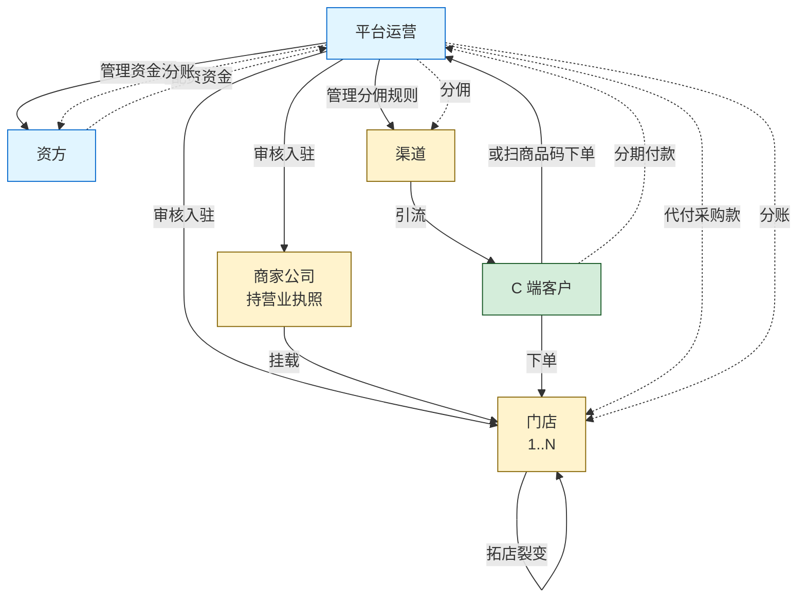
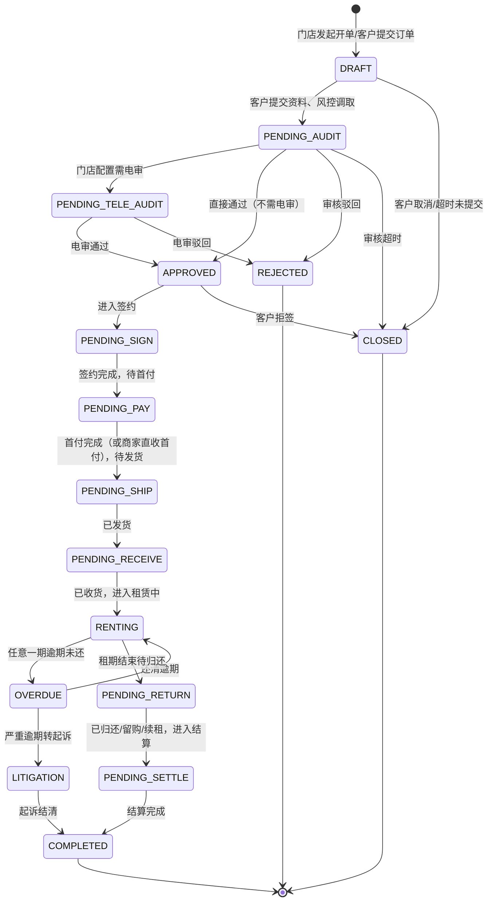
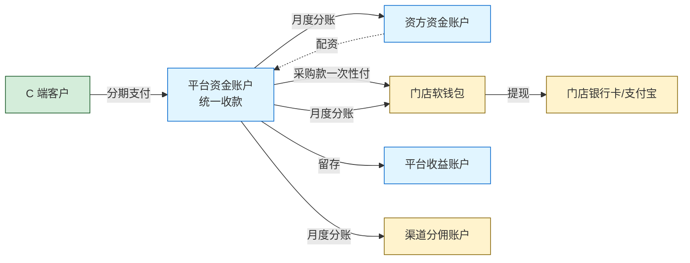

# 【满点重构 PRD V0.1】产品负责人 / 业务总览专题

> 👤 **目标读者**：产品负责人、项目经理、业务负责人、决策者
> 
> 📖 **本文档含**：商业模式 + 角色生态 + 订单模型 + 资金流 + 重构注意事项落地 + 待澄清问题
> 
> ⏱ **预计阅读时长**：60-90 分钟
> 
> 🎯 **评审重点**：
> - 商业模式描述是否准确（§2）
> - 角色与端的划分是否合理（§3）
> - 订单类型驱动模型是否符合实际业务（§4.1）
> - 资金流是否反映真实情况（§4.3）
> - 12 条重构注意事项的落地方案（§11）
> - 22 个待澄清问题的决策（§12）

---

> **📌 评审须知**（所有文档通用，1 分钟读完）
> 
> 你拿到的是【满点租赁系统重构 PRD V0.1 总体大纲】的一个分章节子文档。完整文档约 5 万字，为了高效评审，按部门/角色拆分后只给你看你工作相关的部分。
> 
> **如何参与评审**：
> 1. **整体读一遍**（按你部门预计 20-40 分钟即可）
> 2. **选中文字 → 右键评论** 提具体反馈，建议格式：
>    - 【类型】修改 / 新增 / 删除 / 质疑 / 疑问
>    - 【内容】你的建议
>    - 【原因】为什么这么改（可选）
> 3. **重要反馈 @ 产品负责人**
> 4. **截止时间**：[请项目负责人填写]
> 
> **不要做的事**：
> - 不要直接编辑文档（请用评论）
> - 不要纠结字段名/UI 文案这些细节（V1.0 阶段再抠）
> - 不要超出本文档范围讨论其他模块
> 
> **本文档可能引用的其他章节**（如有疑问可向产品负责人申请阅读权限）：
> - §1 文档说明  /  §2 商业模式  /  §3 角色与端  /  §4 核心业务模型
> - §5-6 各端 PRD  /  §7 基础设施  /  §8 全局规则  /  §9 数据模型
> - §10-13 短租 / 注意事项 / 待澄清 / 实施建议

---

## 1. 文档说明

### 1.1 文档目标

本 PRD 用于指导技术团队完成现有"满点 / 悦租租"系统的重构。重构目标：

1. **业务清晰**：解决现有系统中订单类型、资金流、角色关系混乱的问题，用统一模型描述全部业务
2. **可配置化**：所有业务规则（费率、租期、首付比例、审核策略、合同模板、商品分类等）由后台配置驱动，代码不写死
3. **多客户部署**：支持一套代码部署到 10+ 客户环境，主代码更新时全部客户同步升级
4. **第三方中控**：e签宝、风控、人脸识别、设备锁等第三方服务统一接入中控平台，按调用量计费
5. **自研 IM**：替代当前"拉微信群审核"的低效模式，订单审核全流程在系统内完成
6. **数据隔离**：客户之间数据完全隔离，无互通

### 1.2 文档边界

**本版本（V0.1）包含**：
- 三端（C 端、门店端、商家端、运营端、资方端只读、渠道端）的模块划分与核心功能
- 订单类型驱动模型、资金流、计费规则、状态机
- IM 客服模块、第三方中控、配置中心、多租户部署架构
- 数据模型概览（核心实体 ER）
- 短租业务的架构预留位

**本版本（V0.1）不包含**：
- 短租业务的详细规则（V0.2 补充）
- 完整接口文档（OpenAPI/Swagger 文档由开发阶段补充）
- 完整 UI 原型图（落地前由设计师补充低保真）
- 测试用例（QA 团队补充）
- 部署运维手册、监控告警方案（运维团队补充）

### 1.3 术语表

| 术语 | 含义 |
|---|---|
| **平台** | 你方（系统提供方），运营整个系统的主体 |
| **客户** | 平台的客户公司，购买系统后部署使用（不同客户独立部署、数据隔离） |
| **商家** | 客户公司下的一个企业主体，持有营业执照，可以挂多个门店 |
| **门店** | 实际经营场所，对应商家公司下的一个销售点 |
| **C 端用户 / 租客** | 实际租赁手机/车辆的终端消费者 |
| **资方** | 提供配资资金的方，可能是平台自有、合作金融机构、或独立投资人 |
| **渠道** | 引流方，按引流订单获取分佣 |
| **配资** | 资方/平台对门店出货的代付款，门店出货、资方付钱 |
| **软钱包** | 系统内的账面余额，需通过提现才能变成真实银行卡/支付宝余额 |
| **留购** | 租期结束后客户买断设备（同义词：买断），价格随期数递减 |
| **电审** | 电话审核，人工电话核实客户租赁意愿和资料真实性 |
| **风控报告** | 第三方信用机构提供的客户信用报告（如新颜共债、新颜全景） |
| **三因子登录** | 手机号 + 密码 + 短信验证码同时校验的登录方式 |
| **三方合同** | 一般为客户 + 门店（或商家）+ 平台三方电子合同 |
| **采购合同** | 平台从门店采购手机时签订的合同，平台付采购款给门店 |
| **采购账户** | 平台向门店付采购款时使用的门店收款账户（支付宝） |
| **第三方中控** | 统一管理 e签宝/风控/人脸/设备锁等第三方接口调用与计费的平台 |
| **IM 工单** | 一笔需要客服介入的业务对应一个工单，绑定一个聊天会话 |
| **可周转资产** | 同一物品可多次出租（如汽车），区别于"一次性出租"的耐用品 |
| **租赁商品 / 设备** | 平台上可被租赁的物品（手机、电动车等），有独立的商品 ID 和库存 |
| **押金** | 客户租赁时缴纳的保证金，留购可抵扣或归还时退回 |
| **会员费** | 每笔订单固定收取的技术服务费（当前为 99 元，可配置） |
| **加价系数 / 费率** | 计费时把"未付金额"放大的倍数，是平台收益的主要来源 |

### 1.4 文档约定

- 状态枚举用 **大写下划线** 表示（如 `PENDING_AUDIT`）
- 字段表用 markdown 表格，标注"必填/可选"、"数据类型"、"业务含义"
- 状态机用 mermaid 流程图
- "**待澄清**"标记的内容需要业务方在评审时确认
- "**短租扩展点**"标记为短租业务预留接口
- "**配置化**"标记的项需做成后台可配置项

---

## 2. 商业模式概述

### 2.1 业务本质

本系统支持的核心业务是 **"以租代售"** 模式的耐用品分期租赁。

- 客户分期支付租金（首付 + 月付），租期内拥有设备使用权
- 租期结束后客户可选：归还、续租、留购（买断）
- 设备所有权在租期内归出租方（门店/商家/平台/资方，按订单类型不同而不同）
- 平台通过"加价系数"（计费倍数）赚取利润，资方通过资金回报赚利润

### 2.2 资金真相 —— 与传统理解的差异

**传统误解**：客户 → 门店租手机 → 门店赚租金

**实际模式**：

```
门店采购手机（自己进货）
       ↓
客户向门店发起租赁
       ↓
平台/资方介入，"从门店购买"这台手机（手机采购合同生效）
       ↓
平台支付采购款到门店采购账户（资方/平台垫付）
       ↓  
平台与客户签租赁合同，客户分期付款给平台
       ↓
月付收上来后，按订单类型分账：
  - 给资方（资方分润）
  - 给门店软钱包（分红/佣金）
  - 平台自留（会员费 + 加价部分 - 第三方接口成本）
```

**关键观察**：
- "**手机采购合同**" 是商业模式的底层凭证（平台从门店买货）
- "**采购账户**" 是平台向门店付款的支付宝账号（不是门店收客户款的账户）
- "**分红订单 = 平台配资**"（平台/资方出钱垫付采购款）
- "**配资额度**" 由资方资金池决定，按杠杆放大
- "**低费率/平台订单**" 是门店把客户/订单送给平台执行，自己不出货
- "**门店订单**" 是门店自己全资做（不需要平台垫资）

### 2.3 三类订单的本质区别

| 维度 | 门店订单 | 分红订单 | 平台订单（原"低费率"）|
|---|---|---|---|
| **出资方** | 门店 100%（货 + 现金都自己出） | 门店出货 + 资方/平台配资部分款 | 门店不出货也不出钱，纯送单 |
| **审核方** | **门店自审** | **平台审核** | **平台审核** |
| **签约方** | 客户 + 门店 + 平台 | 客户 + 门店 + 平台（+ 资方备注） | 客户 + 平台 + 执行商家（由平台分配） |
| **资金链路** | 平台代收客户款，扣手续费，余款给门店 | 平台代收客户款，扣会员费+加价，按比例分给门店、资方 | 平台代收客户款，扣会员费+加价，按佣金标准付门店 |
| **平台收益** | 客户总租金 × 手续费率（**配置化**）| 99 元会员费 + 加价部分 + 资方利息差 | 99 元会员费 + 加价部分 |
| **门店收益** | 总租金 - 平台手续费 | 按分红比例（自填配资金额决定） | 按固定佣金（可配置） |
| **客户违约损失承担** | 门店 | 资方/平台 | 平台 |
| **典型场景** | 门店自己有钱有货想做高单价 | 门店有货缺资金，想杠杆做大量 | 门店缺货缺客户，纯当流量入口 |

**重构设计原则**：订单类型不写死成三个枚举，而是用"**出资比例**"字段驱动：
- 100% 门店出资 → 系统自动识别为门店订单
- 0% 门店出资 → 系统自动识别为平台订单
- 介于之间 → 系统自动识别为分红订单

这样未来增加新订单形态（如纯资方订单、二级代理订单）也能自然兼容。

### 2.4 业务链上的 6 类角色

| 角色 | 在系统里的体现 | 是否有独立端 |
|---|---|---|
| **平台运营** | 运营端（PC 后台） | ✅ 运营端 |
| **资方** | 资方信息、资方资金账户、资方账单 | ✅ 资方端（只读 H5）|
| **商家** | 商家公司主体，管商品/营销/财务 | ✅ 商家端（PC 后台）|
| **门店** | 商家下属销售点，处理订单、自建开单、拓店 | ✅ 门店端（H5 移动）|
| **渠道** | 引流方，按订单分佣 | ✅ 渠道端（H5 报表） |
| **C 端客户 / 租客** | 实际租赁人 | ✅ 小程序/App |

商家与门店是 **1:N 关系**（一个商家公司可以挂多个门店，也支持 1:1 的小商家模式）。

### 2.5 平台收益来源

平台的盈利模式由 **4 个并行收入构成**：

1. **会员费**：每笔分红/平台订单固定收 99 元（**配置化**，可调整金额甚至按订单金额比例）
2. **加价部分**：客户总租金 - 设备价 = 加价空间，平台与资方按约定分润
3. **手续费**：门店订单按总租金扣 X%（**配置化**）
4. **第三方接口差价**：客户/商家被收取的人脸/风控费用 > 平台向第三方付的成本

平台成本：
- 第三方接口实际成本（e签宝/新颜/人脸/设备锁）
- 资方分润（如资方出资部分）
- 门店分红/佣金（如分红订单/平台订单）
- 渠道分佣（如渠道引流订单）
- 运营人力（信审、电审、客服、催收）

### 2.6 商业模式的扩展性

V0.1 主要描述长租分期模式。系统底层应预留以下扩展能力：

- **短租**：按时间颗粒度计费（小时/日/周/月），同一设备可多次出租，需要"设备日历"
- **维修/保养服务**：手机碎屏、电池更换等单次服务
- **配件商城**：耗材、配件销售
- **质保服务**：延保、意外保险

短租在本版本架构层面预留，业务细节 V0.2 补充。其余业务在当前阶段不开发，但商品类型枚举里保留扩展位。

---
## 3. 角色与端

### 3.1 端的全景图

```
┌─────────────────────────────────────────────────────────────┐
│  小程序/App（C 端）              微信公众号、支付宝小程序    │
│  · 浏览选品（长租+短租预留）                                  │
│  · 下单/签约/还款/留购/续租/归还                              │
│  · 扫商品码下单                                              │
│  · 工单与 IM 客服                                            │
├─────────────────────────────────────────────────────────────┤
│  门店端（H5 移动）             商家工作台 H5                 │
│  · 订单审核（门店订单自审、分红/平台订单移交）                │
│  · 自建开单（扫码助手）                                       │
│  · 拓店裂变                                                  │
│  · 软钱包提现                                                │
│  · IM 工单（联系客服）                                       │
├─────────────────────────────────────────────────────────────┤
│  商家端（PC 后台）             商家管理中心                   │
│  · 店铺/企业资质管理                                          │
│  · 商品上下架、规格、租金、押金                               │
│  · 营销（优惠券、礼包、营销图）                               │
│  · 财务对账、提现                                            │
│  · 组织/部门/成员/权限                                       │
├─────────────────────────────────────────────────────────────┤
│  运营端（PC 后台）             运营管理平台                   │
│  · 全平台订单管理（含电审、买断、续租、关闭退货）              │
│  · 商家/门店/采购账户/商品审核                                 │
│  · 资方管理（订单、账单、用户、打款记录、资金账户）             │
│  · 租后管理（逾期、催收、起诉）                                │
│  · 营销/佣金/财务/渠道/配置/信审/数据/权限                     │
│  · IM 工单台（客服侧）                                       │
├─────────────────────────────────────────────────────────────┤
│  资方端（H5 只读）             资方资金看板                   │
│  · 我的订单、账单、回款                                       │
│  · 资金账户余额、明细                                        │
│  · 申请提现（提交后走运营审核）                                │
├─────────────────────────────────────────────────────────────┤
│  渠道端（H5 报表）             渠道结算看板                   │
│  · 我带来的订单、佣金计算明细                                  │
│  · 结算单、提现申请                                          │
├─────────────────────────────────────────────────────────────┤
│  第三方中控（平台方自营，跨客户）                              │
│  · e签宝 / 新颜风控 / 人脸识别 / 设备安全锁 / 二要素验证       │
│  · 各客户调用我们中控，中控统一调第三方                        │
│  · 统一计费、充值、对账、统计                                  │
└─────────────────────────────────────────────────────────────┘
```

### 3.2 端的角色权限矩阵

| 模块 / 角色 | C 端 | 门店端 | 商家端 | 运营端 | 资方端 | 渠道端 |
|---|---|---|---|---|---|---|
| 浏览商品 | ✅ | - | - | - | - | - |
| 下单/签约/支付 | ✅ | - | - | - | - | - |
| 还款/留购/续租/归还 | ✅ | - | - | - | - | - |
| 商品管理 | - | - | ✅ | 审核 | - | - |
| 自建开单 | - | ✅ | - | - | - | - |
| 订单审核 | - | 门店订单 | - | 分红/平台订单 | - | - |
| 风控报告调取 | - | ✅ | - | ✅ | - | - |
| 电审 | - | - | - | ✅（信审员） | - | - |
| 拓店裂变 | - | ✅ | - | - | - | - |
| 软钱包/提现 | - | ✅ | ✅ | 审核提现 | ✅ 申请 | ✅ 申请 |
| 营销配置 | - | - | ✅ | ✅ 全局 | - | - |
| 财务对账 | - | 自己的 | 自己的 | 全平台 | 自己的 | 自己的 |
| 资方管理 | - | - | - | ✅ | - | - |
| 渠道管理 | - | - | - | ✅ | - | 看自己 |
| 租后/催收/起诉 | - | - | - | ✅ | - | - |
| 配置中心 | - | - | - | ✅ | - | - |
| IM 工单 | ✅ 客户视角 | ✅ 门店视角 | - | ✅ 客服视角 | - | - |
| 数据统计 | - | 自己的 | 自己的 | 全平台 | 自己的 | 自己的 |
| 组织权限 | - | - | ✅ | ✅ | - | - |

### 3.3 角色之间的关系图



---

## 4. 核心业务模型

### 4.1 订单类型驱动模型

#### 4.1.1 设计思想

**不要把订单类型写死成枚举（DIANPU / FENHONG / PINGTAI）**，而是用**多个字段组合**驱动业务逻辑。

核心字段：

| 字段 | 含义 | 示例值 |
|---|---|---|
| `order_source` | 订单来源 | C 端用户主动 / 门店扫码助手 / 渠道引流 / 商品码 |
| `funding_ratio` | 门店出资比例 | 0%（平台订单）/ 1-99%（分红订单）/ 100%（门店订单） |
| `audit_owner` | 审核归属 | STORE（门店自审） / PLATFORM（平台审核） |
| `signing_subjects` | 签约主体集合 | [客户, 门店, 平台] / [客户, 商家, 平台] |
| `rental_term_type` | 租期类型 | LONG_RENT（长租分期）/ SHORT_RENT_HOUR/DAY/WEEK/MONTH（短租）|
| `goods_type` | 商品类型 | PHONE_NEW / PHONE_USED / EV（电动车）/ ... |
| `risk_strategy_id` | 风控策略 ID | 引用配置中心 |

#### 4.1.2 三类订单的映射

```
门店订单 = funding_ratio: 100% + audit_owner: STORE
分红订单 = funding_ratio: 1-99% + audit_owner: PLATFORM
平台订单 = funding_ratio: 0% + audit_owner: PLATFORM
```

#### 4.1.3 订单类型扩展性

未来加新订单形态（如：纯资方订单、二级代理订单），只需在配置层加新组合，不动核心代码。

### 4.2 订单状态机

#### 4.2.1 长租订单完整状态流转



#### 4.2.2 状态枚举详表

| 状态 | 中文名 | 业务含义 | 谁能看到 |
|---|---|---|---|
| `DRAFT` | 草稿 | 门店开单未提交 / 客户填资料中 | 门店、运营 |
| `PENDING_AUDIT` | 待审核 | 资料齐全等待审核 | 门店、运营、客户（提示等待）|
| `PENDING_TELE_AUDIT` | 待电审 | 进入电话审核环节 | 信审员、运营、客户（提示）|
| `APPROVED` | 审核通过 | 准备签约 | 客户（待签约）|
| `PENDING_SIGN` | 待签约 | 已通过审核，等待客户/门店/平台三方电签 | 客户、门店、运营 |
| `PENDING_PAY` | 待支付 | 签约完成，等首付支付 | 客户 |
| `PENDING_SHIP` | 待发货 | 首付到账（或商家直收），等门店发货 | 门店、运营 |
| `PENDING_RECEIVE` | 待收货 | 已发货，等客户收货 | 客户、门店、运营 |
| `RENTING` | 租赁中 | 客户使用设备，分期还款中 | 全部 |
| `OVERDUE` | 逾期 | 当前期账单超过还款日未还 | 全部 |
| `PENDING_RETURN` | 待归还 | 租期结束，等客户处理（归还/留购/续租） | 客户、门店、运营 |
| `PENDING_SETTLE` | 待结算 | 客户已处理（归还/留购/续租），等财务结算 | 运营、商家、门店、资方 |
| `COMPLETED` | 已完成 | 全部结算完成 | 全部 |
| `REJECTED` | 已驳回 | 审核未通过 | 门店、运营 |
| `CLOSED` | 已关闭 | 订单关闭（客户取消、超时、客户拒签） | 门店、运营 |
| `LITIGATION` | 起诉中 | 严重逾期已进入诉讼流程 | 运营、租后团队 |

#### 4.2.3 关键状态流转规则

- **PENDING_AUDIT → PENDING_TELE_AUDIT**：受门店级开关 `need_tele_audit` 控制（**配置化**）
- **APPROVED → PENDING_SIGN**：触发 e签宝生成签约任务
- **签约阶段**：客户、门店（或商家）、平台三方依次签字，**任一方未签则订单停留在 PENDING_SIGN**
- **PENDING_PAY → PENDING_SHIP**：分两种路径
  - 默认：客户支付首付到平台账户 → 平台收到回调 → 状态流转
  - 商家直收首付模式：门店勾选"已收取客户首付 XX 元" → 直接流转，平台不代收首付
- **RENTING ↔ OVERDUE**：每天定时任务扫描，当前期账单到期未还转 OVERDUE，还清后转回 RENTING
- **任何状态 → CLOSED**：客户可在任意阶段申请退单（详见 4.5）
- **状态机的状态值要做成可配置**：未来加新状态（如"客户身份审核中"）无需改代码

### 4.3 资金流转模型

#### 4.3.1 资金链路全景图



#### 4.3.2 三种订单的资金流差异

**门店订单（funding_ratio = 100%）**

```
客户付款（含首付+月付）→ 平台账户
                          ↓
                    扣手续费（总租金 × X%）→ 平台收益
                          ↓
                    剩余金额 → 门店软钱包
                          ↓
                          门店提现 → 门店银行卡/支付宝
```

- 平台不代垫采购款（货款由门店自有现金 / 已有库存承担）
- 客户违约损失全部由门店承担

**分红订单（funding_ratio = 1-99%）**

```
订单成立时：
  资方资金池扣 [设备价 × 配资比例] → 平台代垫给门店采购账户
  
客户按月还款：
  客户付款 → 平台账户
            ↓
       扣 99 元会员费 → 平台收益
            ↓
       扣加价部分（X%）→ 平台收益、资方分润（按约定比例）
            ↓
       剩余 → 门店软钱包（按分红比例）+ 资方账户（按出资比例）
```

- 资方资金池余额不足 → 拒绝下单（运营在配置中心可设置预警阈值）
- 客户违约损失由资方/平台承担，门店不追责
- 客户违约 → 资方/平台收回设备 → 二次处置（待 V1.0 细化处置流程）

**平台订单（funding_ratio = 0%）**

```
订单成立时：
  平台从资方资金池支出全部采购款 → 平台分配给某商家执行
  
客户按月还款：
  客户付款 → 平台账户
            ↓
       扣 99 元会员费 → 平台收益
            ↓
       扣加价部分 → 平台收益、资方分润
            ↓
       门店得佣金（固定金额或按订单比例，配置化）
```

- 门店纯当流量入口，不出货不出钱
- 平台需把订单分配给具体的执行商家（由商家备货发货）
- **待澄清**：如果客户已支付但平台找不到合适执行商家怎么办？是否设"备货池"机制？

#### 4.3.3 软钱包账户体系

每个门店/商家在系统里有以下账户类型（参考门店端手册的三账户结构，重构后简化）：

| 账户类型 | 用途 | 是否可提现 |
|---|---|---|
| **可用余额** | 已结算到账的资金，可发起提现 | ✅ |
| **结算中余额** | 客户已还款但未到结算日的金额 | ❌ |
| **冻结金额** | 提现申请中、订单争议中的金额 | ❌ |

**门店端原有的"分成余额 / 佣金余额 / 配资额度"三账户结构**：

- 重构后：合并为**单一资金账户**，每笔流水标注**资金类型**（分红收入 / 佣金收入 / 退款 / 提现等）
- 通过流水的"资金类型"过滤即可分类查看
- 原"配资额度"功能**不再保留**（因为门店不再充值配资，配资由资方资金池统一管理）

#### 4.3.4 软钱包允许负数

特殊场景：客户退单退款后，门店软钱包可能变成负数。

- 系统不拒绝退款（资金原路退回客户优先）
- 门店软钱包变负数后，**禁止新订单分账入账**（先用新订单收入抵扣负数）
- 门店可主动充值正值回填（充值入口在门店端"我的钱包"）
- 运营端可见所有负数账户列表，定期跟进

### 4.4 计费规则（搬运惠讯租办单助手）

#### 4.4.1 核心计算公式

来源于 GitHub `joezjyan-bot/calculator/phone-rent/README.md`。

**输入参数**：
- `price`：设备价格（来源于商品库的指导价 = 靓机价 × multiplier，或新机官网价）
- `ratio`：首付比例（0.3 / 0.4 / 0.5 / 0.6，**配置化**）
- `periods`：租期（6 / 9 / 12，**配置化**）
- `fee`：设备管理费（50 / 150 / 250 元，**配置化**）

**公式**：

```
首付金额 = price × ratio
未付金额 = price - 首付金额
后续应还总额 = 未付金额 × 费率（查表：rates[periods][ratio]）
后期月付 = 后续应还总额 ÷ (periods - 1)
押金（留购可抵扣）= 首付金额 - first_period_rent（首期租金，默认 10 元）
设备管理费 = 单独列出，首期一次性收
留购总价 = 首付金额 + 后续应还总额 + 设备管理费

当期购买价（第 N 期）：
- 第 1 期：后续应还总额 + 押金
- 第 N 期（N>1）：月付 × (periods - N) + 押金
- 最后一期：仅押金（押金可抵扣）
```

#### 4.4.2 费率表

配置在 `rates.json`（重构后改为后台配置表）：

| 期数 | 首付 30% | 首付 40% | 首付 50% | 首付 60% |
|---|---|---|---|---|
| 6 期 | 1.26 | 1.20 | 1.20 | 1.15 |
| 9 期 | 1.30 | 1.28 | 1.26 | 1.21 |
| 12 期 | 1.37 | 1.30 | 1.30 | 1.28 |

**配置化要求**：
- 后台可增删期数（如未来加 4 期、24 期）
- 后台可增删首付比例档位
- 后台可调整任一格的费率倍数
- 配置变更**只影响新订单**，不回溯老订单

#### 4.4.3 商品价格表

配置在 `pricing.json`（重构后改为商品库）：

```
multiplier = 1.15（靓机价 → 指导价的乘数，配置化）

prices_used (二手机) = {
  "iPhone 17 Pro Max": {"256": 7400, "512": 8400},
  "iPhone 17 Pro": {"256": 6500, "512": 7750},
  ... (维护到 iPhone 13 Pro)
}

prices_new (全新机) = {
  "iPhone 17 Pro Max": {"256": 9999, "512": 11999},
  ... (苹果中国官网价)
}

ev_prices_used / ev_prices_new = {} (短租电动车扩展点，V0.2 补充)
```

**配置化要求**：
- 价格库由运营端「配置管理 → 商品价格库」维护
- 支持批量导入/导出（Excel）
- 支持机型增删
- 价格变更**只影响新订单**

#### 4.4.4 计算示例

iPhone 17 Pro 256GB，全新机，首付 30%，6 期，设备管理费 50 元：

```
设备价 price = 8999（苹果官网价）
首付比例 ratio = 0.3
期数 periods = 6
管理费 fee = 50

首付金额 = 8999 × 0.3 = 2699.70
未付金额 = 8999 - 2699.70 = 6299.30
费率 = rates[6][0.3] = 1.26
后续应还总额 = 6299.30 × 1.26 = 7937.12
后期月付 = 7937.12 ÷ 5 = 1587.42
押金 = 2699.70 - 10 = 2689.70
留购总价 = 2699.70 + 7937.12 + 50 = 10686.82
```

#### 4.4.5 留购价计算（按期数递减）

```
当期购买价（第 N 期）：
N=1: 7937.12 + 2689.70 = 10626.82（首期就买断 = 几乎全款）
N=2: 1587.42 × 4 + 2689.70 = 9039.38
N=3: 1587.42 × 3 + 2689.70 = 7451.96
N=4: 1587.42 × 2 + 2689.70 = 5864.54
N=5: 1587.42 × 1 + 2689.70 = 4277.12
N=6（最后一期）: 2689.70（仅押金，押金可抵扣，实付 = 0）
```

**最后一期为零的处理**：
- 显示为"留购价 ¥0.00（押金已抵扣）"
- 客户仍需点确认按钮触发"我要留购"流程
- 系统不要求实际付款，但要走留购合同电签
- 押金不退还客户（已用于抵扣留购价）

#### 4.4.6 计费规则的配置化层级

```
全局配置（平台级，全部客户）
  ↓
客户配置（不同客户部署的差异化）
  ↓
门店配置（特定门店的个性化，如某门店只做电动车）
  ↓
商品配置（特定商品的特殊规则，如某机型限定首付 50% 起）
```

后台支持四层配置覆盖，下层配置覆盖上层。

### 4.5 退款 / 退单流程

#### 4.5.1 退单的时机

| 退单时机 | 资金处理 | 设备处理 |
|---|---|---|
| **签约前** | 无资金往来 → 直接关闭 | 无 |
| **签约后未支付** | 无资金往来 → 关闭订单，撤销签约 | 无 |
| **支付首付但未发货** | 首付原路退回客户 | 无 |
| **已发货未收货** | 首付原路退回，物流召回 | 物流召回 |
| **已收货** | 扣除"按订单金额比例"的违约金（**配置化**），剩余原路退回 | 客户寄回 → 门店验机 → 入库 |
| **租赁中** | 已付租金原路退回（扣违约金）+ 押金扣损耗 | 客户寄回 / 门店上门取 |

#### 4.5.2 资金回滚链路

退款时，资金按**反向流向**回退：

```
平台从客户账户已收款金额扣除违约金后
→ 原路退回客户
   ↓
平台从门店软钱包扣除已分账金额
（如果门店余额不够 → 软钱包变负数）
   ↓
平台从资方资金账户扣回已分账金额
（如果资方余额不够 → 流水标记待补，财务对账时处理）
   ↓
渠道分佣已分账金额扣回
（同上）
```

#### 4.5.3 退款审核流程

- 客户在 C 端申请退款 → 进入"退款工单"
- 运营端「订单管理 → 订单关闭和退货」处理
- 退款金额 ≤ 500 元：自动通过
- 退款金额 > 500 元：需运营审核（**金额阈值配置化**）
- 审核通过后，原路退款（支付宝/微信走支付平台 API）

#### 4.5.4 违约金规则

| 退款时机 | 违约金计算 |
|---|---|
| 已收货 < 7 天 | 订单金额 × 5%（**配置化**） |
| 已收货 7-30 天 | 订单金额 × 10% |
| 已收货 > 30 天 | 订单金额 × 15% |
| 租赁中提前退租 | 剩余未付租金 × 30% |

具体比例后台配置，支持按订单类型、客户等级差异化。

### 4.6 续租流程

#### 4.6.1 续租的触发

租赁到期前 7 天，系统自动通知客户：
- "您的订单即将到期，可选：归还 / 续租 / 留购"
- 客户在 C 端点击"续租"进入续租流程

#### 4.6.2 续租规则

| 字段 | 续租规则 |
|---|---|
| 续租周期 | 客户可选（6/9/12 期，与原订单可不同） |
| 续租租金 | 重新按当前商品价格 + 费率表试算（**不沿用原订单费率**） |
| 押金 | 沿用原订单押金（不重新收） |
| 合同 | 重新签订续租合同（独立合同号） |
| 资金流 | 不重新走采购款（设备权属沿用原订单） |
| 订单号 | 生成新订单号，标记 `original_order_id` 关联原订单 |

#### 4.6.3 续租后的留购价

续租期间，留购价按**续租合同**重新计算，与原订单解耦。

### 4.7 账单日修改

参考同行业务公告，规则如下：

#### 4.7.1 修改窗口

| 当前状态 | 是否可改首期账单日 | 是否可改后续账单日 |
|---|---|---|
| 下单 7 天内 | ✅ | - |
| 下单 > 7 天，未付首期 | ❌ | - |
| 已付首期租金 | ❌ | ✅ |
| 当前期已逾期 | ❌ | ❌ |
| 逾期结清后 | ❌ | ✅ |

#### 4.7.2 修改规则

- 必须由客服在 IM 工单里发起（客户不能自助修改）
- 修改账单日时**系统自动重算每期账单**，原则上**总费用不变**
- 如延迟天数 > X 天（**配置化**），按"日租金 × 延迟天数"加收延期费
- 修改后客户需在 IM 里二次确认
- 修改记录留痕（操作人、原账单日、新账单日、加收金额）

---
## 11. 重构注意事项落地

你提出的 10 条重构注意事项，逐一对应到 PRD 的落地方案。

### 11.1 梳理长短租业务逻辑

**对应**：本 PRD 第 4 章（核心业务模型）+ 第 10 章（短租预留）

**进度**：
- ✅ 长租业务逻辑已梳理（订单类型驱动模型、资金流、计费规则）
- ✅ 短租架构层预留完成
- ⏳ 短租业务细节 V0.2 补充

### 11.2 项目重构与悦租租过渡方案

**对应**：本 PRD 第 11.2 章

**初步方案**：

```
Stage 1：双系统并行（2-3 个月）
├─ 新系统部署上线（仅给 1-2 个客户试用）
├─ 老系统继续维护，不开发新功能
└─ 双系统数据不互通，新订单走新系统

Stage 2：数据迁移（1 个月）
├─ 编写数据迁移脚本（老系统订单/客户/商家 → 新系统）
├─ 老系统订单冻结，全部迁移到新系统
└─ 老系统切只读模式

Stage 3：老系统下线（即可）
├─ 所有客户切换到新系统
└─ 老系统归档
```

**关键点**：
- 数据迁移脚本需要在 V1.0 开发阶段同步编写
- 迁移前充分测试（数据一致性、业务连续性）
- 历史订单按"原合同规则"处理，不强制按新规则
- 准备回滚预案（迁移失败可回到老系统）

**待澄清**：
- 老系统的数据量有多大？
- 老系统的代码/数据库是否还有访问权限？
- 客户对停机时间的容忍度（迁移可能需要短暂停机）

### 11.3 重构时数据统计也得考虑

**对应**：本 PRD 第 6.4.15 章（运营端数据管理）

**统计大盘清单**：

- 业务大盘：GMV、订单数、客户数、新增/活跃用户、增长曲线
- 风险大盘：逾期率、坏账率、违约金回收率、风控通过率
- 资金大盘：资方资金占用率、回款周期、平台收益
- 商品大盘：销售排行、留购率、续租率
- 渠道大盘：引流转化、佣金成本
- 第三方成本大盘：各接口调用量、成本
- 平台健康度：系统响应时间、错误率、报警

技术实现：
- 关键统计走预聚合（每日跑批，存到统计表）
- 实时统计走 OLAP（如 ClickHouse / StarRocks）
- 数据展示用图表组件（ECharts / Antv）

### 11.4 IM 实现客服咨询及自动拉群做单

**对应**：本 PRD 第 7.1 章（IM 客服模块）

**已设计**：
- 自研 IM（保护数据 + 聊天记录不外流）
- 工单与订单强关联（替代拉群）
- 客户、门店、客服在同一会话内沟通
- 支持文字/图片/视频/文件/系统卡片
- 历史记录永久保存

**开发预估**：MVP 3-4 个月（1-2 后端 + 1 前端 + 1 测试）

### 11.5 其他客户的进件资料支持客户自行提交

**对应**：本 PRD 第 6.2.2 章（门店端入驻）+ 第 7.5 章（多客户租户）

**已设计**：
- 多客户独立部署，每个客户独立域名 + 独立运营后台
- 客户的商家/门店可自行在客户系统内提交资料、上传证照
- 资料提交流程已经标准化（注册 → 资料 → e签宝授权 → 采购账户）
- 客户运营审核流程标准化

### 11.6 第三方计费接口统一中控

**对应**：本 PRD 第 7.2 章（第三方中控）

**已设计**：
- 独立的中控平台（你方自营，跨客户）
- 所有第三方调用走中控
- 客户充值 + 调用计费 + 余额预警
- 客户系统不持有第三方 Key

### 11.7 扫商品码下单 + 客服分配门店/商户

**对应**：本 PRD 第 6.1.4 章（扫商品码下单）

**已设计**：
- 商品码 + 门店码 + 渠道码三层归属
- 客户扫商品码 → 订单按二维码内的参数自动归属（商品/门店/渠道）
- 对于"先下单后分配门店"的场景（如纯平台订单），运营在 IM 工单内手动分配

**待澄清**：你提到"下完单之后后台客服进行分配到哪个门店或者商户"——这是指**所有订单都需要客服分配**？还是仅特定订单（如平台订单）需要？建议：
- 默认订单按二维码自动归属
- 平台订单需要分配执行商家时，客服在 IM 工单内分配

### 11.8 合作方统一管理同步

**对应**：本 PRD 第 7.5 章（多客户租户管理）

**已设计**：
- 主代码统一仓库，统一更新
- 客户租户独立部署、独立配置
- CI/CD 自动化部署
- 升级策略支持同步/分批/灰度

### 11.9 切换门店和运营方做出租方

**对应**：本 PRD 第 7.4 章（合同模板引擎）

**已设计**：
- 出租方主体可切换（门店 / 商家 / 平台运营方）
- 合同模板按"业务类型 + 订单类型 + 出租方主体"动态绑定
- 出租方信息从对应主体的企业资料拉取

### 11.10 签署合同模板可切换

**对应**：本 PRD 第 7.4 章（合同模板引擎）

**已设计**：
- 模板版本管理
- 模板与业务场景绑定可配置
- 历史合同沿用签约时版本
- 新合同走最新启用版本

---

## 12. 待澄清问题清单

V0.1 阶段累计的待澄清问题，按优先级分类。**评审会议时逐项确认**。

### 12.1 必须先定（影响 V1.0 开发）

| # | 问题 | 我的建议默认 |
|---|---|---|
| 1 | 商家与门店是 1:N、1:1，还是两种都支持？ | 两种都支持，由商家自己选 |
| 2 | 拓店关系层级（默认 2 级还是无限）？ | 默认 2 级，配置化扩展 |
| 3 | 拓店奖励触发规则（按下级订单数/金额/固定）？ | 按下级订单金额的 X%，配置化 |
| 4 | 拓店关系是否可解除？ | 不允许自动解除，运营介入处理 |
| 5 | 老系统数据迁移的范围与方式？ | 全部订单 + 全部客户 + 全部商家，停机迁移 |
| 6 | 平台订单的执行商家如何分配？是否需要"备货池"？ | 由客服在 IM 工单内手动分配 |
| 7 | 商家直收首付模式下，客户违约时第 1 期归属？ | 第 1 期归商家自留作为损失补偿 |
| 8 | 多个资方时，订单按什么规则分配？ | 轮询为主，可配置按额度比例/优先级 |
| 9 | 资方资金账户冻结时，是否影响该资方原有订单还款入账？ | 不影响入账，仅影响新订单分配 |

### 12.2 应该定（影响 V1.0 用户体验）

| # | 问题 | 我的建议默认 |
|---|---|---|
| 10 | 商品码是否带时效？商品下架后扫码提示？ | 商品码永久，下架提示"已下架" |
| 11 | 是否需要"营业员二维码"标记开单人？ | V1.0 暂不做，V1.1 加 |
| 12 | 风控报告调取的金额阈值（不同金额走不同报告类型）？ | 大单调全景报告，小单调共债报告，可配置 |
| 13 | 电审脚本由谁定义？是否多个版本（不同业务）？ | 由运营在"配置管理 → 电审脚本"维护，多版本 |
| 14 | 客户长期失联（30 天）后是否联系紧急联系人？ | IM 推送 + 电话通知，不发短信 |
| 15 | 客服技能标签（业务咨询/订单审核/售后）的工单互通？ | 默认按技能分配，可手动转单 |

### 12.3 可以后定（不阻塞 V1.0）

| # | 问题 | 我的建议默认 |
|---|---|---|
| 16 | 评论是否需要审核？敏感词库谁维护？ | 默认需要审核，敏感词库由运营维护 |
| 17 | 客户能否邀请用户分销（小程序佣金）？ | V1.0 实现基础分销，V2.0 扩展玩法 |
| 18 | 增值服务理赔流程？ | 走 IM 工单 + 客服核实 + 财务赔付，V1.0 简化 |
| 19 | 数据导出权限是否需要二次审批？ | 一般用户导出受限（行数限制），管理员无限制 |
| 20 | 设备安全锁对接哪家厂商？接口是否开放？ | 评估"租先知"或自研，V1.0 用人工锁机 + 设备照片留痕 |

### 12.4 远期规划（V2.0+）

| # | 问题 | 我的建议 |
|---|---|---|
| 21 | 自研质检 APP（参考手机妈妈）？ | V2.0 评估，先用 IM 内人工质检 |
| 22 | 维修/保养/质保/配件等业务集成？ | V2.0 评估扩展 |
| 23 | AI 客服初筛常见问题？ | V2.0 加入 |
| 24 | 国际化（多语言）？ | 视客户需求 |
