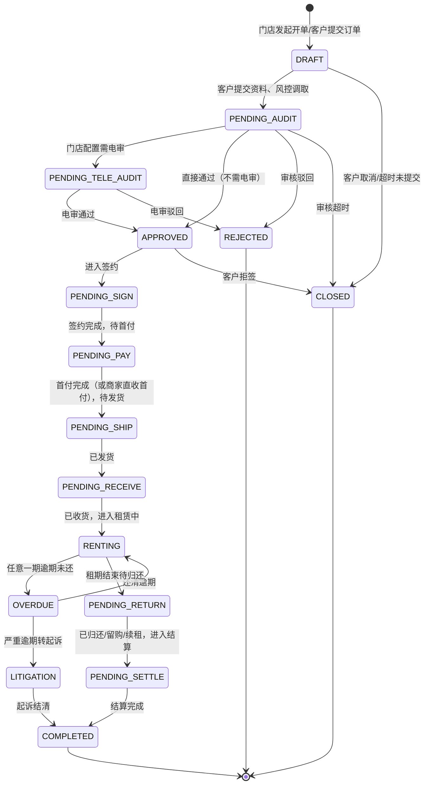
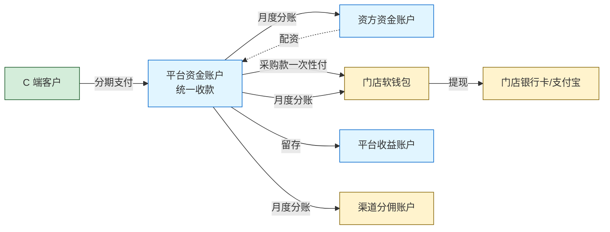
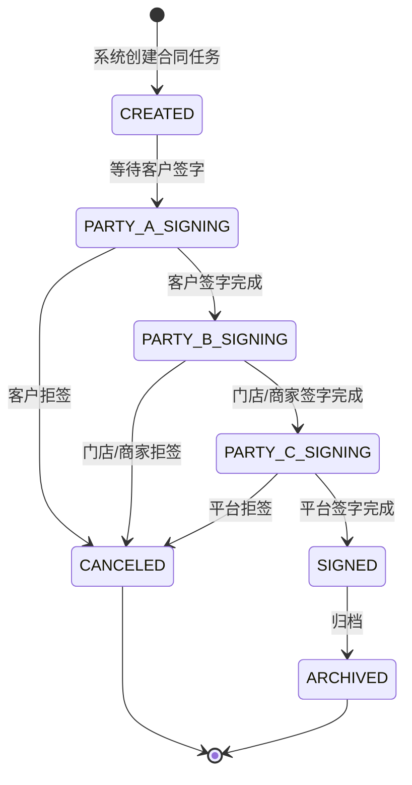
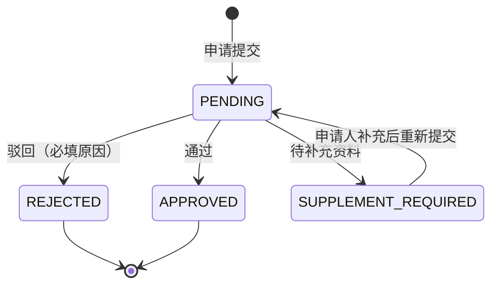
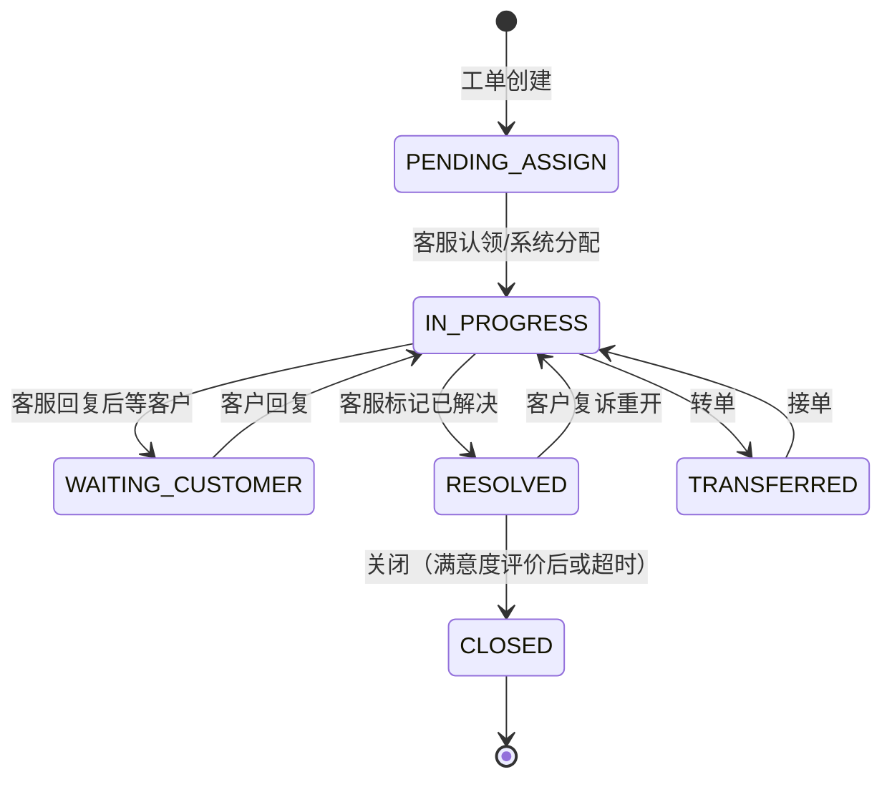
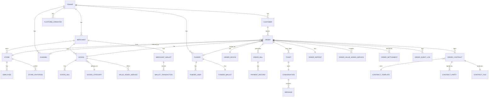

# 【满点重构 PRD V0.1】后端 Leader 专题

> 👤 **目标读者**：后端开发 leader、核心后端
> 
> 📖 **本文档含**：业务模型 + 基础设施（IM/中控/配置/合同）+ 全局规则 + 数据模型
> 
> ⏱ **预计阅读时长**：90-120 分钟
> 
> 🎯 **评审重点**：
> - 订单状态机、合同状态机、工单状态机的实现复杂度（§4.2, §7.1.4, §8.1）
> - 资金流转和软钱包账户体系的事务一致性（§4.3）
> - 计费规则的实现方式（§4.4）
> - IM 模块的技术架构和分期建设（§7.1.15, §7.1.16）
> - 中控的对接和计费实现（§7.2）
> - 配置中心的缓存和生效机制（§7.3）
> - 数据模型表设计（§9.3）
> - 数据库分库分表策略（§9.4）

---

> **📌 评审须知**（所有文档通用，1 分钟读完）
> 
> 你拿到的是【满点租赁系统重构 PRD V0.1 总体大纲】的一个分章节子文档。完整文档约 5 万字，为了高效评审，按部门/角色拆分后只给你看你工作相关的部分。
> 
> **如何参与评审**：
> 1. **整体读一遍**（按你部门预计 20-40 分钟即可）
> 2. **选中文字 → 右键评论** 提具体反馈，建议格式：
>    - 【类型】修改 / 新增 / 删除 / 质疑 / 疑问
>    - 【内容】你的建议
>    - 【原因】为什么这么改（可选）
> 3. **重要反馈 @ 产品负责人**
> 4. **截止时间**：[请项目负责人填写]
> 
> **不要做的事**：
> - 不要直接编辑文档（请用评论）
> - 不要纠结字段名/UI 文案这些细节（V1.0 阶段再抠）
> - 不要超出本文档范围讨论其他模块
> 
> **本文档可能引用的其他章节**（如有疑问可向产品负责人申请阅读权限）：
> - §1 文档说明  /  §2 商业模式  /  §3 角色与端  /  §4 核心业务模型
> - §5-6 各端 PRD  /  §7 基础设施  /  §8 全局规则  /  §9 数据模型
> - §10-13 短租 / 注意事项 / 待澄清 / 实施建议
-e 

---

## 4. 核心业务模型

### 4.1 订单类型驱动模型

#### 4.1.1 设计思想

**不要把订单类型写死成枚举（DIANPU / FENHONG / PINGTAI）**，而是用**多个字段组合**驱动业务逻辑。

核心字段：

| 字段 | 含义 | 示例值 |
|---|---|---|
| `order_source` | 订单来源 | C 端用户主动 / 门店扫码助手 / 渠道引流 / 商品码 |
| `funding_ratio` | 门店出资比例 | 0%（平台订单）/ 1-99%（分红订单）/ 100%（门店订单） |
| `audit_owner` | 审核归属 | STORE（门店自审） / PLATFORM（平台审核） |
| `signing_subjects` | 签约主体集合 | [客户, 门店, 平台] / [客户, 商家, 平台] |
| `rental_term_type` | 租期类型 | LONG_RENT（长租分期）/ SHORT_RENT_HOUR/DAY/WEEK/MONTH（短租）|
| `goods_type` | 商品类型 | PHONE_NEW / PHONE_USED / EV（电动车）/ ... |
| `risk_strategy_id` | 风控策略 ID | 引用配置中心 |

#### 4.1.2 三类订单的映射

```
门店订单 = funding_ratio: 100% + audit_owner: STORE
分红订单 = funding_ratio: 1-99% + audit_owner: PLATFORM
平台订单 = funding_ratio: 0% + audit_owner: PLATFORM
```

#### 4.1.3 订单类型扩展性

未来加新订单形态（如：纯资方订单、二级代理订单），只需在配置层加新组合，不动核心代码。

### 4.2 订单状态机

#### 4.2.1 长租订单完整状态流转



#### 4.2.2 状态枚举详表

| 状态 | 中文名 | 业务含义 | 谁能看到 |
|---|---|---|---|
| `DRAFT` | 草稿 | 门店开单未提交 / 客户填资料中 | 门店、运营 |
| `PENDING_AUDIT` | 待审核 | 资料齐全等待审核 | 门店、运营、客户（提示等待）|
| `PENDING_TELE_AUDIT` | 待电审 | 进入电话审核环节 | 信审员、运营、客户（提示）|
| `APPROVED` | 审核通过 | 准备签约 | 客户（待签约）|
| `PENDING_SIGN` | 待签约 | 已通过审核，等待客户/门店/平台三方电签 | 客户、门店、运营 |
| `PENDING_PAY` | 待支付 | 签约完成，等首付支付 | 客户 |
| `PENDING_SHIP` | 待发货 | 首付到账（或商家直收），等门店发货 | 门店、运营 |
| `PENDING_RECEIVE` | 待收货 | 已发货，等客户收货 | 客户、门店、运营 |
| `RENTING` | 租赁中 | 客户使用设备，分期还款中 | 全部 |
| `OVERDUE` | 逾期 | 当前期账单超过还款日未还 | 全部 |
| `PENDING_RETURN` | 待归还 | 租期结束，等客户处理（归还/留购/续租） | 客户、门店、运营 |
| `PENDING_SETTLE` | 待结算 | 客户已处理（归还/留购/续租），等财务结算 | 运营、商家、门店、资方 |
| `COMPLETED` | 已完成 | 全部结算完成 | 全部 |
| `REJECTED` | 已驳回 | 审核未通过 | 门店、运营 |
| `CLOSED` | 已关闭 | 订单关闭（客户取消、超时、客户拒签） | 门店、运营 |
| `LITIGATION` | 起诉中 | 严重逾期已进入诉讼流程 | 运营、租后团队 |

#### 4.2.3 关键状态流转规则

- **PENDING_AUDIT → PENDING_TELE_AUDIT**：受门店级开关 `need_tele_audit` 控制（**配置化**）
- **APPROVED → PENDING_SIGN**：触发 e签宝生成签约任务
- **签约阶段**：客户、门店（或商家）、平台三方依次签字，**任一方未签则订单停留在 PENDING_SIGN**
- **PENDING_PAY → PENDING_SHIP**：分两种路径
  - 默认：客户支付首付到平台账户 → 平台收到回调 → 状态流转
  - 商家直收首付模式：门店勾选"已收取客户首付 XX 元" → 直接流转，平台不代收首付
- **RENTING ↔ OVERDUE**：每天定时任务扫描，当前期账单到期未还转 OVERDUE，还清后转回 RENTING
- **任何状态 → CLOSED**：客户可在任意阶段申请退单（详见 4.5）
- **状态机的状态值要做成可配置**：未来加新状态（如"客户身份审核中"）无需改代码

### 4.3 资金流转模型

#### 4.3.1 资金链路全景图



#### 4.3.2 三种订单的资金流差异

**门店订单（funding_ratio = 100%）**

```
客户付款（含首付+月付）→ 平台账户
                          ↓
                    扣手续费（总租金 × X%）→ 平台收益
                          ↓
                    剩余金额 → 门店软钱包
                          ↓
                          门店提现 → 门店银行卡/支付宝
```

- 平台不代垫采购款（货款由门店自有现金 / 已有库存承担）
- 客户违约损失全部由门店承担

**分红订单（funding_ratio = 1-99%）**

```
订单成立时：
  资方资金池扣 [设备价 × 配资比例] → 平台代垫给门店采购账户
  
客户按月还款：
  客户付款 → 平台账户
            ↓
       扣 99 元会员费 → 平台收益
            ↓
       扣加价部分（X%）→ 平台收益、资方分润（按约定比例）
            ↓
       剩余 → 门店软钱包（按分红比例）+ 资方账户（按出资比例）
```

- 资方资金池余额不足 → 拒绝下单（运营在配置中心可设置预警阈值）
- 客户违约损失由资方/平台承担，门店不追责
- 客户违约 → 资方/平台收回设备 → 二次处置（待 V1.0 细化处置流程）

**平台订单（funding_ratio = 0%）**

```
订单成立时：
  平台从资方资金池支出全部采购款 → 平台分配给某商家执行
  
客户按月还款：
  客户付款 → 平台账户
            ↓
       扣 99 元会员费 → 平台收益
            ↓
       扣加价部分 → 平台收益、资方分润
            ↓
       门店得佣金（固定金额或按订单比例，配置化）
```

- 门店纯当流量入口，不出货不出钱
- 平台需把订单分配给具体的执行商家（由商家备货发货）
- **待澄清**：如果客户已支付但平台找不到合适执行商家怎么办？是否设"备货池"机制？

#### 4.3.3 软钱包账户体系

每个门店/商家在系统里有以下账户类型（参考门店端手册的三账户结构，重构后简化）：

| 账户类型 | 用途 | 是否可提现 |
|---|---|---|
| **可用余额** | 已结算到账的资金，可发起提现 | ✅ |
| **结算中余额** | 客户已还款但未到结算日的金额 | ❌ |
| **冻结金额** | 提现申请中、订单争议中的金额 | ❌ |

**门店端原有的"分成余额 / 佣金余额 / 配资额度"三账户结构**：

- 重构后：合并为**单一资金账户**，每笔流水标注**资金类型**（分红收入 / 佣金收入 / 退款 / 提现等）
- 通过流水的"资金类型"过滤即可分类查看
- 原"配资额度"功能**不再保留**（因为门店不再充值配资，配资由资方资金池统一管理）

#### 4.3.4 软钱包允许负数

特殊场景：客户退单退款后，门店软钱包可能变成负数。

- 系统不拒绝退款（资金原路退回客户优先）
- 门店软钱包变负数后，**禁止新订单分账入账**（先用新订单收入抵扣负数）
- 门店可主动充值正值回填（充值入口在门店端"我的钱包"）
- 运营端可见所有负数账户列表，定期跟进

### 4.4 计费规则（搬运惠讯租办单助手）

#### 4.4.1 核心计算公式

来源于 GitHub `joezjyan-bot/calculator/phone-rent/README.md`。

**输入参数**：
- `price`：设备价格（来源于商品库的指导价 = 靓机价 × multiplier，或新机官网价）
- `ratio`：首付比例（0.3 / 0.4 / 0.5 / 0.6，**配置化**）
- `periods`：租期（6 / 9 / 12，**配置化**）
- `fee`：设备管理费（50 / 150 / 250 元，**配置化**）

**公式**：

```
首付金额 = price × ratio
未付金额 = price - 首付金额
后续应还总额 = 未付金额 × 费率（查表：rates[periods][ratio]）
后期月付 = 后续应还总额 ÷ (periods - 1)
押金（留购可抵扣）= 首付金额 - first_period_rent（首期租金，默认 10 元）
设备管理费 = 单独列出，首期一次性收
留购总价 = 首付金额 + 后续应还总额 + 设备管理费

当期购买价（第 N 期）：
- 第 1 期：后续应还总额 + 押金
- 第 N 期（N>1）：月付 × (periods - N) + 押金
- 最后一期：仅押金（押金可抵扣）
```

#### 4.4.2 费率表

配置在 `rates.json`（重构后改为后台配置表）：

| 期数 | 首付 30% | 首付 40% | 首付 50% | 首付 60% |
|---|---|---|---|---|
| 6 期 | 1.26 | 1.20 | 1.20 | 1.15 |
| 9 期 | 1.30 | 1.28 | 1.26 | 1.21 |
| 12 期 | 1.37 | 1.30 | 1.30 | 1.28 |

**配置化要求**：
- 后台可增删期数（如未来加 4 期、24 期）
- 后台可增删首付比例档位
- 后台可调整任一格的费率倍数
- 配置变更**只影响新订单**，不回溯老订单

#### 4.4.3 商品价格表

配置在 `pricing.json`（重构后改为商品库）：

```
multiplier = 1.15（靓机价 → 指导价的乘数，配置化）

prices_used (二手机) = {
  "iPhone 17 Pro Max": {"256": 7400, "512": 8400},
  "iPhone 17 Pro": {"256": 6500, "512": 7750},
  ... (维护到 iPhone 13 Pro)
}

prices_new (全新机) = {
  "iPhone 17 Pro Max": {"256": 9999, "512": 11999},
  ... (苹果中国官网价)
}

ev_prices_used / ev_prices_new = {} (短租电动车扩展点，V0.2 补充)
```

**配置化要求**：
- 价格库由运营端「配置管理 → 商品价格库」维护
- 支持批量导入/导出（Excel）
- 支持机型增删
- 价格变更**只影响新订单**

#### 4.4.4 计算示例

iPhone 17 Pro 256GB，全新机，首付 30%，6 期，设备管理费 50 元：

```
设备价 price = 8999（苹果官网价）
首付比例 ratio = 0.3
期数 periods = 6
管理费 fee = 50

首付金额 = 8999 × 0.3 = 2699.70
未付金额 = 8999 - 2699.70 = 6299.30
费率 = rates[6][0.3] = 1.26
后续应还总额 = 6299.30 × 1.26 = 7937.12
后期月付 = 7937.12 ÷ 5 = 1587.42
押金 = 2699.70 - 10 = 2689.70
留购总价 = 2699.70 + 7937.12 + 50 = 10686.82
```

#### 4.4.5 留购价计算（按期数递减）

```
当期购买价（第 N 期）：
N=1: 7937.12 + 2689.70 = 10626.82（首期就买断 = 几乎全款）
N=2: 1587.42 × 4 + 2689.70 = 9039.38
N=3: 1587.42 × 3 + 2689.70 = 7451.96
N=4: 1587.42 × 2 + 2689.70 = 5864.54
N=5: 1587.42 × 1 + 2689.70 = 4277.12
N=6（最后一期）: 2689.70（仅押金，押金可抵扣，实付 = 0）
```

**最后一期为零的处理**：
- 显示为"留购价 ¥0.00（押金已抵扣）"
- 客户仍需点确认按钮触发"我要留购"流程
- 系统不要求实际付款，但要走留购合同电签
- 押金不退还客户（已用于抵扣留购价）

#### 4.4.6 计费规则的配置化层级

```
全局配置（平台级，全部客户）
  ↓
客户配置（不同客户部署的差异化）
  ↓
门店配置（特定门店的个性化，如某门店只做电动车）
  ↓
商品配置（特定商品的特殊规则，如某机型限定首付 50% 起）
```

后台支持四层配置覆盖，下层配置覆盖上层。

### 4.5 退款 / 退单流程

#### 4.5.1 退单的时机

| 退单时机 | 资金处理 | 设备处理 |
|---|---|---|
| **签约前** | 无资金往来 → 直接关闭 | 无 |
| **签约后未支付** | 无资金往来 → 关闭订单，撤销签约 | 无 |
| **支付首付但未发货** | 首付原路退回客户 | 无 |
| **已发货未收货** | 首付原路退回，物流召回 | 物流召回 |
| **已收货** | 扣除"按订单金额比例"的违约金（**配置化**），剩余原路退回 | 客户寄回 → 门店验机 → 入库 |
| **租赁中** | 已付租金原路退回（扣违约金）+ 押金扣损耗 | 客户寄回 / 门店上门取 |

#### 4.5.2 资金回滚链路

退款时，资金按**反向流向**回退：

```
平台从客户账户已收款金额扣除违约金后
→ 原路退回客户
   ↓
平台从门店软钱包扣除已分账金额
（如果门店余额不够 → 软钱包变负数）
   ↓
平台从资方资金账户扣回已分账金额
（如果资方余额不够 → 流水标记待补，财务对账时处理）
   ↓
渠道分佣已分账金额扣回
（同上）
```

#### 4.5.3 退款审核流程

- 客户在 C 端申请退款 → 进入"退款工单"
- 运营端「订单管理 → 订单关闭和退货」处理
- 退款金额 ≤ 500 元：自动通过
- 退款金额 > 500 元：需运营审核（**金额阈值配置化**）
- 审核通过后，原路退款（支付宝/微信走支付平台 API）

#### 4.5.4 违约金规则

| 退款时机 | 违约金计算 |
|---|---|
| 已收货 < 7 天 | 订单金额 × 5%（**配置化**） |
| 已收货 7-30 天 | 订单金额 × 10% |
| 已收货 > 30 天 | 订单金额 × 15% |
| 租赁中提前退租 | 剩余未付租金 × 30% |

具体比例后台配置，支持按订单类型、客户等级差异化。

### 4.6 续租流程

#### 4.6.1 续租的触发

租赁到期前 7 天，系统自动通知客户：
- "您的订单即将到期，可选：归还 / 续租 / 留购"
- 客户在 C 端点击"续租"进入续租流程

#### 4.6.2 续租规则

| 字段 | 续租规则 |
|---|---|
| 续租周期 | 客户可选（6/9/12 期，与原订单可不同） |
| 续租租金 | 重新按当前商品价格 + 费率表试算（**不沿用原订单费率**） |
| 押金 | 沿用原订单押金（不重新收） |
| 合同 | 重新签订续租合同（独立合同号） |
| 资金流 | 不重新走采购款（设备权属沿用原订单） |
| 订单号 | 生成新订单号，标记 `original_order_id` 关联原订单 |

#### 4.6.3 续租后的留购价

续租期间，留购价按**续租合同**重新计算，与原订单解耦。

### 4.7 账单日修改

参考同行业务公告，规则如下：

#### 4.7.1 修改窗口

| 当前状态 | 是否可改首期账单日 | 是否可改后续账单日 |
|---|---|---|
| 下单 7 天内 | ✅ | - |
| 下单 > 7 天，未付首期 | ❌ | - |
| 已付首期租金 | ❌ | ✅ |
| 当前期已逾期 | ❌ | ❌ |
| 逾期结清后 | ❌ | ✅ |

#### 4.7.2 修改规则

- 必须由客服在 IM 工单里发起（客户不能自助修改）
- 修改账单日时**系统自动重算每期账单**，原则上**总费用不变**
- 如延迟天数 > X 天（**配置化**），按"日租金 × 延迟天数"加收延期费
- 修改后客户需在 IM 里二次确认
- 修改记录留痕（操作人、原账单日、新账单日、加收金额）

---
## 7. 后台基础设施

本章描述跨多端共用的基础设施模块，包括 IM 客服、第三方中控、配置中心、合同模板引擎、多租户部署架构。这些模块在重构中是**全新或重大改造**的，重要性很高。

### 7.1 IM 客服模块（自研，重点）

#### 7.1.1 模块定位

- **替代当前的"拉微信群审核"模式**
- 所有客户/门店/商家与平台客服的沟通在系统内完成
- 工单与订单/审核任务强关联
- 聊天记录永久保存，不外流

#### 7.1.2 核心模型

**工单（Ticket）**：

| 字段 | 类型 | 说明 |
|---|---|---|
| ticket_id | 字符串 | 工单号（全局唯一）|
| ticket_type | 枚举 | 业务咨询 / 订单审核 / 售后服务 / 催收 / 退款 / 起诉 |
| related_entity_type | 枚举 | 订单 / 商品 / 退款 / null |
| related_entity_id | 字符串 | 关联实体 ID |
| customer_id | 字符串 | 客户/门店/商家 ID |
| customer_type | 枚举 | C 端客户 / 门店 / 商家 / 资方 |
| assigned_to | 字符串 | 客服员工 ID |
| status | 枚举 | 待分配 / 处理中 / 待客户响应 / 已解决 / 已关闭 |
| priority | 枚举 | 低 / 中 / 高 / 紧急 |
| tags | 数组 | 自定义标签 |
| created_at | 时间 | 创建时间 |
| last_message_at | 时间 | 最后消息时间 |
| resolved_at | 时间 | 解决时间 |
| satisfaction_rating | 整数 | 满意度评分（1-5）|

**会话（Conversation）**：

- 一个工单对应一个会话
- 会话成员：客服、提单人（门店/商家/客户）、可选邀请人（如客户被邀请加入）

**消息（Message）**：

| 字段 | 类型 | 说明 |
|---|---|---|
| message_id | 字符串 | 消息 ID |
| conversation_id | 字符串 | 会话 ID |
| sender_id | 字符串 | 发送人 ID |
| sender_type | 枚举 | 客服 / 门店 / 商家 / 客户 / 系统 |
| content_type | 枚举 | 文字 / 图片 / 视频 / 文件 / 系统卡片 / 订单卡片 |
| content | JSON | 消息内容 |
| sent_at | 时间 | 发送时间 |
| read_by | 数组 | 已读用户 ID 列表 |

#### 7.1.3 关键流程

**门店发起审核工单**（核心场景，参考手机妈妈模式）：

```
门店在开单助手生成二维码 → 客户扫码下单 → 订单状态 PENDING_AUDIT
       ↓
门店打开门店端 → 联系客服 → 订单审核客服 → 点击"审核结果"
       ↓
系统检测：该订单是否已有工单？
   ├─ 有：直接打开已有工单的会话
   └─ 无：自动创建新工单（关联订单 ID），按分配规则指派客服
       ↓
会话窗口打开，顶部展示订单卡片（客户姓名、手机、金额、设备、期数、风控结论）
       ↓
门店与客服在窗口内沟通：
   - 客服可发送系统卡片（如"请补充身份证背面"）
   - 客服可一键调取：风控报告、订单详情、客户历史订单
   - 客服可一键操作：审核通过 / 驳回 / 修改账单
       ↓
客服点"审核通过" → 自动更新订单状态 + 推送通知给客户和门店
       ↓
工单状态变为"已解决"，会话保留可继续沟通
```

**客户发起售后咨询**：

```
客户在 C 端订单详情点"联系客服" → 选择咨询类型（售后/账单/物流）
       ↓
系统创建工单，关联订单 ID
       ↓
按客服分配规则指派客服
       ↓
客户与客服沟通
```

**客户被邀请加入审核会话**（特殊场景）：

```
门店与客服沟通中，客服需要客户本人确认（如"是否本人下单？"）
       ↓
客服点"邀请客户加入会话"
       ↓
系统给客户推送通知 + C 端弹出邀请
       ↓
客户加入会话 → 三方沟通
       ↓
确认完毕后客户可退出会话，会话留痕
```

#### 7.1.4 会话内特殊消息类型

- **订单卡片**：展示订单关键信息
- **风控报告卡片**：客服调取后展示报告摘要
- **身份证识别卡片**：客户上传后系统自动识别
- **审核操作卡片**：客服点击触发系统操作
- **设备照片卡片**（用于门店上传待租设备照片留痕，对应质检场景）
- **支付卡片**（客户在会话内一键支付）
- **签约卡片**（客户在会话内一键签约）

#### 7.1.5 客服侧工作台

**工单列表**：

- 我的工单（已分配给我）
- 待分配池（可手动认领）
- 全部工单（管理员视角）
- 筛选：类型、状态、优先级、客户、时间

**工单详情**：
- 左侧：工单元信息、客户信息、订单信息、操作面板
- 中部：会话窗口
- 右侧：可调取的系统资料（风控报告、订单历史、合同、操作日志）

**统计看板**：
- 我今天处理的工单数、平均响应时间、满意度
- 工单池堆积情况
- 客服工作量对比

#### 7.1.6 客服分配规则（**配置化**）

支持多种分配策略：

| 策略 | 说明 |
|---|---|
| 轮询 | 按客服在线顺序轮流分配 |
| 最小负载 | 分配给当前工单数最少的客服 |
| 技能匹配 | 按工单类型分配给对应技能的客服 |
| 客户区域 | 按客户省份/城市分配 |
| 订单金额 | 大额订单分配给资深客服 |
| 手动认领 | 工单进入待分配池，客服自助认领 |
| 混合 | 多策略组合（先技能匹配，再最小负载） |

**超时规则**：
- 客服 X 分钟未响应 → 自动转单（**配置化**）
- 工单 Y 天未关闭 → 自动升级 / 通知管理员

#### 7.1.7 客服工作时段（**配置化**）

参考同行公告：
- 业务咨询顾问：8:30-23:30
- 售后服务专员：8:30-23:30

非工作时段：
- 客户/门店可继续提交工单
- 自动回复"已收到，X 时段处理"
- 工作时段开始时按队列处理

#### 7.1.8 历史记录与留痕

- 聊天记录**永久保存**
- 关键资料自动归档（身份证、风控报告、设备照片、操作记录）
- 工单关闭后会话只读，可重新打开（如客户复诉）
- 起诉时可导出工单完整记录作证据

#### 7.1.9 技术架构（开发参考）

- **协议**：WebSocket（实时双向通信）
- **消息持久化**：MySQL（消息表分表 by 月份）+ MinIO/OSS（图片/视频/文件）
- **在线状态**：Redis（客服在线/离线、用户活跃度）
- **离线推送**：APP 端用极光/小米/华为推送，Web 端用浏览器 Notification + 短信兜底
- **消息去重**：消息 ID 全局唯一，客户端去重
- **断线重连**：自动重连 + 离线消息补拉
- **群聊**：暂不需要（默认 1v1 + 邀请加入）
- **客服转接**：客服 A 点"转交" → 选择客服 B → 工单分配关系更新 → 会话保留全部历史
- **机器人**：预留接口（V2.0 接 AI 客服初筛常见问题）

#### 7.1.10 开发优先级

**MVP（V1.0 必须）**：
- 工单创建、分配、会话
- 文字消息
- 图片/视频/文件
- 订单卡片、系统卡片
- 工单状态机
- 客服分配规则
- 历史记录

**V1.1 加入**：
- 客户邀请加入会话
- 转接客服
- 工单转单
- 自动回复
- 满意度评价

**V2.0 进阶**：
- AI 客服初筛
- 群聊（如多人协作处理大额订单）
- 通话集成（IM 内拨打电话）

---

### 7.2 第三方中控（独立平台，重点）

#### 7.2.1 模块定位

**问题背景**：

- 系统需要对接多个第三方服务：e签宝、新颜风控、人脸识别、设备锁、二要素验证、支付、短信
- 每个第三方都有自己的计费、调用限制、Key 管理
- 平台部署到 10+ 客户后，如果每个客户独立对接，账务和成本会乱
- 客户也不应该直接持有 Anthropic/阿里云等第三方 Key

**解决方案**：建立**第三方中控平台**，由平台方（你）自营，所有客户的第三方调用都走中控。

#### 7.2.2 架构

```
客户 A 系统  ─┐
客户 B 系统  ─┼─→  中控 API 网关  ─→  统一计费/限流/日志
客户 C 系统  ─┘                       ↓
                                       ↓
                            ┌─────────┼─────────┐
                            ↓         ↓         ↓
                         e签宝     新颜风控   人脸识别
                            ↓         ↓         ↓
                         设备锁    二要素      支付/短信
```

#### 7.2.3 中控功能模块

**接口管理**：
- 注册第三方接口（名称、类型、API 地址、平台计费规则、对外计费规则）
- 维护 API Key（中控持有，客户系统不持有）
- 接口启用/停用

**客户租户管理**：
- 注册客户（客户公司名、联系人、接入 Token）
- 客户接入鉴权（每个客户独立 Token，请求带 Token 验证）

**统一计费**：
- 每次调用记录：客户、接口、调用时间、第三方实际成本、对客户的计费金额、调用结果
- 客户账户余额管理
- 余额预警、自动停服

**充值与对账**：
- 客户充值（线下打款 + 录入 / 在线支付）
- 对账：第三方实际账单 vs 中控记录的调用次数（月度核对）

**调用统计**：
- 按客户、按接口、按时间维度统计
- 调用成功率
- 平均响应时间

**限流与熔断**：
- 客户调用频率限制（防止接口被滥用）
- 第三方接口故障时熔断保护

#### 7.2.4 当前需对接的第三方清单

| 第三方 | 用途 | 计费维度 | 对客户计费建议 |
|---|---|---|---|
| **e签宝** | 企业授权、电子合同签署 | 按合同数 + 套餐月费 | 按合同数 + 加成 |
| **新颜风控** | 共债报告、全景报告 | 按次 | 按次 + 加成 |
| **人脸识别** | 活体检测、人脸对比 | 按次 | 按次 + 加成 |
| **设备安全锁** | 远程锁定、解锁手机 | 按设备数月费 | 按设备数月费 + 加成 |
| **二要素验证** | 姓名+手机号一致性 | 按次 | 按次 + 加成 |
| **支付（支付宝/微信）** | 收款、退款、提现 | 按交易金额 | 按交易金额 + 加成（少加，谨慎）|
| **短信** | 验证码、通知 | 按条 | 按条 + 加成 |
| **OSS/CDN** | 图片视频存储 | 按存储+流量 | 按存储+流量 + 加成 |
| **质检 SDK（预留）** | 二手机质检 | 按次 | 按次 + 加成 |
| **物流接口（预留）** | 顺丰/京东/三通一达 | 按运单 | 按运单 |

#### 7.2.5 中控前后台

**中控前台**（客户运营人员使用）：
- 充值入口
- 余额、流水查询
- 调用统计图表
- 接口启用配置

**中控后台**（平台方运营使用）：
- 客户管理
- 接口管理
- 第三方账单对账
- 价格策略管理（不同客户不同计费）
- 系统监控告警

#### 7.2.6 与业务系统的对接

每个客户的业务系统对接中控时：

```python
# 客户系统代码示例（伪代码）
def get_risk_report(customer_id):
    # 调用中控接口
    response = requests.post(
        "https://zhongkong.your-platform.com/api/v1/risk/report",
        headers={"X-Tenant-Token": "客户A的Token"},
        json={
            "user_id": customer_id,
            "report_type": "xinyan_full"
        }
    )
    # 中控扣费、调第三方、返回报告
    return response.json()
```

业务系统**不持有第三方 Key**，所有调用都通过中控统一管理。

---

### 7.3 配置中心（重点）

#### 7.3.1 模块定位

- 所有"业务规则"配置化的统一存储
- 支持多层级覆盖（全局 → 客户 → 门店 → 商品）
- 配置变更可灰度、可回滚、可审计

#### 7.3.2 配置项分类

| 大类 | 配置项 | 配置方式 |
|---|---|---|
| **计费类** | 费率表、价格库、押金公式、留购公式、会员费、手续费率、罚息率、退款违约金 | 表格 / 公式 |
| **业务规则** | 商家直收首付开关、平台电审默认开关、账单日修改窗口、提现限额、续租规则 | 开关 / 表单 |
| **状态机** | 订单状态、合同状态、审核状态、工单状态可扩展定义 | 状态机配置 |
| **流程规则** | 审核分配规则、客服分配规则、催收分级规则、起诉触发规则 | 规则引擎 |
| **UI 配置** | 首页 Banner、分类、推荐位、营销图、公告 | 富文本 / 图片 |
| **角色权限** | 部门、角色、菜单权限、数据权限、操作权限 | 权限管理 |
| **第三方接口** | API Key、对接配置、限流、对客户计费 | 表单 |
| **风控策略** | 客户风险规则、自动通过/拒绝阈值、风险等级 | 规则引擎 |
| **合同模板** | 合同模板内容、变量、签约方、版本 | 模板编辑器 |
| **客服配置** | 工作时段、技能标签、自动回复、满意度评价规则 | 表单 |
| **拓店规则** | 奖励计算公式、关系层级、发放节奏 | 公式 / 表单 |
| **多客户差异** | 域名、品牌名、Logo、主题色、功能开关 | 客户级配置 |

#### 7.3.3 配置存储

- 数据库 `system_config` 表 + Redis 缓存
- 关键字段：
  - config_key（如 `rates.6.0.3`）
  - config_value（JSON）
  - scope_type（GLOBAL / CUSTOMER / STORE / GOODS）
  - scope_id（对应 ID）
  - version（版本号）
  - effective_at（生效时间，支持定时生效）
  - created_by, updated_by

#### 7.3.4 配置覆盖规则

```
查询某商品在某门店的费率时：
  1. 优先查 GOODS 级配置（goods_id 匹配）
  2. 如无 → 查 STORE 级配置（store_id 匹配）
  3. 如无 → 查 CUSTOMER 级配置（customer_id 匹配）
  4. 如无 → 查 GLOBAL 级配置（默认）
```

#### 7.3.5 配置变更流程

- 普通配置项：运营直接修改 + 立即生效
- 关键配置项（费率、价格、合同模板）：
  - 修改 → 进入"待生效"状态
  - 高级管理员审批
  - 设置生效时间（立即 / 定时）
  - 操作日志全记录
- 历史版本可回滚

#### 7.3.6 配置缓存策略

- 应用启动时全量加载到内存
- 配置变更时通过消息总线（Kafka / Redis Pub/Sub）通知所有应用节点刷新
- 关键配置变更前后留快照

---

### 7.4 合同模板引擎

#### 7.4.1 模块定位

支持"出租方主体 + 合同模板"完全可配置：
- 三方组合可变（门店+客户+平台 / 商家+客户+平台 / 客户+平台+执行商家 等）
- 合同内容可变（不同业务、不同时期、不同客户用不同模板）
- 模板版本可管理

#### 7.4.2 模板结构

```
合同模板
├─ 模板基础信息（名称、版本、适用范围、状态）
├─ 签约方定义（甲方/乙方/丙方/丁方，每方角色：客户/门店/商家/平台/资方）
├─ 模板正文（富文本 + 变量占位符）
└─ 变量定义（必填变量、变量取值规则）
```

#### 7.4.3 变量占位符

模板内用 `{{变量名}}` 占位，签约时动态填充：

| 变量 | 来源 | 示例 |
|---|---|---|
| `{{客户姓名}}` | 客户实名信息 | 张三 |
| `{{客户身份证}}` | 客户实名信息 | 110101199001011234 |
| `{{客户手机}}` | 客户信息 | 13800138000 |
| `{{设备型号}}` | 商品信息 | iPhone 17 Pro 256GB |
| `{{设备序列号}}` | 订单设备绑定 | F2LXXX |
| `{{设备价格}}` | 订单 | ¥8999 |
| `{{首付金额}}` | 订单 | ¥2699.70 |
| `{{月付金额}}` | 订单 | ¥1587.42 |
| `{{期数}}` | 订单 | 6 期 |
| `{{留购总价}}` | 订单 | ¥10686.82 |
| `{{合同生效日}}` | 系统 | 2026-05-21 |
| `{{出租方名称}}` | 出租方企业资料 | 武汉鼎租机科技有限公司 |
| `{{出租方营业执照}}` | 出租方企业资料 | 91420100... |
| `{{违约条款}}` | 配置 | 标准模板 |
| `{{管辖法院}}` | 配置 | 武汉市洪山区人民法院 |

#### 7.4.4 模板绑定规则

模板与业务场景的绑定关系，由"业务类型 + 订单类型 + 客户/商品" 决定：

| 业务场景 | 默认模板 |
|---|---|
| 长租 + 门店订单 + 手机 | 长租手机三方租赁合同（客户+门店+平台）|
| 长租 + 分红订单 + 手机 | 长租手机分红三方合同（客户+门店+平台）|
| 长租 + 平台订单 + 手机 | 长租手机平台合同（客户+平台+执行商家）|
| 长租 + 任意 + 留购 | 留购合同 |
| 长租 + 任意 + 续租 | 续租合同 |
| 短租 + ... | V0.2 补充 |
| 平台 - 门店 - 入驻 | 入驻合同 |
| 平台 - 门店 - 采购 | 手机采购合同 |

#### 7.4.5 出租方可切换

- 系统支持订单级别指定"出租方主体"
- 默认按订单类型自动选择，运营可手动切换
- 出租方信息（企业名称、营业执照、银行账户）从对应主体的"企业资料"拉取

#### 7.4.6 模板版本管理

- 每次模板修改保存为新版本
- 旧版本只读，已签合同永远沿用签约时的版本
- 新签合同走最新启用版本
- 版本切换可定时（如"2026-07-01 起切换 v2"）

---

### 7.5 多客户租户与部署架构

#### 7.5.1 架构选型

按用户回复确认：**独立部署 + 主代码统一更新**

```
┌─────────────────────────────────────────────────┐
│  代码仓库（GitHub: mandian-java-rebuild）        │
│  ├─ 核心业务代码（所有客户共用）                  │
│  ├─ 多租户配置层                                 │
│  └─ 部署配置模板                                 │
└──────────┬──────────────────────────────────────┘
           │ 平台方更新主代码后
           │ CI/CD 自动推送
    ┌──────┴──────┬────────┬────────┬────────┐
    ▼             ▼        ▼        ▼        ▼
  客户A环境    客户B环境  客户C环境  客户D ... 客户N
  (独立DB)    (独立DB)   (独立DB)
  (独立域名)  (独立域名) (独立域名)
  (独立配置)  (独立配置) (独立配置)
```

#### 7.5.2 客户租户管理

平台方在**运营端 / 多客户管理**模块维护：

| 字段 | 说明 |
|---|---|
| 客户公司名 | 客户的对外品牌（如鼎租、惠讯租）|
| 客户编号 | 内部唯一标识 |
| 部署域名 | 如 admin.dingzu.com、c.huixunzu.com |
| 数据库连接 | 独立数据库实例 |
| 部署状态 | 部署中 / 正常 / 维护中 / 已停用 |
| 当前版本 | 代码版本号 |
| 联系人 | 客户联系人 |
| 中控 Token | 用于调用第三方中控的鉴权 |
| 自定义配置 | 客户级别配置覆盖（费率默认值、UI 主题、品牌名等）|

#### 7.5.3 自动化部署

- CI/CD 流水线（GitHub Actions / Jenkins）
- 主代码更新 → 自动构建镜像 → 灰度发布到客户环境
- 部署前自动备份（数据库、配置）
- 失败自动回滚
- 部署后健康检查

#### 7.5.4 升级策略

- 同步升级：所有客户同时升级（默认）
- 分批升级：按客户分组（重要客户 / 一般客户）
- 灰度升级：先升级 1 个客户，观察 24 小时后推全部

#### 7.5.5 数据隔离

- 物理隔离：每个客户独立数据库实例
- 逻辑隔离（中控类共享系统）：通过 tenant_id 严格隔离查询
- 客户之间**完全无数据互通**
- 平台方运营端可看到所有客户的部署状态（不看具体业务数据）

#### 7.5.6 客户差异化配置

不同客户可独立配置：

- 域名、品牌名、Logo、主题色（运营端 → 多客户管理）
- 启用/停用某模块（如某客户不需要短租，关闭短租模块）
- 启用/停用某第三方接口（如某客户不需要 e签宝，用其他签约方案）
- 业务规则差异（费率、首付、押金等）

UI 层面所有客户使用同一套代码，但通过 CSS 主题 + 多语言 + 配置开关实现差异化展现。

---
## 8. 全局规则

本章汇总跨模块的全局规则，包括状态机、权限模型、安全规则等。

### 8.1 全局状态机

#### 8.1.1 订单状态机

详见 4.2.1。

#### 8.1.2 合同状态机



#### 8.1.3 审核状态机（通用）

适用于：店铺审核、商品审核、采购账户审核、订单审核、提现审核等。



#### 8.1.4 工单状态机



#### 8.1.5 资金账户状态

| 状态 | 含义 |
|---|---|
| NORMAL | 正常 |
| FROZEN | 冻结（争议处理中、提现中） |
| OVERDRAW | 透支（软钱包变负数后） |
| SUSPENDED | 暂停（违规） |

### 8.2 全局权限模型

#### 8.2.1 RBAC 模型

```
用户（User） → 部门（Department） → 角色（Role） → 权限（Permission）
                                                       ↓
                                            ┌──────────┼──────────┐
                                            ↓          ↓          ↓
                                        菜单权限   数据权限   操作权限
```

#### 8.2.2 菜单权限

- 控制用户能看到哪些菜单和页面
- 树形结构（菜单 → 子菜单 → 按钮）

#### 8.2.3 数据权限

- 控制用户能看到哪些数据
- 维度：全部 / 区域 / 门店 / 商家 / 自己
- 适用于运营端（不同岗位看不同范围数据）

#### 8.2.4 操作权限

- 控制用户能执行哪些动作
- 如：审核订单、修改账单、退款、提现审批、配置变更等
- 关键操作需二次确认 + 操作日志

#### 8.2.5 角色模板

系统预置常见角色，新建部门时可基于模板创建：

| 角色 | 权限范围 |
|---|---|
| 平台超级管理员 | 全部权限 |
| 运营经理 | 全部业务模块，无系统配置 |
| 信审员 | 信审工作台、客户资料、风控报告 |
| 电审员 | 电审工作台、IM 客服 |
| 催收员 | 租后管理、IM 客服 |
| 客服 | IM 客服、工单台 |
| 财务 | 财务管理模块、对账、提现审核 |
| 商家管理员 | 商家端全部权限 |
| 门店店长 | 门店端全部权限 |
| 销售员 | 门店端开单 + 自己的订单 |
| 资方代表 | 资方端 |
| 渠道方 | 渠道端 |

### 8.3 安全规则

#### 8.3.1 登录安全

- 门店端、商家端、运营端：三因子登录（手机号 + 密码 + 短信验证码）
- 资方端、渠道端：手机号 + 密码 + 短信验证码（同三因子，特殊场景可降级为手机号 + 短信验证码）
- C 端：手机号 + 短信验证码（首次注册），后续支持微信/支付宝授权登录

#### 8.3.2 密码策略

- 密码长度 ≥ 8 位，含数字 + 字母
- 90 天强制修改（**配置化**）
- 不能复用前 3 次密码
- 5 次密码错误锁定账号 30 分钟

#### 8.3.3 操作审计

- 关键操作全留痕
- 操作日志包含：操作人、操作时间、操作类型、操作对象、操作前后值、IP 地址
- 日志保存 ≥ 3 年（合规要求）

#### 8.3.4 数据安全

- 客户敏感字段加密存储（身份证号、银行卡号、密码）
- 传输全程 HTTPS
- 数据库备份 + 异地容灾
- 客户数据完全隔离

#### 8.3.5 接口安全

- API 网关统一鉴权
- 防刷限流
- 防 SQL 注入、XSS
- 重要接口幂等性设计
- 第三方接口 Key 不下发到客户端

### 8.4 全局计费规则

详见 4.4。

### 8.5 全局支付规则

| 场景 | 支付方式 |
|---|---|
| C 端首付 | 支付宝/微信 H5 支付 |
| C 端月付 | 支付宝/微信免密代扣 |
| C 端留购 | 支付宝/微信 H5 支付 |
| 门店配资充值（仅负数回填）| 支付宝/微信扫码 |
| 资方在线充值 | 支付宝/微信 / 银行转账 |
| 商家直收首付 | 商家自行收取（线下/扫码），平台不参与 |
| 提现到账 | 支付宝企业打款 / 银行打款 |

### 8.6 全局推送规则

| 场景 | 推送方式 | 频率 |
|---|---|---|
| 审核结果 | IM + APP 推送 + 短信 | 即时 |
| 还款提醒 | APP 推送 + 短信 | 还款日前 3 天 + 当天 + 逾期当天 |
| 工单消息 | APP 推送 + IM 红点 | 即时 |
| 营销活动 | APP 推送 | 运营触发 |
| 系统公告 | APP banner + IM | 运营触发 |

短信不主动推送给紧急联系人（按用户回复要求）。

---

## 9. 数据模型概览

本章给出核心实体的简化 ER 图，**不是完整数据库设计**。详细字段在 V1.0 落地版补充。

### 9.1 核心实体清单

```
租户（Tenant，多客户租户）
├─ 客户（Customer，C 端用户）
├─ 商家（Merchant）
│   ├─ 门店（Store）
│   │   ├─ 员工（Employee）
│   │   └─ 拓店关系（StoreInvitation）
│   ├─ 商品（Goods）
│   │   ├─ 商品 SKU（GoodsSku）
│   │   ├─ 增值服务（ValueAddedService）
│   │   ├─ 商品分类（GoodsCategory）
│   │   └─ 商品价格（GoodsPrice）
│   └─ 资金账户（MerchantWallet）
│       └─ 资金流水（WalletTransaction）
├─ 资方（Funder）
│   ├─ 资方用户（FunderUser）
│   └─ 资方资金账户（FunderWallet）
├─ 渠道（Channel）
│   └─ 渠道分佣（ChannelCommission）
└─ 平台运营（PlatformOperator）

订单（Order）
├─ 订单类型字段（funding_ratio、audit_owner...）
├─ 订单状态（OrderStatus）
├─ 订单设备绑定（OrderDevice）
├─ 订单合同（OrderContract）
├─ 订单账单（OrderBill）
│   └─ 还款记录（PaymentRecord）
├─ 订单押金（OrderDeposit）
├─ 订单增值服务（OrderValueAddedService）
├─ 订单分账（OrderSettlement）
└─ 订单事件日志（OrderEventLog）

合同（Contract）
├─ 合同模板（ContractTemplate）
├─ 合同签约方（ContractParty）
└─ 合同文件（ContractFile）

工单（Ticket）
├─ 会话（Conversation）
└─ 消息（Message）

第三方调用记录（ThirdPartyCallLog）
├─ e签宝调用
├─ 风控调用
├─ 人脸识别调用
└─ ...

系统配置（SystemConfig）
└─ 配置变更日志（ConfigChangeLog）

操作日志（OperationLog）
通知记录（NotificationLog）
推送记录（PushLog）
```

### 9.2 核心 ER 图



### 9.3 关键表字段示例

#### 9.3.1 order 表（核心表）

| 字段 | 类型 | 说明 |
|---|---|---|
| order_id | VARCHAR | 订单号（唯一）|
| tenant_id | BIGINT | 租户 ID |
| customer_id | BIGINT | 客户 ID |
| merchant_id | BIGINT | 商家 ID |
| store_id | BIGINT | 门店 ID |
| channel_id | BIGINT | 渠道 ID（可空）|
| funder_id | BIGINT | 资方 ID（可空，仅分红/平台订单）|
| goods_id | BIGINT | 商品 ID |
| sku_id | BIGINT | SKU ID |
| **funding_ratio** | DECIMAL | 门店出资比例（0-100，驱动订单类型）|
| **audit_owner** | ENUM | STORE / PLATFORM |
| **rental_term_type** | ENUM | LONG_RENT / SHORT_RENT_HOUR/DAY/WEEK/MONTH |
| order_source | ENUM | C_END / STORE_QR / CHANNEL / GOODS_QR |
| periods | INT | 期数 |
| down_payment_ratio | DECIMAL | 首付比例 |
| down_payment | DECIMAL | 首付金额 |
| monthly_payment | DECIMAL | 月付金额 |
| total_amount | DECIMAL | 订单总金额 |
| deposit | DECIMAL | 押金 |
| management_fee | DECIMAL | 设备管理费 |
| membership_fee | DECIMAL | 会员费 |
| **first_period_offline_collected** | BOOLEAN | 商家直收首付开关 |
| **need_tele_audit** | BOOLEAN | 是否需要电审（从门店配置带过来）|
| status | ENUM | 见 4.2 状态枚举 |
| created_at | DATETIME | 下单时间 |
| approved_at | DATETIME | 审核通过时间 |
| signed_at | DATETIME | 签约完成时间 |
| paid_at | DATETIME | 支付完成时间 |
| shipped_at | DATETIME | 发货时间 |
| received_at | DATETIME | 收货时间 |
| completed_at | DATETIME | 完成时间 |
| closed_at | DATETIME | 关闭时间 |
| close_reason | TEXT | 关闭原因 |
| risk_report_id | BIGINT | 关联风控报告 |
| contract_id | BIGINT | 关联合同 |
| ticket_id | BIGINT | 关联当前工单 |
| extra | JSON | 扩展字段（短租特有字段、营业员标识等）|

#### 9.3.2 order_bill 表

| 字段 | 类型 | 说明 |
|---|---|---|
| bill_id | BIGINT | 账单 ID |
| order_id | VARCHAR | 订单号 |
| period_num | INT | 第几期（0 = 首付，1-N = 月付）|
| bill_date | DATE | 账单日 |
| amount | DECIMAL | 应还金额 |
| **payment_collector** | ENUM | PLATFORM（平台）/ MERCHANT（商家直收）|
| paid_amount | DECIMAL | 已还金额 |
| status | ENUM | UNPAID / PAID / OVERDUE / PARTIAL |
| paid_at | DATETIME | 实际还款时间 |
| late_fee | DECIMAL | 罚息 |
| overdue_days | INT | 逾期天数 |

#### 9.3.3 wallet_transaction 表

| 字段 | 类型 | 说明 |
|---|---|---|
| transaction_id | BIGINT | 流水 ID |
| wallet_id | BIGINT | 钱包 ID |
| wallet_type | ENUM | MERCHANT / FUNDER / CHANNEL / CUSTOMER_DEPOSIT |
| order_id | VARCHAR | 关联订单（可空）|
| **fund_type** | ENUM | 分红收入/佣金收入/退款/提现/充值/调整/手续费扣减/采购款入账... |
| direction | ENUM | INCOME / OUTCOME |
| amount | DECIMAL | 金额 |
| balance_before | DECIMAL | 变更前余额 |
| balance_after | DECIMAL | 变更后余额 |
| description | VARCHAR | 描述 |
| operator_id | BIGINT | 操作人 |
| created_at | DATETIME | 时间 |

#### 9.3.4 ticket 表

详见 7.1.2。

#### 9.3.5 contract 表

| 字段 | 类型 | 说明 |
|---|---|---|
| contract_id | BIGINT | 合同 ID |
| order_id | VARCHAR | 关联订单 |
| template_id | BIGINT | 关联模板 |
| template_version | VARCHAR | 模板版本 |
| business_type | ENUM | 长租租赁 / 留购 / 续租 / 入驻 / 采购 |
| status | ENUM | 见 8.1.2 |
| created_at | DATETIME | 创建时间 |
| signed_at | DATETIME | 签约完成时间 |
| contract_file_url | VARCHAR | 合同 PDF 存储 URL |
| esign_task_id | VARCHAR | e签宝任务 ID |
| extra | JSON | 扩展（签约方、变量填充值）|

#### 9.3.6 system_config 表

| 字段 | 类型 | 说明 |
|---|---|---|
| config_id | BIGINT | 配置 ID |
| config_key | VARCHAR | 配置 Key |
| config_value | JSON | 配置值 |
| scope_type | ENUM | GLOBAL / TENANT / STORE / GOODS |
| scope_id | BIGINT | 范围 ID |
| version | INT | 版本号 |
| status | ENUM | DRAFT / EFFECTIVE / EXPIRED |
| effective_at | DATETIME | 生效时间 |
| expired_at | DATETIME | 失效时间 |
| created_by | BIGINT | 创建人 |
| updated_at | DATETIME | 修改时间 |

### 9.4 数据库分库分表策略

- 多客户租户：每个客户独立 DB（物理隔离）
- 大表分表（按月/按租户）：消息表、流水表、操作日志表
- 历史数据归档：3 年前的订单/账单归档到冷库

### 9.5 缓存策略

| 数据类型 | 缓存层 | TTL |
|---|---|---|
| 配置 | Redis | 永久（变更主动失效）|
| 商品 | Redis | 1 小时 |
| 价格表 | Redis | 永久（变更主动失效）|
| 风控报告 | Redis + DB | 7 天 |
| 用户会话 | Redis | 24 小时 |
| 在线状态 | Redis | 5 分钟（心跳维持）|

---
