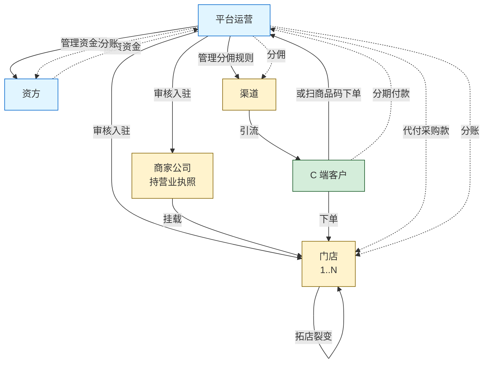

# 【满点重构 PRD V0.1】前端 Leader 专题

> 👤 **目标读者**：前端开发 leader、各端开发负责人
> 
> 📖 **本文档含**：角色端架构 + 6 端 PRD 完整内容 + IM 模块（与前端深度相关）
> 
> ⏱ **预计阅读时长**：90-120 分钟
> 
> 🎯 **评审重点**：
> - 6 个端的角色定位和技术形态（§3, §5）
> - C 端、门店端、商家端、运营端、资方端、渠道端的各模块细节（§6）
> - 扫商品码下单流程（§6.1.4）
> - 首付商家直收设计（§6.1.7）
> - 门店端开单助手的试算逻辑（§6.2.5）
> - 运营端 IM 工单台（§6.4.17）
> - IM 模块前端实现（§7.1.6 会话窗口设计）

---

> **📌 评审须知**（所有文档通用，1 分钟读完）
> 
> 你拿到的是【满点租赁系统重构 PRD V0.1 总体大纲】的一个分章节子文档。完整文档约 5 万字，为了高效评审，按部门/角色拆分后只给你看你工作相关的部分。
> 
> **如何参与评审**：
> 1. **整体读一遍**（按你部门预计 20-40 分钟即可）
> 2. **选中文字 → 右键评论** 提具体反馈，建议格式：
>    - 【类型】修改 / 新增 / 删除 / 质疑 / 疑问
>    - 【内容】你的建议
>    - 【原因】为什么这么改（可选）
> 3. **重要反馈 @ 产品负责人**
> 4. **截止时间**：[请项目负责人填写]
> 
> **不要做的事**：
> - 不要直接编辑文档（请用评论）
> - 不要纠结字段名/UI 文案这些细节（V1.0 阶段再抠）
> - 不要超出本文档范围讨论其他模块
> 
> **本文档可能引用的其他章节**（如有疑问可向产品负责人申请阅读权限）：
> - §1 文档说明  /  §2 商业模式  /  §3 角色与端  /  §4 核心业务模型
> - §5-6 各端 PRD  /  §7 基础设施  /  §8 全局规则  /  §9 数据模型
> - §10-13 短租 / 注意事项 / 待澄清 / 实施建议
-e 

---

## 3. 角色与端

### 3.1 端的全景图

```
┌─────────────────────────────────────────────────────────────┐
│  小程序/App（C 端）              微信公众号、支付宝小程序    │
│  · 浏览选品（长租+短租预留）                                  │
│  · 下单/签约/还款/留购/续租/归还                              │
│  · 扫商品码下单                                              │
│  · 工单与 IM 客服                                            │
├─────────────────────────────────────────────────────────────┤
│  门店端（H5 移动）             商家工作台 H5                 │
│  · 订单审核（门店订单自审、分红/平台订单移交）                │
│  · 自建开单（扫码助手）                                       │
│  · 拓店裂变                                                  │
│  · 软钱包提现                                                │
│  · IM 工单（联系客服）                                       │
├─────────────────────────────────────────────────────────────┤
│  商家端（PC 后台）             商家管理中心                   │
│  · 店铺/企业资质管理                                          │
│  · 商品上下架、规格、租金、押金                               │
│  · 营销（优惠券、礼包、营销图）                               │
│  · 财务对账、提现                                            │
│  · 组织/部门/成员/权限                                       │
├─────────────────────────────────────────────────────────────┤
│  运营端（PC 后台）             运营管理平台                   │
│  · 全平台订单管理（含电审、买断、续租、关闭退货）              │
│  · 商家/门店/采购账户/商品审核                                 │
│  · 资方管理（订单、账单、用户、打款记录、资金账户）             │
│  · 租后管理（逾期、催收、起诉）                                │
│  · 营销/佣金/财务/渠道/配置/信审/数据/权限                     │
│  · IM 工单台（客服侧）                                       │
├─────────────────────────────────────────────────────────────┤
│  资方端（H5 只读）             资方资金看板                   │
│  · 我的订单、账单、回款                                       │
│  · 资金账户余额、明细                                        │
│  · 申请提现（提交后走运营审核）                                │
├─────────────────────────────────────────────────────────────┤
│  渠道端（H5 报表）             渠道结算看板                   │
│  · 我带来的订单、佣金计算明细                                  │
│  · 结算单、提现申请                                          │
├─────────────────────────────────────────────────────────────┤
│  第三方中控（平台方自营，跨客户）                              │
│  · e签宝 / 新颜风控 / 人脸识别 / 设备安全锁 / 二要素验证       │
│  · 各客户调用我们中控，中控统一调第三方                        │
│  · 统一计费、充值、对账、统计                                  │
└─────────────────────────────────────────────────────────────┘
```

### 3.2 端的角色权限矩阵

| 模块 / 角色 | C 端 | 门店端 | 商家端 | 运营端 | 资方端 | 渠道端 |
|---|---|---|---|---|---|---|
| 浏览商品 | ✅ | - | - | - | - | - |
| 下单/签约/支付 | ✅ | - | - | - | - | - |
| 还款/留购/续租/归还 | ✅ | - | - | - | - | - |
| 商品管理 | - | - | ✅ | 审核 | - | - |
| 自建开单 | - | ✅ | - | - | - | - |
| 订单审核 | - | 门店订单 | - | 分红/平台订单 | - | - |
| 风控报告调取 | - | ✅ | - | ✅ | - | - |
| 电审 | - | - | - | ✅（信审员） | - | - |
| 拓店裂变 | - | ✅ | - | - | - | - |
| 软钱包/提现 | - | ✅ | ✅ | 审核提现 | ✅ 申请 | ✅ 申请 |
| 营销配置 | - | - | ✅ | ✅ 全局 | - | - |
| 财务对账 | - | 自己的 | 自己的 | 全平台 | 自己的 | 自己的 |
| 资方管理 | - | - | - | ✅ | - | - |
| 渠道管理 | - | - | - | ✅ | - | 看自己 |
| 租后/催收/起诉 | - | - | - | ✅ | - | - |
| 配置中心 | - | - | - | ✅ | - | - |
| IM 工单 | ✅ 客户视角 | ✅ 门店视角 | - | ✅ 客服视角 | - | - |
| 数据统计 | - | 自己的 | 自己的 | 全平台 | 自己的 | 自己的 |
| 组织权限 | - | - | ✅ | ✅ | - | - |

### 3.3 角色之间的关系图



---

## 5. 端 × 模块矩阵

下表为所有端的全部模块清单，按"端 → 一级模块 → 二级模块"列出。后续章节按此清单逐个展开。

### 5.1 C 端（小程序 / App）

| 一级模块 | 二级模块 | 短租预留 |
|---|---|---|
| 首页 | Banner、商品分类、推荐商品 | ✅ |
| 浏览选品 | 商品列表（按分类）、商品详情、规格选择 | ✅ |
| 扫码 | 扫商品码（直达详情）、扫门店码（绑定门店） | ✅ |
| 下单 | 填实名、紧急联系人、计费试算、选增值服务 | 短租：选时间段、取还车地点 |
| 签约 | e签宝三方电签（客户+门店+平台） | ✅ |
| 支付 | 首付支付（支付宝/微信） | 短租：支付全款或押金 |
| 我的订单 | 订单列表、订单详情、合同查看 | ✅ |
| 还款 | 当期账单、提前还款、还款记录 | 短租：超时计费补缴 |
| 留购/续租/归还 | 留购确认、续租申请、归还预约 | 短租：还车流程 |
| IM 客服 | 业务咨询、订单审核、售后服务 | ✅ |
| 增值服务 | 碎屏险、电池险等可选购 | ✅ |
| 我的钱包 | 押金/退款明细 | ✅ |
| 个人中心 | 实名、紧急联系人、地址、设置 | ✅ |

### 5.2 门店端（H5）

| 一级模块 | 二级模块 |
|---|---|
| 入驻 | 注册、企业资料、e签宝授权、采购账户申请 |
| 工作台 | 经营概览、待办、常用功能入口 |
| 全部订单 | 列表、筛选、详情 |
| 门店订单 | 自审、修改账单、查风控、发货管理 |
| 分红订单 | 查看（详情、分红明细、账单明细） |
| 平台订单 | 查看（执行类） |
| 续租订单 | 查看 |
| 买断订单 | 查看 |
| 开单助手 | 自建分红订单、自建低费率订单（生成二维码） |
| 我的钱包 | 余额、提现、流水 |
| 对账单 | 资金流水筛选、订单关联查询 |
| 采购申请 | 采购收款账号申请/修改 |
| 拓店助手 | 邀请码、协助入驻、奖励规则 |
| 已拓门店 | 一级/二级门店列表、状态跟踪 |
| IM 工单 | 联系客服（业务咨询、订单审核、售后） |
| 设置 | 店铺信息修改、密码修改、退出登录 |
| 企业授权 | e签宝授权状态、同步、授权书下载 |
| 审核进度 | 资料审核状态跟踪 |

### 5.3 商家端（PC）

| 一级模块 | 二级模块 |
|---|---|
| 首页 | 销售/成本/待收款/逾期/回款指标 |
| 订单管理 | 订单列表、逾期订单、到期未归还、买断订单、分红订单、低费率订单、续租订单 |
| 店铺管理 | 店铺信息、供应商寄件地址 |
| 商品管理 | 租赁商品列表（新增/修改/复制/删除/上下架/审核状态/二维码）、归还地址、增值服务、寄件地址 |
| 营销管理 | 优惠券列表、大礼包、店铺营销图配置 |
| 数据管理 | 导出数据下载 |
| 财务管理 | 资金账户、提现列表、结算明细、费用结算明细 |
| 服务中心 | 常见问题 |
| 权限管理 | 部门列表、成员管理 |

### 5.4 运营端（PC）

| 一级模块 | 二级模块 |
|---|---|
| 首页 | 销售额、成本、待收款、逾期、回款（分今日/7天/本月/全部/自定义） |
| 订单管理 | 订单列表、订单关闭和退货、到期未归还、买断订单、续租订单、分红订单、门店订单、电审订单 |
| 商品审核 | 租赁商品审核 |
| 店铺审核 | 店铺审核列表（含电审开关、冻结开关） |
| 采购账户审核 | 采购账户审核 |
| 分红订单管理 | 独立分红订单业务管理 |
| 低费率订单管理 | 独立低费率订单业务管理 |
| 资方管理 | 数据统计、订单管理、账单管理、用户管理、打款记录、资金账户 |
| 租后管理 | 逾期订单、催收回款、起诉列表 |
| 营销管理 | 评论管理、大礼包、优惠券 |
| 佣金管理 | 佣金列表、小程序佣金列表、佣金成本 |
| 财务管理 | 租金管理、线下还款、提现管理、钱包提现、押金管理、商家资金账户、资方提现列表、佣金审批、结算明细、费用结算明细 |
| 渠道管理 | 渠道分佣列表、佣金结算管理、渠道订单明细 |
| 配置管理 | 分类配置、素材中心、公告配置、常见问题配置、小程序配置、**费率配置（新）、价格库（新）、合同模板（新）、业务规则（新）** |
| 信审管理 | 信审管理（人员、启停、工作量分配规则） |
| 数据管理 | 获客明细表、导出数据下载 |
| 权限管理 | 部门列表、成员管理 |
| **IM 工单台（新增）** | 工单列表、工单详情、客服分配、聊天记录、统计 |
| **第三方中控（新增独立后台）** | 接口管理、调用计费、账户充值、统计 |
| **多客户管理（新增独立后台）** | 客户租户、版本管理、部署记录 |

### 5.5 资方端（H5 只读）

| 一级模块 | 二级模块 |
|---|---|
| 资方首页 | 资金余额、订单数、回款指标 |
| 我的订单 | 订单列表、订单详情、还款进度 |
| 我的账单 | 账单列表、应收/已收、回款记录 |
| 资金账户 | 余额、明细 |
| 提现申请 | 申请提现（提交后走运营审核） |
| 设置 | 资方资料、联系人 |

### 5.6 渠道端（H5 报表）

| 一级模块 | 二级模块 |
|---|---|
| 渠道首页 | 引流订单数、佣金概览 |
| 我的订单 | 引流订单列表、详情 |
| 佣金结算 | 佣金计算明细、结算单 |
| 提现申请 | 申请提现（走运营审核） |

---

## 6. 各端 PRD 详细大纲

> 本章对每个端的核心模块展开详细描述。鉴于篇幅，部分功能仅保留原有手册内容、不重复描述，重点展开**重构后变化的部分**和**之前未覆盖的设计**。

### 6.1 C 端（小程序 / App）PRD

#### 6.1.1 端定位

- **核心受众**：终端消费者（租客）
- **主要场景**：选品 → 下单 → 签约 → 支付 → 使用 → 还款 → 留购/归还
- **平台覆盖**：微信小程序（一期）、支付宝小程序（二期）、独立 App（三期）
- **技术选型建议**：Taro / uni-app（一码多端）

#### 6.1.2 首页

**布局区域**：

```
┌─────────────────────────────────┐
│  顶部导航：定位、搜索框、消息       │
├─────────────────────────────────┤
│  Banner 轮播图（运营配置）         │
├─────────────────────────────────┤
│  服务分类：长租手机、长租车、     │
│           短租车（预留）、增值服务 │
├─────────────────────────────────┤
│  热门商品（运营推荐位）            │
├─────────────────────────────────┤
│  全部商品（按分类滚动加载）        │
└─────────────────────────────────┘
```

**核心字段**：

| 字段 | 来源 | 配置位置 |
|---|---|---|
| Banner | 运营配置 | 配置管理 → 素材中心、小程序配置 |
| 分类 | 运营配置 | 配置管理 → 分类配置 |
| 商品列表 | 商家端商品库 | 商家端 → 商品管理 |
| 推荐位 | 运营配置 | 配置管理 → 小程序配置 |
| 公告横幅 | 运营配置 | 配置管理 → 公告配置 |

**短租扩展点**：分类 Tab 中预留"短租车"入口，V0.2 接入。

#### 6.1.3 浏览选品

**商品列表页**：
- 按一级分类（手机/电动车/...）筛选
- 按二级分类（苹果新机/苹果二手/安卓新机/...）筛选
- 排序：默认 / 价格升序 / 价格降序 / 销量
- 卡片信息：图片、名称、规格摘要、最低月付价、累计租出数

**商品详情页**：
- 头图轮播（多图）
- 商品名称、品牌、设备型号、成色（全新/二手）、保修状态
- 规格选择：颜色、内存（128/256/512）
- 计费试算区（实时计算，参考惠讯租办单助手）：
  - 期数选择（6/9/12 期可选）
  - 首付比例选择（30/40/50/60% 可选）
  - 设备管理费选择（50/150/250 元）
  - 自动显示：首付、月付、留购总价、押金
- 增值服务勾选：碎屏险 / 电池险 / 质保服务（按商品配置展示）
- 商品详情图文（商家维护）
- 商品须知（系统配置，如"本设备为安全锁设备，不可刷机..."）
- 底部固定按钮：联系客服 / 立即下单

**短租扩展点**：当 `goods_type` = 短租车型时，计费试算区切换为"时间段选择 + 实时计价"模式，详见 V0.2。

#### 6.1.4 扫商品码下单（重构新增重点）

**业务背景**：

当前业务痛点：客户到店看中一台手机后，销售员要打开 APP 找商品、填资料、生成二维码、给客户扫描，多步繁琐。

**重构后流程**：

```
客户到店看中商品
       ↓
门店给商品打印过商品码（或贴在样机上）
       ↓
客户用微信/支付宝扫一扫
       ↓
直接跳转到该商品在该门店的下单页
（商品已选好规格，门店已绑定）
       ↓
客户选择期数/首付/管理费/增值服务
       ↓
填实名、紧急联系人、收货地址
       ↓
提交订单（后续走审核）
```

**商品码生成规则**：

- 商品码 URL：`https://{客户域名}/c/scan?goods_id=XXX&store_id=XXX&channel_id=XXX`
- 商家端商品管理 → 二维码功能：生成单商品码（不绑定门店）
- 门店端开单助手 → 生成"商品+门店"二维码（绑定到当前门店）
- 渠道端可生成"商品+门店+渠道"码（绑定推广归属）

**自动归属规则**：

- 客户扫商品码 → 订单归属到对应门店
- 如有渠道参数 → 订单归属到渠道（计算佣金）
- 未来支持"店内 PAD 自助开单"（门店在 PAD 上自助生成订单码给客户扫）

**待澄清**：
- 商品码是永久有效还是带时效？
- 商品下架后，二维码扫描是否提示"商品已下架"？
- 是否需要"营业员二维码"标记是哪个销售员开的单（用于内部业绩分润）？

#### 6.1.5 下单流程

**步骤拆解**：

```
Step 1: 选商品 + 规格 + 期数 + 首付 + 管理费 + 增值服务
   ↓
Step 2: 填写客户信息
   - 实名认证（扫身份证或手动填）
   - 人脸识别（活体检测）
   - 紧急联系人（至少 2 个，要求至少一位是家人）
   - 收货地址
   ↓
Step 3: 计费确认页
   - 显示完整账单（首付 + 月付 × N 期 + 留购总价）
   - 增值服务费用
   - 总计金额
   - 同意《租机协议》《用户隐私协议》等
   ↓
Step 4: 提交订单
   - 系统调用风控接口（人工触发，不在此步自动调用）
   - 订单状态: DRAFT → PENDING_AUDIT
   ↓
Step 5: 等待审核（页面显示进度，预计 1-3 个工作日内完成）
```

**紧急联系人字段**：

| 字段 | 必填 | 数据类型 | 说明 |
|---|---|---|---|
| 联系人姓名 | ✅ | 字符串 | |
| 联系人手机号 | ✅ | 字符串 | 调用二要素验证 API（姓名+手机号是否一致）|
| 与客户关系 | ✅ | 枚举 | 父亲/母亲/配偶/子女/兄弟姐妹/同事/朋友/其他 |
| 是否家人 | ✅ | 布尔 | 系统校验：至少 1 条记录关系为家人 |
| 是否经过验证 | 自动 | 布尔 | 二要素 API 调用结果 |

**校验规则**：
- 至少 2 个紧急联系人
- 至少 1 个关系为"家人"（父亲/母亲/配偶/子女/兄弟姐妹）
- 手机号不能与客户本人手机号一致
- 调用二要素 API 验证姓名+手机号一致（**第三方中控计费**）
- 验证未通过的联系人，客服在审核时可标记"未通过" 或 人工沟通后手动标记"已确认"

**不发短信**：不主动给紧急联系人发任何短信通知。

#### 6.1.6 签约流程

**触发**：订单状态 APPROVED → PENDING_SIGN

**流程**：
- 系统调用 e签宝 API 创建签约任务
- 三方依次签字：
  - 客户在 C 端弹出 e签宝签约界面，活体识别后签字
  - 门店/商家在自己端收到签约通知，登录后签字
  - 平台自动签字（运营平台对接 e签宝企业账号）
- 三方全部完成后，订单状态 PENDING_SIGN → PENDING_PAY
- 签约完成后，合同 PDF 自动归档到订单详情

**合同模板**：

- 由"合同模板引擎"动态选择（详见 7.4 章节）
- 默认场景模板：
  - 长租分红订单：客户 + 门店 + 平台
  - 长租门店订单：客户 + 门店 + 平台
  - 长租平台订单：客户 + 平台 + 执行商家
  - 短租：客户 + 出租方（门店或平台） —— V0.2 补充
- 模板变量自动填充：甲乙丙方主体、订单金额、期数、首付、月付、设备信息、合同生效日、违约条款等

#### 6.1.7 支付与首付商家直收（重构新增）

**默认模式**：客户在线支付首付到平台账户

- 支付渠道：支付宝 / 微信 / 银联（**配置化**）
- 支付方式：H5 支付 / APP 拉起支付 / 扫码支付

**商家直收首付模式（可选开启）**：

- 触发条件：订单类型支持商家直收 + 门店/商家级开关开启
- 流程变化：
  - 客户不在 C 端付首付
  - 门店在开单助手生成二维码前，勾选「商家已收取客户第 1 期 X 元」
  - 系统跳过 PENDING_PAY 状态，直接 APPROVED → PENDING_SHIP
  - 平台不参与首付资金的代收代付
- 对应字段：
  - 订单表新增 `first_period_offline_collected` 布尔字段
  - 订单表新增 `first_period_offline_amount` 字段（线下收取金额）
- 风险控制：
  - 仅特定订单类型可用（默认门店订单可用，分红/平台订单不可用，**配置化**）
  - 财务对账时，第 1 期账单不参与平台与门店的结算

**待澄清**：
- 商家直收模式下，如果客户后续违约（不还月付），第 1 期商家自留是否合理？需明确"违约责任"
- 是否需要门店上传"已收款凭证"截图保存

#### 6.1.8 我的订单 / 还款 / 留购 / 续租 / 归还

**我的订单**：
- 列表：按状态筛选（全部 / 进行中 / 已完成 / 已关闭 / 退款中）
- 卡片：商品图、商品名、订单状态、订单金额、下单时间、最近账单日
- 点击进入详情

**订单详情**：
- 订单摘要（订单号、状态、商品、规格、期数、金额）
- 账单明细（每期金额、还款日、状态、收款方）
- 还款记录（每笔实际还款时间、金额、方式）
- 合同（点击查看 PDF）
- 物流信息（如发货后）
- 售后入口（联系客服、申请归还、申请续租、申请留购）

**还款**：
- 默认自动扣款（支付宝/微信免密代扣，绑定支付方式时已授权）
- 当期账单到期前 3 天推送提醒
- 客户可主动提前还款（一次性还多期）
- 还款记录可在订单详情和我的钱包查看

**留购**：
- 触发：客户在订单详情点"我要留购"
- 展示当期留购价（按 4.4.5 公式）
- 同意留购协议，支付留购价（最后一期可能为零）
- 支付完成 → 签留购合同 → 设备所有权转移 → 订单状态 PENDING_SETTLE

**续租**：
- 触发：租期最后 7 天，订单详情出现"申请续租"按钮
- 选续租期数（与原订单可不同）
- 系统按当前商品价 + 费率表重新试算
- 押金沿用，不重新收
- 签续租合同（独立合同号，关联原订单）
- 进入新一轮租赁

**归还**：
- 触发：客户在订单详情点"我要归还"
- 选择归还方式：寄回 / 送回门店
- 寄回：客户拍照确认设备状态，填快递单号
- 门店收到后验机 → 评估损耗 → 退还押金（如有扣减需在 IM 沟通确认）
- 订单状态 PENDING_RETURN → PENDING_SETTLE → COMPLETED

#### 6.1.9 IM 客服模块（C 端入口）

详见 7.1 章节 IM 客服整体设计。

C 端入口：
- 订单详情页 → 联系客服（绑定该订单的工单）
- 个人中心 → 客服中心（业务咨询 / 售后服务）
- 接收客服主动推送的消息（如审核通知、还款提醒、问题答疑）

#### 6.1.10 增值服务

- C 端在下单时可勾选商品配套的增值服务（碎屏险/电池险/质保等）
- 服务费用累加到首付一并支付
- 服务详情可在订单详情查看
- 服务理赔走单独工单（在 IM 模块）

#### 6.1.11 我的钱包（C 端）

- 押金账户：显示当前订单押金总额
- 退款记录：申请中 / 已完成 / 已拒绝
- 优惠券：可用券、已用券、过期券
- 大礼包：领取记录

#### 6.1.12 个人中心

- 头像、昵称、手机号
- 实名认证状态
- 紧急联系人管理（增删改）
- 收货地址
- 设置：消息通知、隐私协议、注销账号

---
### 6.2 门店端（H5）PRD

#### 6.2.1 端定位

- **核心受众**：商家公司下挂的实际经营门店（销售员、店长）
- **主要场景**：订单审核、自建开单、拓店、提现
- **平台覆盖**：H5（手机浏览器），未来出 App 版本
- **登录方式**：三因子（手机号 + 密码 + 短信验证码），符合金融行业安全要求

#### 6.2.2 入驻流程（重构关键变化）

**完整入驻链路**：

```
Step 1: 注册（手机号+密码+验证码+邀请码可选）
   ↓
Step 2: 选择门店类型
   ├─ 独立小门店（商家=门店，1:1）
   └─ 已有商家公司下挂门店（输入商家邀请码）
   ↓
Step 3: 填写企业资料 / 门店资料
   ├─ 企业名称、营业执照号、法人信息
   ├─ 门店名称、联系人、地址
   ├─ 上传营业执照、法人身份证正反面
   └─ 同意《入驻合同》《手机采购合同》《服务协议》《隐私政策》
   ↓
Step 4: 提交资料 → 状态 PENDING_AUDIT
   ↓
Step 5: 完成 e签宝企业授权
   ├─ 跳转 e签宝授权页面
   ├─ 完成授权后返回，点击"同步授权结果"
   └─ 必须在审核通过前完成，否则运营审核会拦截
   ↓
Step 6: 提交采购账户申请
   ├─ 填写签约支付宝账户、法人、身份证、手机号、邮箱
   └─ 运营审核通过后才能正常提现
   ↓
Step 7: 等待审核进度（手册有专门页面）
   ↓
Step 8: 审核通过 → 进入工作台
```

**关键规则**：
- e签宝授权状态由系统**主动拉取**（用户在页面点"同步授权结果"按钮）
- 资料审核与 e签宝授权是**并行**进行，但**审核通过的前提是 e签宝授权必须完成**
- 采购账户审核**独立于**资料审核，是提现前的必要前置

#### 6.2.3 工作台首页

**保留现有手册结构**：
- 今日订单、今日收入、应收账款（三个核心指标）
- 待办事项（待审核 / 待发货 / 待收货 / 租赁中 / 待归还）
- 常用功能（全部订单 / 门店订单 / 分红订单 / 开单助手 / 我的钱包 / 对账单 / 采购申请 / 拓店助手 / 已拓门店）
- 经营概览（门店订单统计、分红订单统计、租用中/逾期/已收/未收金额）

**重构后变化**：
- 增加"未读 IM 消息"红点提醒
- 增加"待处理工单"提醒（待审核工单、待沟通工单）
- 优化经营概览的图表化展示

#### 6.2.4 订单管理

**订单列表（全部订单）**：
- 列表项：商品图、商品名、客户姓名、客户手机、商品规格、期数、订单金额、状态、下单时间
- 筛选：状态、商品名、客户、手机号、订单号、时间范围
- 搜索：订单号 / 客户手机 / 客户姓名

**门店订单（门店自审）**：
- 列表筛选：状态（待审核 / 待发货 / 待收货 / 租赁中 / 待归还 / 待结算 / 已完成 / 已关闭）
- 待审核订单可执行：风控报告（人工调取）、修改账单、操作审批（通过/驳回）
- 修改账单流程：选择规格、期数 → 输入结算价格、首付比例 → 系统试算 → 保存

**分红订单 / 平台订单（运营审核）**：
- 门店仅查看，不能审核
- 详情可见：分红明细、账单明细、订单进度

**续租订单 / 买断订单**：
- 仅查看（详情 + 账单 + 结算）

**新增：到期未归还订单**（对应运营端的"到期未归还"，门店端也需要看到自己的）：
- 跟进客户归还状态
- 联系客户

**新增：逾期订单**（门店级查看）：
- 仅展示该门店相关的逾期订单
- 不能直接操作催收（催收归运营管），但能查看进度
- 配合催收员沟通客户

#### 6.2.5 开单助手（重构关键变化）

**界面结构**（保留现有 + 优化）：

```
开单助手
├─ 自建分红订单：平台配资，支持全系列主流数码产品
└─ 自建低费率开单：门店订单（重构后改名"自建门店订单"），自主定价
└─ 自建平台订单（新增）：纯送单给平台，门店得佣金
```

**新机下单 + 旧机下单**（参考手机妈妈同行设计）：

- 新机下单：调用 `pricing.json.prices_new` 价格库（苹果中国官网价）
- 旧机下单：调用 `pricing.json.prices_used` 价格库（靓机价 × multiplier）

**单据生成流程**（按惠讯租办单助手公式）：

```
Step 1: 选成色（全新 / 二手）
Step 2: 选分类（苹果 / 安卓 / 电动车 / ...）
Step 3: 选型号（iPhone 17 Pro Max / iPhone 17 Pro / ...）
Step 4: 选规格（256/512）
Step 5: 系统自动带出"指导价"（用户可手动改价，但有保护：低于成本价时警告）
Step 6: 选期数（6/9/12）
Step 7: 选首付比例（30/40/50/60%）
Step 8: 选设备管理费（50/150/250）
Step 9: 系统实时试算并显示：首付、月付方案、设备总金额、留购总价
Step 10: 勾选"商家已收取客户第 1 期 XX 元"（可选，仅商家直收模式）
Step 11: 生成二维码（包含订单参数）
Step 12: 客户扫码 → 进入 C 端下单页 → 填实名、紧急联系人、签约、支付
```

**开单类型选择**：
- 自建分红订单：填写"配资比例"或"配资金额"
- 自建门店订单：100% 自资
- 自建平台订单：0% 自资，门店只赚佣金

**自动归属**：
- 二维码包含门店 ID
- 客户扫码下单后，订单自动归属到该门店
- 渠道引流码：在门店码基础上加渠道参数

#### 6.2.6 我的钱包（重构关键变化）

**重构前（三账户）**：
- 分成余额（分红收入）
- 佣金余额（佣金收入）
- 配资额度（充值放大倍数）

**重构后（单账户 + 流水类型）**：

```
我的钱包
├─ 可用余额（可提现）
├─ 结算中余额（未到结算日的客户已还款）
├─ 冻结金额（提现申请中、订单争议中）
└─ 累计入账（统计指标）
```

**资金流水**：
- 每笔流水标注资金类型（分红收入 / 佣金收入 / 退款 / 提现 / 充值 / 调整）
- 按订单号筛选、按时间筛选、按资金类型筛选
- 可导出 Excel

**提现**：
- 提现至已绑定的采购账户（支付宝）
- 单次提现金额限制：最小 100 元（**配置化**），最大 50000 元
- 提现申请 → 运营审核 → 通过后走支付宝 API 打款 → 客户到账
- 提现手续费（**配置化**，默认 0 元）

**充值（仅负数账户回填）**：
- 仅当软钱包为负数时，门店可主动充值正向回填
- 充值方式：支付宝/微信扫码支付
- 充值成功后实时入账

**配资额度功能取消**：原配资充值放大机制改为资方资金池统一管理

#### 6.2.7 拓店助手 + 已拓门店

**保留现有手册功能 + 优化**：

- 拓店助手：邀请码、协助新门店入驻、奖励规则、累计奖励
- 已拓门店：一级门店 / 二级门店切换、状态跟踪、订单数量

**重构后新增**：
- 一级门店向二级门店的分润比例（**配置化**）
- 二级门店向上级的回报比例
- 拓店奖励触发规则（按下级订单数？金额？固定金额？— **配置化**）
- 拓店关系限制层级（默认 2 级，**配置化**）

**待澄清**：
- 拓店奖励是一次性的还是持续的（如下级每出一单都返点）？
- 拓店关系是否可解除（如下级门店转走）？

#### 6.2.8 IM 工单（重构新增重点）

详见 7.1 章节。

门店端 IM 入口：
- 工作台 → 联系客服（顶部固定）
- 订单详情 → 联系客服（绑定该订单的工单）
- 推送通知：客户/客服发消息时手机收到通知

工单类型：
- 业务咨询（开店、营销、提现等一般问题）
- 订单审核（分红/平台订单送审）
- 售后服务（设备问题、客户投诉等）

#### 6.2.9 设置 / 企业授权 / 审核进度

保留现有手册功能不变。

---

### 6.3 商家端（PC）PRD

#### 6.3.1 端定位

- **核心受众**：商家公司主体（公司管理员、运营人员）
- **主要场景**：商品上下架、营销、财务对账、组织权限
- **平台覆盖**：PC 浏览器后台
- **特点**：管"商品 + 营销 + 财务 + 组织"，订单审核操作让给门店和运营

#### 6.3.2 首页

**保留现有手册**：销售额及成本、待收款统计、已收款统计

**新增**：
- 多门店切换（如有多门店）
- 商品审核状态汇总（待审核商品数）
- 待处理工单提醒

#### 6.3.3 订单管理

**保留现有手册**：
- 订单列表、逾期订单、到期未归还、买断订单、分红订单、低费率订单、续租订单
- 待审核订单可调风控、修改账单、审核
- 详情核对：订单摘要、收货信息、实名状态、金额明细、分期账单

**重构后新增**：
- 全局搜索：跨所有订单类型的统一搜索框
- 批量操作：批量审核、批量驳回、批量导出
- 标签管理：给订单打自定义标签（如"加急"、"VIP 客户"）

#### 6.3.4 店铺管理

**店铺信息**：
- 店铺主体资料、企业信息、e签宝授权、合同
- 多门店管理：商家可挂多个门店，每个门店独立资料

**供应商寄件地址**：保留现有手册

#### 6.3.5 商品管理（重构关键变化）

**租赁商品列表**：

- 新增字段：
  - 商品类型（PHONE_NEW / PHONE_USED / EV / SHORT_RENT_EV 预留）
  - 是否可周转（短租预留）
  - 是否需要质检（二手机默认勾选）
  - 设备序列号绑定（一物一码，预留设备库）

- 操作：新增、修改、复制、删除、上下架、查看审核状态、生成二维码（**商品码**）

**新增商品流程**：

```
Step 1: 选商品类目（运营端配置）
Step 2: 填基础信息（名称、品牌、型号、成色、规格）
Step 3: 上传图片（主图、轮播图、详情图）
Step 4: 设置租金规则（套餐 / 自定义）
   - 套餐模式：选预设的费率档位（6 期 30% 套餐 / 12 期 50% 套餐...）
   - 自定义模式：单独设置该商品的费率（覆盖全局费率表）
Step 5: 押金规则（按公式计算 / 固定金额）
Step 6: 留购规则（按公式计算 / 自定义）
Step 7: 买断/归还规则
Step 8: 运费规则
Step 9: 增值服务关联（勾选可购买的增值服务）
Step 10: 商品须知（默认带"安全锁、不可刷机、序列号一致"等模板，可改）
Step 11: 上下架开关
Step 12: 提交审核（运营端审核）
```

**商品类目**：

- 由运营端「配置管理 → 分类配置」维护
- 多层级（一级分类 / 二级分类 / 三级分类）
- 商家创建商品时选择类目

**商品二维码**：

- 每个商品一个永久商品码
- URL: `https://{客户域名}/c/scan?goods_id=XXX`
- 商家可下载二维码图片，门店可打印贴在样机上

**归还地址 / 寄件地址 / 增值服务**：保留现有手册

#### 6.3.6 营销管理

**优惠券**：
- 创建、编辑、停用、删除
- 字段：券名称、面额、使用门槛、有效期、适用商品、领取规则
- 新增字段：客户分群（新客 / 老客 / VIP）
- 新增字段：是否可叠加使用

**大礼包**：
- 组合多张优惠券为礼包
- 发放规则配置（新客注册自动发 / 邀请奖励 / 节日活动）

**店铺营销图配置**：
- 上传 banner、跳转链接、上线时间、排序
- 推送到 C 端首页展示

#### 6.3.7 数据管理

**导出数据下载**：保留现有手册

**新增统计报表**：
- 销售总览（按时间维度）
- 商品销售排行
- 门店业绩对比（如多门店）
- 增值服务销售统计
- 留购率、续租率、归还率

#### 6.3.8 财务管理（重构关键变化）

**资金账户**：

- 重构前：商家端单一资金账户，明细按"电子合同费用结算、人脸识别费用、新颜共债风控报告、新颜全景风控报告"等第三方接口费用扣减
- 重构后：
  - 主资金账户（可用 / 冻结 / 结算中）
  - 资金流水（按订单 / 按类型 / 按时间筛选）
  - 第三方费用扣款明细（独立 Tab，与业务流水分离）

**提现列表**：保留现有手册

**结算明细查询**：保留现有手册

**费用结算明细**（重构变化）：
- 按费用类型分 Tab：芝麻租排分离接口费用、风控报告、电子合同、人脸识别、二要素验证、设备锁
- 每类显示：已结算 / 待结算金额、订单关联、时间
- 与第三方中控统一对账（详见 7.2）

#### 6.3.9 服务中心

- 常见问题（运营端配置）
- 在线客服入口（IM 工单）
- 视频教程入口

#### 6.3.10 权限管理（保留 + 增强）

**部门列表**：
- 新增、编辑、删除部门
- 部门权限配置（菜单权限、数据权限）

**成员管理**：
- 新增成员（账号、姓名、手机号、部门、角色）
- 启用/停用、修改、权限配置
- 操作日志（记录每个成员的关键操作）

**新增功能**：
- 角色模板（常见角色：店长、销售员、财务、客服）
- 数据权限（看全部 / 看自己 / 看本门店）

---

### 6.4 运营端（PC）PRD

#### 6.4.1 端定位

- **核心受众**：平台运营、审核、财务、风控、催收、客服等多岗位
- **主要场景**：上帝视角的全平台管理
- **平台覆盖**：PC 浏览器后台

#### 6.4.2 首页

**保留现有手册的销售/成本/待收/逾期/回款指标**

**新增模块**：
- 待办事项汇总：待审核店铺数、待审核商品数、待审核订单数、待审核电审、待处理工单
- 实时业务监控：今日订单数、今日回款、今日逾期、今日新增客户
- 平台健康度：第三方接口余额、系统报警

#### 6.4.3 订单管理

**保留现有手册的全部订单类型菜单**：
- 订单列表（统一搜索）
- 订单关闭和退货
- 到期未归还订单
- 买断订单
- 续租订单
- 分红订单
- 门店订单
- 电审订单

**电审订单详解**：

- 电审订单来源：满足"门店级 `need_tele_audit` = true"的订单，自动进入电审池
- 电审分配规则（**配置化**）：
  - 轮询（默认）
  - 按订单金额（大单分给资深电审）
  - 按客户地域（按省份/城市分配）
  - 手动认领（电审员从池子里抢单）
- 电审员工作台：
  - 当前任务卡片：客户姓名、手机号、紧急联系人、订单金额、风控结论
  - 一键拨号（集成 SIP 或外呼系统）
  - 通话录音自动保存
  - 电审脚本（**配置化**，由运营定义问题）
  - 审核动作：通过 / 驳回（必填原因） / 待补充资料

**新增"高级筛选"**：
- 风险等级筛选（高/中/低）
- 风控报告类型筛选
- 客户标签筛选
- 多维度组合筛选

#### 6.4.4 商品审核

**租赁商品审核**：
- 列表筛选（待审核 / 审核通过 / 审核拒绝）
- 详情核对：商品主图、轮播图、规格、价格、商品详情、租赁规则
- 审核动作：通过 / 拒绝（填具体修改点）
- 批量操作：批量通过 / 批量拒绝

#### 6.4.5 店铺审核（重构关键变化）

**列表新增筛选**：
- 是否需要平台电审（门店级开关）
- 店铺冻结状态

**详情新增字段**：
- 平台电审开关（运营在审核时勾选，控制该门店订单是否走电审）
- 商品审核冻结开关（运营在审核时勾选，控制该门店上架商品是否需要单独审核）
- 店铺冻结开关（运营在审核时勾选，控制该门店是否允许新单）

**审核动作**：
- 审核通过 + 设置开关
- 审核拒绝 + 填写原因（可批量驳回项目，如"营业执照模糊"、"法人身份证不一致"）
- 提交后系统自动校验 e签宝授权状态，未授权拒绝通过

#### 6.4.6 采购账户审核

保留现有手册：审核商家提交的支付宝账户、法人、身份证、手机号、邮箱。

**审核日志**：审核人、审核时间、审核意见。

#### 6.4.7 资方管理（重构关键变化）

**资方数据统计**：保留现有手册

**资方订单管理**：保留现有手册（认领、分配、详情）

**资方账单管理**：保留现有手册

**资方用户管理**（重构变化）：
- 新增字段：资方端登录账号、初始密码
- 资方用户创建后，系统给资方发邮件（含资方端 H5 链接 + 账号 + 临时密码）
- 资方可登录资方端查看自己的数据

**打款记录**：保留现有手册

**资方资金账户**（重构变化）：
- 充值入口：支持四种方式（**配置化开关**）
  - A. 银行对公转账后运营手动录入
  - B. 资方在线充值（支付宝/微信，限额制）
  - C. 平台代垫，事后结算（财务月底跑批扣资方账户）
  - D. 资方银行直连（自动同步，需对接 API，待评估）
- 资金账户余额预警：余额 < 阈值时（**配置化**）通知运营，且自动暂停新订单分配给该资方

**待澄清**：
- 多个资方时，订单按什么规则分配（轮询 / 按额度比例 / 优先级）？
- 资方资金账户冻结时（如争议处理），是否影响该资方原有订单的还款入账？

#### 6.4.8 租后管理（重构关键变化）

**逾期订单列表**（保留 + 增强）：
- 按逾期天数分级（1-3 天、4-7 天、8-15 天、16-30 天、30+ 天）
- 按客户、订单筛选
- 分配催收员（轮询 / 按地域 / 手动）

**催收回款列表**（保留 + 增强）：
- 实际还款日期、闲置时间、是否提前、是否逾期、催收人筛选
- 新增字段：催收备注、催收次数、客户响应状态（已回复 / 未回复 / 拒绝沟通）
- 催收员工作台：当前催收任务、IM 沟通工单

**起诉列表**（保留 + 增强）：
- 严重违约订单（逾期 90+ 天，金额 > 阈值）转起诉
- 起诉资料管理（合同、聊天记录、还款记录、风控报告、客户身份信息等证据归档）
- 起诉状态：准备资料 / 已起诉 / 立案 / 庭审 / 判决 / 执行 / 结清

**新增模块：失联客户处理**：
- 客户长期失联（电话不通、IM 不回）转入失联池
- 联系紧急联系人（通过 IM 推送或电话，避免短信）
- 设备远程锁定（联动设备安全锁服务）
- 30 天未恢复联系 → 转起诉准备

#### 6.4.9 营销管理

**评论管理**：
- 列表（待审核 / 已通过 / 已隐藏）
- 内容审核（敏感词过滤、人工复审）
- 商家回复（商家可在自己端回复）

**大礼包 / 优惠券**：保留现有手册，与商家端互补
- 运营端管"平台级活动"（如全平台双 11 优惠）
- 商家端管"店铺级活动"

#### 6.4.10 佣金管理

**佣金列表**：
- 渠道佣金规则配置
- 字段：渠道名称、订单类型、佣金计算方式（固定金额 / 订单百分比 / 阶梯）、生效时间、状态

**小程序佣金列表**：
- C 端分销返佣规则配置
- 用户邀请用户、按下级订单分佣

**佣金成本**：
- 按时间、按渠道统计佣金成本
- 与财务对账

#### 6.4.11 财务管理

**租金管理**：
- 全平台租金收款、待收、逾期统计
- 按订单、按客户、按时间、按状态筛选
- 异常订单标记

**线下还款管理**（重构关键变化）：
- 客户线下打款 → 商家/运营手动录入 → 审核 → 入账
- 流程：录入金额、客户、订单号、还款日期、凭证图片
- 双人审核制：录入人 + 复核人（**配置化是否开启**）
- 入账后自动更新订单账单状态

**提现管理 / 钱包提现**：保留现有手册（合并到统一提现审核）

**押金管理**（重构关键变化）：
- 按订单维度展示押金（订单号、客户、押金金额、状态、订单状态）
- 押金状态：已收取 / 已冻结 / 待退还 / 已退还 / 已抵扣留购
- 退还操作：客户归还设备且无损耗 → 退还押金
- 强制退款：争议订单运营介入，强制退押金（需高级权限）
- 金额调整：损耗扣减押金（需填扣减原因）

**商家资金账户**：保留现有手册

**资方提现列表**：保留现有手册

**佣金审批**：审批佣金结算或提现申请

**结算明细查询 / 费用结算明细**：保留现有手册

#### 6.4.12 渠道管理

**渠道分佣列表**：
- 维护渠道方信息（名称、联系人、佣金规则、状态）
- 渠道方注册：运营手动新增 + 自动生成渠道码

**佣金结算管理**：
- 按渠道、按时间结算
- 结算后生成结算单 PDF
- 渠道方提现申请

**渠道订单明细**：
- 按渠道、按时间筛选订单
- 显示佣金计算明细

#### 6.4.13 配置管理（重构关键变化，新增大量配置项）

**保留现有手册的**：
- 分类配置（商品分类树）
- 素材中心（图片、视频）
- 公告配置
- 常见问题配置
- 小程序配置（首页 banner、导航、专区）

**新增重要配置项**：

1. **费率配置**：
   - 期数 × 首付比例 × 费率倍数表
   - 全局/客户/门店/商品多层级覆盖
   - 配置变更只影响新订单

2. **价格库**：
   - 新机价格库（按品牌-型号-规格）
   - 二手机价格库（按品牌-型号-规格-成色）
   - 短租车价格库（V0.2）
   - 批量导入导出

3. **合同模板管理**：
   - 模板列表（按业务类型、订单类型）
   - 模板编辑器（变量占位符、富文本）
   - 模板版本管理
   - 启用/停用切换

4. **业务规则配置**：
   - 商家直收首付开关（按订单类型 / 按门店）
   - 平台电审默认开关
   - 逾期罚息规则
   - 退款违约金规则
   - 账单日修改窗口
   - 提现金额限制
   - 提现手续费
   - 推送规则（提醒频率）
   - 客服工作时段

5. **第三方接口配置**：
   - e签宝、新颜、人脸识别、设备锁、二要素验证、短信、支付的 API Key、调用规则
   - 配置在中控平台，本地仅做读取（详见 7.2）

6. **风控策略配置**：
   - 风控规则编辑（如：客户在途订单 > N 单时拒绝）
   - 风险分级
   - 自动通过/拒绝/转人工审核的阈值

7. **客服分配规则**：
   - 工单按类型分配（咨询/审核/售后）
   - 客服技能标签
   - 工作量上限
   - 自动转单规则

8. **拓店奖励规则**：
   - 拓店奖励计算公式
   - 拓店关系层级
   - 奖励发放节奏

#### 6.4.14 信审管理（重构变化）

**信审管理**：
- 信审人员名单
- 启用 / 停用
- 工作量统计（每日处理订单数、平均处理时长）
- 排班配置（不同时段值班）

**新增分配规则配置**：
- 轮询 / 按金额 / 按地域 / 手动
- 优先级：高金额优先 / 高风险优先 / 新客户优先
- 超时自动转单（信审员 X 分钟未处理转给下一个）

#### 6.4.15 数据管理

**获客明细表**：
- 按渠道 / 按时间 / 按门店统计获客数据
- 转化漏斗：浏览 → 下单 → 签约 → 支付 → 完成

**导出数据下载**：保留现有手册

**新增统计大盘**：
- 业务大盘（GMV、订单数、客户数、增长曲线）
- 风险大盘（逾期率、坏账率、违约金回收率）
- 资金大盘（资方资金占用率、回款周期）
- 平台健康度

#### 6.4.16 权限管理

**部门列表 / 成员管理**：保留现有手册

**新增**：
- 角色模板（信审员、电审员、催收员、客服、财务、运营）
- 数据权限（全部 / 区域 / 商家 / 自己）
- 操作日志（关键操作留痕：审核、退款、配置变更）

#### 6.4.17 IM 工单台（运营端新增重点）

详见 7.1 章节。

运营端是客服的主要工作台。

#### 6.4.18 第三方中控（运营端独立新增）

详见 7.2 章节。

#### 6.4.19 多客户租户管理（运营端独立新增）

详见 7.5 章节。

---

### 6.5 资方端（H5 只读）PRD

#### 6.5.1 端定位

- **核心受众**：资方公司或个人投资人
- **主要场景**：查看自己资金、订单、账单、回款，申请提现
- **平台覆盖**：H5（手机浏览器）
- **特点**：只读 + 提现申请，关键操作走运营审核

#### 6.5.2 资方首页

- 资方公司名称、欢迎语
- 资金余额、累计投资、累计回款
- 当月数据：新增订单数、回款金额、待回款金额
- 余额预警提醒

#### 6.5.3 我的订单

- 列表：订单状态、商品、客户、金额、还款进度
- 详情：订单摘要、分红明细、账单明细、还款记录
- 筛选：状态、时间、金额范围

#### 6.5.4 我的账单

- 按订单维度的账单列表
- 应收 / 已收 / 待收金额
- 每期还款情况
- 异常账单标记（逾期、争议）

#### 6.5.5 资金账户

- 当前余额
- 历史流水（充值、回款、提现、调整）
- 按类型筛选

#### 6.5.6 提现申请

- 申请提现金额、目标账户
- 提交后状态：申请中 / 审核通过 / 已打款 / 拒绝
- 历史提现记录

#### 6.5.7 设置

- 资方资料（公司名、联系人、电话、邮箱）
- 收款账户管理
- 密码修改
- 通知设置

---

### 6.6 渠道端（H5 报表）PRD

#### 6.6.1 端定位

- **核心受众**：渠道方（流量平台、个人推广者）
- **主要场景**：查看引流订单、佣金计算、申请提现
- **平台覆盖**：H5

#### 6.6.2 渠道首页

- 渠道方名称
- 累计引流订单数、累计佣金
- 当月引流数、当月佣金
- 引流二维码 / 推广链接

#### 6.6.3 我的订单

- 引流订单列表
- 详情：订单状态、客户、金额、佣金计算

#### 6.6.4 佣金结算

- 按月结算单
- 佣金计算明细
- 结算状态：未结算 / 结算中 / 已结算

#### 6.6.5 提现申请

- 申请提现
- 历史记录
- 走运营审核

---
## 7. 后台基础设施

本章描述跨多端共用的基础设施模块，包括 IM 客服、第三方中控、配置中心、合同模板引擎、多租户部署架构。这些模块在重构中是**全新或重大改造**的，重要性很高。

### 7.1 IM 客服模块（自研，重点）

#### 7.1.1 模块定位

- **替代当前的"拉微信群审核"模式**
- 所有客户/门店/商家与平台客服的沟通在系统内完成
- 工单与订单/审核任务强关联
- 聊天记录永久保存，不外流

#### 7.1.2 核心模型

**工单（Ticket）**：

| 字段 | 类型 | 说明 |
|---|---|---|
| ticket_id | 字符串 | 工单号（全局唯一）|
| ticket_type | 枚举 | 业务咨询 / 订单审核 / 售后服务 / 催收 / 退款 / 起诉 |
| related_entity_type | 枚举 | 订单 / 商品 / 退款 / null |
| related_entity_id | 字符串 | 关联实体 ID |
| customer_id | 字符串 | 客户/门店/商家 ID |
| customer_type | 枚举 | C 端客户 / 门店 / 商家 / 资方 |
| assigned_to | 字符串 | 客服员工 ID |
| status | 枚举 | 待分配 / 处理中 / 待客户响应 / 已解决 / 已关闭 |
| priority | 枚举 | 低 / 中 / 高 / 紧急 |
| tags | 数组 | 自定义标签 |
| created_at | 时间 | 创建时间 |
| last_message_at | 时间 | 最后消息时间 |
| resolved_at | 时间 | 解决时间 |
| satisfaction_rating | 整数 | 满意度评分（1-5）|

**会话（Conversation）**：

- 一个工单对应一个会话
- 会话成员：客服、提单人（门店/商家/客户）、可选邀请人（如客户被邀请加入）

**消息（Message）**：

| 字段 | 类型 | 说明 |
|---|---|---|
| message_id | 字符串 | 消息 ID |
| conversation_id | 字符串 | 会话 ID |
| sender_id | 字符串 | 发送人 ID |
| sender_type | 枚举 | 客服 / 门店 / 商家 / 客户 / 系统 |
| content_type | 枚举 | 文字 / 图片 / 视频 / 文件 / 系统卡片 / 订单卡片 |
| content | JSON | 消息内容 |
| sent_at | 时间 | 发送时间 |
| read_by | 数组 | 已读用户 ID 列表 |

#### 7.1.3 关键流程

**门店发起审核工单**（核心场景，参考手机妈妈模式）：

```
门店在开单助手生成二维码 → 客户扫码下单 → 订单状态 PENDING_AUDIT
       ↓
门店打开门店端 → 联系客服 → 订单审核客服 → 点击"审核结果"
       ↓
系统检测：该订单是否已有工单？
   ├─ 有：直接打开已有工单的会话
   └─ 无：自动创建新工单（关联订单 ID），按分配规则指派客服
       ↓
会话窗口打开，顶部展示订单卡片（客户姓名、手机、金额、设备、期数、风控结论）
       ↓
门店与客服在窗口内沟通：
   - 客服可发送系统卡片（如"请补充身份证背面"）
   - 客服可一键调取：风控报告、订单详情、客户历史订单
   - 客服可一键操作：审核通过 / 驳回 / 修改账单
       ↓
客服点"审核通过" → 自动更新订单状态 + 推送通知给客户和门店
       ↓
工单状态变为"已解决"，会话保留可继续沟通
```

**客户发起售后咨询**：

```
客户在 C 端订单详情点"联系客服" → 选择咨询类型（售后/账单/物流）
       ↓
系统创建工单，关联订单 ID
       ↓
按客服分配规则指派客服
       ↓
客户与客服沟通
```

**客户被邀请加入审核会话**（特殊场景）：

```
门店与客服沟通中，客服需要客户本人确认（如"是否本人下单？"）
       ↓
客服点"邀请客户加入会话"
       ↓
系统给客户推送通知 + C 端弹出邀请
       ↓
客户加入会话 → 三方沟通
       ↓
确认完毕后客户可退出会话，会话留痕
```

#### 7.1.4 会话内特殊消息类型

- **订单卡片**：展示订单关键信息
- **风控报告卡片**：客服调取后展示报告摘要
- **身份证识别卡片**：客户上传后系统自动识别
- **审核操作卡片**：客服点击触发系统操作
- **设备照片卡片**（用于门店上传待租设备照片留痕，对应质检场景）
- **支付卡片**（客户在会话内一键支付）
- **签约卡片**（客户在会话内一键签约）

#### 7.1.5 客服侧工作台

**工单列表**：

- 我的工单（已分配给我）
- 待分配池（可手动认领）
- 全部工单（管理员视角）
- 筛选：类型、状态、优先级、客户、时间

**工单详情**：
- 左侧：工单元信息、客户信息、订单信息、操作面板
- 中部：会话窗口
- 右侧：可调取的系统资料（风控报告、订单历史、合同、操作日志）

**统计看板**：
- 我今天处理的工单数、平均响应时间、满意度
- 工单池堆积情况
- 客服工作量对比

#### 7.1.6 客服分配规则（**配置化**）

支持多种分配策略：

| 策略 | 说明 |
|---|---|
| 轮询 | 按客服在线顺序轮流分配 |
| 最小负载 | 分配给当前工单数最少的客服 |
| 技能匹配 | 按工单类型分配给对应技能的客服 |
| 客户区域 | 按客户省份/城市分配 |
| 订单金额 | 大额订单分配给资深客服 |
| 手动认领 | 工单进入待分配池，客服自助认领 |
| 混合 | 多策略组合（先技能匹配，再最小负载） |

**超时规则**：
- 客服 X 分钟未响应 → 自动转单（**配置化**）
- 工单 Y 天未关闭 → 自动升级 / 通知管理员

#### 7.1.7 客服工作时段（**配置化**）

参考同行公告：
- 业务咨询顾问：8:30-23:30
- 售后服务专员：8:30-23:30

非工作时段：
- 客户/门店可继续提交工单
- 自动回复"已收到，X 时段处理"
- 工作时段开始时按队列处理

#### 7.1.8 历史记录与留痕

- 聊天记录**永久保存**
- 关键资料自动归档（身份证、风控报告、设备照片、操作记录）
- 工单关闭后会话只读，可重新打开（如客户复诉）
- 起诉时可导出工单完整记录作证据

#### 7.1.9 技术架构（开发参考）

- **协议**：WebSocket（实时双向通信）
- **消息持久化**：MySQL（消息表分表 by 月份）+ MinIO/OSS（图片/视频/文件）
- **在线状态**：Redis（客服在线/离线、用户活跃度）
- **离线推送**：APP 端用极光/小米/华为推送，Web 端用浏览器 Notification + 短信兜底
- **消息去重**：消息 ID 全局唯一，客户端去重
- **断线重连**：自动重连 + 离线消息补拉
- **群聊**：暂不需要（默认 1v1 + 邀请加入）
- **客服转接**：客服 A 点"转交" → 选择客服 B → 工单分配关系更新 → 会话保留全部历史
- **机器人**：预留接口（V2.0 接 AI 客服初筛常见问题）

#### 7.1.10 开发优先级

**MVP（V1.0 必须）**：
- 工单创建、分配、会话
- 文字消息
- 图片/视频/文件
- 订单卡片、系统卡片
- 工单状态机
- 客服分配规则
- 历史记录

**V1.1 加入**：
- 客户邀请加入会话
- 转接客服
- 工单转单
- 自动回复
- 满意度评价

**V2.0 进阶**：
- AI 客服初筛
- 群聊（如多人协作处理大额订单）
- 通话集成（IM 内拨打电话）

---

### 7.2 第三方中控（独立平台，重点）

#### 7.2.1 模块定位

**问题背景**：

- 系统需要对接多个第三方服务：e签宝、新颜风控、人脸识别、设备锁、二要素验证、支付、短信
- 每个第三方都有自己的计费、调用限制、Key 管理
- 平台部署到 10+ 客户后，如果每个客户独立对接，账务和成本会乱
- 客户也不应该直接持有 Anthropic/阿里云等第三方 Key

**解决方案**：建立**第三方中控平台**，由平台方（你）自营，所有客户的第三方调用都走中控。

#### 7.2.2 架构

```
客户 A 系统  ─┐
客户 B 系统  ─┼─→  中控 API 网关  ─→  统一计费/限流/日志
客户 C 系统  ─┘                       ↓
                                       ↓
                            ┌─────────┼─────────┐
                            ↓         ↓         ↓
                         e签宝     新颜风控   人脸识别
                            ↓         ↓         ↓
                         设备锁    二要素      支付/短信
```

#### 7.2.3 中控功能模块

**接口管理**：
- 注册第三方接口（名称、类型、API 地址、平台计费规则、对外计费规则）
- 维护 API Key（中控持有，客户系统不持有）
- 接口启用/停用

**客户租户管理**：
- 注册客户（客户公司名、联系人、接入 Token）
- 客户接入鉴权（每个客户独立 Token，请求带 Token 验证）

**统一计费**：
- 每次调用记录：客户、接口、调用时间、第三方实际成本、对客户的计费金额、调用结果
- 客户账户余额管理
- 余额预警、自动停服

**充值与对账**：
- 客户充值（线下打款 + 录入 / 在线支付）
- 对账：第三方实际账单 vs 中控记录的调用次数（月度核对）

**调用统计**：
- 按客户、按接口、按时间维度统计
- 调用成功率
- 平均响应时间

**限流与熔断**：
- 客户调用频率限制（防止接口被滥用）
- 第三方接口故障时熔断保护

#### 7.2.4 当前需对接的第三方清单

| 第三方 | 用途 | 计费维度 | 对客户计费建议 |
|---|---|---|---|
| **e签宝** | 企业授权、电子合同签署 | 按合同数 + 套餐月费 | 按合同数 + 加成 |
| **新颜风控** | 共债报告、全景报告 | 按次 | 按次 + 加成 |
| **人脸识别** | 活体检测、人脸对比 | 按次 | 按次 + 加成 |
| **设备安全锁** | 远程锁定、解锁手机 | 按设备数月费 | 按设备数月费 + 加成 |
| **二要素验证** | 姓名+手机号一致性 | 按次 | 按次 + 加成 |
| **支付（支付宝/微信）** | 收款、退款、提现 | 按交易金额 | 按交易金额 + 加成（少加，谨慎）|
| **短信** | 验证码、通知 | 按条 | 按条 + 加成 |
| **OSS/CDN** | 图片视频存储 | 按存储+流量 | 按存储+流量 + 加成 |
| **质检 SDK（预留）** | 二手机质检 | 按次 | 按次 + 加成 |
| **物流接口（预留）** | 顺丰/京东/三通一达 | 按运单 | 按运单 |

#### 7.2.5 中控前后台

**中控前台**（客户运营人员使用）：
- 充值入口
- 余额、流水查询
- 调用统计图表
- 接口启用配置

**中控后台**（平台方运营使用）：
- 客户管理
- 接口管理
- 第三方账单对账
- 价格策略管理（不同客户不同计费）
- 系统监控告警

#### 7.2.6 与业务系统的对接

每个客户的业务系统对接中控时：

```python
# 客户系统代码示例（伪代码）
def get_risk_report(customer_id):
    # 调用中控接口
    response = requests.post(
        "https://zhongkong.your-platform.com/api/v1/risk/report",
        headers={"X-Tenant-Token": "客户A的Token"},
        json={
            "user_id": customer_id,
            "report_type": "xinyan_full"
        }
    )
    # 中控扣费、调第三方、返回报告
    return response.json()
```

业务系统**不持有第三方 Key**，所有调用都通过中控统一管理。

---

### 7.3 配置中心（重点）

#### 7.3.1 模块定位

- 所有"业务规则"配置化的统一存储
- 支持多层级覆盖（全局 → 客户 → 门店 → 商品）
- 配置变更可灰度、可回滚、可审计

#### 7.3.2 配置项分类

| 大类 | 配置项 | 配置方式 |
|---|---|---|
| **计费类** | 费率表、价格库、押金公式、留购公式、会员费、手续费率、罚息率、退款违约金 | 表格 / 公式 |
| **业务规则** | 商家直收首付开关、平台电审默认开关、账单日修改窗口、提现限额、续租规则 | 开关 / 表单 |
| **状态机** | 订单状态、合同状态、审核状态、工单状态可扩展定义 | 状态机配置 |
| **流程规则** | 审核分配规则、客服分配规则、催收分级规则、起诉触发规则 | 规则引擎 |
| **UI 配置** | 首页 Banner、分类、推荐位、营销图、公告 | 富文本 / 图片 |
| **角色权限** | 部门、角色、菜单权限、数据权限、操作权限 | 权限管理 |
| **第三方接口** | API Key、对接配置、限流、对客户计费 | 表单 |
| **风控策略** | 客户风险规则、自动通过/拒绝阈值、风险等级 | 规则引擎 |
| **合同模板** | 合同模板内容、变量、签约方、版本 | 模板编辑器 |
| **客服配置** | 工作时段、技能标签、自动回复、满意度评价规则 | 表单 |
| **拓店规则** | 奖励计算公式、关系层级、发放节奏 | 公式 / 表单 |
| **多客户差异** | 域名、品牌名、Logo、主题色、功能开关 | 客户级配置 |

#### 7.3.3 配置存储

- 数据库 `system_config` 表 + Redis 缓存
- 关键字段：
  - config_key（如 `rates.6.0.3`）
  - config_value（JSON）
  - scope_type（GLOBAL / CUSTOMER / STORE / GOODS）
  - scope_id（对应 ID）
  - version（版本号）
  - effective_at（生效时间，支持定时生效）
  - created_by, updated_by

#### 7.3.4 配置覆盖规则

```
查询某商品在某门店的费率时：
  1. 优先查 GOODS 级配置（goods_id 匹配）
  2. 如无 → 查 STORE 级配置（store_id 匹配）
  3. 如无 → 查 CUSTOMER 级配置（customer_id 匹配）
  4. 如无 → 查 GLOBAL 级配置（默认）
```

#### 7.3.5 配置变更流程

- 普通配置项：运营直接修改 + 立即生效
- 关键配置项（费率、价格、合同模板）：
  - 修改 → 进入"待生效"状态
  - 高级管理员审批
  - 设置生效时间（立即 / 定时）
  - 操作日志全记录
- 历史版本可回滚

#### 7.3.6 配置缓存策略

- 应用启动时全量加载到内存
- 配置变更时通过消息总线（Kafka / Redis Pub/Sub）通知所有应用节点刷新
- 关键配置变更前后留快照

---

### 7.4 合同模板引擎

#### 7.4.1 模块定位

支持"出租方主体 + 合同模板"完全可配置：
- 三方组合可变（门店+客户+平台 / 商家+客户+平台 / 客户+平台+执行商家 等）
- 合同内容可变（不同业务、不同时期、不同客户用不同模板）
- 模板版本可管理

#### 7.4.2 模板结构

```
合同模板
├─ 模板基础信息（名称、版本、适用范围、状态）
├─ 签约方定义（甲方/乙方/丙方/丁方，每方角色：客户/门店/商家/平台/资方）
├─ 模板正文（富文本 + 变量占位符）
└─ 变量定义（必填变量、变量取值规则）
```

#### 7.4.3 变量占位符

模板内用 `{{变量名}}` 占位，签约时动态填充：

| 变量 | 来源 | 示例 |
|---|---|---|
| `{{客户姓名}}` | 客户实名信息 | 张三 |
| `{{客户身份证}}` | 客户实名信息 | 110101199001011234 |
| `{{客户手机}}` | 客户信息 | 13800138000 |
| `{{设备型号}}` | 商品信息 | iPhone 17 Pro 256GB |
| `{{设备序列号}}` | 订单设备绑定 | F2LXXX |
| `{{设备价格}}` | 订单 | ¥8999 |
| `{{首付金额}}` | 订单 | ¥2699.70 |
| `{{月付金额}}` | 订单 | ¥1587.42 |
| `{{期数}}` | 订单 | 6 期 |
| `{{留购总价}}` | 订单 | ¥10686.82 |
| `{{合同生效日}}` | 系统 | 2026-05-21 |
| `{{出租方名称}}` | 出租方企业资料 | 武汉鼎租机科技有限公司 |
| `{{出租方营业执照}}` | 出租方企业资料 | 91420100... |
| `{{违约条款}}` | 配置 | 标准模板 |
| `{{管辖法院}}` | 配置 | 武汉市洪山区人民法院 |

#### 7.4.4 模板绑定规则

模板与业务场景的绑定关系，由"业务类型 + 订单类型 + 客户/商品" 决定：

| 业务场景 | 默认模板 |
|---|---|
| 长租 + 门店订单 + 手机 | 长租手机三方租赁合同（客户+门店+平台）|
| 长租 + 分红订单 + 手机 | 长租手机分红三方合同（客户+门店+平台）|
| 长租 + 平台订单 + 手机 | 长租手机平台合同（客户+平台+执行商家）|
| 长租 + 任意 + 留购 | 留购合同 |
| 长租 + 任意 + 续租 | 续租合同 |
| 短租 + ... | V0.2 补充 |
| 平台 - 门店 - 入驻 | 入驻合同 |
| 平台 - 门店 - 采购 | 手机采购合同 |

#### 7.4.5 出租方可切换

- 系统支持订单级别指定"出租方主体"
- 默认按订单类型自动选择，运营可手动切换
- 出租方信息（企业名称、营业执照、银行账户）从对应主体的"企业资料"拉取

#### 7.4.6 模板版本管理

- 每次模板修改保存为新版本
- 旧版本只读，已签合同永远沿用签约时的版本
- 新签合同走最新启用版本
- 版本切换可定时（如"2026-07-01 起切换 v2"）

---

### 7.5 多客户租户与部署架构

#### 7.5.1 架构选型

按用户回复确认：**独立部署 + 主代码统一更新**

```
┌─────────────────────────────────────────────────┐
│  代码仓库（GitHub: mandian-java-rebuild）        │
│  ├─ 核心业务代码（所有客户共用）                  │
│  ├─ 多租户配置层                                 │
│  └─ 部署配置模板                                 │
└──────────┬──────────────────────────────────────┘
           │ 平台方更新主代码后
           │ CI/CD 自动推送
    ┌──────┴──────┬────────┬────────┬────────┐
    ▼             ▼        ▼        ▼        ▼
  客户A环境    客户B环境  客户C环境  客户D ... 客户N
  (独立DB)    (独立DB)   (独立DB)
  (独立域名)  (独立域名) (独立域名)
  (独立配置)  (独立配置) (独立配置)
```

#### 7.5.2 客户租户管理

平台方在**运营端 / 多客户管理**模块维护：

| 字段 | 说明 |
|---|---|
| 客户公司名 | 客户的对外品牌（如鼎租、惠讯租）|
| 客户编号 | 内部唯一标识 |
| 部署域名 | 如 admin.dingzu.com、c.huixunzu.com |
| 数据库连接 | 独立数据库实例 |
| 部署状态 | 部署中 / 正常 / 维护中 / 已停用 |
| 当前版本 | 代码版本号 |
| 联系人 | 客户联系人 |
| 中控 Token | 用于调用第三方中控的鉴权 |
| 自定义配置 | 客户级别配置覆盖（费率默认值、UI 主题、品牌名等）|

#### 7.5.3 自动化部署

- CI/CD 流水线（GitHub Actions / Jenkins）
- 主代码更新 → 自动构建镜像 → 灰度发布到客户环境
- 部署前自动备份（数据库、配置）
- 失败自动回滚
- 部署后健康检查

#### 7.5.4 升级策略

- 同步升级：所有客户同时升级（默认）
- 分批升级：按客户分组（重要客户 / 一般客户）
- 灰度升级：先升级 1 个客户，观察 24 小时后推全部

#### 7.5.5 数据隔离

- 物理隔离：每个客户独立数据库实例
- 逻辑隔离（中控类共享系统）：通过 tenant_id 严格隔离查询
- 客户之间**完全无数据互通**
- 平台方运营端可看到所有客户的部署状态（不看具体业务数据）

#### 7.5.6 客户差异化配置

不同客户可独立配置：

- 域名、品牌名、Logo、主题色（运营端 → 多客户管理）
- 启用/停用某模块（如某客户不需要短租，关闭短租模块）
- 启用/停用某第三方接口（如某客户不需要 e签宝，用其他签约方案）
- 业务规则差异（费率、首付、押金等）

UI 层面所有客户使用同一套代码，但通过 CSS 主题 + 多语言 + 配置开关实现差异化展现。

---
