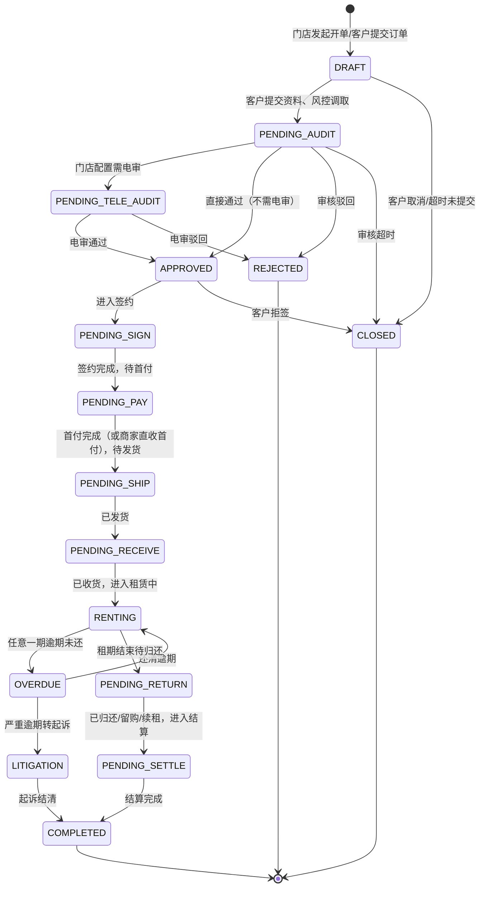
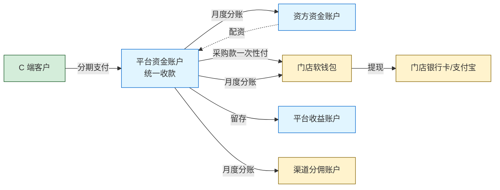
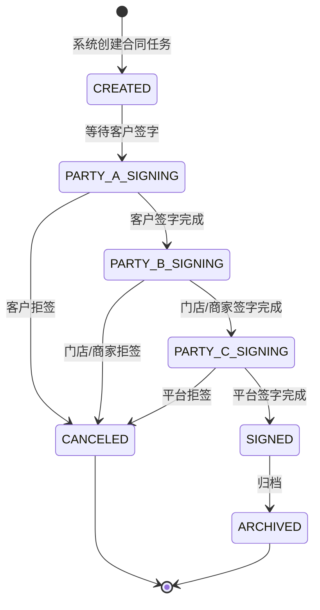
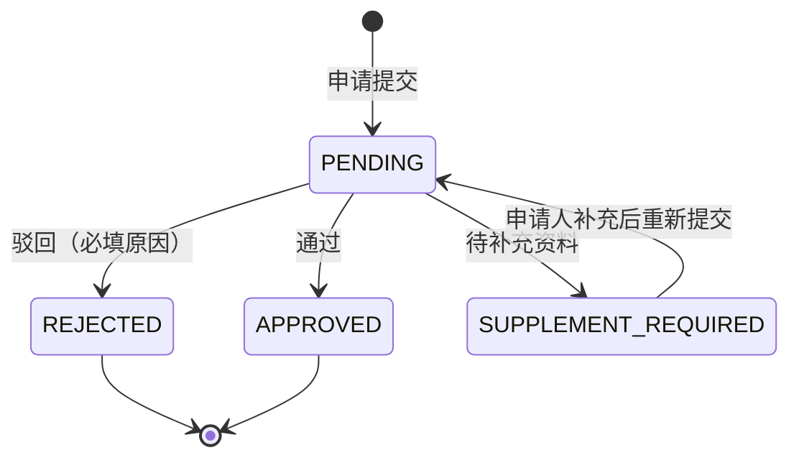
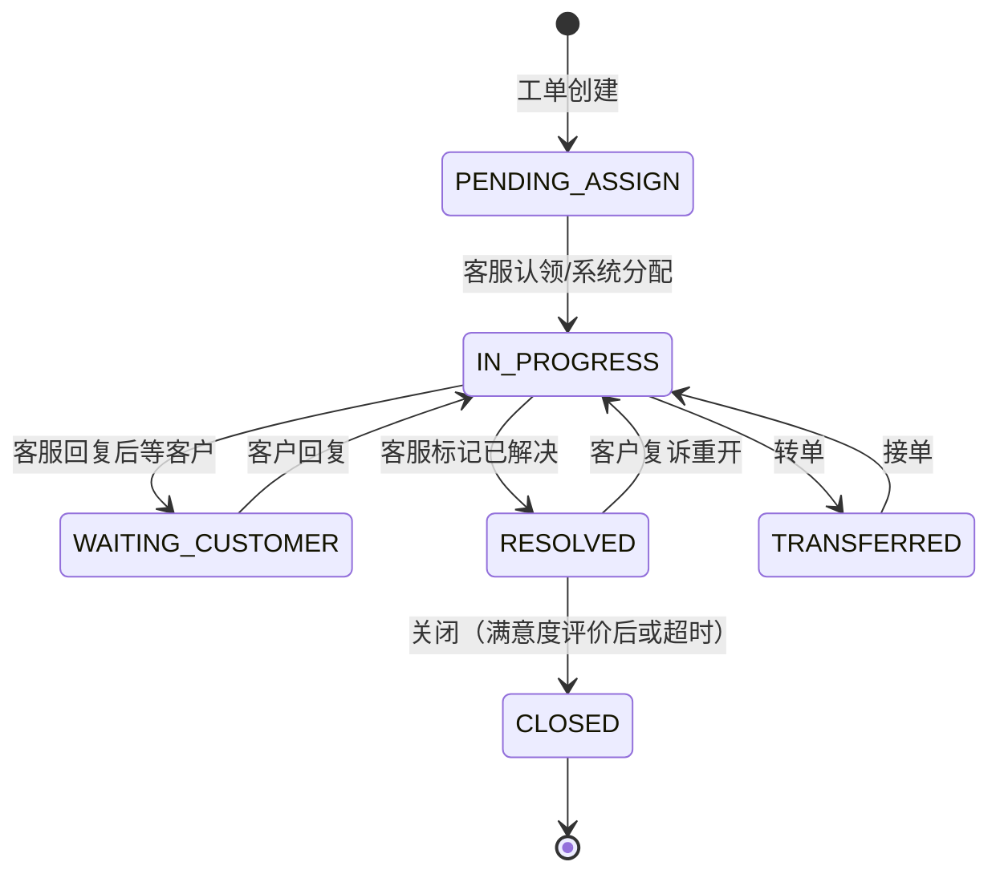

# 【满点重构 PRD V0.1】测试 QA 专题

> 👤 **目标读者**：测试负责人、测试工程师
> 
> 📖 **本文档含**：业务模型 + 各端 PRD + 全局规则 + 待澄清问题
> 
> ⏱ **预计阅读时长**：90-120 分钟
> 
> 🎯 **评审重点**：
> - 订单状态机的状态流转和异常分支（§4.2）
> - 资金流的边界场景（违约/退款/失败补偿）（§4.3, §4.5）
> - 计费规则的边界用例（首付 0% / 100% / 一期 / 异常金额）（§4.4）
> - 续租和账单日修改的回归测试范围（§4.6, §4.7）
> - 工单状态机和分配规则（§7.1）
> - 多客户部署下的测试覆盖（§7.4）
> - 全局状态机汇总（§8.1）
> - 安全规则（§8.3）
> - 待澄清问题中可能影响测试的部分（§12）
> 
> 💡 **建议输出**：
> - 测试用例分布初步规划
> - 自动化测试覆盖范围建议
> - 性能测试场景

---

> **📌 评审须知**（所有文档通用，1 分钟读完）
> 
> 你拿到的是【满点租赁系统重构 PRD V0.1 总体大纲】的一个分章节子文档。完整文档约 5 万字，为了高效评审，按部门/角色拆分后只给你看你工作相关的部分。
> 
> **如何参与评审**：
> 1. **整体读一遍**（按你部门预计 20-40 分钟即可）
> 2. **选中文字 → 右键评论** 提具体反馈，建议格式：
>    - 【类型】修改 / 新增 / 删除 / 质疑 / 疑问
>    - 【内容】你的建议
>    - 【原因】为什么这么改（可选）
> 3. **重要反馈 @ 产品负责人**
> 4. **截止时间**：[请项目负责人填写]
> 
> **不要做的事**：
> - 不要直接编辑文档（请用评论）
> - 不要纠结字段名/UI 文案这些细节（V1.0 阶段再抠）
> - 不要超出本文档范围讨论其他模块
> 
> **本文档可能引用的其他章节**（如有疑问可向产品负责人申请阅读权限）：
> - §1 文档说明  /  §2 商业模式  /  §3 角色与端  /  §4 核心业务模型
> - §5-6 各端 PRD  /  §7 基础设施  /  §8 全局规则  /  §9 数据模型
> - §10-13 短租 / 注意事项 / 待澄清 / 实施建议
-e 

---

## 4. 核心业务模型

### 4.1 订单类型驱动模型

#### 4.1.1 设计思想

**不要把订单类型写死成枚举（DIANPU / FENHONG / PINGTAI）**，而是用**多个字段组合**驱动业务逻辑。

核心字段：

| 字段 | 含义 | 示例值 |
|---|---|---|
| `order_source` | 订单来源 | C 端用户主动 / 门店扫码助手 / 渠道引流 / 商品码 |
| `funding_ratio` | 门店出资比例 | 0%（平台订单）/ 1-99%（分红订单）/ 100%（门店订单） |
| `audit_owner` | 审核归属 | STORE（门店自审） / PLATFORM（平台审核） |
| `signing_subjects` | 签约主体集合 | [客户, 门店, 平台] / [客户, 商家, 平台] |
| `rental_term_type` | 租期类型 | LONG_RENT（长租分期）/ SHORT_RENT_HOUR/DAY/WEEK/MONTH（短租）|
| `goods_type` | 商品类型 | PHONE_NEW / PHONE_USED / EV（电动车）/ ... |
| `risk_strategy_id` | 风控策略 ID | 引用配置中心 |

#### 4.1.2 三类订单的映射

```
门店订单 = funding_ratio: 100% + audit_owner: STORE
分红订单 = funding_ratio: 1-99% + audit_owner: PLATFORM
平台订单 = funding_ratio: 0% + audit_owner: PLATFORM
```

#### 4.1.3 订单类型扩展性

未来加新订单形态（如：纯资方订单、二级代理订单），只需在配置层加新组合，不动核心代码。

### 4.2 订单状态机

#### 4.2.1 长租订单完整状态流转



#### 4.2.2 状态枚举详表

| 状态 | 中文名 | 业务含义 | 谁能看到 |
|---|---|---|---|
| `DRAFT` | 草稿 | 门店开单未提交 / 客户填资料中 | 门店、运营 |
| `PENDING_AUDIT` | 待审核 | 资料齐全等待审核 | 门店、运营、客户（提示等待）|
| `PENDING_TELE_AUDIT` | 待电审 | 进入电话审核环节 | 信审员、运营、客户（提示）|
| `APPROVED` | 审核通过 | 准备签约 | 客户（待签约）|
| `PENDING_SIGN` | 待签约 | 已通过审核，等待客户/门店/平台三方电签 | 客户、门店、运营 |
| `PENDING_PAY` | 待支付 | 签约完成，等首付支付 | 客户 |
| `PENDING_SHIP` | 待发货 | 首付到账（或商家直收），等门店发货 | 门店、运营 |
| `PENDING_RECEIVE` | 待收货 | 已发货，等客户收货 | 客户、门店、运营 |
| `RENTING` | 租赁中 | 客户使用设备，分期还款中 | 全部 |
| `OVERDUE` | 逾期 | 当前期账单超过还款日未还 | 全部 |
| `PENDING_RETURN` | 待归还 | 租期结束，等客户处理（归还/留购/续租） | 客户、门店、运营 |
| `PENDING_SETTLE` | 待结算 | 客户已处理（归还/留购/续租），等财务结算 | 运营、商家、门店、资方 |
| `COMPLETED` | 已完成 | 全部结算完成 | 全部 |
| `REJECTED` | 已驳回 | 审核未通过 | 门店、运营 |
| `CLOSED` | 已关闭 | 订单关闭（客户取消、超时、客户拒签） | 门店、运营 |
| `LITIGATION` | 起诉中 | 严重逾期已进入诉讼流程 | 运营、租后团队 |

#### 4.2.3 关键状态流转规则

- **PENDING_AUDIT → PENDING_TELE_AUDIT**：受门店级开关 `need_tele_audit` 控制（**配置化**）
- **APPROVED → PENDING_SIGN**：触发 e签宝生成签约任务
- **签约阶段**：客户、门店（或商家）、平台三方依次签字，**任一方未签则订单停留在 PENDING_SIGN**
- **PENDING_PAY → PENDING_SHIP**：分两种路径
  - 默认：客户支付首付到平台账户 → 平台收到回调 → 状态流转
  - 商家直收首付模式：门店勾选"已收取客户首付 XX 元" → 直接流转，平台不代收首付
- **RENTING ↔ OVERDUE**：每天定时任务扫描，当前期账单到期未还转 OVERDUE，还清后转回 RENTING
- **任何状态 → CLOSED**：客户可在任意阶段申请退单（详见 4.5）
- **状态机的状态值要做成可配置**：未来加新状态（如"客户身份审核中"）无需改代码

### 4.3 资金流转模型

#### 4.3.1 资金链路全景图



#### 4.3.2 三种订单的资金流差异

**门店订单（funding_ratio = 100%）**

```
客户付款（含首付+月付）→ 平台账户
                          ↓
                    扣手续费（总租金 × X%）→ 平台收益
                          ↓
                    剩余金额 → 门店软钱包
                          ↓
                          门店提现 → 门店银行卡/支付宝
```

- 平台不代垫采购款（货款由门店自有现金 / 已有库存承担）
- 客户违约损失全部由门店承担

**分红订单（funding_ratio = 1-99%）**

```
订单成立时：
  资方资金池扣 [设备价 × 配资比例] → 平台代垫给门店采购账户
  
客户按月还款：
  客户付款 → 平台账户
            ↓
       扣 99 元会员费 → 平台收益
            ↓
       扣加价部分（X%）→ 平台收益、资方分润（按约定比例）
            ↓
       剩余 → 门店软钱包（按分红比例）+ 资方账户（按出资比例）
```

- 资方资金池余额不足 → 拒绝下单（运营在配置中心可设置预警阈值）
- 客户违约损失由资方/平台承担，门店不追责
- 客户违约 → 资方/平台收回设备 → 二次处置（待 V1.0 细化处置流程）

**平台订单（funding_ratio = 0%）**

```
订单成立时：
  平台从资方资金池支出全部采购款 → 平台分配给某商家执行
  
客户按月还款：
  客户付款 → 平台账户
            ↓
       扣 99 元会员费 → 平台收益
            ↓
       扣加价部分 → 平台收益、资方分润
            ↓
       门店得佣金（固定金额或按订单比例，配置化）
```

- 门店纯当流量入口，不出货不出钱
- 平台需把订单分配给具体的执行商家（由商家备货发货）
- **待澄清**：如果客户已支付但平台找不到合适执行商家怎么办？是否设"备货池"机制？

#### 4.3.3 软钱包账户体系

每个门店/商家在系统里有以下账户类型（参考门店端手册的三账户结构，重构后简化）：

| 账户类型 | 用途 | 是否可提现 |
|---|---|---|
| **可用余额** | 已结算到账的资金，可发起提现 | ✅ |
| **结算中余额** | 客户已还款但未到结算日的金额 | ❌ |
| **冻结金额** | 提现申请中、订单争议中的金额 | ❌ |

**门店端原有的"分成余额 / 佣金余额 / 配资额度"三账户结构**：

- 重构后：合并为**单一资金账户**，每笔流水标注**资金类型**（分红收入 / 佣金收入 / 退款 / 提现等）
- 通过流水的"资金类型"过滤即可分类查看
- 原"配资额度"功能**不再保留**（因为门店不再充值配资，配资由资方资金池统一管理）

#### 4.3.4 软钱包允许负数

特殊场景：客户退单退款后，门店软钱包可能变成负数。

- 系统不拒绝退款（资金原路退回客户优先）
- 门店软钱包变负数后，**禁止新订单分账入账**（先用新订单收入抵扣负数）
- 门店可主动充值正值回填（充值入口在门店端"我的钱包"）
- 运营端可见所有负数账户列表，定期跟进

### 4.4 计费规则（搬运惠讯租办单助手）

#### 4.4.1 核心计算公式

来源于 GitHub `joezjyan-bot/calculator/phone-rent/README.md`。

**输入参数**：
- `price`：设备价格（来源于商品库的指导价 = 靓机价 × multiplier，或新机官网价）
- `ratio`：首付比例（0.3 / 0.4 / 0.5 / 0.6，**配置化**）
- `periods`：租期（6 / 9 / 12，**配置化**）
- `fee`：设备管理费（50 / 150 / 250 元，**配置化**）

**公式**：

```
首付金额 = price × ratio
未付金额 = price - 首付金额
后续应还总额 = 未付金额 × 费率（查表：rates[periods][ratio]）
后期月付 = 后续应还总额 ÷ (periods - 1)
押金（留购可抵扣）= 首付金额 - first_period_rent（首期租金，默认 10 元）
设备管理费 = 单独列出，首期一次性收
留购总价 = 首付金额 + 后续应还总额 + 设备管理费

当期购买价（第 N 期）：
- 第 1 期：后续应还总额 + 押金
- 第 N 期（N>1）：月付 × (periods - N) + 押金
- 最后一期：仅押金（押金可抵扣）
```

#### 4.4.2 费率表

配置在 `rates.json`（重构后改为后台配置表）：

| 期数 | 首付 30% | 首付 40% | 首付 50% | 首付 60% |
|---|---|---|---|---|
| 6 期 | 1.26 | 1.20 | 1.20 | 1.15 |
| 9 期 | 1.30 | 1.28 | 1.26 | 1.21 |
| 12 期 | 1.37 | 1.30 | 1.30 | 1.28 |

**配置化要求**：
- 后台可增删期数（如未来加 4 期、24 期）
- 后台可增删首付比例档位
- 后台可调整任一格的费率倍数
- 配置变更**只影响新订单**，不回溯老订单

#### 4.4.3 商品价格表

配置在 `pricing.json`（重构后改为商品库）：

```
multiplier = 1.15（靓机价 → 指导价的乘数，配置化）

prices_used (二手机) = {
  "iPhone 17 Pro Max": {"256": 7400, "512": 8400},
  "iPhone 17 Pro": {"256": 6500, "512": 7750},
  ... (维护到 iPhone 13 Pro)
}

prices_new (全新机) = {
  "iPhone 17 Pro Max": {"256": 9999, "512": 11999},
  ... (苹果中国官网价)
}

ev_prices_used / ev_prices_new = {} (短租电动车扩展点，V0.2 补充)
```

**配置化要求**：
- 价格库由运营端「配置管理 → 商品价格库」维护
- 支持批量导入/导出（Excel）
- 支持机型增删
- 价格变更**只影响新订单**

#### 4.4.4 计算示例

iPhone 17 Pro 256GB，全新机，首付 30%，6 期，设备管理费 50 元：

```
设备价 price = 8999（苹果官网价）
首付比例 ratio = 0.3
期数 periods = 6
管理费 fee = 50

首付金额 = 8999 × 0.3 = 2699.70
未付金额 = 8999 - 2699.70 = 6299.30
费率 = rates[6][0.3] = 1.26
后续应还总额 = 6299.30 × 1.26 = 7937.12
后期月付 = 7937.12 ÷ 5 = 1587.42
押金 = 2699.70 - 10 = 2689.70
留购总价 = 2699.70 + 7937.12 + 50 = 10686.82
```

#### 4.4.5 留购价计算（按期数递减）

```
当期购买价（第 N 期）：
N=1: 7937.12 + 2689.70 = 10626.82（首期就买断 = 几乎全款）
N=2: 1587.42 × 4 + 2689.70 = 9039.38
N=3: 1587.42 × 3 + 2689.70 = 7451.96
N=4: 1587.42 × 2 + 2689.70 = 5864.54
N=5: 1587.42 × 1 + 2689.70 = 4277.12
N=6（最后一期）: 2689.70（仅押金，押金可抵扣，实付 = 0）
```

**最后一期为零的处理**：
- 显示为"留购价 ¥0.00（押金已抵扣）"
- 客户仍需点确认按钮触发"我要留购"流程
- 系统不要求实际付款，但要走留购合同电签
- 押金不退还客户（已用于抵扣留购价）

#### 4.4.6 计费规则的配置化层级

```
全局配置（平台级，全部客户）
  ↓
客户配置（不同客户部署的差异化）
  ↓
门店配置（特定门店的个性化，如某门店只做电动车）
  ↓
商品配置（特定商品的特殊规则，如某机型限定首付 50% 起）
```

后台支持四层配置覆盖，下层配置覆盖上层。

### 4.5 退款 / 退单流程

#### 4.5.1 退单的时机

| 退单时机 | 资金处理 | 设备处理 |
|---|---|---|
| **签约前** | 无资金往来 → 直接关闭 | 无 |
| **签约后未支付** | 无资金往来 → 关闭订单，撤销签约 | 无 |
| **支付首付但未发货** | 首付原路退回客户 | 无 |
| **已发货未收货** | 首付原路退回，物流召回 | 物流召回 |
| **已收货** | 扣除"按订单金额比例"的违约金（**配置化**），剩余原路退回 | 客户寄回 → 门店验机 → 入库 |
| **租赁中** | 已付租金原路退回（扣违约金）+ 押金扣损耗 | 客户寄回 / 门店上门取 |

#### 4.5.2 资金回滚链路

退款时，资金按**反向流向**回退：

```
平台从客户账户已收款金额扣除违约金后
→ 原路退回客户
   ↓
平台从门店软钱包扣除已分账金额
（如果门店余额不够 → 软钱包变负数）
   ↓
平台从资方资金账户扣回已分账金额
（如果资方余额不够 → 流水标记待补，财务对账时处理）
   ↓
渠道分佣已分账金额扣回
（同上）
```

#### 4.5.3 退款审核流程

- 客户在 C 端申请退款 → 进入"退款工单"
- 运营端「订单管理 → 订单关闭和退货」处理
- 退款金额 ≤ 500 元：自动通过
- 退款金额 > 500 元：需运营审核（**金额阈值配置化**）
- 审核通过后，原路退款（支付宝/微信走支付平台 API）

#### 4.5.4 违约金规则

| 退款时机 | 违约金计算 |
|---|---|
| 已收货 < 7 天 | 订单金额 × 5%（**配置化**） |
| 已收货 7-30 天 | 订单金额 × 10% |
| 已收货 > 30 天 | 订单金额 × 15% |
| 租赁中提前退租 | 剩余未付租金 × 30% |

具体比例后台配置，支持按订单类型、客户等级差异化。

### 4.6 续租流程

#### 4.6.1 续租的触发

租赁到期前 7 天，系统自动通知客户：
- "您的订单即将到期，可选：归还 / 续租 / 留购"
- 客户在 C 端点击"续租"进入续租流程

#### 4.6.2 续租规则

| 字段 | 续租规则 |
|---|---|
| 续租周期 | 客户可选（6/9/12 期，与原订单可不同） |
| 续租租金 | 重新按当前商品价格 + 费率表试算（**不沿用原订单费率**） |
| 押金 | 沿用原订单押金（不重新收） |
| 合同 | 重新签订续租合同（独立合同号） |
| 资金流 | 不重新走采购款（设备权属沿用原订单） |
| 订单号 | 生成新订单号，标记 `original_order_id` 关联原订单 |

#### 4.6.3 续租后的留购价

续租期间，留购价按**续租合同**重新计算，与原订单解耦。

### 4.7 账单日修改

参考同行业务公告，规则如下：

#### 4.7.1 修改窗口

| 当前状态 | 是否可改首期账单日 | 是否可改后续账单日 |
|---|---|---|
| 下单 7 天内 | ✅ | - |
| 下单 > 7 天，未付首期 | ❌ | - |
| 已付首期租金 | ❌ | ✅ |
| 当前期已逾期 | ❌ | ❌ |
| 逾期结清后 | ❌ | ✅ |

#### 4.7.2 修改规则

- 必须由客服在 IM 工单里发起（客户不能自助修改）
- 修改账单日时**系统自动重算每期账单**，原则上**总费用不变**
- 如延迟天数 > X 天（**配置化**），按"日租金 × 延迟天数"加收延期费
- 修改后客户需在 IM 里二次确认
- 修改记录留痕（操作人、原账单日、新账单日、加收金额）

---
## 5. 端 × 模块矩阵

下表为所有端的全部模块清单，按"端 → 一级模块 → 二级模块"列出。后续章节按此清单逐个展开。

### 5.1 C 端（小程序 / App）

| 一级模块 | 二级模块 | 短租预留 |
|---|---|---|
| 首页 | Banner、商品分类、推荐商品 | ✅ |
| 浏览选品 | 商品列表（按分类）、商品详情、规格选择 | ✅ |
| 扫码 | 扫商品码（直达详情）、扫门店码（绑定门店） | ✅ |
| 下单 | 填实名、紧急联系人、计费试算、选增值服务 | 短租：选时间段、取还车地点 |
| 签约 | e签宝三方电签（客户+门店+平台） | ✅ |
| 支付 | 首付支付（支付宝/微信） | 短租：支付全款或押金 |
| 我的订单 | 订单列表、订单详情、合同查看 | ✅ |
| 还款 | 当期账单、提前还款、还款记录 | 短租：超时计费补缴 |
| 留购/续租/归还 | 留购确认、续租申请、归还预约 | 短租：还车流程 |
| IM 客服 | 业务咨询、订单审核、售后服务 | ✅ |
| 增值服务 | 碎屏险、电池险等可选购 | ✅ |
| 我的钱包 | 押金/退款明细 | ✅ |
| 个人中心 | 实名、紧急联系人、地址、设置 | ✅ |

### 5.2 门店端（H5）

| 一级模块 | 二级模块 |
|---|---|
| 入驻 | 注册、企业资料、e签宝授权、采购账户申请 |
| 工作台 | 经营概览、待办、常用功能入口 |
| 全部订单 | 列表、筛选、详情 |
| 门店订单 | 自审、修改账单、查风控、发货管理 |
| 分红订单 | 查看（详情、分红明细、账单明细） |
| 平台订单 | 查看（执行类） |
| 续租订单 | 查看 |
| 买断订单 | 查看 |
| 开单助手 | 自建分红订单、自建低费率订单（生成二维码） |
| 我的钱包 | 余额、提现、流水 |
| 对账单 | 资金流水筛选、订单关联查询 |
| 采购申请 | 采购收款账号申请/修改 |
| 拓店助手 | 邀请码、协助入驻、奖励规则 |
| 已拓门店 | 一级/二级门店列表、状态跟踪 |
| IM 工单 | 联系客服（业务咨询、订单审核、售后） |
| 设置 | 店铺信息修改、密码修改、退出登录 |
| 企业授权 | e签宝授权状态、同步、授权书下载 |
| 审核进度 | 资料审核状态跟踪 |

### 5.3 商家端（PC）

| 一级模块 | 二级模块 |
|---|---|
| 首页 | 销售/成本/待收款/逾期/回款指标 |
| 订单管理 | 订单列表、逾期订单、到期未归还、买断订单、分红订单、低费率订单、续租订单 |
| 店铺管理 | 店铺信息、供应商寄件地址 |
| 商品管理 | 租赁商品列表（新增/修改/复制/删除/上下架/审核状态/二维码）、归还地址、增值服务、寄件地址 |
| 营销管理 | 优惠券列表、大礼包、店铺营销图配置 |
| 数据管理 | 导出数据下载 |
| 财务管理 | 资金账户、提现列表、结算明细、费用结算明细 |
| 服务中心 | 常见问题 |
| 权限管理 | 部门列表、成员管理 |

### 5.4 运营端（PC）

| 一级模块 | 二级模块 |
|---|---|
| 首页 | 销售额、成本、待收款、逾期、回款（分今日/7天/本月/全部/自定义） |
| 订单管理 | 订单列表、订单关闭和退货、到期未归还、买断订单、续租订单、分红订单、门店订单、电审订单 |
| 商品审核 | 租赁商品审核 |
| 店铺审核 | 店铺审核列表（含电审开关、冻结开关） |
| 采购账户审核 | 采购账户审核 |
| 分红订单管理 | 独立分红订单业务管理 |
| 低费率订单管理 | 独立低费率订单业务管理 |
| 资方管理 | 数据统计、订单管理、账单管理、用户管理、打款记录、资金账户 |
| 租后管理 | 逾期订单、催收回款、起诉列表 |
| 营销管理 | 评论管理、大礼包、优惠券 |
| 佣金管理 | 佣金列表、小程序佣金列表、佣金成本 |
| 财务管理 | 租金管理、线下还款、提现管理、钱包提现、押金管理、商家资金账户、资方提现列表、佣金审批、结算明细、费用结算明细 |
| 渠道管理 | 渠道分佣列表、佣金结算管理、渠道订单明细 |
| 配置管理 | 分类配置、素材中心、公告配置、常见问题配置、小程序配置、**费率配置（新）、价格库（新）、合同模板（新）、业务规则（新）** |
| 信审管理 | 信审管理（人员、启停、工作量分配规则） |
| 数据管理 | 获客明细表、导出数据下载 |
| 权限管理 | 部门列表、成员管理 |
| **IM 工单台（新增）** | 工单列表、工单详情、客服分配、聊天记录、统计 |
| **第三方中控（新增独立后台）** | 接口管理、调用计费、账户充值、统计 |
| **多客户管理（新增独立后台）** | 客户租户、版本管理、部署记录 |

### 5.5 资方端（H5 只读）

| 一级模块 | 二级模块 |
|---|---|
| 资方首页 | 资金余额、订单数、回款指标 |
| 我的订单 | 订单列表、订单详情、还款进度 |
| 我的账单 | 账单列表、应收/已收、回款记录 |
| 资金账户 | 余额、明细 |
| 提现申请 | 申请提现（提交后走运营审核） |
| 设置 | 资方资料、联系人 |

### 5.6 渠道端（H5 报表）

| 一级模块 | 二级模块 |
|---|---|
| 渠道首页 | 引流订单数、佣金概览 |
| 我的订单 | 引流订单列表、详情 |
| 佣金结算 | 佣金计算明细、结算单 |
| 提现申请 | 申请提现（走运营审核） |

---

## 6. 各端 PRD 详细大纲

> 本章对每个端的核心模块展开详细描述。鉴于篇幅，部分功能仅保留原有手册内容、不重复描述，重点展开**重构后变化的部分**和**之前未覆盖的设计**。

### 6.1 C 端（小程序 / App）PRD

#### 6.1.1 端定位

- **核心受众**：终端消费者（租客）
- **主要场景**：选品 → 下单 → 签约 → 支付 → 使用 → 还款 → 留购/归还
- **平台覆盖**：微信小程序（一期）、支付宝小程序（二期）、独立 App（三期）
- **技术选型建议**：Taro / uni-app（一码多端）

#### 6.1.2 首页

**布局区域**：

```
┌─────────────────────────────────┐
│  顶部导航：定位、搜索框、消息       │
├─────────────────────────────────┤
│  Banner 轮播图（运营配置）         │
├─────────────────────────────────┤
│  服务分类：长租手机、长租车、     │
│           短租车（预留）、增值服务 │
├─────────────────────────────────┤
│  热门商品（运营推荐位）            │
├─────────────────────────────────┤
│  全部商品（按分类滚动加载）        │
└─────────────────────────────────┘
```

**核心字段**：

| 字段 | 来源 | 配置位置 |
|---|---|---|
| Banner | 运营配置 | 配置管理 → 素材中心、小程序配置 |
| 分类 | 运营配置 | 配置管理 → 分类配置 |
| 商品列表 | 商家端商品库 | 商家端 → 商品管理 |
| 推荐位 | 运营配置 | 配置管理 → 小程序配置 |
| 公告横幅 | 运营配置 | 配置管理 → 公告配置 |

**短租扩展点**：分类 Tab 中预留"短租车"入口，V0.2 接入。

#### 6.1.3 浏览选品

**商品列表页**：
- 按一级分类（手机/电动车/...）筛选
- 按二级分类（苹果新机/苹果二手/安卓新机/...）筛选
- 排序：默认 / 价格升序 / 价格降序 / 销量
- 卡片信息：图片、名称、规格摘要、最低月付价、累计租出数

**商品详情页**：
- 头图轮播（多图）
- 商品名称、品牌、设备型号、成色（全新/二手）、保修状态
- 规格选择：颜色、内存（128/256/512）
- 计费试算区（实时计算，参考惠讯租办单助手）：
  - 期数选择（6/9/12 期可选）
  - 首付比例选择（30/40/50/60% 可选）
  - 设备管理费选择（50/150/250 元）
  - 自动显示：首付、月付、留购总价、押金
- 增值服务勾选：碎屏险 / 电池险 / 质保服务（按商品配置展示）
- 商品详情图文（商家维护）
- 商品须知（系统配置，如"本设备为安全锁设备，不可刷机..."）
- 底部固定按钮：联系客服 / 立即下单

**短租扩展点**：当 `goods_type` = 短租车型时，计费试算区切换为"时间段选择 + 实时计价"模式，详见 V0.2。

#### 6.1.4 扫商品码下单（重构新增重点）

**业务背景**：

当前业务痛点：客户到店看中一台手机后，销售员要打开 APP 找商品、填资料、生成二维码、给客户扫描，多步繁琐。

**重构后流程**：

```
客户到店看中商品
       ↓
门店给商品打印过商品码（或贴在样机上）
       ↓
客户用微信/支付宝扫一扫
       ↓
直接跳转到该商品在该门店的下单页
（商品已选好规格，门店已绑定）
       ↓
客户选择期数/首付/管理费/增值服务
       ↓
填实名、紧急联系人、收货地址
       ↓
提交订单（后续走审核）
```

**商品码生成规则**：

- 商品码 URL：`https://{客户域名}/c/scan?goods_id=XXX&store_id=XXX&channel_id=XXX`
- 商家端商品管理 → 二维码功能：生成单商品码（不绑定门店）
- 门店端开单助手 → 生成"商品+门店"二维码（绑定到当前门店）
- 渠道端可生成"商品+门店+渠道"码（绑定推广归属）

**自动归属规则**：

- 客户扫商品码 → 订单归属到对应门店
- 如有渠道参数 → 订单归属到渠道（计算佣金）
- 未来支持"店内 PAD 自助开单"（门店在 PAD 上自助生成订单码给客户扫）

**待澄清**：
- 商品码是永久有效还是带时效？
- 商品下架后，二维码扫描是否提示"商品已下架"？
- 是否需要"营业员二维码"标记是哪个销售员开的单（用于内部业绩分润）？

#### 6.1.5 下单流程

**步骤拆解**：

```
Step 1: 选商品 + 规格 + 期数 + 首付 + 管理费 + 增值服务
   ↓
Step 2: 填写客户信息
   - 实名认证（扫身份证或手动填）
   - 人脸识别（活体检测）
   - 紧急联系人（至少 2 个，要求至少一位是家人）
   - 收货地址
   ↓
Step 3: 计费确认页
   - 显示完整账单（首付 + 月付 × N 期 + 留购总价）
   - 增值服务费用
   - 总计金额
   - 同意《租机协议》《用户隐私协议》等
   ↓
Step 4: 提交订单
   - 系统调用风控接口（人工触发，不在此步自动调用）
   - 订单状态: DRAFT → PENDING_AUDIT
   ↓
Step 5: 等待审核（页面显示进度，预计 1-3 个工作日内完成）
```

**紧急联系人字段**：

| 字段 | 必填 | 数据类型 | 说明 |
|---|---|---|---|
| 联系人姓名 | ✅ | 字符串 | |
| 联系人手机号 | ✅ | 字符串 | 调用二要素验证 API（姓名+手机号是否一致）|
| 与客户关系 | ✅ | 枚举 | 父亲/母亲/配偶/子女/兄弟姐妹/同事/朋友/其他 |
| 是否家人 | ✅ | 布尔 | 系统校验：至少 1 条记录关系为家人 |
| 是否经过验证 | 自动 | 布尔 | 二要素 API 调用结果 |

**校验规则**：
- 至少 2 个紧急联系人
- 至少 1 个关系为"家人"（父亲/母亲/配偶/子女/兄弟姐妹）
- 手机号不能与客户本人手机号一致
- 调用二要素 API 验证姓名+手机号一致（**第三方中控计费**）
- 验证未通过的联系人，客服在审核时可标记"未通过" 或 人工沟通后手动标记"已确认"

**不发短信**：不主动给紧急联系人发任何短信通知。

#### 6.1.6 签约流程

**触发**：订单状态 APPROVED → PENDING_SIGN

**流程**：
- 系统调用 e签宝 API 创建签约任务
- 三方依次签字：
  - 客户在 C 端弹出 e签宝签约界面，活体识别后签字
  - 门店/商家在自己端收到签约通知，登录后签字
  - 平台自动签字（运营平台对接 e签宝企业账号）
- 三方全部完成后，订单状态 PENDING_SIGN → PENDING_PAY
- 签约完成后，合同 PDF 自动归档到订单详情

**合同模板**：

- 由"合同模板引擎"动态选择（详见 7.4 章节）
- 默认场景模板：
  - 长租分红订单：客户 + 门店 + 平台
  - 长租门店订单：客户 + 门店 + 平台
  - 长租平台订单：客户 + 平台 + 执行商家
  - 短租：客户 + 出租方（门店或平台） —— V0.2 补充
- 模板变量自动填充：甲乙丙方主体、订单金额、期数、首付、月付、设备信息、合同生效日、违约条款等

#### 6.1.7 支付与首付商家直收（重构新增）

**默认模式**：客户在线支付首付到平台账户

- 支付渠道：支付宝 / 微信 / 银联（**配置化**）
- 支付方式：H5 支付 / APP 拉起支付 / 扫码支付

**商家直收首付模式（可选开启）**：

- 触发条件：订单类型支持商家直收 + 门店/商家级开关开启
- 流程变化：
  - 客户不在 C 端付首付
  - 门店在开单助手生成二维码前，勾选「商家已收取客户第 1 期 X 元」
  - 系统跳过 PENDING_PAY 状态，直接 APPROVED → PENDING_SHIP
  - 平台不参与首付资金的代收代付
- 对应字段：
  - 订单表新增 `first_period_offline_collected` 布尔字段
  - 订单表新增 `first_period_offline_amount` 字段（线下收取金额）
- 风险控制：
  - 仅特定订单类型可用（默认门店订单可用，分红/平台订单不可用，**配置化**）
  - 财务对账时，第 1 期账单不参与平台与门店的结算

**待澄清**：
- 商家直收模式下，如果客户后续违约（不还月付），第 1 期商家自留是否合理？需明确"违约责任"
- 是否需要门店上传"已收款凭证"截图保存

#### 6.1.8 我的订单 / 还款 / 留购 / 续租 / 归还

**我的订单**：
- 列表：按状态筛选（全部 / 进行中 / 已完成 / 已关闭 / 退款中）
- 卡片：商品图、商品名、订单状态、订单金额、下单时间、最近账单日
- 点击进入详情

**订单详情**：
- 订单摘要（订单号、状态、商品、规格、期数、金额）
- 账单明细（每期金额、还款日、状态、收款方）
- 还款记录（每笔实际还款时间、金额、方式）
- 合同（点击查看 PDF）
- 物流信息（如发货后）
- 售后入口（联系客服、申请归还、申请续租、申请留购）

**还款**：
- 默认自动扣款（支付宝/微信免密代扣，绑定支付方式时已授权）
- 当期账单到期前 3 天推送提醒
- 客户可主动提前还款（一次性还多期）
- 还款记录可在订单详情和我的钱包查看

**留购**：
- 触发：客户在订单详情点"我要留购"
- 展示当期留购价（按 4.4.5 公式）
- 同意留购协议，支付留购价（最后一期可能为零）
- 支付完成 → 签留购合同 → 设备所有权转移 → 订单状态 PENDING_SETTLE

**续租**：
- 触发：租期最后 7 天，订单详情出现"申请续租"按钮
- 选续租期数（与原订单可不同）
- 系统按当前商品价 + 费率表重新试算
- 押金沿用，不重新收
- 签续租合同（独立合同号，关联原订单）
- 进入新一轮租赁

**归还**：
- 触发：客户在订单详情点"我要归还"
- 选择归还方式：寄回 / 送回门店
- 寄回：客户拍照确认设备状态，填快递单号
- 门店收到后验机 → 评估损耗 → 退还押金（如有扣减需在 IM 沟通确认）
- 订单状态 PENDING_RETURN → PENDING_SETTLE → COMPLETED

#### 6.1.9 IM 客服模块（C 端入口）

详见 7.1 章节 IM 客服整体设计。

C 端入口：
- 订单详情页 → 联系客服（绑定该订单的工单）
- 个人中心 → 客服中心（业务咨询 / 售后服务）
- 接收客服主动推送的消息（如审核通知、还款提醒、问题答疑）

#### 6.1.10 增值服务

- C 端在下单时可勾选商品配套的增值服务（碎屏险/电池险/质保等）
- 服务费用累加到首付一并支付
- 服务详情可在订单详情查看
- 服务理赔走单独工单（在 IM 模块）

#### 6.1.11 我的钱包（C 端）

- 押金账户：显示当前订单押金总额
- 退款记录：申请中 / 已完成 / 已拒绝
- 优惠券：可用券、已用券、过期券
- 大礼包：领取记录

#### 6.1.12 个人中心

- 头像、昵称、手机号
- 实名认证状态
- 紧急联系人管理（增删改）
- 收货地址
- 设置：消息通知、隐私协议、注销账号

---
### 6.2 门店端（H5）PRD

#### 6.2.1 端定位

- **核心受众**：商家公司下挂的实际经营门店（销售员、店长）
- **主要场景**：订单审核、自建开单、拓店、提现
- **平台覆盖**：H5（手机浏览器），未来出 App 版本
- **登录方式**：三因子（手机号 + 密码 + 短信验证码），符合金融行业安全要求

#### 6.2.2 入驻流程（重构关键变化）

**完整入驻链路**：

```
Step 1: 注册（手机号+密码+验证码+邀请码可选）
   ↓
Step 2: 选择门店类型
   ├─ 独立小门店（商家=门店，1:1）
   └─ 已有商家公司下挂门店（输入商家邀请码）
   ↓
Step 3: 填写企业资料 / 门店资料
   ├─ 企业名称、营业执照号、法人信息
   ├─ 门店名称、联系人、地址
   ├─ 上传营业执照、法人身份证正反面
   └─ 同意《入驻合同》《手机采购合同》《服务协议》《隐私政策》
   ↓
Step 4: 提交资料 → 状态 PENDING_AUDIT
   ↓
Step 5: 完成 e签宝企业授权
   ├─ 跳转 e签宝授权页面
   ├─ 完成授权后返回，点击"同步授权结果"
   └─ 必须在审核通过前完成，否则运营审核会拦截
   ↓
Step 6: 提交采购账户申请
   ├─ 填写签约支付宝账户、法人、身份证、手机号、邮箱
   └─ 运营审核通过后才能正常提现
   ↓
Step 7: 等待审核进度（手册有专门页面）
   ↓
Step 8: 审核通过 → 进入工作台
```

**关键规则**：
- e签宝授权状态由系统**主动拉取**（用户在页面点"同步授权结果"按钮）
- 资料审核与 e签宝授权是**并行**进行，但**审核通过的前提是 e签宝授权必须完成**
- 采购账户审核**独立于**资料审核，是提现前的必要前置

#### 6.2.3 工作台首页

**保留现有手册结构**：
- 今日订单、今日收入、应收账款（三个核心指标）
- 待办事项（待审核 / 待发货 / 待收货 / 租赁中 / 待归还）
- 常用功能（全部订单 / 门店订单 / 分红订单 / 开单助手 / 我的钱包 / 对账单 / 采购申请 / 拓店助手 / 已拓门店）
- 经营概览（门店订单统计、分红订单统计、租用中/逾期/已收/未收金额）

**重构后变化**：
- 增加"未读 IM 消息"红点提醒
- 增加"待处理工单"提醒（待审核工单、待沟通工单）
- 优化经营概览的图表化展示

#### 6.2.4 订单管理

**订单列表（全部订单）**：
- 列表项：商品图、商品名、客户姓名、客户手机、商品规格、期数、订单金额、状态、下单时间
- 筛选：状态、商品名、客户、手机号、订单号、时间范围
- 搜索：订单号 / 客户手机 / 客户姓名

**门店订单（门店自审）**：
- 列表筛选：状态（待审核 / 待发货 / 待收货 / 租赁中 / 待归还 / 待结算 / 已完成 / 已关闭）
- 待审核订单可执行：风控报告（人工调取）、修改账单、操作审批（通过/驳回）
- 修改账单流程：选择规格、期数 → 输入结算价格、首付比例 → 系统试算 → 保存

**分红订单 / 平台订单（运营审核）**：
- 门店仅查看，不能审核
- 详情可见：分红明细、账单明细、订单进度

**续租订单 / 买断订单**：
- 仅查看（详情 + 账单 + 结算）

**新增：到期未归还订单**（对应运营端的"到期未归还"，门店端也需要看到自己的）：
- 跟进客户归还状态
- 联系客户

**新增：逾期订单**（门店级查看）：
- 仅展示该门店相关的逾期订单
- 不能直接操作催收（催收归运营管），但能查看进度
- 配合催收员沟通客户

#### 6.2.5 开单助手（重构关键变化）

**界面结构**（保留现有 + 优化）：

```
开单助手
├─ 自建分红订单：平台配资，支持全系列主流数码产品
└─ 自建低费率开单：门店订单（重构后改名"自建门店订单"），自主定价
└─ 自建平台订单（新增）：纯送单给平台，门店得佣金
```

**新机下单 + 旧机下单**（参考手机妈妈同行设计）：

- 新机下单：调用 `pricing.json.prices_new` 价格库（苹果中国官网价）
- 旧机下单：调用 `pricing.json.prices_used` 价格库（靓机价 × multiplier）

**单据生成流程**（按惠讯租办单助手公式）：

```
Step 1: 选成色（全新 / 二手）
Step 2: 选分类（苹果 / 安卓 / 电动车 / ...）
Step 3: 选型号（iPhone 17 Pro Max / iPhone 17 Pro / ...）
Step 4: 选规格（256/512）
Step 5: 系统自动带出"指导价"（用户可手动改价，但有保护：低于成本价时警告）
Step 6: 选期数（6/9/12）
Step 7: 选首付比例（30/40/50/60%）
Step 8: 选设备管理费（50/150/250）
Step 9: 系统实时试算并显示：首付、月付方案、设备总金额、留购总价
Step 10: 勾选"商家已收取客户第 1 期 XX 元"（可选，仅商家直收模式）
Step 11: 生成二维码（包含订单参数）
Step 12: 客户扫码 → 进入 C 端下单页 → 填实名、紧急联系人、签约、支付
```

**开单类型选择**：
- 自建分红订单：填写"配资比例"或"配资金额"
- 自建门店订单：100% 自资
- 自建平台订单：0% 自资，门店只赚佣金

**自动归属**：
- 二维码包含门店 ID
- 客户扫码下单后，订单自动归属到该门店
- 渠道引流码：在门店码基础上加渠道参数

#### 6.2.6 我的钱包（重构关键变化）

**重构前（三账户）**：
- 分成余额（分红收入）
- 佣金余额（佣金收入）
- 配资额度（充值放大倍数）

**重构后（单账户 + 流水类型）**：

```
我的钱包
├─ 可用余额（可提现）
├─ 结算中余额（未到结算日的客户已还款）
├─ 冻结金额（提现申请中、订单争议中）
└─ 累计入账（统计指标）
```

**资金流水**：
- 每笔流水标注资金类型（分红收入 / 佣金收入 / 退款 / 提现 / 充值 / 调整）
- 按订单号筛选、按时间筛选、按资金类型筛选
- 可导出 Excel

**提现**：
- 提现至已绑定的采购账户（支付宝）
- 单次提现金额限制：最小 100 元（**配置化**），最大 50000 元
- 提现申请 → 运营审核 → 通过后走支付宝 API 打款 → 客户到账
- 提现手续费（**配置化**，默认 0 元）

**充值（仅负数账户回填）**：
- 仅当软钱包为负数时，门店可主动充值正向回填
- 充值方式：支付宝/微信扫码支付
- 充值成功后实时入账

**配资额度功能取消**：原配资充值放大机制改为资方资金池统一管理

#### 6.2.7 拓店助手 + 已拓门店

**保留现有手册功能 + 优化**：

- 拓店助手：邀请码、协助新门店入驻、奖励规则、累计奖励
- 已拓门店：一级门店 / 二级门店切换、状态跟踪、订单数量

**重构后新增**：
- 一级门店向二级门店的分润比例（**配置化**）
- 二级门店向上级的回报比例
- 拓店奖励触发规则（按下级订单数？金额？固定金额？— **配置化**）
- 拓店关系限制层级（默认 2 级，**配置化**）

**待澄清**：
- 拓店奖励是一次性的还是持续的（如下级每出一单都返点）？
- 拓店关系是否可解除（如下级门店转走）？

#### 6.2.8 IM 工单（重构新增重点）

详见 7.1 章节。

门店端 IM 入口：
- 工作台 → 联系客服（顶部固定）
- 订单详情 → 联系客服（绑定该订单的工单）
- 推送通知：客户/客服发消息时手机收到通知

工单类型：
- 业务咨询（开店、营销、提现等一般问题）
- 订单审核（分红/平台订单送审）
- 售后服务（设备问题、客户投诉等）

#### 6.2.9 设置 / 企业授权 / 审核进度

保留现有手册功能不变。

---

### 6.3 商家端（PC）PRD

#### 6.3.1 端定位

- **核心受众**：商家公司主体（公司管理员、运营人员）
- **主要场景**：商品上下架、营销、财务对账、组织权限
- **平台覆盖**：PC 浏览器后台
- **特点**：管"商品 + 营销 + 财务 + 组织"，订单审核操作让给门店和运营

#### 6.3.2 首页

**保留现有手册**：销售额及成本、待收款统计、已收款统计

**新增**：
- 多门店切换（如有多门店）
- 商品审核状态汇总（待审核商品数）
- 待处理工单提醒

#### 6.3.3 订单管理

**保留现有手册**：
- 订单列表、逾期订单、到期未归还、买断订单、分红订单、低费率订单、续租订单
- 待审核订单可调风控、修改账单、审核
- 详情核对：订单摘要、收货信息、实名状态、金额明细、分期账单

**重构后新增**：
- 全局搜索：跨所有订单类型的统一搜索框
- 批量操作：批量审核、批量驳回、批量导出
- 标签管理：给订单打自定义标签（如"加急"、"VIP 客户"）

#### 6.3.4 店铺管理

**店铺信息**：
- 店铺主体资料、企业信息、e签宝授权、合同
- 多门店管理：商家可挂多个门店，每个门店独立资料

**供应商寄件地址**：保留现有手册

#### 6.3.5 商品管理（重构关键变化）

**租赁商品列表**：

- 新增字段：
  - 商品类型（PHONE_NEW / PHONE_USED / EV / SHORT_RENT_EV 预留）
  - 是否可周转（短租预留）
  - 是否需要质检（二手机默认勾选）
  - 设备序列号绑定（一物一码，预留设备库）

- 操作：新增、修改、复制、删除、上下架、查看审核状态、生成二维码（**商品码**）

**新增商品流程**：

```
Step 1: 选商品类目（运营端配置）
Step 2: 填基础信息（名称、品牌、型号、成色、规格）
Step 3: 上传图片（主图、轮播图、详情图）
Step 4: 设置租金规则（套餐 / 自定义）
   - 套餐模式：选预设的费率档位（6 期 30% 套餐 / 12 期 50% 套餐...）
   - 自定义模式：单独设置该商品的费率（覆盖全局费率表）
Step 5: 押金规则（按公式计算 / 固定金额）
Step 6: 留购规则（按公式计算 / 自定义）
Step 7: 买断/归还规则
Step 8: 运费规则
Step 9: 增值服务关联（勾选可购买的增值服务）
Step 10: 商品须知（默认带"安全锁、不可刷机、序列号一致"等模板，可改）
Step 11: 上下架开关
Step 12: 提交审核（运营端审核）
```

**商品类目**：

- 由运营端「配置管理 → 分类配置」维护
- 多层级（一级分类 / 二级分类 / 三级分类）
- 商家创建商品时选择类目

**商品二维码**：

- 每个商品一个永久商品码
- URL: `https://{客户域名}/c/scan?goods_id=XXX`
- 商家可下载二维码图片，门店可打印贴在样机上

**归还地址 / 寄件地址 / 增值服务**：保留现有手册

#### 6.3.6 营销管理

**优惠券**：
- 创建、编辑、停用、删除
- 字段：券名称、面额、使用门槛、有效期、适用商品、领取规则
- 新增字段：客户分群（新客 / 老客 / VIP）
- 新增字段：是否可叠加使用

**大礼包**：
- 组合多张优惠券为礼包
- 发放规则配置（新客注册自动发 / 邀请奖励 / 节日活动）

**店铺营销图配置**：
- 上传 banner、跳转链接、上线时间、排序
- 推送到 C 端首页展示

#### 6.3.7 数据管理

**导出数据下载**：保留现有手册

**新增统计报表**：
- 销售总览（按时间维度）
- 商品销售排行
- 门店业绩对比（如多门店）
- 增值服务销售统计
- 留购率、续租率、归还率

#### 6.3.8 财务管理（重构关键变化）

**资金账户**：

- 重构前：商家端单一资金账户，明细按"电子合同费用结算、人脸识别费用、新颜共债风控报告、新颜全景风控报告"等第三方接口费用扣减
- 重构后：
  - 主资金账户（可用 / 冻结 / 结算中）
  - 资金流水（按订单 / 按类型 / 按时间筛选）
  - 第三方费用扣款明细（独立 Tab，与业务流水分离）

**提现列表**：保留现有手册

**结算明细查询**：保留现有手册

**费用结算明细**（重构变化）：
- 按费用类型分 Tab：芝麻租排分离接口费用、风控报告、电子合同、人脸识别、二要素验证、设备锁
- 每类显示：已结算 / 待结算金额、订单关联、时间
- 与第三方中控统一对账（详见 7.2）

#### 6.3.9 服务中心

- 常见问题（运营端配置）
- 在线客服入口（IM 工单）
- 视频教程入口

#### 6.3.10 权限管理（保留 + 增强）

**部门列表**：
- 新增、编辑、删除部门
- 部门权限配置（菜单权限、数据权限）

**成员管理**：
- 新增成员（账号、姓名、手机号、部门、角色）
- 启用/停用、修改、权限配置
- 操作日志（记录每个成员的关键操作）

**新增功能**：
- 角色模板（常见角色：店长、销售员、财务、客服）
- 数据权限（看全部 / 看自己 / 看本门店）

---

### 6.4 运营端（PC）PRD

#### 6.4.1 端定位

- **核心受众**：平台运营、审核、财务、风控、催收、客服等多岗位
- **主要场景**：上帝视角的全平台管理
- **平台覆盖**：PC 浏览器后台

#### 6.4.2 首页

**保留现有手册的销售/成本/待收/逾期/回款指标**

**新增模块**：
- 待办事项汇总：待审核店铺数、待审核商品数、待审核订单数、待审核电审、待处理工单
- 实时业务监控：今日订单数、今日回款、今日逾期、今日新增客户
- 平台健康度：第三方接口余额、系统报警

#### 6.4.3 订单管理

**保留现有手册的全部订单类型菜单**：
- 订单列表（统一搜索）
- 订单关闭和退货
- 到期未归还订单
- 买断订单
- 续租订单
- 分红订单
- 门店订单
- 电审订单

**电审订单详解**：

- 电审订单来源：满足"门店级 `need_tele_audit` = true"的订单，自动进入电审池
- 电审分配规则（**配置化**）：
  - 轮询（默认）
  - 按订单金额（大单分给资深电审）
  - 按客户地域（按省份/城市分配）
  - 手动认领（电审员从池子里抢单）
- 电审员工作台：
  - 当前任务卡片：客户姓名、手机号、紧急联系人、订单金额、风控结论
  - 一键拨号（集成 SIP 或外呼系统）
  - 通话录音自动保存
  - 电审脚本（**配置化**，由运营定义问题）
  - 审核动作：通过 / 驳回（必填原因） / 待补充资料

**新增"高级筛选"**：
- 风险等级筛选（高/中/低）
- 风控报告类型筛选
- 客户标签筛选
- 多维度组合筛选

#### 6.4.4 商品审核

**租赁商品审核**：
- 列表筛选（待审核 / 审核通过 / 审核拒绝）
- 详情核对：商品主图、轮播图、规格、价格、商品详情、租赁规则
- 审核动作：通过 / 拒绝（填具体修改点）
- 批量操作：批量通过 / 批量拒绝

#### 6.4.5 店铺审核（重构关键变化）

**列表新增筛选**：
- 是否需要平台电审（门店级开关）
- 店铺冻结状态

**详情新增字段**：
- 平台电审开关（运营在审核时勾选，控制该门店订单是否走电审）
- 商品审核冻结开关（运营在审核时勾选，控制该门店上架商品是否需要单独审核）
- 店铺冻结开关（运营在审核时勾选，控制该门店是否允许新单）

**审核动作**：
- 审核通过 + 设置开关
- 审核拒绝 + 填写原因（可批量驳回项目，如"营业执照模糊"、"法人身份证不一致"）
- 提交后系统自动校验 e签宝授权状态，未授权拒绝通过

#### 6.4.6 采购账户审核

保留现有手册：审核商家提交的支付宝账户、法人、身份证、手机号、邮箱。

**审核日志**：审核人、审核时间、审核意见。

#### 6.4.7 资方管理（重构关键变化）

**资方数据统计**：保留现有手册

**资方订单管理**：保留现有手册（认领、分配、详情）

**资方账单管理**：保留现有手册

**资方用户管理**（重构变化）：
- 新增字段：资方端登录账号、初始密码
- 资方用户创建后，系统给资方发邮件（含资方端 H5 链接 + 账号 + 临时密码）
- 资方可登录资方端查看自己的数据

**打款记录**：保留现有手册

**资方资金账户**（重构变化）：
- 充值入口：支持四种方式（**配置化开关**）
  - A. 银行对公转账后运营手动录入
  - B. 资方在线充值（支付宝/微信，限额制）
  - C. 平台代垫，事后结算（财务月底跑批扣资方账户）
  - D. 资方银行直连（自动同步，需对接 API，待评估）
- 资金账户余额预警：余额 < 阈值时（**配置化**）通知运营，且自动暂停新订单分配给该资方

**待澄清**：
- 多个资方时，订单按什么规则分配（轮询 / 按额度比例 / 优先级）？
- 资方资金账户冻结时（如争议处理），是否影响该资方原有订单的还款入账？

#### 6.4.8 租后管理（重构关键变化）

**逾期订单列表**（保留 + 增强）：
- 按逾期天数分级（1-3 天、4-7 天、8-15 天、16-30 天、30+ 天）
- 按客户、订单筛选
- 分配催收员（轮询 / 按地域 / 手动）

**催收回款列表**（保留 + 增强）：
- 实际还款日期、闲置时间、是否提前、是否逾期、催收人筛选
- 新增字段：催收备注、催收次数、客户响应状态（已回复 / 未回复 / 拒绝沟通）
- 催收员工作台：当前催收任务、IM 沟通工单

**起诉列表**（保留 + 增强）：
- 严重违约订单（逾期 90+ 天，金额 > 阈值）转起诉
- 起诉资料管理（合同、聊天记录、还款记录、风控报告、客户身份信息等证据归档）
- 起诉状态：准备资料 / 已起诉 / 立案 / 庭审 / 判决 / 执行 / 结清

**新增模块：失联客户处理**：
- 客户长期失联（电话不通、IM 不回）转入失联池
- 联系紧急联系人（通过 IM 推送或电话，避免短信）
- 设备远程锁定（联动设备安全锁服务）
- 30 天未恢复联系 → 转起诉准备

#### 6.4.9 营销管理

**评论管理**：
- 列表（待审核 / 已通过 / 已隐藏）
- 内容审核（敏感词过滤、人工复审）
- 商家回复（商家可在自己端回复）

**大礼包 / 优惠券**：保留现有手册，与商家端互补
- 运营端管"平台级活动"（如全平台双 11 优惠）
- 商家端管"店铺级活动"

#### 6.4.10 佣金管理

**佣金列表**：
- 渠道佣金规则配置
- 字段：渠道名称、订单类型、佣金计算方式（固定金额 / 订单百分比 / 阶梯）、生效时间、状态

**小程序佣金列表**：
- C 端分销返佣规则配置
- 用户邀请用户、按下级订单分佣

**佣金成本**：
- 按时间、按渠道统计佣金成本
- 与财务对账

#### 6.4.11 财务管理

**租金管理**：
- 全平台租金收款、待收、逾期统计
- 按订单、按客户、按时间、按状态筛选
- 异常订单标记

**线下还款管理**（重构关键变化）：
- 客户线下打款 → 商家/运营手动录入 → 审核 → 入账
- 流程：录入金额、客户、订单号、还款日期、凭证图片
- 双人审核制：录入人 + 复核人（**配置化是否开启**）
- 入账后自动更新订单账单状态

**提现管理 / 钱包提现**：保留现有手册（合并到统一提现审核）

**押金管理**（重构关键变化）：
- 按订单维度展示押金（订单号、客户、押金金额、状态、订单状态）
- 押金状态：已收取 / 已冻结 / 待退还 / 已退还 / 已抵扣留购
- 退还操作：客户归还设备且无损耗 → 退还押金
- 强制退款：争议订单运营介入，强制退押金（需高级权限）
- 金额调整：损耗扣减押金（需填扣减原因）

**商家资金账户**：保留现有手册

**资方提现列表**：保留现有手册

**佣金审批**：审批佣金结算或提现申请

**结算明细查询 / 费用结算明细**：保留现有手册

#### 6.4.12 渠道管理

**渠道分佣列表**：
- 维护渠道方信息（名称、联系人、佣金规则、状态）
- 渠道方注册：运营手动新增 + 自动生成渠道码

**佣金结算管理**：
- 按渠道、按时间结算
- 结算后生成结算单 PDF
- 渠道方提现申请

**渠道订单明细**：
- 按渠道、按时间筛选订单
- 显示佣金计算明细

#### 6.4.13 配置管理（重构关键变化，新增大量配置项）

**保留现有手册的**：
- 分类配置（商品分类树）
- 素材中心（图片、视频）
- 公告配置
- 常见问题配置
- 小程序配置（首页 banner、导航、专区）

**新增重要配置项**：

1. **费率配置**：
   - 期数 × 首付比例 × 费率倍数表
   - 全局/客户/门店/商品多层级覆盖
   - 配置变更只影响新订单

2. **价格库**：
   - 新机价格库（按品牌-型号-规格）
   - 二手机价格库（按品牌-型号-规格-成色）
   - 短租车价格库（V0.2）
   - 批量导入导出

3. **合同模板管理**：
   - 模板列表（按业务类型、订单类型）
   - 模板编辑器（变量占位符、富文本）
   - 模板版本管理
   - 启用/停用切换

4. **业务规则配置**：
   - 商家直收首付开关（按订单类型 / 按门店）
   - 平台电审默认开关
   - 逾期罚息规则
   - 退款违约金规则
   - 账单日修改窗口
   - 提现金额限制
   - 提现手续费
   - 推送规则（提醒频率）
   - 客服工作时段

5. **第三方接口配置**：
   - e签宝、新颜、人脸识别、设备锁、二要素验证、短信、支付的 API Key、调用规则
   - 配置在中控平台，本地仅做读取（详见 7.2）

6. **风控策略配置**：
   - 风控规则编辑（如：客户在途订单 > N 单时拒绝）
   - 风险分级
   - 自动通过/拒绝/转人工审核的阈值

7. **客服分配规则**：
   - 工单按类型分配（咨询/审核/售后）
   - 客服技能标签
   - 工作量上限
   - 自动转单规则

8. **拓店奖励规则**：
   - 拓店奖励计算公式
   - 拓店关系层级
   - 奖励发放节奏

#### 6.4.14 信审管理（重构变化）

**信审管理**：
- 信审人员名单
- 启用 / 停用
- 工作量统计（每日处理订单数、平均处理时长）
- 排班配置（不同时段值班）

**新增分配规则配置**：
- 轮询 / 按金额 / 按地域 / 手动
- 优先级：高金额优先 / 高风险优先 / 新客户优先
- 超时自动转单（信审员 X 分钟未处理转给下一个）

#### 6.4.15 数据管理

**获客明细表**：
- 按渠道 / 按时间 / 按门店统计获客数据
- 转化漏斗：浏览 → 下单 → 签约 → 支付 → 完成

**导出数据下载**：保留现有手册

**新增统计大盘**：
- 业务大盘（GMV、订单数、客户数、增长曲线）
- 风险大盘（逾期率、坏账率、违约金回收率）
- 资金大盘（资方资金占用率、回款周期）
- 平台健康度

#### 6.4.16 权限管理

**部门列表 / 成员管理**：保留现有手册

**新增**：
- 角色模板（信审员、电审员、催收员、客服、财务、运营）
- 数据权限（全部 / 区域 / 商家 / 自己）
- 操作日志（关键操作留痕：审核、退款、配置变更）

#### 6.4.17 IM 工单台（运营端新增重点）

详见 7.1 章节。

运营端是客服的主要工作台。

#### 6.4.18 第三方中控（运营端独立新增）

详见 7.2 章节。

#### 6.4.19 多客户租户管理（运营端独立新增）

详见 7.5 章节。

---

### 6.5 资方端（H5 只读）PRD

#### 6.5.1 端定位

- **核心受众**：资方公司或个人投资人
- **主要场景**：查看自己资金、订单、账单、回款，申请提现
- **平台覆盖**：H5（手机浏览器）
- **特点**：只读 + 提现申请，关键操作走运营审核

#### 6.5.2 资方首页

- 资方公司名称、欢迎语
- 资金余额、累计投资、累计回款
- 当月数据：新增订单数、回款金额、待回款金额
- 余额预警提醒

#### 6.5.3 我的订单

- 列表：订单状态、商品、客户、金额、还款进度
- 详情：订单摘要、分红明细、账单明细、还款记录
- 筛选：状态、时间、金额范围

#### 6.5.4 我的账单

- 按订单维度的账单列表
- 应收 / 已收 / 待收金额
- 每期还款情况
- 异常账单标记（逾期、争议）

#### 6.5.5 资金账户

- 当前余额
- 历史流水（充值、回款、提现、调整）
- 按类型筛选

#### 6.5.6 提现申请

- 申请提现金额、目标账户
- 提交后状态：申请中 / 审核通过 / 已打款 / 拒绝
- 历史提现记录

#### 6.5.7 设置

- 资方资料（公司名、联系人、电话、邮箱）
- 收款账户管理
- 密码修改
- 通知设置

---

### 6.6 渠道端（H5 报表）PRD

#### 6.6.1 端定位

- **核心受众**：渠道方（流量平台、个人推广者）
- **主要场景**：查看引流订单、佣金计算、申请提现
- **平台覆盖**：H5

#### 6.6.2 渠道首页

- 渠道方名称
- 累计引流订单数、累计佣金
- 当月引流数、当月佣金
- 引流二维码 / 推广链接

#### 6.6.3 我的订单

- 引流订单列表
- 详情：订单状态、客户、金额、佣金计算

#### 6.6.4 佣金结算

- 按月结算单
- 佣金计算明细
- 结算状态：未结算 / 结算中 / 已结算

#### 6.6.5 提现申请

- 申请提现
- 历史记录
- 走运营审核

---
## 8. 全局规则

本章汇总跨模块的全局规则，包括状态机、权限模型、安全规则等。

### 8.1 全局状态机

#### 8.1.1 订单状态机

详见 4.2.1。

#### 8.1.2 合同状态机



#### 8.1.3 审核状态机（通用）

适用于：店铺审核、商品审核、采购账户审核、订单审核、提现审核等。



#### 8.1.4 工单状态机



#### 8.1.5 资金账户状态

| 状态 | 含义 |
|---|---|
| NORMAL | 正常 |
| FROZEN | 冻结（争议处理中、提现中） |
| OVERDRAW | 透支（软钱包变负数后） |
| SUSPENDED | 暂停（违规） |

### 8.2 全局权限模型

#### 8.2.1 RBAC 模型

```
用户（User） → 部门（Department） → 角色（Role） → 权限（Permission）
                                                       ↓
                                            ┌──────────┼──────────┐
                                            ↓          ↓          ↓
                                        菜单权限   数据权限   操作权限
```

#### 8.2.2 菜单权限

- 控制用户能看到哪些菜单和页面
- 树形结构（菜单 → 子菜单 → 按钮）

#### 8.2.3 数据权限

- 控制用户能看到哪些数据
- 维度：全部 / 区域 / 门店 / 商家 / 自己
- 适用于运营端（不同岗位看不同范围数据）

#### 8.2.4 操作权限

- 控制用户能执行哪些动作
- 如：审核订单、修改账单、退款、提现审批、配置变更等
- 关键操作需二次确认 + 操作日志

#### 8.2.5 角色模板

系统预置常见角色，新建部门时可基于模板创建：

| 角色 | 权限范围 |
|---|---|
| 平台超级管理员 | 全部权限 |
| 运营经理 | 全部业务模块，无系统配置 |
| 信审员 | 信审工作台、客户资料、风控报告 |
| 电审员 | 电审工作台、IM 客服 |
| 催收员 | 租后管理、IM 客服 |
| 客服 | IM 客服、工单台 |
| 财务 | 财务管理模块、对账、提现审核 |
| 商家管理员 | 商家端全部权限 |
| 门店店长 | 门店端全部权限 |
| 销售员 | 门店端开单 + 自己的订单 |
| 资方代表 | 资方端 |
| 渠道方 | 渠道端 |

### 8.3 安全规则

#### 8.3.1 登录安全

- 门店端、商家端、运营端：三因子登录（手机号 + 密码 + 短信验证码）
- 资方端、渠道端：手机号 + 密码 + 短信验证码（同三因子，特殊场景可降级为手机号 + 短信验证码）
- C 端：手机号 + 短信验证码（首次注册），后续支持微信/支付宝授权登录

#### 8.3.2 密码策略

- 密码长度 ≥ 8 位，含数字 + 字母
- 90 天强制修改（**配置化**）
- 不能复用前 3 次密码
- 5 次密码错误锁定账号 30 分钟

#### 8.3.3 操作审计

- 关键操作全留痕
- 操作日志包含：操作人、操作时间、操作类型、操作对象、操作前后值、IP 地址
- 日志保存 ≥ 3 年（合规要求）

#### 8.3.4 数据安全

- 客户敏感字段加密存储（身份证号、银行卡号、密码）
- 传输全程 HTTPS
- 数据库备份 + 异地容灾
- 客户数据完全隔离

#### 8.3.5 接口安全

- API 网关统一鉴权
- 防刷限流
- 防 SQL 注入、XSS
- 重要接口幂等性设计
- 第三方接口 Key 不下发到客户端

### 8.4 全局计费规则

详见 4.4。

### 8.5 全局支付规则

| 场景 | 支付方式 |
|---|---|
| C 端首付 | 支付宝/微信 H5 支付 |
| C 端月付 | 支付宝/微信免密代扣 |
| C 端留购 | 支付宝/微信 H5 支付 |
| 门店配资充值（仅负数回填）| 支付宝/微信扫码 |
| 资方在线充值 | 支付宝/微信 / 银行转账 |
| 商家直收首付 | 商家自行收取（线下/扫码），平台不参与 |
| 提现到账 | 支付宝企业打款 / 银行打款 |

### 8.6 全局推送规则

| 场景 | 推送方式 | 频率 |
|---|---|---|
| 审核结果 | IM + APP 推送 + 短信 | 即时 |
| 还款提醒 | APP 推送 + 短信 | 还款日前 3 天 + 当天 + 逾期当天 |
| 工单消息 | APP 推送 + IM 红点 | 即时 |
| 营销活动 | APP 推送 | 运营触发 |
| 系统公告 | APP banner + IM | 运营触发 |

短信不主动推送给紧急联系人（按用户回复要求）。

---

## 12. 待澄清问题清单

V0.1 阶段累计的待澄清问题，按优先级分类。**评审会议时逐项确认**。

### 12.1 必须先定（影响 V1.0 开发）

| # | 问题 | 我的建议默认 |
|---|---|---|
| 1 | 商家与门店是 1:N、1:1，还是两种都支持？ | 两种都支持，由商家自己选 |
| 2 | 拓店关系层级（默认 2 级还是无限）？ | 默认 2 级，配置化扩展 |
| 3 | 拓店奖励触发规则（按下级订单数/金额/固定）？ | 按下级订单金额的 X%，配置化 |
| 4 | 拓店关系是否可解除？ | 不允许自动解除，运营介入处理 |
| 5 | 老系统数据迁移的范围与方式？ | 全部订单 + 全部客户 + 全部商家，停机迁移 |
| 6 | 平台订单的执行商家如何分配？是否需要"备货池"？ | 由客服在 IM 工单内手动分配 |
| 7 | 商家直收首付模式下，客户违约时第 1 期归属？ | 第 1 期归商家自留作为损失补偿 |
| 8 | 多个资方时，订单按什么规则分配？ | 轮询为主，可配置按额度比例/优先级 |
| 9 | 资方资金账户冻结时，是否影响该资方原有订单还款入账？ | 不影响入账，仅影响新订单分配 |

### 12.2 应该定（影响 V1.0 用户体验）

| # | 问题 | 我的建议默认 |
|---|---|---|
| 10 | 商品码是否带时效？商品下架后扫码提示？ | 商品码永久，下架提示"已下架" |
| 11 | 是否需要"营业员二维码"标记开单人？ | V1.0 暂不做，V1.1 加 |
| 12 | 风控报告调取的金额阈值（不同金额走不同报告类型）？ | 大单调全景报告，小单调共债报告，可配置 |
| 13 | 电审脚本由谁定义？是否多个版本（不同业务）？ | 由运营在"配置管理 → 电审脚本"维护，多版本 |
| 14 | 客户长期失联（30 天）后是否联系紧急联系人？ | IM 推送 + 电话通知，不发短信 |
| 15 | 客服技能标签（业务咨询/订单审核/售后）的工单互通？ | 默认按技能分配，可手动转单 |

### 12.3 可以后定（不阻塞 V1.0）

| # | 问题 | 我的建议默认 |
|---|---|---|
| 16 | 评论是否需要审核？敏感词库谁维护？ | 默认需要审核，敏感词库由运营维护 |
| 17 | 客户能否邀请用户分销（小程序佣金）？ | V1.0 实现基础分销，V2.0 扩展玩法 |
| 18 | 增值服务理赔流程？ | 走 IM 工单 + 客服核实 + 财务赔付，V1.0 简化 |
| 19 | 数据导出权限是否需要二次审批？ | 一般用户导出受限（行数限制），管理员无限制 |
| 20 | 设备安全锁对接哪家厂商？接口是否开放？ | 评估"租先知"或自研，V1.0 用人工锁机 + 设备照片留痕 |

### 12.4 远期规划（V2.0+）

| # | 问题 | 我的建议 |
|---|---|---|
| 21 | 自研质检 APP（参考手机妈妈）？ | V2.0 评估，先用 IM 内人工质检 |
| 22 | 维修/保养/质保/配件等业务集成？ | V2.0 评估扩展 |
| 23 | AI 客服初筛常见问题？ | V2.0 加入 |
| 24 | 国际化（多语言）？ | 视客户需求 |

---

