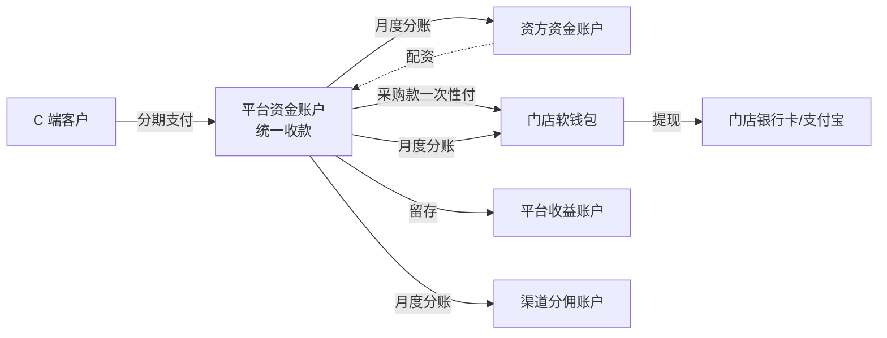

# 【满点重构 PRD V0.1】财务专题

> 👤 **目标读者**：财务总监、财务经理、会计、出纳
> 
> 📖 **本文档含**：资金流转 + 计费 + 退款 + 各端财务模块 + 全局支付规则
> 
> ⏱ **预计阅读时长**：50-70 分钟
> 
> 🎯 **评审重点**：
> - 资金链路全景图（§4.3.1）
> - 三种订单的资金流差异（§4.3.2）
> - 软钱包账户体系（§4.3.3, §4.3.4）
> - 计费规则（搬运惠讯租办单助手）（§4.4）
> - 退款/退单流程（§4.5）
> - 商家端财务管理（§6.3.8）
> - 运营端财务管理（§6.4.11）
> - 资方资金账户（§6.5.5）
> - 全局计费 + 支付规则（§8.4, §8.5）
> 
> 💡 **请你重点反馈**：
> - 资金链路在你这边是否做得了账
> - 分账时各方收入是否需要单独发票
> - 退款的会计处理是否合规
> - 押金的会计科目处理
> - 跨客户部署时财务报表的合并/独立要求

---

> **📌 评审须知**（所有文档通用，1 分钟读完）
> 
> 你拿到的是【满点租赁系统重构 PRD V0.1 总体大纲】的一个分章节子文档。完整文档约 5 万字，为了高效评审，按部门/角色拆分后只给你看你工作相关的部分。
> 
> **如何参与评审**：
> 1. **整体读一遍**（按你部门预计 20-40 分钟即可）
> 2. **选中文字 → 右键评论** 提具体反馈，建议格式：
>    - 【类型】修改 / 新增 / 删除 / 质疑 / 疑问
>    - 【内容】你的建议
>    - 【原因】为什么这么改（可选）
> 3. **重要反馈 @ 产品负责人**
> 4. **截止时间**：[请项目负责人填写]
> 
> **不要做的事**：
> - 不要直接编辑文档（请用评论）
> - 不要纠结字段名/UI 文案这些细节（V1.0 阶段再抠）
> - 不要超出本文档范围讨论其他模块
> 
> **本文档可能引用的其他章节**（如有疑问可向产品负责人申请阅读权限）：
> - §1 文档说明  /  §2 商业模式  /  §3 角色与端  /  §4 核心业务模型
> - §5-6 各端 PRD  /  §7 基础设施  /  §8 全局规则  /  §9 数据模型
> - §10-13 短租 / 注意事项 / 待澄清 / 实施建议

---

### 4.3 资金流转模型

#### 4.3.1 资金链路全景图



#### 4.3.2 三种订单的资金流差异

**门店订单（funding_ratio = 100%）**
- 客户付款（含首付+月付）→ 平台账户
- 扣手续费（总租金 × X%）→ 平台收益
- 剩余金额 → 门店软钱包 → 门店提现
- 平台不代垫采购款，客户违约损失全部由门店承担

**分红订单（funding_ratio = 1-99%）**
- 订单成立时：资方资金池扣 [设备价 × 配资比例] → 平台代垫给门店采购账户
- 客户按月还款 → 平台扣 99 元会员费 + 加价部分 → 剩余按比例分给门店、资方
- 客户违约由资方/平台承担，门店不追责

**平台订单（funding_ratio = 0%）**
- 订单成立时：平台从资方资金池支出全部采购款 → 分配给某商家执行
- 客户按月还款 → 扣 99 元会员费 + 加价部分 → 门店得佣金
- **待澄清**：如果客户已支付但平台找不到合适执行商家怎么办？

#### 4.3.3 软钱包账户体系

每个门店/商家有以下账户类型：

| 账户类型 | 用途 | 是否可提现 |
|---|---|---|
| **可用余额** | 已结算到账的资金 | ✅ |
| **结算中余额** | 客户已还款但未到结算日的金额 | ❌ |
| **冻结金额** | 提现申请中、订单争议中 | ❌ |

**重构变化**：
- 原"分成余额 / 佣金余额 / 配资额度"三账户合并为**单一资金账户**
- 每笔流水标注**资金类型**（分红收入 / 佣金收入 / 退款 / 提现等）
- 原"配资额度"功能不再保留

#### 4.3.4 软钱包允许负数

- 客户退单退款后，门店软钱包可能变成负数
- 系统不拒绝退款，资金原路退回客户优先
- 门店软钱包变负数后，禁止新订单分账入账（先用新订单收入抵扣负数）
- 门店可主动充值正值回填

### 4.4 计费规则（搬运惠讯租办单助手）

#### 4.4.1 核心计算公式

**输入参数**：
- `price`：设备价格
- `ratio`：首付比例（0.3 / 0.4 / 0.5 / 0.6，**配置化**）
- `periods`：租期（6 / 9 / 12，**配置化**）
- `fee`：设备管理费（50 / 150 / 250 元，**配置化**）

**公式**：

```
首付金额 = price × ratio
未付金额 = price - 首付金额
后续应还总额 = 未付金额 × 费率（查表）
后期月付 = 后续应还总额 ÷ (periods - 1)
押金 = 首付金额 - 首期租金（默认 10 元）
设备管理费 = 单独列出，首期一次性收
留购总价 = 首付金额 + 后续应还总额 + 设备管理费
```

#### 4.4.2 费率表

| 期数 | 首付 30% | 首付 40% | 首付 50% | 首付 60% |
|---|---|---|---|---|
| 6 期 | 1.26 | 1.20 | 1.20 | 1.15 |
| 9 期 | 1.30 | 1.28 | 1.26 | 1.21 |
| 12 期 | 1.37 | 1.30 | 1.30 | 1.28 |

**配置化要求**：
- 后台可增删期数、首付比例档位
- 可调整任一格的费率倍数
- 配置变更只影响新订单

#### 4.4.3 商品价格表

- 由运营端「配置管理 → 商品价格库」维护
- 支持批量导入/导出（Excel）
- 支持机型增删
- 价格变更只影响新订单

#### 4.4.4 计算示例

iPhone 17 Pro 256GB，全新机，首付 30%，6 期，设备管理费 50 元：
- 设备价 = 8999，首付比例 = 0.3，期数 = 6
- 首付金额 = 2699.70
- 后续应还总额 = 6299.30 × 1.26 = 7937.12
- 后期月付 = 7937.12 ÷ 5 = 1587.42
- 押金 = 2689.70
- 留购总价 = 10686.82

#### 4.4.5 留购价计算（按期数递减）

```
N=1: 7937.12 + 2689.70 = 10626.82
N=2: 1587.42 × 4 + 2689.70 = 9039.38
N=3: 1587.42 × 3 + 2689.70 = 7451.96
N=4: 1587.42 × 2 + 2689.70 = 5864.54
N=5: 1587.42 × 1 + 2689.70 = 4277.12
N=6（最后一期）: 2689.70（押金可抵扣，实付 = 0）
```

**最后一期为零的处理**：
- 显示为"留购价 ¥0.00（押金已抵扣）"
- 客户仍需点确认按钮触发"我要留购"流程
- 走留购合同电签
- 押金不退还客户（已用于抵扣留购价）

#### 4.4.6 计费规则的配置化层级

```
全局配置 → 客户配置 → 门店配置 → 商品配置
```

下层配置覆盖上层。

### 4.5 退款 / 退单流程

#### 4.5.1 退单的时机

| 退单时机 | 资金处理 | 设备处理 |
|---|---|---|
| 签约前 | 无资金往来 → 直接关闭 | 无 |
| 签约后未支付 | 无资金往来 → 关闭订单 | 无 |
| 支付首付但未发货 | 首付原路退回客户 | 无 |
| 已发货未收货 | 首付原路退回，物流召回 | 物流召回 |
| 已收货 | 扣除违约金，剩余原路退回 | 客户寄回 → 门店验机 → 入库 |
| 租赁中 | 已付租金原路退回（扣违约金）+ 押金扣损耗 | 客户寄回 / 门店上门取 |

#### 4.5.2 资金回滚链路

退款时，资金按**反向流向**回退：
1. 平台从客户账户已收款金额扣除违约金后，原路退回客户
2. 平台从门店软钱包扣除已分账金额（余额不够则负数）
3. 平台从资方资金账户扣回已分账金额（余额不够则流水标记待补）
4. 渠道分佣已分账金额扣回

#### 4.5.3 退款审核流程

- 客户在 C 端申请退款 → 进入"退款工单"
- 退款金额 ≤ 500 元：自动通过
- 退款金额 > 500 元：需运营审核（**金额阈值配置化**）
- 审核通过后，原路退款（支付宝/微信走支付平台 API）

#### 4.5.4 违约金规则

| 退款时机 | 违约金计算 |
|---|---|
| 已收货 < 7 天 | 订单金额 × 5%（**配置化**） |
| 已收货 7-30 天 | 订单金额 × 10% |
| 已收货 > 30 天 | 订单金额 × 15% |
| 租赁中提前退租 | 剩余未付租金 × 30% |

---

#### 6.3.8 商家端 - 财务管理（重构关键变化）

**资金账户**：
- 重构后：主资金账户（可用 / 冻结 / 结算中）+ 资金流水 + 第三方费用扣款明细（独立 Tab）

**费用结算明细**（重构变化）：
- 按费用类型分 Tab：电子合同、风控报告、人脸识别、二要素验证、设备锁
- 每类显示：已结算 / 待结算金额、订单关联、时间
- 与第三方中控统一对账（详见 7.2）

---

#### 6.4.11 运营端 - 财务管理

**租金管理**：
- 全平台租金收款、待收、逾期统计
- 按订单、客户、时间、状态筛选
- 异常订单标记

**线下还款管理**（重构关键变化）：
- 客户线下打款 → 商家/运营手动录入 → 审核 → 入账
- 流程：录入金额、客户、订单号、还款日期、凭证图片
- 双人审核制：录入人 + 复核人（**配置化是否开启**）
- 入账后自动更新订单账单状态

**押金管理**（重构关键变化）：
- 按订单维度展示押金（订单号、客户、押金金额、状态、订单状态）
- 押金状态：已收取 / 已冻结 / 待退还 / 已退还 / 已抵扣留购
- 退还操作：客户归还设备且无损耗 → 退还押金
- 强制退款：争议订单运营介入，强制退押金（需高级权限）
- 金额调整：损耗扣减押金（需填扣减原因）

---

#### 6.5.5 资方端 - 资金账户

- 当前余额
- 历史流水（充值、回款、提现、调整）
- 按类型筛选

---

### 8.4 全局计费规则

详见 4.4。

### 8.5 全局支付规则

| 场景 | 支付方式 |
|---|---|
| C 端首付 | 支付宝/微信 H5 支付 |
| C 端月付 | 支付宝/微信免密代扣 |
| C 端留购 | 支付宝/微信 H5 支付 |
| 门店配资充值（仅负数回填）| 支付宝/微信扫码 |
| 资方在线充值 | 支付宝/微信 / 银行转账 |
| 商家直收首付 | 商家自行收取，平台不参与 |
| 提现到账 | 支付宝企业打款 / 银行打款 |
