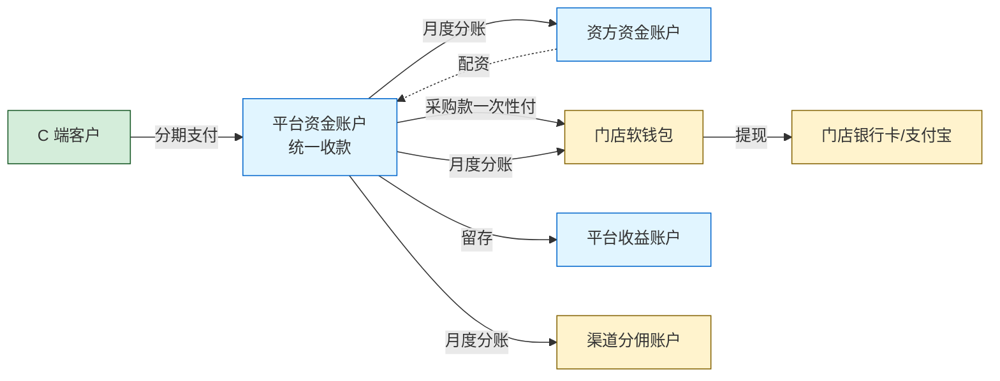

# 【满点重构 PRD V0.1】法务 / 合规专题

> 👤 **目标读者**：法务、合规、外部律师
> 
> 📖 **本文档含**：合同模板引擎 + 商业模式 + 资金流 + 风控 + 过渡方案
> 
> ⏱ **预计阅读时长**：40-60 分钟
> 
> 🎯 **评审重点**：
> - **合同模板引擎设计**（§7.5 完整章节）
>   - 合同类型清单（§7.5.2）
>   - 签署主体配置（§7.5.5）
>   - 出租方可切换（§7.5.5）
> - 商业模式描述（§2，是否涉及合规风险）
> - 资金链路（§4.3，分账模式合规性）
> - 风控引擎（§7.7，催收、起诉、黑名单）
> - 过渡方案中的法律风险（§11.2）
> 
> 💡 **请你重点反馈**：
> - 现有合同模板的法律审定情况
> - 重构后需新增的合同模板（如商家版、短租）
> - 商业模式描述中是否涉及"融资租赁"等需要资质的红线
> - 客户实名、紧急联系人收集的隐私合规
> - 催收和起诉流程的合规边界

---

> **📌 评审须知**（所有文档通用，1 分钟读完）
> 
> 你拿到的是【满点租赁系统重构 PRD V0.1 总体大纲】的一个分章节子文档。完整文档约 5 万字，为了高效评审，按部门/角色拆分后只给你看你工作相关的部分。
> 
> **如何参与评审**：
> 1. **整体读一遍**（按你部门预计 20-40 分钟即可）
> 2. **选中文字 → 右键评论** 提具体反馈，建议格式：
>    - 【类型】修改 / 新增 / 删除 / 质疑 / 疑问
>    - 【内容】你的建议
>    - 【原因】为什么这么改（可选）
> 3. **重要反馈 @ 产品负责人**
> 4. **截止时间**：[请项目负责人填写]
> 
> **不要做的事**：
> - 不要直接编辑文档（请用评论）
> - 不要纠结字段名/UI 文案这些细节（V1.0 阶段再抠）
> - 不要超出本文档范围讨论其他模块
> 
> **本文档可能引用的其他章节**（如有疑问可向产品负责人申请阅读权限）：
> - §1 文档说明  /  §2 商业模式  /  §3 角色与端  /  §4 核心业务模型
> - §5-6 各端 PRD  /  §7 基础设施  /  §8 全局规则  /  §9 数据模型
> - §10-13 短租 / 注意事项 / 待澄清 / 实施建议
-e 

---

## 2. 商业模式概述

### 2.1 业务本质

本系统支持的核心业务是 **"以租代售"** 模式的耐用品分期租赁。

- 客户分期支付租金（首付 + 月付），租期内拥有设备使用权
- 租期结束后客户可选：归还、续租、留购（买断）
- 设备所有权在租期内归出租方（门店/商家/平台/资方，按订单类型不同而不同）
- 平台通过"加价系数"（计费倍数）赚取利润，资方通过资金回报赚利润

### 2.2 资金真相 —— 与传统理解的差异

**传统误解**：客户 → 门店租手机 → 门店赚租金

**实际模式**：

```
门店采购手机（自己进货）
       ↓
客户向门店发起租赁
       ↓
平台/资方介入，"从门店购买"这台手机（手机采购合同生效）
       ↓
平台支付采购款到门店采购账户（资方/平台垫付）
       ↓  
平台与客户签租赁合同，客户分期付款给平台
       ↓
月付收上来后，按订单类型分账：
  - 给资方（资方分润）
  - 给门店软钱包（分红/佣金）
  - 平台自留（会员费 + 加价部分 - 第三方接口成本）
```

**关键观察**：
- "**手机采购合同**" 是商业模式的底层凭证（平台从门店买货）
- "**采购账户**" 是平台向门店付款的支付宝账号（不是门店收客户款的账户）
- "**分红订单 = 平台配资**"（平台/资方出钱垫付采购款）
- "**配资额度**" 由资方资金池决定，按杠杆放大
- "**低费率/平台订单**" 是门店把客户/订单送给平台执行，自己不出货
- "**门店订单**" 是门店自己全资做（不需要平台垫资）

### 2.3 三类订单的本质区别

| 维度 | 门店订单 | 分红订单 | 平台订单（原"低费率"）|
|---|---|---|---|
| **出资方** | 门店 100%（货 + 现金都自己出） | 门店出货 + 资方/平台配资部分款 | 门店不出货也不出钱，纯送单 |
| **审核方** | **门店自审** | **平台审核** | **平台审核** |
| **签约方** | 客户 + 门店 + 平台 | 客户 + 门店 + 平台（+ 资方备注） | 客户 + 平台 + 执行商家（由平台分配） |
| **资金链路** | 平台代收客户款，扣手续费，余款给门店 | 平台代收客户款，扣会员费+加价，按比例分给门店、资方 | 平台代收客户款，扣会员费+加价，按佣金标准付门店 |
| **平台收益** | 客户总租金 × 手续费率（**配置化**）| 99 元会员费 + 加价部分 + 资方利息差 | 99 元会员费 + 加价部分 |
| **门店收益** | 总租金 - 平台手续费 | 按分红比例（自填配资金额决定） | 按固定佣金（可配置） |
| **客户违约损失承担** | 门店 | 资方/平台 | 平台 |
| **典型场景** | 门店自己有钱有货想做高单价 | 门店有货缺资金，想杠杆做大量 | 门店缺货缺客户，纯当流量入口 |

**重构设计原则**：订单类型不写死成三个枚举，而是用"**出资比例**"字段驱动：
- 100% 门店出资 → 系统自动识别为门店订单
- 0% 门店出资 → 系统自动识别为平台订单
- 介于之间 → 系统自动识别为分红订单

这样未来增加新订单形态（如纯资方订单、二级代理订单）也能自然兼容。

### 2.4 业务链上的 6 类角色

| 角色 | 在系统里的体现 | 是否有独立端 |
|---|---|---|
| **平台运营** | 运营端（PC 后台） | ✅ 运营端 |
| **资方** | 资方信息、资方资金账户、资方账单 | ✅ 资方端（只读 H5）|
| **商家** | 商家公司主体，管商品/营销/财务 | ✅ 商家端（PC 后台）|
| **门店** | 商家下属销售点，处理订单、自建开单、拓店 | ✅ 门店端（H5 移动）|
| **渠道** | 引流方，按订单分佣 | ✅ 渠道端（H5 报表） |
| **C 端客户 / 租客** | 实际租赁人 | ✅ 小程序/App |

商家与门店是 **1:N 关系**（一个商家公司可以挂多个门店，也支持 1:1 的小商家模式）。

### 2.5 平台收益来源

平台的盈利模式由 **4 个并行收入构成**：

1. **会员费**：每笔分红/平台订单固定收 99 元（**配置化**，可调整金额甚至按订单金额比例）
2. **加价部分**：客户总租金 - 设备价 = 加价空间，平台与资方按约定分润
3. **手续费**：门店订单按总租金扣 X%（**配置化**）
4. **第三方接口差价**：客户/商家被收取的人脸/风控费用 > 平台向第三方付的成本

平台成本：
- 第三方接口实际成本（e签宝/新颜/人脸/设备锁）
- 资方分润（如资方出资部分）
- 门店分红/佣金（如分红订单/平台订单）
- 渠道分佣（如渠道引流订单）
- 运营人力（信审、电审、客服、催收）

### 2.6 商业模式的扩展性

V0.1 主要描述长租分期模式。系统底层应预留以下扩展能力：

- **短租**：按时间颗粒度计费（小时/日/周/月），同一设备可多次出租，需要"设备日历"
- **维修/保养服务**：手机碎屏、电池更换等单次服务
- **配件商城**：耗材、配件销售
- **质保服务**：延保、意外保险

短租在本版本架构层面预留，业务细节 V0.2 补充。其余业务在当前阶段不开发，但商品类型枚举里保留扩展位。

---
## 2. 商业模式概述

### 2.1 业务本质

本系统支持的核心业务是 **"以租代售"** 模式的耐用品分期租赁。

- 客户分期支付租金（首付 + 月付），租期内拥有设备使用权
- 租期结束后客户可选：归还、续租、留购（买断）
- 设备所有权在租期内归出租方（门店/商家/平台/资方，按订单类型不同而不同）
- 平台通过"加价系数"（计费倍数）赚取利润，资方通过资金回报赚利润

### 2.2 资金真相 —— 与传统理解的差异

**传统误解**：客户 → 门店租手机 → 门店赚租金

**实际模式**：

```
门店采购手机（自己进货）
       ↓
客户向门店发起租赁
       ↓
平台/资方介入，"从门店购买"这台手机（手机采购合同生效）
       ↓
平台支付采购款到门店采购账户（资方/平台垫付）
       ↓  
平台与客户签租赁合同，客户分期付款给平台
       ↓
月付收上来后，按订单类型分账：
  - 给资方（资方分润）
  - 给门店软钱包（分红/佣金）
  - 平台自留（会员费 + 加价部分 - 第三方接口成本）
```

**关键观察**：
- "**手机采购合同**" 是商业模式的底层凭证（平台从门店买货）
- "**采购账户**" 是平台向门店付款的支付宝账号（不是门店收客户款的账户）
- "**分红订单 = 平台配资**"（平台/资方出钱垫付采购款）
- "**配资额度**" 由资方资金池决定，按杠杆放大
- "**低费率/平台订单**" 是门店把客户/订单送给平台执行，自己不出货
- "**门店订单**" 是门店自己全资做（不需要平台垫资）

### 2.3 三类订单的本质区别

| 维度 | 门店订单 | 分红订单 | 平台订单（原"低费率"）|
|---|---|---|---|
| **出资方** | 门店 100%（货 + 现金都自己出） | 门店出货 + 资方/平台配资部分款 | 门店不出货也不出钱，纯送单 |
| **审核方** | **门店自审** | **平台审核** | **平台审核** |
| **签约方** | 客户 + 门店 + 平台 | 客户 + 门店 + 平台（+ 资方备注） | 客户 + 平台 + 执行商家（由平台分配） |
| **资金链路** | 平台代收客户款，扣手续费，余款给门店 | 平台代收客户款，扣会员费+加价，按比例分给门店、资方 | 平台代收客户款，扣会员费+加价，按佣金标准付门店 |
| **平台收益** | 客户总租金 × 手续费率（**配置化**）| 99 元会员费 + 加价部分 + 资方利息差 | 99 元会员费 + 加价部分 |
| **门店收益** | 总租金 - 平台手续费 | 按分红比例（自填配资金额决定） | 按固定佣金（可配置） |
| **客户违约损失承担** | 门店 | 资方/平台 | 平台 |
| **典型场景** | 门店自己有钱有货想做高单价 | 门店有货缺资金，想杠杆做大量 | 门店缺货缺客户，纯当流量入口 |

**重构设计原则**：订单类型不写死成三个枚举，而是用"**出资比例**"字段驱动：
- 100% 门店出资 → 系统自动识别为门店订单
- 0% 门店出资 → 系统自动识别为平台订单
- 介于之间 → 系统自动识别为分红订单

这样未来增加新订单形态（如纯资方订单、二级代理订单）也能自然兼容。

### 2.4 业务链上的 6 类角色

| 角色 | 在系统里的体现 | 是否有独立端 |
|---|---|---|
| **平台运营** | 运营端（PC 后台） | ✅ 运营端 |
| **资方** | 资方信息、资方资金账户、资方账单 | ✅ 资方端（只读 H5）|
| **商家** | 商家公司主体，管商品/营销/财务 | ✅ 商家端（PC 后台）|
| **门店** | 商家下属销售点，处理订单、自建开单、拓店 | ✅ 门店端（H5 移动）|
| **渠道** | 引流方，按订单分佣 | ✅ 渠道端（H5 报表） |
| **C 端客户 / 租客** | 实际租赁人 | ✅ 小程序/App |

商家与门店是 **1:N 关系**（一个商家公司可以挂多个门店，也支持 1:1 的小商家模式）。

### 2.5 平台收益来源

平台的盈利模式由 **4 个并行收入构成**：

1. **会员费**：每笔分红/平台订单固定收 99 元（**配置化**，可调整金额甚至按订单金额比例）
2. **加价部分**：客户总租金 - 设备价 = 加价空间，平台与资方按约定分润
3. **手续费**：门店订单按总租金扣 X%（**配置化**）
4. **第三方接口差价**：客户/商家被收取的人脸/风控费用 > 平台向第三方付的成本

平台成本：
- 第三方接口实际成本（e签宝/新颜/人脸/设备锁）
- 资方分润（如资方出资部分）
- 门店分红/佣金（如分红订单/平台订单）
- 渠道分佣（如渠道引流订单）
- 运营人力（信审、电审、客服、催收）

### 2.6 商业模式的扩展性

V0.1 主要描述长租分期模式。系统底层应预留以下扩展能力：

- **短租**：按时间颗粒度计费（小时/日/周/月），同一设备可多次出租，需要"设备日历"
- **维修/保养服务**：手机碎屏、电池更换等单次服务
- **配件商城**：耗材、配件销售
- **质保服务**：延保、意外保险

短租在本版本架构层面预留，业务细节 V0.2 补充。其余业务在当前阶段不开发，但商品类型枚举里保留扩展位。

---
-e 


### 4.3 资金流转模型

#### 4.3.1 资金链路全景图



#### 4.3.2 三种订单的资金流差异

**门店订单（funding_ratio = 100%）**

```
客户付款（含首付+月付）→ 平台账户
                          ↓
                    扣手续费（总租金 × X%）→ 平台收益
                          ↓
                    剩余金额 → 门店软钱包
                          ↓
                          门店提现 → 门店银行卡/支付宝
```

- 平台不代垫采购款（货款由门店自有现金 / 已有库存承担）
- 客户违约损失全部由门店承担

**分红订单（funding_ratio = 1-99%）**

```
订单成立时：
  资方资金池扣 [设备价 × 配资比例] → 平台代垫给门店采购账户
  
客户按月还款：
  客户付款 → 平台账户
            ↓
       扣 99 元会员费 → 平台收益
            ↓
       扣加价部分（X%）→ 平台收益、资方分润（按约定比例）
            ↓
       剩余 → 门店软钱包（按分红比例）+ 资方账户（按出资比例）
```

- 资方资金池余额不足 → 拒绝下单（运营在配置中心可设置预警阈值）
- 客户违约损失由资方/平台承担，门店不追责
- 客户违约 → 资方/平台收回设备 → 二次处置（待 V1.0 细化处置流程）

**平台订单（funding_ratio = 0%）**

```
订单成立时：
  平台从资方资金池支出全部采购款 → 平台分配给某商家执行
  
客户按月还款：
  客户付款 → 平台账户
            ↓
       扣 99 元会员费 → 平台收益
            ↓
       扣加价部分 → 平台收益、资方分润
            ↓
       门店得佣金（固定金额或按订单比例，配置化）
```

- 门店纯当流量入口，不出货不出钱
- 平台需把订单分配给具体的执行商家（由商家备货发货）
- **待澄清**：如果客户已支付但平台找不到合适执行商家怎么办？是否设"备货池"机制？

#### 4.3.3 软钱包账户体系

每个门店/商家在系统里有以下账户类型（参考门店端手册的三账户结构，重构后简化）：

| 账户类型 | 用途 | 是否可提现 |
|---|---|---|
| **可用余额** | 已结算到账的资金，可发起提现 | ✅ |
| **结算中余额** | 客户已还款但未到结算日的金额 | ❌ |
| **冻结金额** | 提现申请中、订单争议中的金额 | ❌ |

**门店端原有的"分成余额 / 佣金余额 / 配资额度"三账户结构**：

- 重构后：合并为**单一资金账户**，每笔流水标注**资金类型**（分红收入 / 佣金收入 / 退款 / 提现等）
- 通过流水的"资金类型"过滤即可分类查看
- 原"配资额度"功能**不再保留**（因为门店不再充值配资，配资由资方资金池统一管理）

#### 4.3.4 软钱包允许负数

特殊场景：客户退单退款后，门店软钱包可能变成负数。

- 系统不拒绝退款（资金原路退回客户优先）
- 门店软钱包变负数后，**禁止新订单分账入账**（先用新订单收入抵扣负数）
- 门店可主动充值正值回填（充值入口在门店端"我的钱包"）
- 运营端可见所有负数账户列表，定期跟进

-e 


### 7.5 多客户租户与部署架构

#### 7.5.1 架构选型

按用户回复确认：**独立部署 + 主代码统一更新**

```
┌─────────────────────────────────────────────────┐
│  代码仓库（GitHub: mandian-java-rebuild）        │
│  ├─ 核心业务代码（所有客户共用）                  │
│  ├─ 多租户配置层                                 │
│  └─ 部署配置模板                                 │
└──────────┬──────────────────────────────────────┘
           │ 平台方更新主代码后
           │ CI/CD 自动推送
    ┌──────┴──────┬────────┬────────┬────────┐
    ▼             ▼        ▼        ▼        ▼
  客户A环境    客户B环境  客户C环境  客户D ... 客户N
  (独立DB)    (独立DB)   (独立DB)
  (独立域名)  (独立域名) (独立域名)
  (独立配置)  (独立配置) (独立配置)
```

#### 7.5.2 客户租户管理

平台方在**运营端 / 多客户管理**模块维护：

| 字段 | 说明 |
|---|---|
| 客户公司名 | 客户的对外品牌（如鼎租、惠讯租）|
| 客户编号 | 内部唯一标识 |
| 部署域名 | 如 admin.dingzu.com、c.huixunzu.com |
| 数据库连接 | 独立数据库实例 |
| 部署状态 | 部署中 / 正常 / 维护中 / 已停用 |
| 当前版本 | 代码版本号 |
| 联系人 | 客户联系人 |
| 中控 Token | 用于调用第三方中控的鉴权 |
| 自定义配置 | 客户级别配置覆盖（费率默认值、UI 主题、品牌名等）|

#### 7.5.3 自动化部署

- CI/CD 流水线（GitHub Actions / Jenkins）
- 主代码更新 → 自动构建镜像 → 灰度发布到客户环境
- 部署前自动备份（数据库、配置）
- 失败自动回滚
- 部署后健康检查

#### 7.5.4 升级策略

- 同步升级：所有客户同时升级（默认）
- 分批升级：按客户分组（重要客户 / 一般客户）
- 灰度升级：先升级 1 个客户，观察 24 小时后推全部

#### 7.5.5 数据隔离

- 物理隔离：每个客户独立数据库实例
- 逻辑隔离（中控类共享系统）：通过 tenant_id 严格隔离查询
- 客户之间**完全无数据互通**
- 平台方运营端可看到所有客户的部署状态（不看具体业务数据）

#### 7.5.6 客户差异化配置

不同客户可独立配置：

- 域名、品牌名、Logo、主题色（运营端 → 多客户管理）
- 启用/停用某模块（如某客户不需要短租，关闭短租模块）
- 启用/停用某第三方接口（如某客户不需要 e签宝，用其他签约方案）
- 业务规则差异（费率、首付、押金等）

UI 层面所有客户使用同一套代码，但通过 CSS 主题 + 多语言 + 配置开关实现差异化展现。

---
-e 


-e 


### 11.2 项目重构与悦租租过渡方案

**对应**：本 PRD 第 11.2 章

**初步方案**：

```
Stage 1：双系统并行（2-3 个月）
├─ 新系统部署上线（仅给 1-2 个客户试用）
├─ 老系统继续维护，不开发新功能
└─ 双系统数据不互通，新订单走新系统

Stage 2：数据迁移（1 个月）
├─ 编写数据迁移脚本（老系统订单/客户/商家 → 新系统）
├─ 老系统订单冻结，全部迁移到新系统
└─ 老系统切只读模式

Stage 3：老系统下线（即可）
├─ 所有客户切换到新系统
└─ 老系统归档
```

**关键点**：
- 数据迁移脚本需要在 V1.0 开发阶段同步编写
- 迁移前充分测试（数据一致性、业务连续性）
- 历史订单按"原合同规则"处理，不强制按新规则
- 准备回滚预案（迁移失败可回到老系统）

**待澄清**：
- 老系统的数据量有多大？
- 老系统的代码/数据库是否还有访问权限？
- 客户对停机时间的容忍度（迁移可能需要短暂停机）

