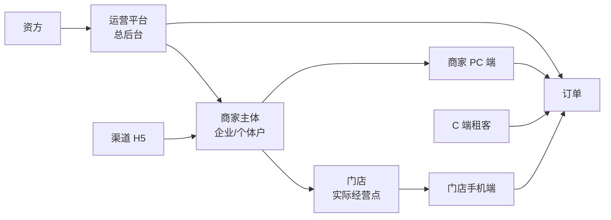

# 02 三端模块地图

> 本文用于统一系统范围。后续页面级 PRD、菜单权限、接口拆分、数据库建模都按本文拆模块。

---

## 1. 端与主体关系

核心结论：

- 运营端是总后台。
- 商家 PC 端和门店手机端是同一主体的两个操作入口。
- 门店手机端不是独立业务主体，而是商家/门店的移动工作台。
- 渠道端只看自己推广带来的入驻和订单统计。
- 资方端先以只读看板为主。

---

## 2. 运营端模块地图

| 一级模块 | 二级模块 | 核心职责 | V0.2 调整 |
|---|---|---|---|
| 工作台 | 数据看板、待办、预警 | 平台全局运营入口 | 保留，后续按财务中台风格重画 |
| 订单管理 | 全部订单、门店订单、分红订单、平台订单、关闭/退货、买断、续租、逾期未归还、电审订单、短租订单 | 全平台订单主控 | 订单类型统一为三类，订单需支持长租/短租 |
| 商品管理 | 平台商品、商家商品、商品审核、商品复制、规格、增值服务、同步办单助手、长租/短租适配 | 商品全生命周期 | 原 `商品审核` 升级为完整 `商品管理` |
| 库存设备管理 | 设备档案、唯一设备码、仓库、出入库、锁定、出租、归还验收、维修下架 | 短租履约和库存主控 | 短租必须绑定唯一设备，商品库存不能替代设备库存 |
| 店铺管理 | 入驻审核、店铺资料、采购账户、签章授权、员工账号 | 商家/门店资质和账号 | 入驻审核需展示 OCR、实名、e签宝授权 |
| 资方管理 | 资方配置、资方订单、资方账单、资方用户、打款记录、资金账户 | 分红/平台订单资金侧 | 资方必须先配置后才能分配订单 |
| 财务管理 | 钱包、提现、分账、对账、账单、押金、线下还款 | 钱的总账和明细 | 三类订单分账必须互通 |
| 渠道管理 | 渠道新增、推广码、入驻统计、订单统计、佣金、提现 | 渠道推广与结算 | 新增渠道 H5 数据看板 |
| 佣金管理 | 门店抽佣、渠道佣金、平台服务费、分红比例 | 佣金规则配置 | 门店订单默认 2%，可调 |
| 客诉管理 | 支付宝投诉同步、投诉处理、处理记录 | 客诉闭环 | 从营销管理中保留出来 |
| 租后管理 | 逾期导入、催收、处置、外部系统对接 | 租后风险管理 | 先建模块，后接外部系统 |
| 黑名单库 | 黑名单导入、脱敏匹配、命中提示 | 审核辅助 | 后期对接外置黑名单 |
| 监管锁管理 | 设备锁配置、锁机/解锁日志、厂商密钥 | 设备控制 | 后期接自研监管锁 |
| 配置管理 | 费率、套餐、租赁模式、计费单位、链路配置中心、增值服务、合同模板、审核策略、商品同步规则 | 平台规则中心 | 分红/平台订单配置归运营端，租期单位支持小时/天/周/月，支付/合同/风控/发货/分账支持按订单类型和商户覆盖 |
| 权限管理 | 角色、账号、菜单、操作权限 | 平台人员权限 | 所有敏感操作需日志 |
| 日志审计 | 操作日志、系统日志、回调日志、改价日志 | 可追溯 | 全系统强制保留 |

---

## 3. 商家 PC 端模块地图

商家 PC 端用于商家老板或管理人员。

| 一级模块 | 核心功能 | 权限边界 |
|---|---|---|
| 工作台 | 自己门店订单、分红订单、平台订单进度、待办、经营数据 | 只看自己主体数据 |
| 商品管理 | 添加商品、自定义规格组、SKU 价格、长租适配、是否同步办单助手、增值服务 | 商品提交后由运营审核；短租库存后续单独接入 |
| 短租设备库存 | 设备档案、设备码、入库、锁定、出租、归还验收、维修下架 | 短租后续模块；当前长租不走库存 |
| 门店订单 | 自有订单列表、审核、改价、发货、售后 | 门店订单可自审 |
| 分红订单 | 查看发起订单、审核进度、资方分配结果、分账明细 | 审核主控在运营端 |
| 平台订单 | 查看自己发起的平台订单进度、联系客服 | 审核/资方/财务主控在运营端 |
| 财务钱包 | 可提现余额、冻结金额、流水、提现申请、对账 | 不可查看其他商家 |
| 员工管理 | 新增员工、分配手机号密码、启停、权限 | 老板/管理员可操作 |
| 门店资料 | 营业执照、法人、地址、门头、收款账户、签章授权 | 关键资料变更需运营审核 |
| 配置管理 | 门店订单费率、增值服务、办单助手配置 | 只影响门店订单 |
| 客服/工单 | 平台订单联系客服、订单咨询 | 绑定订单上下文 |

商家 PC 端不做：

- 资方分配
- 平台订单审核
- 分红订单最终审核
- 全平台商品审核
- 全平台财务总账
- 渠道佣金配置

---

## 4. 门店手机端模块地图

门店手机端是商家/门店的移动工作台。

| 模块 | 页面/入口 | 核心功能 |
|---|---|---|
| 登录 | 门店登录 | 手机号、密码、短信验证码、协议勾选、登录保持 |
| 入驻 | 立即入驻 | 注册、资料上传、OCR、地图地址、收款账户、e签宝授权 |
| 首页/待办 | 门店管理首页 | 待审核、待签约、待支付、待发货、待处理任务 |
| 办单助手 | 门店订单 | 使用商家配置，扫码生成门店自营订单 |
| 办单助手 | 分红订单 | 使用运营配置，选择配资比例，提交平台审核 |
| 办单助手 | 平台订单 | 使用运营配置，提交平台审核，支持联系客服 |
| 设备管理 | 短租设备 | 扫设备码、选择仓库、交付、归还验收、异常上报 |
| 订单 | 我的订单 | 按三类订单查看进度 |
| 钱包 | 我的钱包 | 收益、提现、流水；员工账号不可见 |
| 员工账号 | 员工登录 | 员工只可办单和查看待办 |
| 我的 | 门店资料、账号设置、退出登录 | 管理基础信息 |

门店手机端不保留：

- 普通门店资金充值入口

门店手机端新增/保留：

- 同一手机登录保持
- 员工受限账号
- 扫码下单
- 平台订单联系客服

---

## 5. C 端模块地图

| 模块 | 核心功能 | 数据来源 |
|---|---|---|
| 首页/分类 | 浏览可租商品 | 运营/商家同步的商品 |
| 商品详情 | 规格、套餐、费用、留购价、增值服务 | 商品库 + 办单助手价格方案 |
| 扫码下单 | 扫办单助手二维码进入订单 | 办单助手生成的锁价方案 |
| 资料填写 | 身份、联系方式、地址、授权 | 订单流程 |
| 审核进度 | 待审核、补资料、审核结果 | 订单状态 |
| 签约支付 | e签宝、首付、授权 | 合同/支付模块 |
| 我的订单 | 还款、续租、买断、归还 | 订单/账单 |
| 客服 IM | 与客服沟通 | IM 工单 |

---

## 6. 渠道端模块地图

| 模块 | 核心功能 |
|---|---|
| 登录 | 渠道账号登录 |
| 推广码 | 查看/下载推广码，扫码跳转门店入驻 |
| 入驻统计 | 推广入驻商家数量、审核状态 |
| 分红订单统计 | 订单数量、金额、状态、逾期、在租 |
| 平台订单统计 | 订单数量、金额、状态、逾期、在租 |
| 佣金明细 | 订单维度佣金、结算状态 |
| 提现 | 提现申请、提现记录 |

不统计：

- 门店订单，因为门店自营与渠道佣金无直接关系。

---

## 7. 资方端模块地图

资方端先做只读看板，不做复杂运营。

| 模块 | 核心功能 |
|---|---|
| 登录 | 资方账号登录 |
| 工作台 | 资金余额、待回款、逾期预警 |
| 我的订单 | 被分配的分红/平台订单 |
| 账单 | 应收、已收、逾期 |
| 资金账户 | 授信记录、出资记录、回款记录、提现记录 |
| 提现申请 | 提交后由运营审核 |

---

## 8. 数据互通要求

系统不能只做菜单和页面，必须保证模块间数据贯通。

| 数据 | 产生模块 | 消费模块 |
|---|---|---|
| 商品规格 | 运营/商家商品管理 | 办单助手、C 端商品详情、订单 |
| 入驻资料 | 门店入驻 | 运营端店铺审核、商家档案、签章授权、财务钱包 |
| 租赁模式/计费单位 | 配置管理 | 商品规格、办单助手、订单、账单、财务 |
| 链路配置 | 配置管理 | 订单、支付、合同、风控、发货、财务、办单助手、操作日志 |
| 设备库存 | 库存设备管理 | 短租下单、订单交付、归还验收、监管锁 |
| 价格方案 | 办单助手 | C 端下单、订单详情、财务分账 |
| 订单 | C 端/门店端/商家端 | 审核、合同、支付、财务、客服、渠道 |
| 审核结论 | 门店/运营 | 合同、支付、订单状态、IM |
| 资方分配 | 运营端 | 财务、资方端、订单详情 |
| 账单 | 订单/支付 | 财务、钱包、渠道、资方 |
| 分账 | 财务规则 | 门店钱包、资方账户、平台收益、渠道佣金 |
| 投诉 | 支付宝投诉接口 | 客诉管理、订单详情 |
| 黑名单命中 | 黑名单库 | 审核弹窗、订单风险记录 |
| 监管锁动作 | 订单/租后 | 设备状态、操作日志 |
| 操作日志 | 所有模块 | 审计、风控、客服追溯 |
