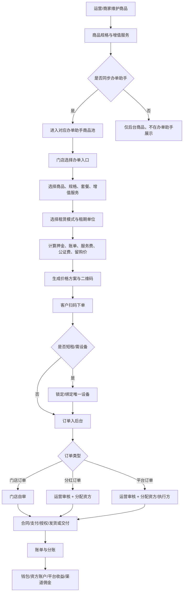

# 03 商品、办单助手、订单核心链路

> 这是 V0.2 最优先落地的主链路。商品、办单助手和订单模型不定准，后续审核、合同、支付、财务、渠道、租后都会跑偏。

---

## 1. 总流程

---

## 2. 商品模型

### 2.1 商品基础信息

| 字段 | 说明 | 备注 |
|---|---|---|
| 商品名称 | 如 iPhone 17 Pro Max | 必填 |
| 品牌 | 苹果、华为、小米、九号等 | 必填 |
| 类目 | 手机、电动车、平板、手表等 | 必填 |
| 商品图片 | 主图、轮播图、详情图 | 必填 |
| 商品卖点 | 展示文案 | 可选 |
| 所属主体 | 平台商品 / 商家商品 | 必填 |
| 审核状态 | 草稿、待审核、已通过、已驳回、已下架 | 必填 |
| 是否可复制给商家 | 平台商品专用 | 可选 |
| 适用租赁模式 | 长租 / 短租 / 两者都适用 | 必填 |

### 2.2 商品规格

`全新` 和 `二手` 是同一商品下的规格。

| 字段 | 说明 | 示例 |
|---|---|---|
| 规格类型 | 全新 / 二手 | 全新 |
| 成色 | 二手规格使用 | 99 新、95 新 |
| 容量/颜色 | 手机规格 | 256G 黑色 |
| 设备指导价 | 办单助手计算基础 | 7999 |
| 押金规则 | 固定/比例/免押 | 20% |
| 库存 | 可租数量 | 10 |
| 适用租赁模式 | 长租 / 短租 / 两者都适用 | 短租规格需关联设备库存 |
| 计费单位 | 小时 / 天 / 周 / 月 | 可多选，由租赁模式限制 |
| 是否启用 | 规格开关 | 是 |
| 是否同步办单助手 | 独立开关 | 是 |

规则：

- 商品可有一个或多个规格。
- 规格独立启停。
- 规格独立同步办单助手。
- 无价格配置的规格不可同步。
- 同步后，办单助手按规格展示可选项。
- 规格可选择适配长租、短租或两者。
- 短租规格必须能关联设备库存，不能只依赖一个库存数字。

### 2.3 租赁模式与租期配置

租期必须可配置，不能固定成按月或按天。

| 配置项 | 说明 | 示例 |
|---|---|---|
| 租赁模式 | 长租 / 短租 | 长租 |
| 计费单位 | 小时 / 天 / 周 / 月 | 月 |
| 租期数量 | 可选数量 | 3、6、9、12 |
| 起租规则 | 立即起租 / 发货后起租 / 取车后起租 | 发货后起租 |
| 归还规则 | 到期归还 / 续租 / 留购 / 买断 | 到期归还/续租 |
| 是否需要设备绑定 | 短租通常需要 | 是 |
| 是否允许预约 | 短租使用 | 是 |

长租配置示例：

- 模式：长租
- 单位：月
- 可选租期：3 期、6 期、9 期、12 期
- 起租规则：发货后或确认收货后起租

短租配置示例：

- 模式：短租
- 单位：小时、天、周
- 可选租期：2 小时、8 小时、1 天、3 天、1 周
- 起租规则：门店交付或扫码取车后起租
- 必须绑定唯一设备

### 2.4 设备库存模型

商品是展示和价格配置，设备才是实际履约对象。

| 层级 | 作用 |
|---|---|
| 商品 | C 端/办单助手展示，例如“九号电动车短租” |
| 规格 | 价格和属性，例如“有电池/无电池”“小时租/天租” |
| 设备 | 唯一实物，例如设备码、车架号、IMEI、SN |
| 仓库 | 设备当前所在门店/仓库 |

设备字段至少包括：

| 字段 | 说明 |
|---|---|
| device_code | 唯一设备码 |
| product_id / sku_id | 归属商品和规格 |
| store_id / warehouse_id | 当前归属门店/仓库 |
| status | 在库可租、已锁定、出租中、归还待验、维修中、已下架 |
| lock_id | 监管锁编号，可为空 |
| imei / sn / vin | 手机、电动车等不同设备唯一识别 |
| last_order_id | 最近一次绑定订单 |

规则：

- 短租下单后先锁定设备，支付/审核完成后变为出租中。
- 归还后进入归还待验，验收通过才回到在库可租。
- 损坏、维修、锁定、已下架设备不可被再次出租。
- 设备状态变化必须写操作日志。

### 2.5 增值服务

增值服务可以由运营端或商家端维护。

| 归属 | 使用范围 |
|---|---|
| 运营端增值服务 | 分红订单、平台订单 |
| 商家端增值服务 | 门店订单 |

增值服务示例：

- 公证费
- 设备管理费
- 监管锁服务费
- 延保服务
- 意外保障
- 上门服务

每项增值服务需要配置：

- 名称
- 金额/比例
- 是否必选
- 是否可修改
- 是否计入首期
- 是否计入账单
- 是否可退
- 适用订单类型
- 适用商品/类目

---

## 3. 商品同步规则

### 3.1 运营商品同步给商家

运营端可以把平台商品复制给一个或多个商家。

操作流程：

1. 运营进入商品管理。
2. 筛选平台商品。
3. 点击 `复制给商家`。
4. 选择一个或多个商家。
5. 选择同步内容：基础信息、图片、规格、价格、增值服务。
6. 确认复制。
7. 商家商品库生成副本。

规则：

- 复制后商家可在权限范围内调整自己的价格、库存、是否同步门店办单助手。
- 平台后续更新原商品时，不自动覆盖商家已修改内容，除非运营选择 `强制同步`。
- 强制同步必须留操作日志。

### 3.2 商家商品提交审核

商家自己添加商品后，提交运营审核。

审核通过：

- 商品可在商家 PC 端展示。
- 如勾选同步办单助手，则进入门店订单办单助手商品池。

审核驳回：

- 必须填写驳回原因。
- 商家可修改后再次提交。

### 3.3 商品列表筛选

运营后台商品列表必须支持：

- 商品名称
- 品牌
- 类目
- 所属主体
- 商家
- 审核状态
- 上下架状态
- 是否同步办单助手
- 规格类型

默认不把所有商家商品混在一起展示，必须有清晰筛选。

---

## 4. 办单助手三入口

### 4.1 入口选择页

门店手机端进入办单助手后，先选择订单类型：

| 入口 | 展示文案 | 说明 |
|---|---|---|
| 门店订单 | 自有订单 | 门店自己审核、自己承担风险 |
| 分红订单 | 配资分红 | 门店出设备，资方补资金，收益按比例分 |
| 平台订单 | 平台订单 | 门店送单给平台，平台审核和匹配资方 |

点击后进入对应计算器。

### 4.2 门店订单办单助手

数据来源：

- 商家商品
- 商家规格
- 商家费率
- 商家增值服务

流程：

1. 选择类目。
2. 选择商品。
3. 选择规格。
4. 选择租赁模式和租期单位。
5. 选择租期/套餐。
6. 短租场景选择或锁定设备。
7. 选择增值服务。
8. 计算价格。
9. 生成二维码。
10. 客户扫码下单。
11. 门店自审。

### 4.3 分红订单办单助手

数据来源：

- 运营同步商品
- 运营费率
- 运营增值服务
- 资方配置

额外字段：

- 配资比例：20%-80% 下拉选择
- 设备价
- 门店等效出资
- 资方出资
- 分账预览

流程：

1. 选择商品和规格。
2. 选择租赁模式和租期单位。
3. 选择配资比例。
4. 选择套餐和增值服务。
5. 如为短租或需要实物绑定，选择或锁定设备。
6. 生成价格方案。
7. 生成二维码。
8. 客户扫码下单。
9. 订单进入运营待审核。
10. 审核客服分配资方。
11. 进入合同、支付、授权、发货或交付流程。

### 4.4 平台订单办单助手

数据来源：

- 运营同步商品
- 运营费率
- 运营增值服务

流程：

1. 选择商品和规格。
2. 选择租赁模式和租期单位。
3. 选择套餐和增值服务。
4. 如为短租或需要实物绑定，选择或锁定设备。
5. 生成价格方案。
6. 生成二维码。
7. 客户扫码下单。
8. 订单进入运营待审核。
9. 商家 PC 和门店手机端可查看进度。
10. 待审核列表可点击 `联系客服`，调起 IM 并推送订单信息。

---

## 5. 价格方案

价格方案由办单助手生成，并锁定到订单。

必须包含：

- 商品名称
- 规格
- 设备价
- 租赁模式
- 计费单位
- 租期数量
- 起租时间和到期时间
- 首期实付
- 后期应付金额和计费周期
- 押金
- 服务费
- 公证费
- 设备管理费
- 其他增值服务
- 账单明细
- 留购价
- 分红订单的出资比例和分账预览
- 生成时间
- 生效期限
- 操作人

规则：

- 客户扫码下单后，订单读取该价格方案。
- 客服可改价，但改价必须产生新版本。
- 新旧价格方案都要保留，订单详情可追溯。
- 改价后需重新生成客户确认信息或重新签署必要协议。

---

## 6. 订单生成

### 6.1 订单来源

| 来源 | 说明 |
|---|---|
| C 端选品下单 | 客户自己浏览商品下单 |
| 办单助手扫码下单 | 门店生成二维码，客户扫码 |
| 渠道推广下单 | 渠道码进入后产生 |
| 运营后台代建 | 特殊场景，需权限和日志 |

### 6.2 订单关键字段

| 字段 | 说明 |
|---|---|
| order_type | 门店订单 / 分红订单 / 平台订单 |
| order_source | 下单来源 |
| merchant_id | 商家主体 |
| store_id | 门店 |
| channel_id | 渠道，可能为空 |
| product_id | 商品 |
| sku_id | 规格 |
| price_plan_id | 办单助手价格方案 |
| funding_ratio | 门店出资比例 |
| audit_owner | STORE / PLATFORM |
| funder_id | 资方，平台审核后确定 |
| service_items | 增值服务快照 |
| lease_mode | 长租 / 短租 |
| billing_unit | 小时 / 天 / 周 / 月 |
| lease_quantity | 租期数量 |
| lease_start_at / lease_end_at | 起租和到期时间 |
| device_id | 短租或需绑定设备时必填 |
| warehouse_id | 设备出库/归还仓库 |
| status | 订单状态 |

### 6.3 审核归属

| 订单类型 | 审核人 | 可改价 | 可分配资方 |
|---|---|---|---|
| 门店订单 | 门店/商家 | 门店/商家 | 否 |
| 分红订单 | 运营客服 | 运营客服 | 是 |
| 平台订单 | 运营客服 | 运营客服 | 是 |

---

## 7. 分账模型

### 7.1 门店订单

客户还款后：

1. 平台按配置抽佣，默认 2%。
2. 剩余进入门店钱包。
3. 流水记录订单、账单、抽佣比例、实际入账金额。

### 7.2 分红订单

客户每笔还款后：

1. 按出资比例拆分资方份额和门店份额。
2. 平台默认 2% 抽佣从双方份额分别扣除。
3. 扣除后进入资方账户和门店钱包。
4. 平台收益入平台账户。

示例：

- 客户还款 1000
- 门店占比 20%，资方占比 80%
- 门店份额 200，资方份额 800
- 平台抽佣 2%
- 门店实际入账 196
- 资方实际入账 784
- 平台抽佣收入 20

### 7.3 平台订单

客户还款后：

1. 平台/资方按配置获得主要回款。
2. 门店按固定佣金或比例获得推广/协作收益。
3. 渠道如存在，按渠道佣金规则计算。
4. 所有明细进入财务对账。

---

## 8. 失败态与异常

| 场景 | 系统处理 |
|---|---|
| 商品无可用规格 | 办单助手不展示，后台提示补充规格 |
| 规格无价格 | 不允许同步办单助手 |
| 短租商品无可用设备 | 办单助手提示无可租设备，不允许生成可下单二维码 |
| 设备已被锁定 | 提示设备不可用，要求重新选择设备 |
| 归还验收异常 | 订单进入归还异常，设备不可回到可租库存 |
| 价格方案过期 | 客户扫码后提示方案已失效，需门店重新生成 |
| 客户资料不完整 | 停留在资料补充状态 |
| 疑似黑名单 | 审核弹窗提示，要求严格审核 |
| 资方余额不足 | 分红/平台订单不能继续分配或提示换资方 |
| 合同签署失败 | 订单停留待签约，记录失败原因 |
| 支付失败 | 订单停留待支付，保留支付失败记录 |
| 授权失败 | 订单停留待授权，允许重新发起 |
| 改价后未确认 | 不允许进入签约/支付 |
| 分账失败 | 财务异常队列，人工处理 |

---

## 9. 后续页面级 PRD 拆分

本链路后续应拆以下页面：

1. 运营端商品列表
2. 运营端商品新增/编辑
3. 运营端商品审核
4. 运营端复制商品给商家弹窗
5. 商家端商品列表
6. 商家端商品新增/编辑
7. 门店手机端办单助手入口页
8. 门店订单计算器页
9. 分红订单计算器页
10. 平台订单计算器页
11. 价格方案确认页
12. 二维码下单页
13. C 端扫码下单资料页
14. 运营端待审核列表
15. 订单详情页
16. 分账明细页
17. 运营端租赁模式配置页
18. 运营端设备库存管理页
19. 商家端设备库存管理页
20. 门店手机端设备交付/归还页
