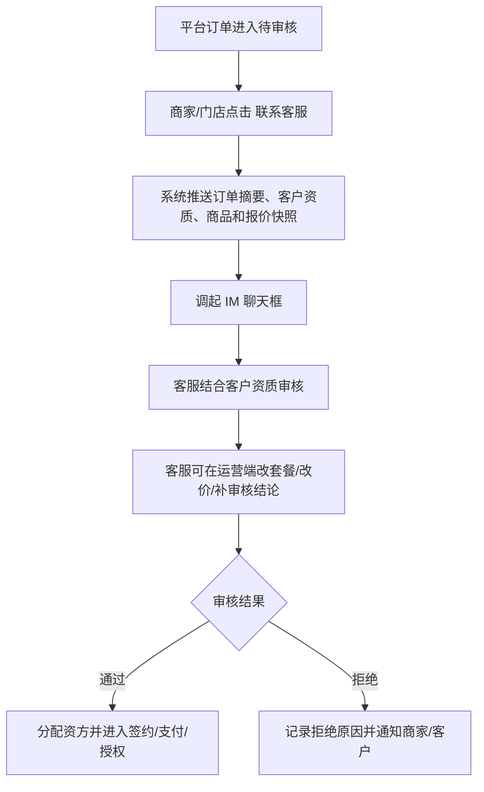

# 重构决策记录

> 本文记录从旧系统实测、商家/门店端走查和业务讨论中确认的新系统规则。页面级 PRD 必须优先遵守本文，再参考旧系统页面表现。

## 1. 系统边界

```text
中控台
├─ 独立于租赁系统
├─ 管第三方接口产品、Token、Secret、接口条数、扣费、调用日志
└─ 对租赁系统提供统一 API

租赁系统
├─ 管订单、商品、商家/门店、办单助手、账单、分账、钱包、客服审核
├─ 自己决定业务流程中何时调用中控台接口
└─ 可把从中控台购买的接口条数分配给下属商家/门店使用
```

中控台的客户是租赁系统或平台项目，不是每个门店。租赁系统内部可以按商家/门店记录接口使用成本和条数分配，但这属于租赁系统内部账，不应和中控台客户模型混在一起。

## 2. 端与主体

```text
运营平台 = 总后台
商家 PC 端 = 商家经营后台
门店手机端 = 商家移动工作台
```

商家 PC 端和门店手机端是同一商家主体的两个端。门店完成入驻后即成为商家主体，可以使用 PC 端管理商品和经营配置，也可以使用手机端现场办单和处理待办。

## 3. 订单类型

新系统统一使用三类订单：

| 订单类型 | 定义 | 审核主体 | 发货主体 | 资金/分账 |
|---|---|---|---|---|
| 门店订单 | 门店自有订单，门店自己经营 | 门店/商家 | 默认门店发货 | 门店收入，平台按配置抽佣 |
| 分红订单 | 门店出设备或部分资金，资方补足剩余资金 | 运营平台审核并分配资方 | 默认门店发货 | 门店和资方按出资比例分账，平台分别抽佣 |
| 平台订单 | 原低费率订单，门店发起，平台/资方全额出资 | 运营平台审核并分配资方 | 默认门店发货，可走线上物流 | 资方收入，平台抽佣 |

旧系统中的 `低费率订单` 在新系统中统一改名为 `平台订单`。旧文档中保留低费率实测记录时，必须标注这是旧名称。

## 4. 平台抽佣

默认平台服务费率为 2%，支持运营后台按全局、商家、资方、订单类型或单笔订单调整。

分账顺序按“先拆份额，再分别扣服务费”：

```text
客户每期还款
→ 按订单快照中的出资比例拆成门店份额和资方份额
→ 分别从门店份额、资方份额扣平台服务费
→ 扣后入门店钱包和资方账户
→ 平台服务费入平台收入
```

示例：

```text
客户某期还款 1000
资方出资比例 80%，门店出资比例 20%
平台服务费率 2%

资方原始份额 = 800
门店原始份额 = 200
资方服务费 = 16
门店服务费 = 4
资方入账 = 784
门店入账 = 196
平台收入 = 20
```

## 5. 分红订单

分红订单 = 门店出设备或部分资金，资方补足剩余资金，收益按比例分成。

```text
设备价 5000
门店选择需求配资比例 80%
资方出资 = 5000 * 80% = 4000
门店出资 = 5000 - 4000 = 1000
资方收益占比 = 80%
门店收益占比 = 20%
```

分红订单办单助手必须支持配资比例下拉：

```text
20% / 30% / 40% / 50% / 60% / 70% / 80%
```

配资比例、设备价、门店出资额、资方出资额、分账比例必须进入订单快照。订单生成后，除有权限的运营人员执行改价/重审流程外，不得直接覆盖历史快照。

## 6. 平台订单与 IM 客服

门店手机端可以发起平台订单，商家 PC 端可以查看自己发起的平台订单进度。平台订单的审核、资方分配和财务主控都在运营端。

平台订单待审核列表需要支持联系客服：



IM 对接属于后续接口能力，但 PRD 需要保留入口、推送字段、客服操作权限和操作日志。

## 7. 办单助手

门店手机端办单助手固定三入口：

```text
办单助手
├─ 门店订单
├─ 分红订单
└─ 平台订单
```

底层使用同一套计算器引擎，但配置来源不同：

| 办单类型 | 配置来源 | 审核主体 | 说明 |
|---|---|---|---|
| 门店订单 | 商家后台 | 商家自己 | 商家配置商品、费率、增值服务 |
| 分红订单 | 运营后台 | 运营平台 | 平台配置商品、费率、配资比例、增值服务 |
| 平台订单 | 运营后台 | 运营平台 | 平台配置商品、费率、增值服务 |

## 8. 惠讯租计算器标准

办单助手 UI 和计算逻辑以 `joezjyan-bot/calculator/phone-rent` 为基准，不沿用旧系统的办单助手逻辑。

已确认的计算器输入：

```text
产品分类：手机 / 电动车
成色：二手 / 全新
设备型号
存储容量
设备价格
首付比例
租期
设备管理费
赋强公证
```

已确认的配置项：

```text
价格表：pricing.json
费率表：rates.json
首期租金：first_period_rent
设备管理费选项：device_fee_options
公证费：默认 80，可后台配置
```

核心公式：

```text
首付金额 = 设备价格 * 首付比例
未付金额 = 设备价格 - 首付金额
后续应还总额 = 未付金额 * 费率
后期月付 = 后续应还总额 / (期数 - 1)
押金 = 首付金额 - 首期租金
首期实付 = 押金 + 首期租金 + 设备管理费 + 公证费
留购总价 = 押金 + 全部期数租金总和
```

办单助手生成的报价必须同步到订单：

```text
商品价格快照
押金
首期实付
后期账单
设备管理费
公证费
增值服务
留购价
配资比例
分账比例
二维码下单记录
```

## 9. 商品管理

运营后台 `商品审核` 应重构为 `商品管理`，包含平台商品、商家商品和商品审核。

```text
商品管理
├─ 平台商品库
│  ├─ 新增/编辑商品
│  ├─ 复制商品到商家
│  ├─ 配置全新/二手等规格
│  ├─ 配置增值服务
│  └─ 是否同步到办单助手
├─ 商家商品
│  ├─ 商家自行添加
│  ├─ 商家选择是否同步到门店办单助手
│  └─ 提交运营审核
└─ 商品审核
   ├─ 审核商家新增
   ├─ 审核商家修改
   └─ 审核上下架或敏感价格变更
```

`全新`、`二手`不能作为互斥商品类型，而应作为同一个商品下的规格/成色。一个商品可同时拥有全新和二手规格，同步到办单助手时只同步已启用规格。

## 10. 发货模式

新系统默认经营模式为门店发货。

```text
默认：门店发货
保留：线上物流/顺丰发货/平台发货接口
```

订单详情、审核、物流、售后和财务文档都必须按默认门店发货设计，再保留线上发货扩展。

## 11. 钱包与配资充值

商家/门店不作为资方，先取消门店手机端配资充值。

门店钱包保留：

```text
订单收益
分账收入
佣金/奖励
提现
对账明细
变动明细
```

如后续允许“商户型资方”，应纳入资方管理或新增出资商户身份，不放在普通门店钱包。

## 12. 渠道管理

渠道管理新增渠道推广链路：

```text
渠道管理
├─ 新增渠道
├─ 渠道推广码/二维码
├─ 扫码跳转门店注册入驻页
├─ 渠道 H5 数据后台
│  ├─ 入驻商家数量
│  ├─ 分红订单统计
│  ├─ 平台订单统计
│  ├─ 在租/逾期/完成统计
│  ├─ 佣金明细
│  └─ 提现记录
└─ 运营平台配置佣金规则
```

渠道只统计分红订单和平台订单，不统计门店自营订单。

## 13. 保留与新增模块

| 模块 | 决策 |
|---|---|
| 租后管理 | 保留，后期对接外部逾期系统，支持导入已逾期订单 |
| 营销管理 | 删除优惠券、大礼包等近期范围；保留客诉管理 |
| 客诉管理 | 对接支付宝投诉接口，拉取投诉、处理、上传凭证、记录日志 |
| 黑名单库 | 新增，支持脱敏/哈希存储姓名、身份证、手机号，审核命中弹窗 |
| 监管锁配置 | 新增，后期对接自研监管锁，订单内可锁机/解锁/查状态 |
| 操作日志 | 全系统强制，人工、系统、回调、改价、审核、分账、发货、锁机均可追溯 |

## 14. 数据互通原则

页面不是孤立功能。所有端和模块必须围绕同一套核心数据模型：

```text
商家/门店
商品
办单报价
订单
客户
合同
支付
账单
物流
资方
分账
钱包
提现
客诉
租后
操作日志
```

办单助手的报价快照要进入订单、账单、财务和结算；资方分配要进入资方订单、资方账单和分账；客诉要关联订单、客户、商家和支付流水；监管锁操作要关联设备和订单。

## 15. UI 交付要求

后续页面级 PRD 不只给文字流程图，还需要完整 UI 截面图。每个核心页面至少包含：

```text
完整页面线框/高保真参考
页面内字段说明
按钮点击后的目标页面/弹窗箭头
成功/失败/空状态
高风险确认弹窗
权限差异状态
移动端与 PC 端适配说明
```

UI 图应以真实页面布局为准，箭头只标注跳转和弹窗关系，不替代页面本身。

## 16. 待确认问题

1. 平台订单在商家 PC 端展示到什么深度：只看进度，还是可查看完整审核、签约、支付、资方信息。
2. IM 客服对接的产品形态：内置客服、企业微信、第三方客服系统，或先抽象接口。
3. 分红订单发生退款、提前结清、退货、买断时，门店和资方分账如何反向处理。
4. 平台服务费率是否支持按门店订单、分红订单、平台订单分别配置默认值。

