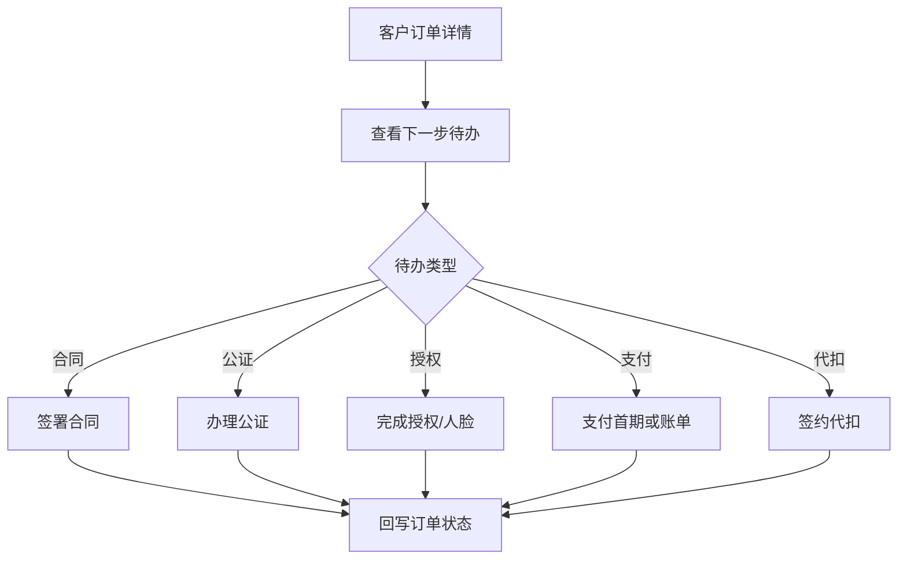

# 合同公证支付操作页

> **Stage 6 术语同步(2026-05-27)**: 本文档已按 Stage 6 统一为商家、联营、平台订单、订单结算款、我的钱包、履约中、逾期费用、留购、保证金等展示术语；数据库字段、API 路径、英文枚举保持不变。

> 页面级 PRD 草案。
> 目标：把客户下单后的合同签署、公证办理、授权、代扣签约、账单支付集中成可理解的操作路径，减少客服反复解释。

---

## 1. 页面说明

| 项 | 内容 |
|---|---|
| 页面名称 | 合同公证支付操作页 |
| 所属端 | C 端小程序/H5/APP |
| 入口路径 | 订单详情 > 待办任务 |
| 使用角色 | C 端客户 |
| 核心目标 | 完成签署、授权、公证、支付、代扣绑卡等订单前置动作 |

---

## 2. 核心口径

1. 客户所有动作都从订单详情进入，保持订单上下文。
2. 系统根据后台链路配置生成下一步待办。
3. 待办完成后自动回写订单状态。
4. 失败、过期、拒签、支付处理中都要给客户明确提示。
5. 客户侧不展示后台内部审核、平台抽佣、商家接口计费等后台信息。

---

## 3. 操作路径

---

## 4. 待办卡片

| 字段 | 说明 |
|---|---|
| 待办名称 | 签署合同、办理公证、支付首期、签约代扣等 |
| 当前状态 | 待处理、处理中、已完成、失败、过期 |
| 截止时间 | 如有 |
| 金额 | 支付或公证费用时展示 |
| 操作按钮 | 去签署、去办理、去支付、去授权 |
| 失败原因 | 摘要 |
| 客服入口 | 联系客服 |

---

## 5. 支付页

| 字段 | 说明 |
|---|---|
| 支付场景 | 首期、账单、部分支付、留购、补款 |
| 应付金额 | 当前应付 |
| 已付金额 | 部分支付时展示 |
| 剩余金额 | 未结清时展示 |
| 费用明细 | 租金、保证金、服务费、公证费、增值服务 |
| 支付方式 | 按后台配置 |
| 支付状态 | 待支付、处理中、成功、失败 |

支付成功后进入支付记录；支付处理中不允许重复点击导致重复付款。

---

## 6. 代扣签约页

| 字段 | 说明 |
|---|---|
| 签约说明 | 展示账单代扣用途 |
| 银行卡/账户 | 脱敏展示 |
| 签约状态 | 未签、签约中、已签、失败、解绑 |
| 失败原因 | 摘要 |
| 操作 | 去签约、重新签约、联系客服 |

代扣签约状态回写订单链路，未完成时按配置阻断发货或起租。

---

## 7. 合同与公证页

| 模块 | 字段 |
|---|---|
| 合同 | 合同名称、签署主体、状态、查看、签署 |
| 补充合同 | 触发原因、变更摘要、状态 |
| 公证 | 公证事项、费用、状态、办理入口 |
| 授权 | 信用评估/征信授权、人脸、报告授权状态 |

客户完成后展示完成状态；失败或过期时展示重试或联系客服入口。

---

## 8. 异常提示

| 场景 | 提示 |
|---|---|
| 合同过期 | 合同已过期，请联系客服或等待重新发起 |
| 支付失败 | 支付未完成，可重新支付 |
| 支付处理中 | 请稍后刷新，不要重复支付 |
| 公证失败 | 办理失败，请重新办理或联系客服 |
| 授权失败 | 授权未完成，请重试 |
| 订单关闭 | 订单已关闭，待办不可继续处理 |

---

## 9. 数据联动

| 模块 | 联动 |
|---|---|
| 订单详情 | 待办状态和下一步动作 |
| 财务管理 | 支付、部分支付、账单、退款 |
| 合同公证 | 合同、公证、授权状态 |
| 消息待办 | 待办生成、超时、重发 |
| 操作日志 | 客户操作、回调、失败原因 |
