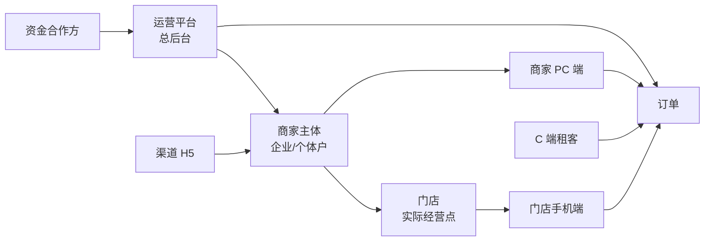

# 02 三端模块地图

> [历史参考 / V0.2.2 口径覆盖] 本文为早期三端模块地图,保留用于理解系统范围。若本文出现“门店订单 / 分红订单 / 受让 / 资方”等旧口径,以 `00_V0.2.2_开发冻结版总PRD.md`、`docs/V0.2.2_P0_FIXUP_TASK.md`、`modules/全局/02_状态字典与订单状态机.md` 为准。
> V0.2.2 正式展示口径为:商家订单 / 联营订单 / 平台订单;内部资金来源不得在 C 端、商家端、合同和客服话术中暴露。

> 本文用于统一系统范围。后续页面级 PRD、菜单权限、接口拆分、数据库建模都按本文拆模块。

---

## 1. 端与主体关系

核心结论:

- 运营端是总后台。
- 商家 PC 端和门店手机端是同一主体的两个操作入口。
- 门店手机端不是独立业务主体,而是商家/门店的移动工作台。
- 渠道端只看自己推广带来的入驻和订单统计。
- 资方端先以只读看板为主,**仅后台,客户侧不暴露**。

---

## 2. 运营端模块地图

| 一级模块 | 二级模块 | 核心职责 | V0.2 调整 |
|---|---|---|---|
| 工作台 | 数据看板、待办、预警 | 平台全局运营入口 | 保留,后续按财务中台风格重画 |
| **前台配置中心** ⭐ 新增 | 业务线/Tab、装修(安心用)、装修(体验租)、Banner/素材库、品类导航、弹窗公告、客群分组、版本灰度 | C 端所有展示元素的集中配置 | V0.2 新增一级模块,详见 `modules/运营端/前台配置中心/*`;城市与门店开通**不在此模块**,见店铺管理 |
| 订单管理 | 全部订单、门店订单、分红订单、平台订单、关闭/退货、留购、续租、逾期未归还、电审订单 | 全平台长租订单主控 | 三类长租订单归属安心用;**C 端用户感知统一为"平台审核",后台按类型分流** |
| 体验租管理 | 短租商品、短租价格方案、车辆库存、短租订单、取车核销、还车验收、押金扣款、控车日志 | 短租独立业务主控 | 与安心用并列,不混入三个长租办单助手;门店开通迁移到店铺管理 |
| 商品管理 | 平台商品、商家商品、商品审核、商品复制、规格、增值服务、同步办单助手、长租配置 | 商品全生命周期 | 基础商品可共享;安心用配置和体验租配置分页签维护;体验租商品启用后**商品标准名/车型编号锁定** |
| 库存设备管理 | 设备档案、唯一设备码、仓库、出入库、锁定、出租、归还验收、维修下架 | 体验租履约和库存主控 | 当前长租不走库存;体验租必须走车辆/设备库存;设备 9 状态见 `modules/全局/02_状态字典与订单状态机.md` |
| 店铺管理 | 入驻审核、店铺资料、采购账户、签章授权、员工账号、**商家入驻业务线勾选**、**门店开通与城市管理** | 商家/门店资质和账号;城市/门店开通 | V0.2 新增:商家入驻可双选业务线;城市与门店开通从前台配置中心迁入本模块 |
| 资方管理 | 资方配置、资方订单、资方账单、资方用户、打款记录、资金账户 | 分红/平台订单资金侧 | **仅后台,客户侧不可见**;C 端任何位置不暴露"资方"字样 |
| 财务管理 | 钱包、提现、分账、对账、账单、押金、线下还款 | 钱的总账和明细 | 三类订单分账必须互通;**分账/抽佣不展示给客户** |
| 渠道管理 | 渠道新增、推广码、入驻统计、订单统计、佣金、提现 | 渠道推广与结算 | 新增渠道 H5 数据看板 |
| 佣金管理 | 门店抽佣、渠道佣金、平台服务费、分红比例 | 佣金规则配置 | 门店订单默认 2%,可调;**仅后台** |
| 客诉管理 | 支付宝投诉同步、投诉处理、处理记录 | 客诉闭环 | 从营销管理中保留出来 |
| 租后管理 | 逾期导入、催收、处置、外部系统对接 | 租后风险管理 | 先建模块,后接外部系统 |
| 黑名单库 | 黑名单导入、脱敏匹配、命中提示 | 审核辅助 | 后期对接外置黑名单 |
| 监管锁管理 | 设备锁配置、锁机/解锁日志、厂商密钥 | 设备控制 | 后期接自研监管锁 |
| 配置管理 | 费率、套餐、长租租期、链路配置中心、增值服务、合同模板、审核策略、商品同步规则、体验租周期 | 平台规则中心(业务配置) | 体验租周期和押金规则在体验租模块下独立配置;**UI 装修不在此模块**,在前台配置中心 |
| 客服中心 | IM 会话、工单、客服分组、外呼记录 | 客服总入口 | 与 C 端"客服" Tab 联动 |
| 权限管理 | 角色、账号、菜单、操作权限 | 平台人员权限 | 所有敏感操作需日志 |
| 日志审计 | 操作日志、系统日志、回调日志、改价日志 | 可追溯 | 全系统强制保留 |

---

## 3. 商家 PC 端模块地图

商家 PC 端用于商家老板或管理人员。**菜单显隐依赖入驻时勾选的业务线**(详见 `modules/运营端/店铺管理/03_商家入驻业务线勾选.md`)。

| 一级模块 | 业务线 | 核心功能 | 权限边界 |
|---|---|---|---|
| 工作台 | 共享 | 自己门店订单、分红订单、平台订单进度、体验租待办、待办、经营数据 | 只看自己主体数据 |
| 商品管理 | 共享(分页签) | 添加商品、自定义规格组、SKU 价格、长租适配、是否同步办单助手、增值服务;**体验租商品/车型独立页签** | 商品提交后由运营审核 |
| 体验租 | 仅体验租商家可见 | 体验租订单、车辆/设备、短租价格方案、押金扣款、控车 | 只看本商家/本门店有权限的数据 |
| 设备库存 | 仅体验租 | 体验租设备档案、设备码、入库、锁定、出租、归还验收、维修下架 | 仅体验租使用;长租不走库存 |
| 门店订单 | 仅安心用商家可见 | 自有订单列表、审核、改价、发货、售后 | 门店订单可自审 |
| 分红订单 | 仅安心用商家可见 | 查看发起订单、审核进度、资方分配结果、分账明细 | 审核主控在运营端 |
| 平台订单 | 仅安心用商家可见 | 查看自己发起的平台订单进度、联系客服 | 审核/资方/财务主控在运营端 |
| 财务钱包 | 共享 | 可提现余额、冻结金额、流水、提现申请、对账 | 不可查看其他商家;提现和提现账号修改分开授权;**长租钱包/体验租钱包独立账户但合并展示** |
| 员工管理 | 共享 | 新增员工、分配手机号密码、启停、权限 | 老板/管理员可操作;可给财务员工提现操作权限,但不能提现账号修改权限 |
| 门店资料 | 共享 | 营业执照、法人、地址、门头、收款账户、签章授权、**业务范围(可申请新增业务线)** | 关键资料变更需运营审核 |
| 配置管理 | 共享 | 门店订单费率、增值服务、办单助手配置、体验租价格方案 | 只影响本商家 |
| 客服/工单 | 共享 | 平台订单联系客服、订单咨询 | 绑定订单上下文 |

商家 PC 端不做:

- 资方分配
- 平台订单审核
- 分红订单最终审核
- 全平台商品审核
- 全平台财务总账
- 渠道佣金配置
- C 端 UI 装修(在运营端前台配置中心)

---

## 4. 门店手机端模块地图

门店手机端是商家/门店的移动工作台。

| 模块 | 业务线 | 页面/入口 | 核心功能 |
|---|---|---|---|
| 登录 | 共享 | 门店登录 | 手机号、密码、短信验证码、协议勾选、登录保持 |
| 入驻 | 共享 | 立即入驻 | 注册、资料上传、OCR、地图地址、收款账户、e签宝授权、**业务线勾选** |
| 首页/待办 | 共享 | 门店管理首页 | 待审核、待签约、待支付、待发货、待处理任务、体验租待办 |
| 办单助手 · 门店订单 | 仅安心用商家 | 门店订单 | 使用商家配置,扫码生成门店自营订单 |
| 办单助手 · 分红订单 | 仅安心用商家 | 分红订单 | 使用运营配置,选择配资比例,提交平台审核 |
| 办单助手 · 平台订单 | 仅安心用商家 | 平台订单 | 使用运营配置,提交平台审核,支持联系客服 |
| 体验租待办 | 仅体验租商家 | 短租订单 | 待接单、待取车、已取车、待还车、押金待处理 |
| 设备管理 | 仅体验租商家 | 体验租设备 | 车辆库存维护;长租门店不展示库存入口 |
| 订单 | 共享 | 我的订单 | 按业务线查看进度 |
| 钱包 | 共享 | 我的钱包 | 收益、提现、流水;员工账号按老板授权展示,不能提现账号修改 |
| 员工账号 | 共享 | 员工登录 | 默认只可办单和查看待办;可被授权体验租接单/核销/还车/有限财务操作 |
| 我的 | 共享 | 门店资料、账号设置、退出登录 | 管理基础信息 |

门店手机端**不保留**:

- 普通门店资金充值入口
- 长租办单助手中不显示体验租入口
- 体验租待办中不显示长租入口

门店手机端**新增/保留**:

- 同一手机登录保持
- 员工受限账号
- 扫码下单
- 平台订单联系客服
- 业务线菜单隔离(安心用 vs 体验租)

---

## 5. C 端模块地图

### 5.1 底部导航(V0.2 关键调整)

**C 端底部 Tab 固定为 4 个**(决策日期 2026-05-25):

| Tab | 业务线编码 | Tabler 图标 | 核心内容 |
|---|---|---|---|
| 安心用 | `assurance_rent` | `ti-shield-check` | 长租入口:分类、商品列表、商品详情、扫码办单、订单中心(长租分类筛选) |
| 体验租 | `experience_rent` | `ti-sparkles` | 短租入口:城市、品类、附近门店(列表/地图)、车型、短租方案;**门店详情可切长短租 Tab** |
| 客服 | `customer_service` | `ti-headphones` | 客服 IM、工单、常见问题、反诈提醒 |
| 我的 | `my_account` | `ti-user` | 账户中心 + **订单中心**(长租/体验租合并展示,Tab 筛选) |

**变更说明**:
- 去掉了原"首页"独立 Tab(综合首页融入"安心用"作为长租门户)
- 去掉了原"订单"独立 Tab,订单中心移到"我的"页面下(顶部 Tab 筛选长租/体验租)
- 客户感知统一为"平台",任何位置不暴露门店订单 / 分红订单 / 平台订单等内部分类

**默认进入 Tab**:**安心用**(冷启动落地)。

**Tab 图标规范**:
- 使用 Tabler Outline 线性图标库
- **禁止使用品类绑定图标**(摩托/单车/手机等)— 体验租未来会扩品类
- 选中态:深蓝 `#1E3A8A` + `font-weight: 500`
- 未选中态:灰 `#94A3B8`

详见 `modules/C端/01_C端视觉规范.md` §6.1。

### 5.2 C 端核心页面

| 模块 | 核心功能 | 数据来源 |
|---|---|---|
| 安心用首页/分类 | 浏览长租可租商品 | 运营/商家同步的长租商品 + 前台配置中心装修配置 |
| 安心用商品详情 | 规格、套餐、费用、留购价、增值服务 | 商品库 + 办单助手价格方案 |
| 安心用订单流程 | 选规格 → 订单确认 → 实名 → 风控 → 合同 → 公证 → 支付 → 发货 → 在租 | 长租订单状态机 |
| 安心用扫码下单 | 扫办单助手二维码进入订单 | 办单助手生成的锁价方案 |
| 体验租首页 | 城市、品类、附近门店(默认列表 + 地图模式切换)、租赁周期 | 体验租商品、门店经纬度、车辆库存 + 前台配置中心 |
| 体验租门店详情 | 门店信息 + **长租/短租双 Tab**(若双业务线均开通) | 店铺管理(门店业务线开通)+ 装修配置 |
| 体验租订单流程 | 选门店 → 选车型 → 选方案 → 骑行人 → 人脸 → 支付 → 取还车 | 体验租订单状态机 + 车辆库存 |
| 我的 / 订单中心 | 长租待办、体验租待办、还款、续租、留购、归还、取车、还车 | 订单/账单/体验租状态(分业务线 Tab 筛选) |
| 我的 / 账户中心 | 实名、授权、地址、骑行人、协议、设置 | 客户基础数据 |
| 客服 Tab | IM 会话、常见问题、反诈提示 | 客服中心 |
| 全局组件 | 反诈提醒条、定位授权弹窗、协议中心 | 前台配置中心(弹窗/公告) |

**C 端业务线边界**:
- 安心用和体验租**共享**:登录、实名、人脸、协议中心、客服 IM、钱包底座、订单中心
- 安心用和体验租**独立**:商品配置、价格方案、库存模型、订单状态机、履约路径、押金规则

---

## 6. 渠道端模块地图

| 模块 | 核心功能 |
|---|---|
| 登录 | 渠道账号登录 |
| 推广码 | 查看/下载推广码,扫码跳转门店入驻 |
| 入驻统计 | 推广入驻商家数量、审核状态 |
| 分红订单统计 | 订单数量、金额、状态、逾期、在租 |
| 平台订单统计 | 订单数量、金额、状态、逾期、在租 |
| 佣金明细 | 订单维度佣金、结算状态 |
| 提现 | 提现申请、提现记录 |

不统计:

- 门店订单,因为门店自营与渠道佣金无直接关系。

---

## 7. 资方端模块地图

资方端先做只读看板,不做复杂运营。**仅供后台合作机构使用,客户侧绝对不可见**。

| 模块 | 核心功能 |
|---|---|
| 登录 | 资方账号登录 |
| 工作台 | 资金余额、待回款、逾期预警 |
| 我的订单 | 被分配的分红/平台订单 |
| 账单 | 应收、已收、逾期 |
| 资金账户 | 授信记录、出资记录、回款记录、提现记录 |
| 提现申请 | 提交后由运营审核 |

---

## 8. 数据互通要求

系统不能只做菜单和页面,必须保证模块间数据贯通。

| 数据 | 产生模块 | 消费模块 |
|---|---|---|
| 商品规格 | 运营/商家商品管理 | 办单助手、C 端商品详情、订单 |
| 商品标准名/车型编号 | 商品管理 | 体验租价格方案、车辆库存、订单快照、统计;**启用体验租后锁定** |
| 入驻资料 | 门店入驻 | 运营端店铺审核、商家档案、签章授权、财务钱包 |
| **业务线勾选** | 商家入驻/追加 | 商家菜单显隐、门店开通范围、C 端门店详情 Tab |
| **门店业务线开通** | 店铺管理 | C 端门店详情 Tab 显隐、C 端附近门店列表过滤 |
| **门店经纬度** | 店铺管理 | C 端附近门店查询、导航到店 |
| **城市开通** | 店铺管理 | C 端城市切换列表、Tab 显隐城市级覆盖 |
| **UI 装修配置** | 前台配置中心 | C 端所有展示元素(Tab/Banner/楼层/弹窗/品类) |
| **客群归属** | 前台配置中心 | C 端 Banner/推荐位/弹窗的定向投放 |
| 长租租期/价格配置 | 配置管理 | 商品规格、办单助手、订单、账单、财务 |
| 链路配置 | 配置管理 | 订单、支付、合同、风控、发货、财务、办单助手、操作日志 |
| 设备库存(9 状态) | 库存设备管理 | 体验租下单、订单交付、归还验收、监管锁 |
| 价格方案 | 办单助手/体验租价格方案 | C 端下单、订单详情、财务分账 |
| 订单 | C 端/门店端/商家端 | 审核、合同、支付、财务、客服、渠道 |
| 审核结论 | 门店/运营 | 合同、支付、订单状态、IM |
| 资方分配 | 运营端 | 财务、资方端、订单详情(**不暴露 C 端**) |
| 账单 | 订单/支付 | 财务、钱包、渠道、资方 |
| 分账 | 财务规则 | 门店钱包、资方账户、平台收益、渠道佣金(**不暴露 C 端**) |
| 投诉 | 支付宝投诉接口 | 客诉管理、订单详情 |
| 黑名单命中 | 黑名单库 | 审核弹窗、订单风险记录 |
| 监管锁动作 | 订单/租后 | 设备状态、操作日志 |
| 体验租车辆 | 体验租库存 | C 端可租列表、门店核销、中控控车、押金验收 |
| 体验租订单 | C 端/门店端/运营端 | 押金、退款、控车、对账、操作日志 |
| 控车日志 | 中控台 | 订单详情、异常处理、租期到期控制、审计 |
| 操作日志 | 所有模块 | 审计、风控、客服追溯 |

---

## 9. 修订记录

| 日期 | 版本 | 修订 |
|---|---|---|
| 2026-05-24 | v0.2.0 | 初版三端模块地图 |
| 2026-05-25 | v0.2.1 | 1. 运营端新增"前台配置中心"一级模块;2. 店铺管理新增"商家入驻业务线勾选"+"门店开通与城市管理";3. C 端底部 Tab 改为 4 个(安心用/体验租/客服/我的),订单合并到我的;4. 商家 PC/门店手机端菜单按业务线勾选动态显隐;5. 数据互通补充业务线勾选、门店开通、UI 装修、客群归属、控车日志 |
