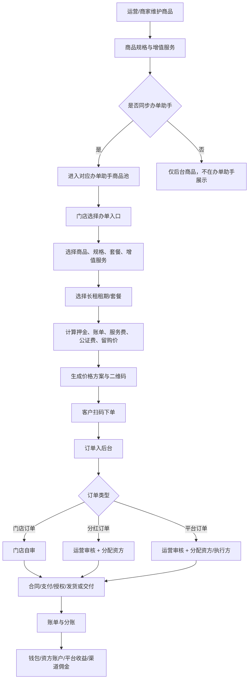
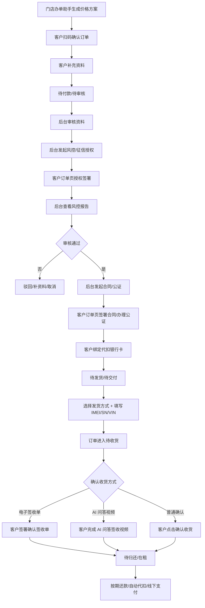

# 03 商品、办单助手、订单核心链路

> [历史参考 / V0.2.2 口径覆盖] 本文为早期核心链路整理,保留用于追溯办单助手结构。V0.2.2 已将一期范围、订单命名、结算三条件、退款责任、四账分离、C 端敏感字段隔离和权限审计收口到 `00_V0.2.2_开发冻结版总PRD.md`、`modules/运营端/订单管理/08_长租订单全生命周期与客服操作.md`、`modules/运营端/财务管理/06_财务流水模型与对账规则.md`。
> 若本文出现“门店订单 / 分红订单 / 资方账户 / 配资 / 分配资方”等旧口径,开发不得直接采用;展示层统一为商家订单 / 联营订单 / 平台订单,资金侧统一解释为内部资金来源。

> 这是 V0.2 最优先落地的主链路。商品、办单助手和订单模型不定准，后续审核、合同、支付、财务、渠道、租后都会跑偏。

---

## 1. 总流程

---

## 2. 商品模型

### 2.1 商品基础信息

| 字段 | 说明 | 备注 |
|---|---|---|
| 商品名称 | 如 iPhone 17 Pro Max | 必填 |
| 品牌 | 苹果、华为、小米、九号等 | 必填 |
| 类目 | 手机、电动车、平板、手表等 | 必填 |
| 商品图片 | 主图、轮播图、详情图 | 必填 |
| 商品卖点 | 展示文案 | 可选 |
| 所属主体 | 平台商品 / 商家商品 | 必填 |
| 审核状态 | 草稿、待审核、已通过、已驳回、已下架 | 必填 |
| 是否可复制给商家 | 平台商品专用 | 可选 |
| 适用租赁模式 | 当前办单助手展示长租；短租后续以独立需求包嫁接 | 必填 |

### 2.2 商品规格

规格不写死。系统支持运营或商家自定义规格组和规格值，`全新`、`二手` 只是“设备成色”这个规格组下的可选值。

| 字段 | 说明 | 示例 |
|---|---|---|
| 规格组 | 自定义规格分类 | 设备成色、颜色、容量、电池 |
| 规格值 | 自定义规格选项 | 全新、二手、白色、黑色、256G、有电池 |
| 规格组合名称 | 由规格值组合生成或手填 | 全新 256G 黑色 |
| 设备指导价 | 办单助手计算基础 | 7999 |
| 押金规则 | 固定/比例/免押 | 20% |
| 库存 | 可租数量 | 10 |
| 适用租赁模式 | 当前办单助手展示长租；短租后续以独立需求包嫁接 | 短租不在第一版入口展示 |
| 计费单位 | 长租按期/月；短租小时/天/周后续独立定义 | 当前办单助手只展示长租可选项 |
| 是否启用 | 规格开关 | 是 |
| 是否同步办单助手 | 独立开关 | 是 |

规则：

- 商品可有一个或多个规格。
- 规格组和规格值由运营或商家手动添加，不允许写死为固定枚举。
- 新增规格组后，要同步到价格设定，按规格组合添加价格。
- 规格独立启停。
- 规格独立同步办单助手。
- 无价格配置的规格不可同步。
- 同步后，办单助手按规格展示可选项。
- 第一版办单助手只展示长租规格和长租套餐。
- 短租规格不在当前办单入口展示，也不在本版继续细化业务需求。
- 后续短租由公司内部人员完成完整需求包后嫁接进来；本系统只保留商品、设备、订单、账单、仓库和履约的后端扩展边界。

### 2.3 租赁模式与租期配置

租期必须可配置，不能固定成按月或按天。当前第一版办单助手只开放长租；短租不做当前需求细化，后续按独立需求包接入。

| 配置项 | 说明 | 示例 |
|---|---|---|
| 租赁模式 | 当前开放长租；短租后续独立接入 | 长租 |
| 计费单位 | 长租按期/月；短租后续独立定义 | 月 |
| 租期数量 | 可选数量 | 3、6、9、12 |
| 起租规则 | 立即起租 / 发货后起租 / 取车后起租 | 发货后起租 |
| 归还规则 | 到期归还 / 续租 / 留购 / 买断 | 到期归还/续租 |
| 是否要求设备识别码 | 长租发货/交付时填写；短租后续需求包定义库存设备 | 是 |
| 是否允许预约 | 短租后续需求包定义 | 是 |

长租配置示例：

- 模式：长租
- 单位：月
- 可选租期：3 期、6 期、9 期、12 期
- 起租规则：发货后或确认收货后起租

短租配置不在当前版本展开。后续如公司内部提供完整短租需求包，可嫁接的后端位置包括：

- 商品/规格：补充短租适配标记和计费单位。
- 设备库存：补充预约锁定、取还设备、超时、维修和回库规则。
- 订单模型：补充短租订单子类型、起止时间和计费快照。
- 账单模型：补充小时/天/周计费、押金、超时费和赔付费。
- 履约模型：补充取车/取机、归还验收、照片证据和异常处理。

第一版不在办单助手入口展示短租字段，也不展示小时租、天租、周租等选项。

### 2.4 短租设备库存和长租设备识别码

商品是展示和价格配置。设备库存主要服务短租。长租不需要提前建库存或扣库存，只需要在发货/交付节点填写设备识别码。

| 层级 | 作用 |
|---|---|
| 商品 | C 端/办单助手展示，例如“九号电动车长租” |
| 规格 | 价格和属性，例如“有电池/无电池”“全新/二手” |
| 设备库存 | 短租真实库存，由后续短租需求包定义 |
| 长租设备识别码 | 发货时填写，例如 IMEI、SN、VIN |
| 仓库 | 设备当前所在门店/仓库 |

长租发货字段至少包括：

| 字段 | 说明 |
|---|---|
| imei / sn / vin | 手机、电动车等不同设备唯一识别 |
| delivery_method | 门店自提、门店配送、快递、顺丰线上发货、其他物流 |
| logistics_company / tracking_no | 快递发货时填写 |
| delivery_photos | 发货或交付照片，按配置必填 |

规则：

- 长租订单只在发货或门店交付时填写设备识别码。
- 短租锁定、预约、取还和回库规则由后续短租需求包定义，本版只保留设备状态扩展能力。
- 长租不使用短租设备状态，不显示在库可租、已锁定、出租中、归还待验等库存状态。
- 监管锁不是这里的编号字段，监管锁操作在订单列表/订单详情和监管锁模块中按接口配置执行。

### 2.5 增值服务

增值服务可以由运营端或商家端维护。

| 归属 | 使用范围 |
|---|---|
| 运营端增值服务 | 分红订单、平台订单 |
| 商家端增值服务 | 门店订单 |

增值服务示例：

- 公证费
- 设备管理费
- 监管锁服务费
- 延保服务
- 意外保障
- 上门服务

每项增值服务需要配置：

- 名称
- 金额/比例
- 是否必选
- 是否可修改
- 是否计入首期
- 是否计入账单
- 是否可退
- 适用订单类型
- 适用商品/类目

---

## 3. 商品同步规则

### 3.1 运营商品同步给商家

运营端可以把平台商品复制给一个或多个商家。

操作流程：

1. 运营进入商品管理。
2. 筛选平台商品。
3. 点击 `复制给商家`。
4. 选择一个或多个商家。
5. 选择同步内容：基础信息、图片、规格、价格、增值服务。
6. 确认复制。
7. 商家商品库生成副本。

规则：

- 复制后商家可在权限范围内调整自己的价格、库存、是否同步门店办单助手。
- 平台后续更新原商品时，不自动覆盖商家已修改内容，除非运营选择 `强制同步`。
- 强制同步必须留操作日志。

### 3.2 商家商品提交审核

商家自己添加商品后，提交运营审核。

审核通过：

- 商品可在商家 PC 端展示。
- 如勾选同步办单助手，则进入门店订单办单助手商品池。

审核驳回：

- 必须填写驳回原因。
- 商家可修改后再次提交。

### 3.3 商品列表筛选

运营后台商品列表必须支持：

- 商品名称
- 品牌
- 类目
- 所属主体
- 商家
- 审核状态
- 上下架状态
- 是否同步办单助手
- 规格类型

默认不把所有商家商品混在一起展示，必须有清晰筛选。

---

## 4. 办单助手三入口

### 4.1 入口选择页

门店手机端进入办单助手后，先选择订单类型：

| 入口 | 展示文案 | 说明 |
|---|---|---|
| 门店订单 | 自有订单 | 门店自己审核、自己承担风险 |
| 分红订单 | 配资分红 | 门店出设备，资方补资金，收益按比例分 |
| 平台订单 | 平台订单 | 门店送单给平台，平台审核和匹配资方 |

点击后进入对应计算器。

### 4.2 门店订单办单助手

数据来源：

- 商家商品
- 商家规格
- 商家费率
- 商家增值服务

流程：

1. 选择类目。
2. 选择商品。
3. 选择规格。
4. 选择长租租期/套餐。
5. 填写或确认设备价。
6. 选择增值服务。
7. 计算价格。
8. 生成二维码。
9. 客户扫码下单。
10. 门店自审。

### 4.3 分红订单办单助手

数据来源：

- 运营同步商品
- 运营费率
- 运营增值服务
- 资方配置

额外字段：

- 配资比例：20%-80% 下拉选择
- 门店等效出资
- 资方出资
- 内部分账/收益预览

额外规则：

- 设备价是三个办单入口的共用字段，不是分红订单独有字段。
- 分红订单只比其他入口多 `配资比例` 和后台内部出资/收益测算。
- 客户看到的账单、报价、合同变量不得展示 `分红`、`分账`、`收益`、`配资比例`、`门店出资额`、`资方出资额` 等内部经营字段。
- 门店老板、商家 PC 端和运营后台可以看到预计收益、实际入账、资方份额和分账明细。

流程：

1. 选择商品和规格。
2. 选择长租租期/套餐。
3. 填写或确认设备价。
4. 选择配资比例。
5. 选择增值服务。
6. 生成价格方案。
7. 生成二维码。
8. 客户扫码下单。
9. 订单进入运营待审核。
10. 审核客服分配资方。
11. 进入合同、支付、授权、发货或交付流程。

### 4.4 平台订单办单助手

数据来源：

- 运营同步商品
- 运营费率
- 运营增值服务

流程：

1. 选择商品和规格。
2. 选择长租租期/套餐。
3. 填写或确认设备价。
4. 选择增值服务。
5. 生成价格方案。
6. 生成二维码。
7. 客户扫码下单。
8. 订单进入运营待审核。
9. 商家 PC 和门店手机端可查看进度。
10. 待审核列表可点击 `联系客服`，调起 IM 并推送订单信息。

---

## 5. 价格方案

价格方案由办单助手生成，并锁定到订单。

必须包含：

- 商品名称
- 规格
- 设备价
- 租赁模式：当前办单助手固定长租
- 长租租期/套餐
- 租期数量
- 起租时间和到期时间
- 首期实付
- 后期应付金额和计费周期
- 押金
- 服务费
- 公证费
- 设备管理费
- 其他增值服务
- 账单明细
- 留购价
- 生成时间
- 生效期限
- 操作人

分红订单内部价格快照另存：

- 需求配资比例
- 门店等效出资额
- 资方出资额
- 预计分账比例
- 预计收益

这些字段只给商家老板、商家 PC 端和运营后台查看，不进入客户侧账单、报价图、合同展示文案。

规则：

- 客户扫码下单后，订单读取该价格方案。
- 客服可改价，但改价必须产生新版本。
- 新旧价格方案都要保留，订单详情可追溯。
- 改价后需重新生成客户确认信息或重新签署必要协议。

---

## 6. 订单生成

### 6.1 订单来源

| 来源 | 说明 |
|---|---|
| C 端选品下单 | 客户自己浏览商品下单 |
| 办单助手扫码下单 | 门店生成二维码，客户扫码 |
| 渠道推广下单 | 渠道码进入后产生 |
| 运营后台代建 | 特殊场景，需权限和日志 |

### 6.2 订单关键字段

| 字段 | 说明 |
|---|---|
| order_type | 门店订单 / 分红订单 / 平台订单 |
| order_source | 下单来源 |
| merchant_id | 商家主体 |
| store_id | 门店 |
| channel_id | 渠道，可能为空 |
| product_id | 商品 |
| sku_id | 规格 |
| price_plan_id | 办单助手价格方案 |
| funding_ratio | 分红订单需求配资比例，客户侧不展示 |
| audit_owner | STORE / PLATFORM |
| funder_id | 资方，平台审核后确定 |
| service_items | 增值服务快照 |
| lease_mode | 当前办单助手固定长租；短租后续独立需求包接入 |
| billing_unit | 当前长租按期/月；短租后续独立定义 |
| lease_quantity | 租期数量 |
| lease_start_at / lease_end_at | 起租和到期时间 |
| device_identifier | 长租发货/交付时填写 IMEI/SN/VIN；短租后续需求包定义库存设备 |
| warehouse_id | 设备出库/归还仓库 |
| customer_profile_status | 客户资料状态：待填写 / 已完成 / 待补充 |
| risk_auth_status | 风控/征信授权状态 |
| face_verify_status | 人脸识别状态 |
| contract_status | 主合同签署状态 |
| supplement_contract_status | 补充合同签署状态 |
| notary_status | 公证状态 |
| deduct_card_bind_status | 代扣银行卡绑定状态 |
| delivery_owner | 发货主体：门店 / 商家 / 平台 / 资方 |
| delivery_method | 门店自提 / 门店配送 / 快递发货 / 顺丰线上发货 / 其他物流 |
| receipt_confirm_method | 普通确认 / 电子签收单 / AI 问答签收视频 |
| next_action | 当前最关键下一步待办 |
| status | 订单状态 |

### 6.3 审核归属

| 订单类型 | 审核人 | 可改价 | 可分配资方 |
|---|---|---|---|
| 门店订单 | 门店/商家 | 门店/商家 | 否 |
| 分红订单 | 运营客服 | 运营客服 | 是 |
| 平台订单 | 运营客服 | 运营客服 | 是 |

---

## 7. 分账模型

分账模型只进入运营后台、商家老板后台、资方账户、钱包流水和对账明细。客户侧订单、报价图、合同展示文案只展示客户应付、已付、待付、押金、服务费、公证费、留购价等租赁账单信息，不展示分红、配资、收益和各方出资比例。

### 7.1 门店订单

客户还款后：

1. 平台按配置抽佣，默认 2%。
2. 剩余进入门店钱包。
3. 流水记录订单、账单、抽佣比例、实际入账金额。

### 7.2 分红订单

客户每笔还款后：

1. 按出资比例拆分资方份额和门店份额。
2. 平台默认 2% 抽佣从双方份额分别扣除。
3. 扣除后进入资方账户和门店钱包。
4. 平台收益入平台账户。

示例：

- 客户还款 1000
- 门店占比 20%，资方占比 80%
- 门店份额 200，资方份额 800
- 平台抽佣 2%
- 门店实际入账 196
- 资方实际入账 784
- 平台抽佣收入 20

### 7.3 平台订单

客户还款后：

1. 平台/资方按配置获得主要回款。
2. 门店按固定佣金或比例获得推广/协作收益。
3. 渠道如存在，按渠道佣金规则计算。
4. 所有明细进入财务对账。

---

## 8. 客户下单、授权、签约与交付链路

合悦租物视频和无界租操作文档都说明：客户扫码下单后，很多动作不是一次性完成，而是由后台发起，再回到客户小程序订单页继续操作。

### 8.1 主链路

### 8.2 后台发起，客户小程序完成

| 后台动作 | 客户侧动作 | 回调结果 |
|---|---|---|
| 发起征信/风控授权签署 | 客户在订单页点击授权签署 | 授权完成/失败 |
| 发起合同签署 | 客户在订单页点击合同签署 | 合同已签署/签署失败 |
| 发起补充合同 | 客户在订单页签署补充合同 | 补充合同已签署/失败 |
| 发起公证 | 客户在订单页办理或确认公证 | 公证完成/失败 |
| 要求绑定银行卡 | 客户绑定代扣银行卡 | 绑定成功/失败 |
| 要求补资料 | 客户补充资料并提交 | 资料已补充/待复审 |

规则：

1. 后台发起后，客户订单页必须出现明确的待办入口。
2. 客户完成后，回调要更新订单状态、下一步待办和操作日志。
3. 回调失败不能直接吞掉，进入异常队列。
4. 人工改状态必须保留操作人、原因和前后状态。

### 8.3 下一步待办

订单列表和订单详情都要展示 `next_action`：

- 待客户付款
- 待审核资料
- 待发起授权
- 待客户授权签署
- 待查看风控报告
- 待审核通过
- 待发起合同
- 待客户签合同
- 待发起公证
- 待客户办理公证
- 待绑定银行卡
- 待发货
- 待客户确认收货
- 待签署确认签收单
- 待完成 AI 问答签收视频
- 待还款

### 8.4 线下支付

线下支付不能只改订单状态，必须生成财务记录：

1. 关联订单和账单。
2. 记录收款金额、凭证、操作人和操作时间。
3. 进入财务对账。
4. 进入操作日志。
5. 高风险场景需要财务复核。

### 8.5 公证服务

公证作为链路配置能力，不默认所有订单启用。

| 配置项 | 说明 |
|---|---|
| 是否启用公证 | 按订单类型、商户、商品配置 |
| 触发节点 | 审核通过后、合同签署前、合同签署后 |
| 客户操作入口 | 小程序订单详情展示 |
| 公证状态 | 未发起、已发起、办理中、完成、失败 |
| 公证费用 | 平台承担、商户承担、客户承担、计入套餐 |

---

## 9. 失败态与异常

| 场景 | 系统处理 |
|---|---|
| 商品无可用规格 | 办单助手不展示，后台提示补充规格 |
| 规格无价格 | 不允许同步办单助手 |
| 待交付设备识别码缺失 | 办单助手可出长租报价，但发货/交付前必须填写 IMEI/SN/VIN |
| 短租设备已被锁定 | 后续短租需求包处理设备不可用和重新选择 |
| 归还验收异常 | 订单进入归还异常；短租后续再联动设备库存 |
| 价格方案过期 | 客户扫码后提示方案已失效，需门店重新生成 |
| 客户资料不完整 | 停留在资料补充状态 |
| 疑似黑名单 | 审核弹窗提示，要求严格审核 |
| 资方余额不足 | 分红/平台订单不能继续分配或提示换资方 |
| 合同签署失败 | 订单停留待签约，记录失败原因 |
| 支付失败 | 订单停留待支付，保留支付失败记录 |
| 授权失败 | 订单停留待授权，允许重新发起 |
| 改价后未确认 | 不允许进入签约/支付 |
| 分账失败 | 财务异常队列，人工处理 |

---

## 10. 后续页面级 PRD 拆分

本链路后续应拆以下页面：

1. 运营端商品列表
2. 运营端商品新增/编辑
3. 运营端商品审核
4. 运营端复制商品给商家弹窗
5. 商家端商品列表
6. 商家端商品新增/编辑
7. 门店手机端办单助手入口页
8. 门店订单计算器页
9. 分红订单计算器页
10. 平台订单计算器页
11. 价格方案确认页
12. 二维码下单页
13. C 端扫码下单资料页
14. 运营端待审核列表
15. 订单详情页
16. 分账明细页
17. 运营端租赁模式配置页
18. 运营端设备库存管理页
19. 商家端设备库存管理页
20. 门店手机端设备交付/归还页
21. C 端扫码确认订单页
22. C 端授权签署页
23. C 端合同/公证办理页
24. 运营端订单详情页
25. 运营端线下支付确认页
