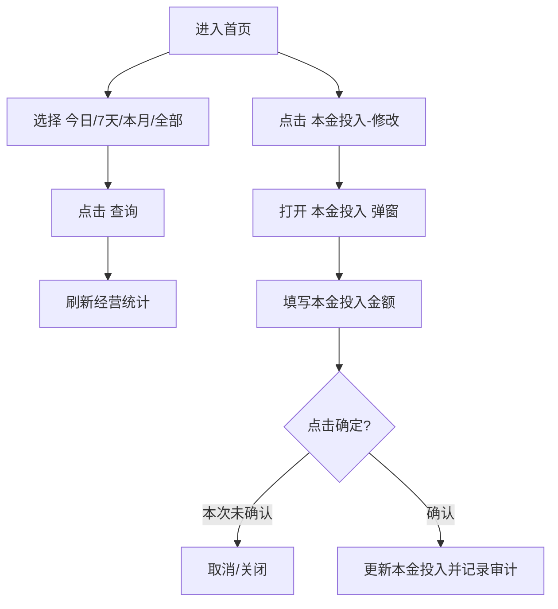

# 商家中心：首页

## 入口与路由

- 菜单路径：`首页`
- 路由：`/Index`
- 页面定位：商家经营概览，展示销售额、成本、押金、待收款和逾期分层。

## UI 结构

```text
首页
├─ 顶部账号区：登录账号 / 退出登录
├─ 销售额及成本
│  ├─ 时间快捷筛选：今日 / 7天 / 本月 / 全部
│  ├─ 日期区间：开始日期 ~ 结束日期
│  └─ 查询
├─ 核心指标卡
│  ├─ 总销售金额(元)
│  ├─ 采购价(元)
│  ├─ 本金投入(元) -> 修改
│  └─ 待收款统计 / 总待收款金额
├─ 收款与押金统计
│  ├─ 总销售金额
│  ├─ 总收押金
│  ├─ 待退还押金
│  ├─ 已收款金额
│  └─ 总收意外保障费
└─ 已收款统计
   ├─ 逾期T+10金额
   ├─ 逾期T+20金额
   └─ 逾期T+30金额
```

## 点击流程



## 控件与反馈

| 控件 | 点击结果 | 重构要求 |
|---|---|---|
| 今日 / 7天 / 本月 / 全部 | 切换统计时间范围，`7天`为实测默认选中 | 明确高亮状态，和日期区间互斥或同步 |
| 日期区间 | 打开日期选择器 | 限制最大查询跨度，避免大范围慢查询 |
| 查询 | 刷新当前统计 | loading、失败提示、空数据默认 0 |
| 本金投入 `修改` | 打开 `本金投入`弹窗 | 高风险财务字段，需权限和审计 |

## 弹窗：本金投入

```text
弹窗标题：本金投入
字段：本金投入金额，placeholder：请输入本金投入
按钮：取消 / 确定
```

## 状态与异常

- 金额类指标为空时展示 `0.00`，不要展示空白。
- 时间筛选和日期区间同时存在时，新系统需定义优先级。
- 本金投入修改失败时需保留原值，并提示失败原因。

