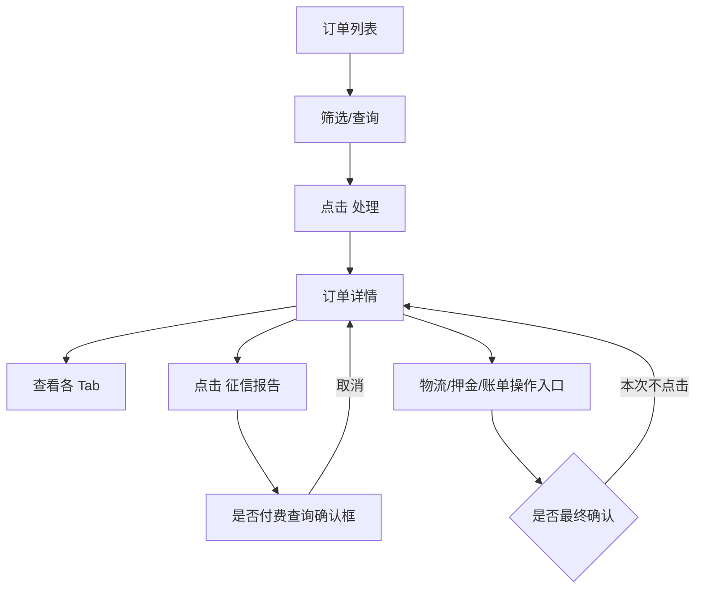

# 商家中心：订单管理

> 本模块记录商家端订单列表和订单详情。发货、关单、代扣、押金抵扣、上传等动作只记录入口，未做最终提交。

## 菜单结构

```text
订单管理
├─ 订单列表
├─ 逾期订单
├─ 到期未归还订单
├─ 买断订单
├─ 分红订单
├─ 门店订单
└─ 续租订单
```

## 页面：订单列表

- 路由：`/order/list` 一类商家端订单路由，旧系统 hash 路由按菜单切换。
- 页面作用：商家查看当前店铺订单，进入详情处理发货、备注、账单、物流、押金等。

### 查询区字段

| 字段 | 控件 | 旧系统占位/说明 | 重构要求 |
|---|---|---|---|
| 商品名称 | 输入/选择 | 商品名称 | 支持名称/编号搜索 |
| 下单人姓名 | 输入框 | 下单人姓名 | 脱敏显示，精确搜索需权限 |
| 下单人手机号 | 输入框 | 下单人手机号 | 支持后四位查询 |
| 收货人手机号 | 输入框 | 收货人手机号 | 支持后四位查询 |
| 下单人身份证号 | 输入框 | 身份证号 | 敏感查询需权限 |
| 订单编号 | 输入框 | 订单编号 | 精确查询 |
| 认领人 | 下拉 | 当前店铺员工 | 支持清空 |
| 创建时间 | 日期区间 | 开始日期 ~ 结束日期 | 限制跨度 |
| 订单状态 | 下拉/Tab | 与页面状态联动 | 状态、Tab、查询条件一致 |
| 用户评级 | 下拉 | 风控评级 | 字典化 |

### 操作按钮

| 操作 | 点击反馈 | 风险边界 |
|---|---|---|
| 查询 | 刷新列表 | 低风险 |
| 重置 | 清空筛选并刷新 | 低风险 |
| 导出 | 可能生成订单文件 | 未点击；新系统应进入导出中心 |
| 处理 | 进入订单详情页 | 低风险入口 |

## 订单详情

详情页以 Tab 组织，实测 Tab 如下：

```text
订单详情
├─ 订单信息
├─ 风控报告
├─ 征信报告
├─ 审批结论
├─ 物流信息
├─ 押金管理
├─ 账单信息
├─ 视频核验内容
├─ 流程进度
└─ 代扣银行卡
```

### Tab 点击反馈

| Tab | 内容/反馈 | 重构要求 |
|---|---|---|
| 订单信息 | 展示订单基础信息、商品、用户、收货等 | 敏感字段脱敏，按权限查看明文 |
| 风控报告 | 展示风控相关信息 | 外部报告需记录查询时间和来源 |
| 征信报告 | 弹出付费确认 `是否付费查询？` | 未确认；新系统必须显示费用、余额、用途 |
| 审批结论 | 展示审批记录/结论 | 只读留痕 |
| 物流信息 | 发货/物流相关字段和上传入口 | 上传、发货不自动提交 |
| 押金管理 | 押金、抵扣、退还相关入口 | 资金动作二次确认 |
| 账单信息 | 账单期次、应收、实收、代扣入口 | 代扣需权限和确认 |
| 视频核验内容 | 视频核验资料 | 文件访问鉴权 |
| 流程进度 | 订单节点时间线 | 节点不可人工篡改 |
| 代扣银行卡 | 代扣卡信息 | 敏感信息脱敏 |

## 关键流程



## 待确认问题

1. 商家端发货、改物流、关单、押金抵扣、代扣分别需要哪些角色权限。
2. 征信报告付费由商家余额扣款还是平台统一扣款。
3. 导出订单是否允许商家下载完整手机号、地址、身份证等敏感字段。

