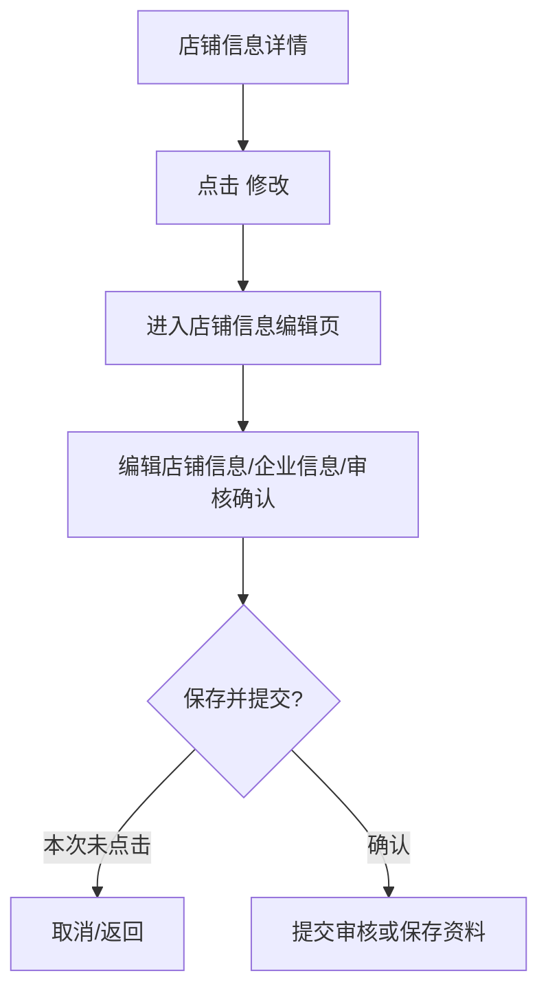

# 商家中心：店铺管理

## 菜单结构

```text
店铺管理
└─ 店铺信息
```

## 页面：店铺信息

- 路由：`/shop/info`
- 修改页路由：`/shop/info/addInfo`
- 页面定位：商家维护店铺资料、企业资质、审核确认、合同/授权相关信息。

## UI 结构

```text
店铺信息
├─ 店铺基础信息
├─ 企业信息
├─ e签宝授权/合同相关信息
├─ 审核确认信息
└─ 修改 -> 店铺信息编辑页
```

## 点击流程



## 编辑页字段分组

| 分组 | 字段类型 | 重构要求 |
|---|---|---|
| 店铺信息 | 店铺名称、联系人、联系方式、经营信息 | 手机号脱敏，必填校验 |
| 企业信息 | 企业名称、证照、法人、统一社会信用代码等 | 证照文件需权限和水印 |
| 审核确认 | 审核状态、确认材料、补充说明 | 只允许有权限人员提交 |
| 合同/授权 | e签宝企业授权、合同签署入口 | 授权状态同步需展示时间和失败原因 |

## 操作按钮

| 操作 | 点击反馈 | 风险边界 |
|---|---|---|
| 修改 | 跳转编辑页 | 低风险入口 |
| 保存并提交 | 提交店铺资料 | 未点击；会影响审核/线上资料 |
| 上传文件 | 打开文件选择/上传 | 未触发文件选择 |
| 签署/授权 | 跳转或同步第三方授权 | 未执行 |

## 重构建议

1. 店铺资料建议拆成 `草稿保存` 和 `提交审核` 两个动作。
2. 企业资质、合同、授权结果必须有版本记录，不覆盖历史文件。
3. e签宝授权失败需要明确原因：未授权、授权过期、同步失败、第三方异常。

