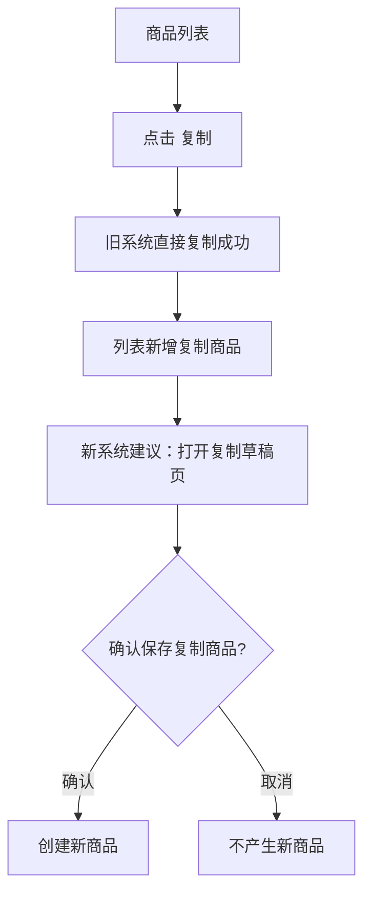

# 商家中心：商品管理

> 商品管理已逐项点击租赁商品列表、审核详情、二维码、修改、复制、删除确认、分页、页大小、跳页、归还地址、增值服务、寄件地址。`复制`在旧系统中点击即生效，已产生一条复制商品，这是旧系统交互风险。

## 菜单结构

```text
商品管理
├─ 租赁商品列表
├─ 归还地址
├─ 增值服务
└─ 寄件地址
```

## 页面：租赁商品列表

### 查询区字段

| 字段 | 控件 | 实测选项/说明 |
|---|---|---|
| 商品名称 | 输入框 | placeholder：`请输入商品名称` |
| 商品编号 | 输入框 | placeholder：`请输入商品编号` |
| 商品类目 | 下拉 | 智能手机、电脑平板、耳机数码、手表饰品、相机摄像、家居设备、二手手机、游戏设备、演出必备、电动车 |
| 上架状态 | 下拉 | 已上架、已下架 |
| 审核状态 | 下拉 | 审核中、审核拒绝、审核通过 |
| 是否删除 | 下拉 | 是、否 |

### 表格字段

| 字段 | 说明 |
|---|---|
| 商品编号 | 商品唯一编号，文档中脱敏 |
| 商品图片 | 商品主图 |
| 商品名称 | 商品标题 |
| 商品类目 | 类目名称 |
| 状态 | 上架/下架/删除等 |
| 创建时间 | 商品创建时间 |
| 审核状态 | 审核中/审核拒绝/审核通过 |
| 操作 | 修改、复制、删除、二维码、审核详情 |

### 按钮与点击反馈

| 操作 | 点击反馈 | 重构要求 |
|---|---|---|
| 查询 | 按筛选刷新列表 | loading、失败提示 |
| 重置 | 清空筛选 | 保持默认排序 |
| 导出 | 可能导出商品数据 | 未点击，进入导出中心 |
| 新增商品 | 进入新增/编辑商品页 | 草稿保存，避免误上架 |
| 审核详情 | 打开 `审核详情`弹窗，列：审核时间、审核人员、审核结果、反馈详情；空状态 `暂无数据` | 审核记录不可删除 |
| 二维码 | 实测显示 `处理中`，未出现可见弹窗 | 新系统需明确生成成功/失败/下载 |
| 修改 | 跳转商品编辑页 | 修改后需重新审核或明确免审字段 |
| 复制 | 旧系统直接复制成功，新增商品名带 `复制后` | 必须改为二次确认或进入复制草稿 |
| 删除 | 弹出 `是否删除该商品？`，已取消 | 删除需二次确认和原因 |

### 分页

- 总数实测由 173 变为 174，原因是点击 `复制`直接生成新商品。
- 页码：`1 2 3 4 5 ... 18`
- 页大小：`5条/页`、`10条/页`、`20条/页`
- 跳页：`跳至 [ ] 页`

## 页面：商品编辑

```text
修改商品
├─ 商品类目：级联选择
├─ 商品名称
├─ 产品新旧：全新 / 99新 / 95新 / 9成新 / 8成新 / 7成新
├─ 租赁标签
├─ 增值服务列表
├─ 买断规则：不支持买断 / 支持提前买断 / 仅到期可买断
├─ 归还规则：支持提前归还 / 仅到期可归还 / 仅到期赠送
├─ 账期类型：月 / 天
├─ 颜色与规格：关联 / 不关联
├─ 碎屏险规则：不强制 / 强制
├─ 颜色分类 / 规格：标签 + 新增
├─ 租赁价格矩阵：官方售价、库存、最短租期、最高租期、各租期价格、买断价
├─ 商品图片：上传/预览/删除
├─ 商品详情：富文本编辑器
├─ 商品参数
├─ 发货地、发货快递、是否上架、归还快递、归还地址
└─ 取消 / 确定
```

## 页面：归还地址

| 区域 | 内容 |
|---|---|
| 表格字段 | 手机号、收货地址、收货人、添加时间、操作 |
| 新增 | 打开 `新增归还地址`弹窗 |
| 修改 | 打开 `修改归还地址`弹窗，字段预填 |
| 删除 | 确认文案：`是否删除该归还地址？`，已取消 |

弹窗字段：`收货人姓名`、`所属区域`级联、`详细地址`、`手机号码`，按钮 `取消/确定`。

## 页面：增值服务

| 区域 | 内容 |
|---|---|
| 表格字段 | 增值服务ID、增值服务名称、增值服务内容、增值服务价格、增值服务说明、操作 |
| 新增 | 打开 `新增增值服务`弹窗 |
| 修改 | 打开同结构弹窗，但旧系统标题仍显示 `新增增值服务` |
| 删除 | 确认文案：`是否删除该增值服务？`，已取消 |

弹窗字段：`增值服务名称`、`增值服务内容`、`增值服务价格`、`增值服务说明`。

## 页面：寄件地址

| 区域 | 内容 |
|---|---|
| 表格字段 | 手机号、发货地址、发货人、添加时间、操作 |
| 新增 | 打开 `新增寄件地址`弹窗 |
| 修改 | 打开 `修改寄件地址`弹窗 |
| 删除 | 旧系统确认文案仍是 `是否删除该归还地址？`，疑似文案错误 |

## 商品复制风险流程



