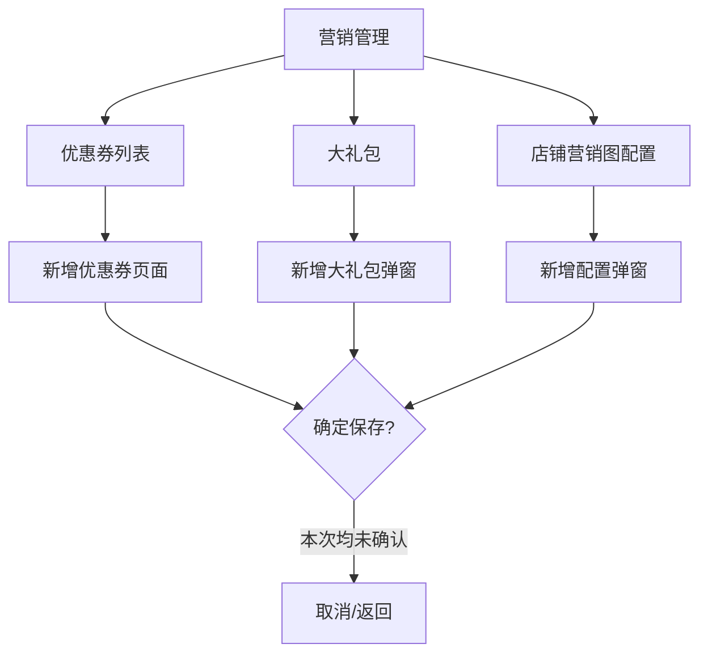

# 商家中心：营销管理

## 菜单结构

```text
营销管理
├─ 优惠券列表
├─ 大礼包
└─ 店铺营销图配置
```

## 页面：优惠券列表

### 查询区字段

| 字段 | 控件 | 实测选项 |
|---|---|---|
| 用法 | 下拉 | 独立使用、大礼包 |
| 优惠券名称 | 输入框 | placeholder：`请输入优惠券名称` |
| 优惠券状态 | 下拉 | 有效、失效、已经领取完 |

### 表格字段

`优惠券ID`、`版本`、`名称`、`发放总量`、`库存`、`面额`、`使用条件`、`每人限领`、`时间设置`、`优惠券状态`、`操作`。

### 新增优惠券

点击 `新增` 跳转 `增加优惠券`页面。

```text
增加优惠券
├─ 用法：独立使用 / 大礼包
├─ 优惠券类型：固额券
├─ 优惠券类别：首期租赁 / 全期租赁 / 买断
├─ 优惠券名称
├─ 发放总量：数字 + 张
├─ 面额：数字 + 元
├─ 使用条件：不限制 / 满指定金额
├─ 每人限领：无限制 / 1张 ~ 10张
├─ 时间设置：按固定时间 / 按领取日期
├─ 优惠券使用人群：所有人 / 指定用户 / 新用户
├─ 优惠券适用范围：全场通用 / 指定商品
├─ 优惠券状态：有效 / 失效 / 已领完
├─ 优惠券展示说明：最多显示12个字
└─ 取消 / 确定
```

## 页面：大礼包

### 查询区字段

| 字段 | 控件 |
|---|---|
| 用法 | 下拉 |
| 大礼包名称 | 输入框 |
| 大礼包状态 | 下拉 |

### 表格字段

`大礼包ID`、`大礼包名称`、`新用户专享`、`大礼包状态`、`优惠券名称`、`发放总量`、`库存`、`面额`、`使用条件`、`每人限领`、`时间设置`、`操作`。

### 新增大礼包弹窗

```text
弹窗标题：新增大礼包
字段：
  用法
  大礼包名称
  数量
  每人限领
  新用户专享：是 / 否
  大礼包状态：有效 / 失效
  新增优惠券：请输入优惠券名称 + 搜索
  优惠券选择表格：复选框、优惠券ID、名称、发放总量、库存、面额
按钮：取消 / 确定
```

## 页面：店铺营销图配置

### 表格字段

`ID`、`店铺营销图名称`、`营销图片`、`跳转链接`、`上线时间`、`状态`、`排序`、`操作`。

### 新增配置弹窗

```text
弹窗标题：新增配置
字段：
  店铺营销图名称
  跳转地址
  排序规则
  是否生效：无效 / 有效
  营销图片：上传，建议尺寸 630px*110px
按钮：取消 / 确定
```

## 点击流程



## 重构要求

1. 优惠券、大礼包、营销图均需支持启停、库存、领取记录和操作审计。
2. `指定用户`、`指定商品`必须有选择器和已选列表，不允许只靠手填 ID。
3. 营销图上传需校验尺寸、大小、格式，并提供预览。

