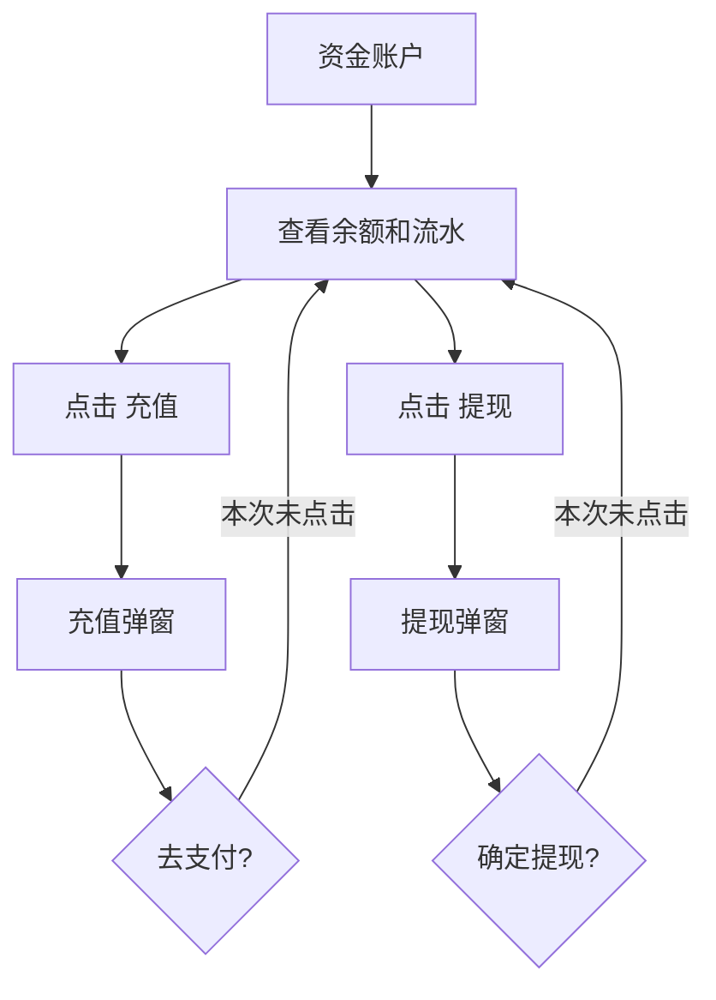

# 商家中心：财务管理

## 菜单结构

```text
财务管理
├─ 资金账户
├─ 提现列表
├─ 佣金结算明细
└─ 费用结算明细
```

## 页面：资金账户

### UI 结构

```text
资金账户
├─ 账户信息：店铺名称、支付宝账户、结算人
├─ 资金明细：账户余额、充值、提现
└─ 资金变更表：时间、类型、变更金额、变更人、余额、操作
```

### 点击反馈

| 操作 | 点击反馈 | 风险边界 |
|---|---|---|
| 充值 | 打开 `充值`弹窗，字段 `金额（元）`，按钮 `去支付` | 未点击去支付 |
| 提现 | 打开 `提现`弹窗，字段 `金额（元）`，按钮 `取消/确定` | 已取消，未确认 |
| 明细 | 跳转 `费用结算明细?id=...` | 低风险查看入口 |

### 弹窗

```text
充值：金额（元） -> 去支付
提现：金额（元） -> 取消 / 确定
```

## 页面：提现列表

表格字段：`ID`、`商户名称`、`申请提现金额`、`手续费`、`到账金额`、`提现状态`、`提现时间`。实测为空状态。

## 页面：佣金结算明细

### Tab

| Tab | 查询字段 | 表格字段 | 实测反馈 |
|---|---|---|---|
| 常规订单 | 订单编号、账单生成时间、查询、重置 | 订单编号、结算期数/总期数、租金、结算金额、佣金、账单生成时间 | 有数据，订单编号点击后复制内容并弹 Toast |
| 买断订单 | 订单编号、账单生成时间、查询、重置 | 买断订单号、原订单号、已付租金、买断尾款、结算金额、佣金、账单生成时间 | 空状态 |

## 页面：费用结算明细

### Tab

```text
费用结算明细
├─ 芝麻租押分离接口费用
├─ 风控报告
└─ 电子合同
```

### 查询区字段

| 字段 | 控件 | 实测选项 |
|---|---|---|
| 结算状态 | 下拉 | 已结算、未结算 |
| 账单生成时间 | 日期区间 | 开始日期 / 结束日期，两月日历面板 |
| 查询 | 按条件刷新 | 低风险 |
| 重置 | 清空条件 | 低风险 |
| 导出 | 导出当前明细 | 未点击 |

### 表格字段

`订单编号`、`费用（元）`、`结算状态`、`账单生成时间`。

## 资金流流程



## 重构要求

1. 充值、提现、费用扣款、佣金结算必须落资金流水和审计日志。
2. 账户余额为负数时需明确业务含义：欠费、预扣失败、授信透支或数据异常。
3. 费用明细导出需进入统一导出任务中心。

