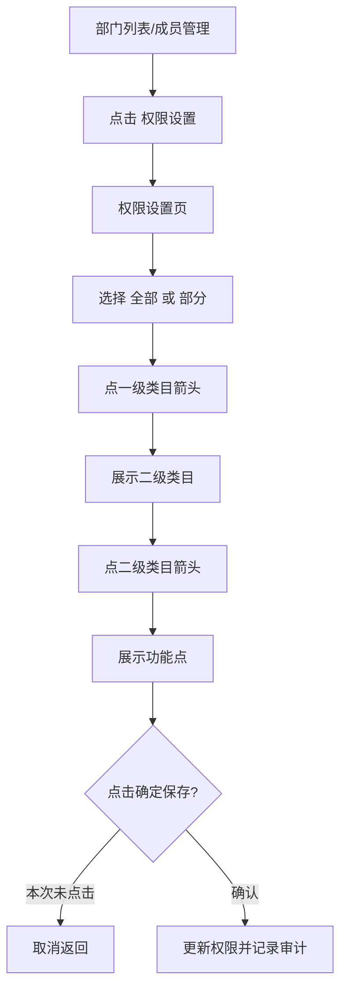

# 商家中心：权限管理

> 权限管理已实测部门列表、成员管理、新增/修改弹窗、删除确认、部门权限设置、成员权限设置。启用/不启用单选切换可能立即影响账号状态，本次未触碰。

## 菜单结构

```text
权限管理
├─ 部门列表
└─ 成员管理
```

## 页面：部门列表

### 表格字段

`部门名称`、`职能描述`、`成员数量`、`添加时间`、`操作`。

### 按钮与反馈

| 操作 | 点击反馈 | 风险边界 |
|---|---|---|
| 新增部门 | 打开 `新增部门`弹窗 | 未确定 |
| 修改 | 打开 `修改部门`弹窗，字段预填 | 未确定 |
| 权限设置 | 跳转部门权限设置页 | 未保存 |
| 删除 | 弹出 `确定要删除吗？` | 已取消 |

### 部门弹窗

```text
新增部门 / 修改部门
字段：
  * 部门名称
  * 职能描述
按钮：取消 / 确定
```

## 页面：成员管理

### 查询区字段

| 字段 | 控件 | 实测选项 |
|---|---|---|
| 姓名 | 输入框 | placeholder：`请输入姓名` |
| 所属部门 | 下拉 | 店铺管理员、客服部 |

### 表格字段

`成员账号`、`姓名`、`所属部门`、`邮箱地址`、`添加时间`、`最后登入`、`是否启用`、`操作`。

### 按钮与反馈

| 操作 | 点击反馈 | 风险边界 |
|---|---|---|
| 查询 | 按姓名/部门筛选 | 低风险 |
| 重置 | 清空筛选 | 低风险 |
| 新增成员 | 打开 `新增成员`弹窗 | 未确定 |
| 修改 | 打开 `修改成员`弹窗，字段预填 | 未确定 |
| 权限设置 | 跳转成员权限设置页 | 未保存 |
| 删除 | 弹出 `确定要删除吗？` | 已取消 |
| 启用/不启用 | 可能立即改账号状态 | 未触碰 |

### 新增成员弹窗

```text
弹窗标题：新增成员
字段：
  * 手机号
  * 成员姓名
  * 邮箱地址
  所属部门：店铺管理员 / 客服部
  * 登入密码
  * 确认密码
  备注信息
按钮：取消 / 确定
```

### 修改成员弹窗

```text
弹窗标题：修改成员
字段：
  * 手机号
  * 成员姓名
  * 邮箱地址
  所属部门：店铺管理员 / 客服部
  备注信息
按钮：取消 / 确定
```

## 权限设置页

部门权限和成员权限结构一致：

```text
权限设置
├─ 对象名称：部门名称 / 成员名称
├─ 权限设置：全部 / 部分
└─ 三列权限树
   ├─ 一级类目
   ├─ 下属二级类目
   └─ 功能
```

### 一级类目与实测二级类目

| 一级类目 | 下属二级类目 |
|---|---|
| 店铺管理 | 店铺信息、供应商寄件地址 |
| 商品管理 | 商品列表、归还地址、增值服务、寄件地址 |
| 订单管理 | 订单列表、逾期订单、买断订单、续租订单、到期未归还订单、门店订单、分红订单 |
| 营销管理 | 优惠券列表、大礼包、店铺营销图配置 |
| 财务管理 | 财务结算、结算明细查询、资金账户、费用结算明细、提现列表 |
| 权限管理 | 部门列表、成员管理 |
| 数据管理 | 导出数据下载 |
| 服务中心 | 常见问题 |
| 订单列表订单统计 | 无二级页面，按功能点授权 |
| 首页 | 首页订单数据统计、首页数据统计、首页逾期数据统计、修改投入本金 |
| 催收管理 | 催收回款列表 |

### 典型功能点

| 模块 | 功能点示例 |
|---|---|
| 店铺管理 | 修改/新增店铺企业资质、文件上传、签署店铺合同、e签宝授权信息/链接/同步结果 |
| 商品管理 | 查询商品列表、复制商品、新增商品、上下架、删除、导出、审核详情、编辑商品 |
| 订单管理 | 查询订单、查看详情、商家备注、导出、关单、发货、查看物流、出具结算单、电审审核、修改发货信息 |
| 营销管理 | 获取/添加/编辑/删除优惠券、查看领取详情、读取 Excel、添加大礼包 |
| 财务管理 | 查看账单、导出、查看支付凭证、查看明细、分账查询、提现/资金账户相关查询 |
| 权限管理 | 部门列表、添加/删除/编辑部门、权限设置页面、提交权限更新 |
| 数据管理 | 查看导出历史、导出订单、导出逾期订单、买断订单导出、回执单导出 |
| 服务中心 | 常见问题集合、查看问题详情 |

## 权限流程



## 待确认问题

1. 成员权限和部门权限是覆盖关系、继承关系，还是取并集。
2. `启用/不启用`是否需要二次确认和强制原因。
3. 权限功能点命名偏接口名，新系统是否改为业务动作名。
4. 权限保存是否需要强制重新登录或实时刷新菜单。

