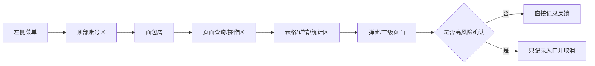

# 商家中心页面级 PRD 补充

> 来源：旧系统 `商家中心` 实测点击梳理。本文档只记录页面结构、控件、交互反馈和重构建议；真实手机号、邮箱、姓名、订单号、地址、店铺名均已脱敏。

## 审计范围

```text
商家中心
├─ 首页
├─ 订单管理
├─ 店铺管理
├─ 商品管理
├─ 营销管理
├─ 数据管理
├─ 财务管理
├─ 服务中心
└─ 权限管理
```

## 与运营端的定位差异

| 维度 | 运营管理平台 | 商家中心 |
|---|---|---|
| 用户角色 | 平台运营、财务、审核、配置人员 | 商家/供应商后台人员 |
| 数据范围 | 全平台、跨店铺、跨资方 | 当前店铺/商户范围 |
| 高频动作 | 审核、分配、打款、配置、风控、财务核算 | 发货、商品维护、地址维护、优惠配置、资金查看、成员权限 |
| 风险动作 | 平台级审核/打款/资金/权限 | 店铺级商品、订单履约、提现、账号权限 |
| 重构建议 | 强平台管控和审计 | 强商户自助、权限隔离、操作留痕 |

## 页面文档清单

| 模块 | 文档 | 覆盖页面 |
|---|---|---|
| 首页 | `01-首页/README.md` | 销售/成本/待收款统计，本金投入修改 |
| 订单管理 | `02-订单管理/README.md` | 订单列表、逾期、到期未归还、买断、分红、门店、续租、订单详情 |
| 店铺管理 | `03-店铺管理/README.md` | 店铺信息、企业信息、审核确认、合同/授权入口 |
| 商品管理 | `04-商品管理/README.md` | 租赁商品列表、商品编辑、归还地址、增值服务、寄件地址 |
| 营销管理 | `05-营销管理/README.md` | 优惠券、大礼包、店铺营销图配置 |
| 数据管理 | `06-数据管理/README.md` | 导出数据下载 |
| 财务管理 | `07-财务管理/README.md` | 资金账户、提现列表、佣金结算、费用结算 |
| 服务中心 | `08-服务中心/README.md` | 常见问题分类与详情 |
| 权限管理 | `09-权限管理/README.md` | 部门列表、成员管理、部门/成员权限树 |

## 通用 UI 骨架



## 高风险操作边界

- 未点击最终确认：删除、保存、提交、确定、提现、去支付、导出、上传、发货、关单、代扣、押金抵扣、权限保存、启停账号。
- 已点击并取消：删除确认、修改/新增弹窗、充值/提现弹窗、权限设置页、付费征信确认。
- 已发生副作用：商品列表点击 `复制` 后旧系统直接复制成功，商品总数由 173 变为 174。新系统必须把复制改为二次确认或先进入编辑草稿。

## 重构共性要求

1. 所有列表查询支持 loading、空状态、失败重试。
2. 所有导出动作进入统一导出任务中心，不直接下载生产数据。
3. 所有资金相关动作必须有二次确认、权限校验、审计日志和操作原因。
4. 所有账号、部门、权限变更必须记录操作者、变更前后内容和生效范围。
5. 商家端只能访问当前店铺数据，后端必须强制按登录商户隔离，不能只依赖前端参数。

