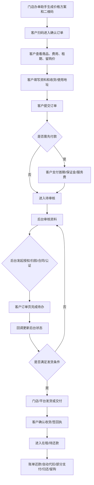

# C 端客户扫码下单主流程

> **Stage 6 术语同步(2026-05-27)**: 本文档已按 Stage 6 统一为商家、联营、平台订单、订单结算款、我的钱包、履约中、逾期费用、留购、保证金等展示术语；数据库字段、API 路径、英文枚举保持不变。

> 页面级 PRD 草案。
> 来源：合悦租物下单视频、无界租下单操作文档、办单助手三入口口径。

> **⚠️ V0.2 合规口径修订(2026-05-25)**:
> - C 端**绝不出现"资方"字样**(P1-4 合规红线);联营订单的服务说明只展示门店/平台,不暴露资方。
> - "留购"全文改为"留购"。

---

## 1. 页面说明

| 项 | 内容 |
|---|---|
| 页面名称 | 客户扫码下单主流程 |
| 所属端 | C 端小程序/H5/APP |
| 入口路径 | 门店办单助手二维码 / 渠道推广码 / 商品详情 |
| 使用角色 | C 端客户 |
| 核心目标 | 客户扫码读取办单助手锁价方案,完成资料、授权、支付、合同、公证、绑卡、签收和还款待办 |

客户下单不是一次性表单。门店通过办单助手生成价格方案和二维码,客户扫码确认订单;后续很多动作由后台发起,再回到客户订单页完成。

---

## 2. 核心口径

1. 客户扫码读取的是 `price_plan_id`,费用以办单助手生成的锁价方案为准。
2. 二维码必须有有效期和状态,客服改价或重新生成价格方案后旧二维码应失效或要求重新确认。
3. 客户订单页必须展示当前最关键待办,不只展示订单状态。
4. 后台发起风控授权、合同、公证、补资料、绑卡后,客户侧订单详情出现对应操作按钮。
5. 客户每完成一步,必须通过回调或接口更新运营端订单状态、下一步待办和日志。
6. 商家订单、联营订单、平台订单的客户体验**尽量一致**,后台审核主体和资金流不同(资方不暴露给客户)。
7. 客户侧费用展示必须清楚:首期实付、后期账单、保证金、服务费、公证费、设备管理费、**留购价**、总租金。

---

## 3. 主流程

> **修订**:原流程图节点"门店/平台/资方发货或交付"改为"门店/平台发货或交付"(资方不暴露)。

---

## 4. 页面清单

| 页面 | 说明 |
|---|---|
| 扫码落地页 | 校验二维码、价格方案、门店、订单类型 |
| 确认订单页 | 商品、规格、费用、租期、留购、协议勾选 |
| 资料填写页 | 身份、联系人、地址、邮箱、定位、补充资料 |
| 支付页 | 首期、保证金、服务费、公证费、收款码或线上支付 |
| 我的订单列表 | 展示订单状态和下一步待办 |
| 订单详情页 | 展示费用、合同、账单、发货、待办按钮 |
| 授权/扫脸页 | 风控授权、人脸识别、征信授权 |
| 合同签署页 | 主合同、补充合同、e 签宝跳转结果 |
| 公证办理页 | 公证办理入口、费用、状态 |
| 绑卡页 | 代扣银行卡绑定和签约 |
| 签收/回执页 | 确认收货、回执单、签收照片 |
| 账单还款页 | 主动还款、部分支付、代扣状态 |
| **归还/留购页** | **归还申请、留购支付、留购完成**(原"留购完成"已改) |

---

## 5. 扫码落地页

| 校验项 | 规则 |
|---|---|
| 二维码状态 | 未使用、已使用、已失效、已取消 |
| 有效期 | 超过有效期不可下单,提示联系门店重新生成 |
| 价格方案 | 必须存在且未被客服改价作废 |
| 商品状态 | 商品和规格仍可下单 |
| 库存/设备 | 短租或指定设备订单必须有可用设备 |
| 门店状态 | 门店已审核通过且未冻结 |
| 订单类型 | 商家订单、联营订单、平台订单 |

落地页展示门店信息、商品摘要、租期、费用摘要和「继续下单」按钮。

---

## 6. 确认订单页

| 区域 | 字段 |
|---|---|
| 商品 | 商品图、名称、规格、成色、数量 |
| 租赁 | 长租/短租、计费单位、租期数量、起租规则 |
| 费用 | 首期实付、后期账单、保证金、补充保证金、服务费、公证费、设备管理费、运费 |
| **留购** | **是否支持留购、留购价(保证金可抵扣)、到期留购价**(原"留购"措辞已废弃) |
| 增值服务 | 服务名称、金额、是否必选 |
| **服务说明** | **展示门店/平台联合提供的租赁服务说明,不向客户暴露任何分账或资方信息**(无论门店/联营/平台订单口径一致) |
| 协议 | 服务协议、隐私政策、租赁合同预览、授权说明 |

> **修订**:原 "联营提示:联营订单可展示门店/资方服务说明,不向客户暴露复杂分账" 整行删除,换为"服务说明"通用口径,不区分订单类型,不暴露资方。

客户确认订单前必须清楚看到账单明细和总成本,避免后续争议。

---

## 7. 资料填写

| 字段 | 说明 |
|---|---|
| 姓名 | 实名认证使用 |
| 身份证号 | 脱敏存储和展示,明文按安全规范处理 |
| 手机号 | 登录和通知 |
| 居住/使用地址 | 长租收货或短租使用地 |
| 收货地址 | 默认门店发货也可填写,用于配送或风控 |
| 邮箱 | 合同或通知可选 |
| 紧急联系人 | 按风控配置决定是否必填 |
| 定位授权 | 用于风控和交付核验 |
| 补充资料 | 身份证照片、工作证明、学生证明等按配置要求 |

资料填写完成后,订单进入待审核或待付款。客户可在订单详情查看资料是否需要补充。

---

## 8. 客户待办

| 待办 | 后台触发 | 客户动作 | 回调 |
|---|---|---|---|
| 待付款 | 下单或审核通过后 | 支付首期/保证金/费用 | 支付成功/失败 |
| 待授权签署 | 发起风控/征信授权 | 签署授权书 | 授权完成/失败 |
| 待人脸识别 | 风控或实名要求 | 完成扫脸 | 通过/失败 |
| 待补资料 | 审核要求补充 | 上传资料 | 已补充/待复审 |
| 待签合同 | 发起主合同 | 跳转 e 签宝签署 | 已签/失败 |
| 待签补充合同 | 发起补充合同 | 签署补充合同 | 已签/失败 |
| 待办理公证 | 发起公证 | 办理或确认公证 | 完成/失败 |
| 待绑卡 | 要求代扣银行卡 | 绑定银行卡 | 绑定成功/失败 |
| 待确认收货 | 已发货或已交付 | 确认收货/签回执 | 已签收 |
| 待还款 | 账单到期 | 主动还款或等待代扣 | 已还/逾期 |

客户订单详情应将当前最紧急待办放在顶部,历史待办折叠展示。

---

## 9. 支付与账单

| 场景 | 规则 |
|---|---|
| 首期支付 | 支持线上支付、通联/信联收款码、线下支付登记 |
| 部分支付 | 必须关联账单和子流水,未结清仍显示待还或逾期 |
| 自动代扣 | 客户绑卡后按账单日自动扣款 |
| 线下支付 | 客服或财务确认后才更新账单,不允许只改订单状态 |
| 退款 | 客户侧展示申请状态,后台审核和财务处理 |

客户账单页展示每期应还、已还、剩余、逾期、代扣状态、支付入口。

---

## 10. 发货、签收、归还

| 节点 | 客户侧展示 |
|---|---|
| 待发货 | 展示发货主体(门店/平台)和预计处理 |
| 已发货 | 展示物流或门店交付信息 |
| 待签收 | 展示确认收货、回执单入口 |
| 已签收 | 展示签收时间、回执、合同和账单 |
| 归还中 | 展示归还方式、物流或门店归还 |
| 已归还 | 展示验收结果、是否有扣费或争议 |
| **留购** | **展示留购价、保证金抵扣、客户实付、支付入口、完成状态**(原"留购"已废弃) |

门店当面交付时,客户侧可展示交付完成状态;人机合照、人车合照主要由门店端上传,客户侧只展示必要结果。

---

## 11. 状态同步

| 客户动作 | 后台同步 |
|---|---|
| 提交订单 | 生成订单、价格方案快照、客户资料状态 |
| 支付成功 | 更新支付流水、账单、订单待办 |
| 授权完成 | 更新授权状态、可查看风控报告 |
| 合同签署 | 更新合同编号、签署状态 |
| 公证完成 | 更新公证状态和费用 |
| 绑卡成功 | 更新代扣协议状态 |
| 确认收货 | 更新发货签收、起租或账单节点 |
| 还款成功 | 更新账单、分账、钱包 |
| 申请归还 | 更新租后/归还流程 |
| **申请留购** | **生成留购账单,订单进入 `PURCHASE_PENDING`**(原"申请留购"已废弃) |

所有第三方回调失败都进入回调异常队列,由运营端处理。

---

## 12. 异常规则

| 异常 | 处理 |
|---|---|
| 二维码过期 | 提示联系门店重新生成 |
| 价格方案被改价 | 要求客户重新确认新方案 |
| 客户资料不完整 | 不能进入最终审核通过或发货 |
| 授权失败 | 可重试,超过次数进入人工处理 |
| 合同签署失败 | 可重新发起或联系客服 |
| 支付成功但订单未更新 | 客户侧展示处理中,后台回调重试 |
| 绑卡失败 | 可更换银行卡或走人工处理 |
| 发货后客户不确认 | 按发货签收配置和客服流程处理 |

---

## 13. V0.2 合规修订记录

| 日期 | 修订 | 说明 |
|---|---|---|
| 2026-05-25 | §3 §6 §10 | **资方暴露清理**:流程图节点改 "门店/平台发货";确认订单页"联营提示"整段删除,换通用"服务说明"口径 |
| 2026-05-25 | §4 §10 §11 | "留购"全部改"留购";状态同步表中"申请留购"改"申请留购"(对应订单状态 `PURCHASE_PENDING`) |

---

## 14. 待确认

1. 客户是否必须先支付再审核,还是分订单类型可配置。
2. 人脸识别是否所有订单强制,还是按风控/资方/订单类型配置(配置仅在后台,客户侧不暴露原因)。
3. 短租小时租是否需要客户侧预约起止时间和门店取还点。
