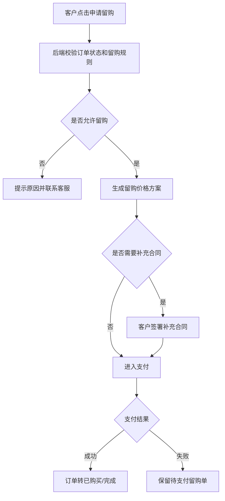

# C 端归还、留购与售后

> 页面级 PRD 草案。
> 目标：补齐客户在租后期的归还、续租、留购、售后、退款、争议处理路径，并同步运营端、商家端、门店待办和财务账单。

---

## 1. 页面说明

| 项 | 内容 |
|---|---|
| 页面名称 | 归还、留购与售后 |
| 所属端 | C 端小程序/H5/APP |
| 入口路径 | 我的订单 > 订单详情 > 归还/留购/售后 |
| 使用角色 | C 端客户 |
| 核心目标 | 让客户在租期中后段清楚选择归还、续租、留购或售后，并把客户操作回写订单、账单、设备、门店待办和财务 |

归还、留购不是简单按钮。它会影响账单、押金、设备状态、门店验收、售后争议和分账冲正。

---

## 2. 核心口径

1. 是否允许归还、续租、留购由订单配置、商品配置、租赁模式和当前状态决定。
2. 客户侧只展示客户能理解和能操作的内容，不展示资方内部收益、平台抽佣等内部字段。
3. 归还必须和交付证据、设备库存、门店验收、押金/赔付打通。
4. 留购金额必须来自订单价格方案快照和已付账单，不能前端临时计算。
5. 短租按小时/天/周/月配置归还和超时规则；长租按期和到期日配置。
6. 售后、退款、争议会进入运营端或商家端处理，客户侧展示进度。
7. 所有客户操作写入订单日志和客户侧操作记录。

---

## 3. 入口展示

| 订单状态 | 可展示入口 |
|---|---|
| 待审核/待签约 | 取消订单、联系客服 |
| 待发货 | 取消订单、联系客服 |
| 在租中 | 查看账单、申请归还、申请留购、联系客服、售后 |
| 临近到期 | 归还、续租、留购、还款 |
| 已逾期 | 去还款、联系客服、归还说明 |
| 归还中 | 查看归还进度、上传凭证、查看验收 |
| 已完成 | 查看合同、查看账单、售后记录 |
| 已关闭 | 查看关闭原因、退款进度 |

入口由后台 `next_action` 和配置开关返回，前端不硬编码。

---

## 4. 申请归还

### 4.1 归还方式

| 方式 | 说明 |
|---|---|
| 到店归还 | 客户到指定门店归还，由门店验收 |
| 快递归还 | 客户填写物流单号，上传快递凭证 |
| 上门取回 | 如商家/平台配置支持，客户预约时间 |
| 短租现场归还 | 短租按约定地点/时间归还，可能需扫码设备码 |

### 4.2 表单字段

| 字段 | 类型 | 说明 |
|---|---|---|
| 归还方式 | 单选 | 按订单配置展示 |
| 归还门店/地址 | 只读/选择 | 到店或快递地址 |
| 预约归还时间 | 时间选择 | 短租和上门取回必填 |
| 物流公司 | 下拉/文本 | 快递归还时填写 |
| 物流单号 | 文本 | 快递归还时填写 |
| 归还照片 | 上传 | 设备、配件、包装 |
| 设备码 | 扫码/只读 | 短租或绑定设备订单 |
| 备注 | 文本 | 客户说明 |

### 4.3 归还状态

| 状态 | 客户侧展示 |
|---|---|
| 待提交 | 可选择方式并提交 |
| 待寄出/待到店 | 展示地址、预约时间 |
| 归还中 | 等待门店/平台确认收到 |
| 待验收 | 已收到，等待验收 |
| 验收通过 | 归还完成，查看结算 |
| 验收异常 | 展示异常说明和争议入口 |
| 已取消 | 展示取消原因 |

---

## 5. 归还验收反馈

| 验收结果 | 客户侧展示 | 后续 |
|---|---|---|
| 正常 | 归还完成 | 进入订单完成/押金释放 |
| 轻微损坏 | 展示损坏说明和费用 | 客户确认或申诉 |
| 严重损坏 | 展示图片、说明、赔付金额 | 进入售后争议 |
| 缺件 | 展示缺件清单和费用 | 客户补寄或赔付 |
| 设备不一致 | 展示设备码不一致 | 人工复核 |

验收异常必须展示门店或平台上传的证据图片，但敏感内部备注不展示给客户。

---

## 6. 申请留购

### 6.1 留购入口

留购入口显示条件：

1. 商品配置允许留购。
2. 当前订单未关闭、未强制冻结。
3. 账单状态满足配置规则，例如已支付到指定期数或可提前买断。
4. 当前无未处理售后争议或黑名单强拦截。

### 6.2 留购页面

| 字段 | 说明 |
|---|---|
| 商品信息 | 商品、规格、设备码 |
| 已付金额 | 已支付租金、服务费摘要 |
| 剩余账单 | 未付账单摘要 |
| 留购价 | 到期留购价或提前买断价 |
| 需支付金额 | 本次实际需支付 |
| 价格说明 | 按订单快照展示 |
| 支付方式 | 支付宝、微信、银行卡、收款码等 |
| 留购协议 | 如需补充合同，展示签署入口 |

留购价由后端返回并保存版本，客户点击支付前锁定价格方案。

### 6.3 留购流程

---

## 7. 续租

V1 可先预留续租入口，按配置开启。

| 字段 | 说明 |
|---|---|
| 可续租租期 | 按商品和订单配置展示 |
| 续租价格 | 后端按当前价格规则返回 |
| 续租起止时间 | 接原订单到期时间 |
| 是否需要重新签约 | 按合同配置 |
| 是否需要重新风控 | 按风控配置 |
| 支付方式 | 支持主动支付、代扣、收款码 |

续租成功后应生成新账单计划，保留原订单和续租记录。

---

## 8. 售后与争议

### 8.1 售后类型

| 类型 | 场景 |
|---|---|
| 退款申请 | 未发货、重复支付、取消订单等 |
| 商品问题 | 设备故障、配件缺失、型号不符 |
| 账单问题 | 扣款错误、金额不认可、部分支付争议 |
| 合同问题 | 合同签署失败、合同内容疑问 |
| 发货签收问题 | 未收到、签收异常、物流异常 |
| 归还验收争议 | 损坏、缺件、赔付金额争议 |

### 8.2 售后表单

| 字段 | 类型 | 说明 |
|---|---|---|
| 售后类型 | 单选 | 按订单状态展示 |
| 问题描述 | 文本 | 必填 |
| 期望处理 | 单选/多选 | 退款、维修、换货、人工联系、取消赔付等 |
| 上传凭证 | 图片/视频 | 可选或按类型必填 |
| 联系方式 | 只读/编辑 | 客户联系电话 |

提交后进入运营端或商家端售后队列。

---

## 9. 退款进度

客户侧只展示退款进度，不展示内部财务审批细节。

| 状态 | 展示 |
|---|---|
| 已申请 | 已提交退款申请 |
| 审核中 | 平台/商家处理中 |
| 已同意 | 等待退款到账 |
| 退款中 | 通道处理中 |
| 退款成功 | 展示退款金额和时间 |
| 退款失败 | 提示联系客服 |
| 已拒绝 | 展示拒绝原因摘要 |

---

## 10. 与后台联动

| 模块 | 联动内容 |
|---|---|
| 订单管理 | 归还、留购、售后状态写入订单详情 |
| 门店待办 | 到店归还、验收、上传照片 |
| 库存设备 | 设备归还、验收、入库、维修 |
| 监管锁 | 归还/留购后的锁状态处理 |
| 财务 | 留购支付、退款、押金释放、赔付 |
| 租后 | 逾期还款、归还协商、法务状态 |
| 客诉 | 支付宝投诉和售后单关联 |
| 日志 | 客户提交、后台处理、回调记录 |

---

## 11. 异常处理

| 异常 | 处理 |
|---|---|
| 留购支付中断 | 保留留购待支付单，可重新支付 |
| 归还物流无记录 | 提示客户补充凭证，后台人工复核 |
| 验收争议 | 客户可发起申诉，进入售后队列 |
| 退款失败 | 展示失败状态，后台财务处理 |
| 监管锁未解锁 | 提示处理中，进入锁控异常 |
| 逾期状态下申请归还 | 先提示需处理欠款或联系客服 |

---

## 12. 待确认

1. 续租是否纳入 V1，还是先只做归还和留购。
2. 客户对验收异常的申诉时限是否按订单类型配置。
3. 留购是否必须签补充合同，还是按商品和订单配置。
