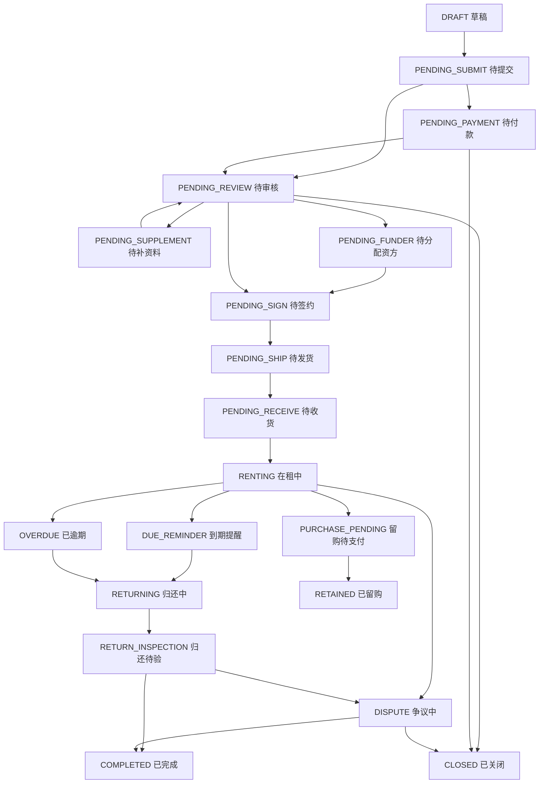

# 状态字典与订单状态机

> 全局 PRD 草案。
> 目标：统一三类订单、账单、支付、合同、公证、发货、设备、租后、客诉等状态,避免不同页面各自定义状态导致数据不互通。

> **⚠️ V0.2 合规口径修订(2026-05-25)**:
> - 订单状态 `BOUGHT_OUT` 改 `RETAINED`、`BUYOUT_PENDING` 改 `PURCHASE_PENDING`(措辞规范:买断→留购)
> - 设备状态补全 9 个(P1-1 决策表),新增 `DEVICE_PENDING_RESERVATION`(预约保留)

---

## 1. 页面说明

| 项 | 内容 |
|---|---|
| 页面名称 | 状态字典与订单状态机 |
| 所属端 | 全局基础能力 |
| 入口路径 | 开发建模 / 配置管理后续可视化 |
| 使用角色 | 产品、研发、测试、运营配置、数据分析 |
| 核心目标 | 规定状态枚举、状态流转、触发动作、权限和日志 |

---

## 2. 核心口径

1. 订单主状态只表示订单整体阶段,不能替代支付、合同、发货、账单等子状态。
2. 三类订单共用大状态,但审核主体、资金流、按钮权限不同。
3. 所有状态变更必须有触发来源:客户、商家、运营、系统回调、定时任务。
4. 回调状态不能直接覆盖人工最终状态,冲突进入异常队列。
5. 历史订单保存状态快照和配置版本,后续配置变更不改历史。
6. 状态枚举要前后端共用,避免页面文案和后端字段不一致。

---

## 3. 订单主状态

| 状态编码 | 状态名称 | 说明 |
|---|---|---|
| DRAFT | 草稿 | 商家/门店生成但客户未提交 |
| PENDING_SUBMIT | 待提交 | 客户填写中 |
| PENDING_PAYMENT | 待付款 | 等待首期或前置支付 |
| PENDING_REVIEW | 待审核 | 等待商家或平台审核 |
| PENDING_SUPPLEMENT | 待补资料 | 需要客户或商家补资料 |
| PENDING_FUNDER | 待分配资方 | 分红/平台订单未分配资方(运营端内部状态) |
| PENDING_SIGN | 待签约 | 合同、授权、公证待完成 |
| PENDING_SHIP | 待发货 | 前置条件完成,等待发货 |
| PENDING_RECEIVE | 待收货 | 已发货或交付,等待客户确认 |
| RENTING | 在租中 | 租赁生效 |
| DUE_REMINDER | 到期提醒 | 按配置进入到期提醒;不作为租后管理列表 |
| OVERDUE | 已逾期 | 账单或归还逾期 |
| RETURNING | 归还中 | 客户已申请归还或归还在途 |
| RETURN_INSPECTION | 归还待验 | 已收到设备,等待验收 |
| **PURCHASE_PENDING** | **留购待支付** | 客户申请留购待支付(原 `BUYOUT_PENDING` 已废弃) |
| COMPLETED | 已完成 | 正常归还或履约完成 |
| **RETAINED** | **已留购** | 客户留购完成(原 `BOUGHT_OUT`、文案"已购买"已废弃) |
| CLOSED | 已关闭 | 取消、审核拒绝、退款关闭 |
| DISPUTE | 争议中 | 客诉、验收、退款争议 |

---

## 4. 三类订单差异

| 阶段 | 门店订单 | 分红订单 | 平台订单 |
|---|---|---|---|
| 审核 | 商家/门店自审 | 运营端审核 | 运营端审核 |
| 资方 | 不需要 | 需要分配资方(后台) | 需要分配资方(后台) |
| 合同 | 商家可配置 | 运营端主控 | 运营端主控 |
| 支付 | 商家/平台配置 | 平台主控 | 平台主控 |
| 发货 | 默认门店 | 默认门店,可配置 | 默认门店,可配置 |
| 分账 | 抽佣后入门店钱包 | 门店/资方按比例(后台) | 资方/平台主收益(后台) |
| 渠道 | 默认不统计 | 可统计 | 可统计 |

---

## 5. 订单状态流转

不是每个订单都经过所有状态。门店订单通常不进入待分配资方;无合同配置时可跳过待签约。

---

## 6. 子状态字典

### 6.1 审核状态

| 编码 | 名称 |
|---|---|
| REVIEW_NONE | 无需审核 |
| REVIEW_WAITING | 待审核 |
| REVIEW_PROCESSING | 审核中 |
| REVIEW_SUPPLEMENT | 待补资料 |
| REVIEW_APPROVED | 审核通过 |
| REVIEW_REJECTED | 审核拒绝 |
| REVIEW_ESCALATED | 主管复核 |

### 6.2 支付状态

| 编码 | 名称 |
|---|---|
| PAY_NONE | 无需支付 |
| PAY_PENDING | 待支付 |
| PAY_PARTIAL | 部分支付 |
| PAY_SUCCESS | 已支付 |
| PAY_FAILED | 支付失败 |
| PAY_REFUNDING | 退款中 |
| PAY_REFUNDED | 已退款 |
| PAY_EXCEPTION | 支付异常 |

### 6.3 合同状态

| 编码 | 名称 |
|---|---|
| CONTRACT_NONE | 不使用合同 |
| CONTRACT_NOT_STARTED | 未发起 |
| CONTRACT_SENT | 已发起 |
| CONTRACT_SIGNING | 签署中 |
| CONTRACT_SIGNED | 已签署 |
| CONTRACT_REJECTED | 拒签 |
| CONTRACT_EXPIRED | 已过期 |
| CONTRACT_FAILED | 发起失败 |

### 6.4 公证状态

| 编码 | 名称 |
|---|---|
| NOTARY_NONE | 不使用公证 |
| NOTARY_NOT_STARTED | 未发起 |
| NOTARY_PENDING_CUSTOMER | 待客户办理 |
| NOTARY_PROCESSING | 办理中 |
| NOTARY_COMPLETED | 已完成 |
| NOTARY_FAILED | 办理失败 |
| NOTARY_CANCELLED | 已取消 |

### 6.5 发货状态

| 编码 | 名称 |
|---|---|
| SHIP_NONE | 无需发货 |
| SHIP_PENDING | 待发货 |
| SHIP_PREPARING | 备货中 |
| SHIP_SENT | 已发货 |
| SHIP_DELIVERED | 已送达 |
| SHIP_RECEIVED | 已签收 |
| SHIP_EXCEPTION | 发货异常 |

### 6.6 设备状态(9 个,P1-1 决策表)

| 编码 | 名称 | 说明 |
|---|---|---|
| DEVICE_PENDING_IN | 待入库 | 已采购/已配货,未完成入库登记 |
| DEVICE_AVAILABLE | 在库可租 | 入库完成,可对外出租 |
| **DEVICE_PENDING_RESERVATION** | **预约保留** | **(新增 P1-1)** 客户已扫码或办单中,设备暂时保留 |
| DEVICE_LOCKED | 已锁定 | 已支付,等待发货/客户取走 |
| DEVICE_RENTING | 出租中 | 已发货/已取走,在客户手中 |
| DEVICE_RETURN_PENDING | 归还待验 | 客户已归还,等待门店验收 |
| DEVICE_REPAIRING | 维修中 | 验收发现问题,送修 |
| DEVICE_DISPUTE | 争议中 | 门店与客户对设备状态有分歧 |
| DEVICE_RETIRED | 已下架 | 报废/出售二手/退还供应商/丢失/留购完成等终态;子原因写 `downgrade_reason` |

### 6.7 账单状态

| 编码 | 名称 |
|---|---|
| BILL_PENDING | 待出账 |
| BILL_UNPAID | 待还款 |
| BILL_PARTIAL | 部分支付 |
| BILL_PAID | 已结清 |
| BILL_OVERDUE | 已逾期 |
| BILL_REFUNDING | 退款中 |
| BILL_CLOSED | 已关闭 |

`bill_type` 枚举(注意):`first / rent / service / notary / purchase / diff`(原 `buyout` 已废弃)

---

## 7. 状态变更触发源

| 触发源 | 示例 |
|---|---|
| 客户操作 | 提交订单、支付、签署、申请归还、**申请留购** |
| 商家操作 | 审核门店订单、发货、上传材料、归还验收 |
| 运营操作 | 审核、分配资方、发起合同、退款、关闭 |
| 系统回调 | 支付成功、合同签署、公证完成、物流签收 |
| 定时任务 | 锁定超时释放、账单逾期、合同过期 |
| 外部系统 | 风控报告、中控台调用、催收系统回调、监管锁回调 |

---

## 8. 状态日志

每次状态变更必须记录：

| 字段 | 说明 |
|---|---|
| 对象类型 | 订单、账单、合同、设备、投诉等 |
| 对象 ID | 业务 ID |
| 原状态 | 变更前 |
| 新状态 | 变更后 |
| 触发源 | 客户、商家、运营、系统、外部 |
| 操作人 | 人工操作时记录 |
| 回调编号 | 系统回调时记录 |
| 变更原因 | 审核意见、失败原因、备注 |
| 配置版本 | 使用的规则版本 |
| 时间 | 发生时间 |

---

## 9. V0.2 合规修订记录

| 日期 | 修订 | 说明 |
|---|---|---|
| 2026-05-25 | §3 §5 | `BUYOUT_PENDING`→`PURCHASE_PENDING`;`BOUGHT_OUT`→`RETAINED`;文案"已购买"→"已留购" |
| 2026-05-25 | §6.6 | 设备状态补 `DEVICE_PENDING_RESERVATION`(预约保留),共 9 状态(P1-1) |
| 2026-05-25 | §6.7 §7 | bill_type 枚举 `buyout` 改 `purchase`;客户触发源补"申请留购" |

---

## 10. 待确认

1. 门店订单是否需要独立"商家审核中"主状态,还是用审核子状态表达。
2. 到期提醒默认提前几天进入 `DUE_REMINDER`,短租是否按小时提前。
3. 争议中是否冻结全部财务动作,还是按争议类型冻结。
