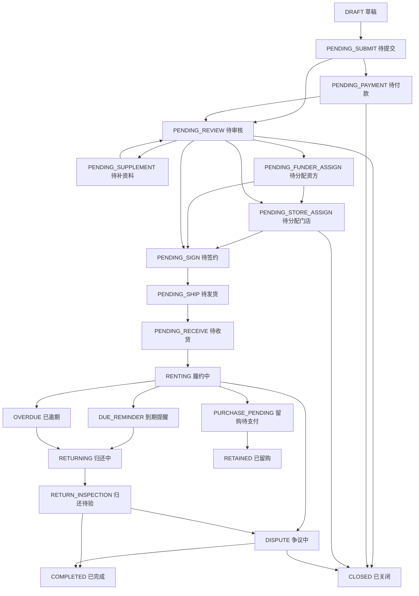
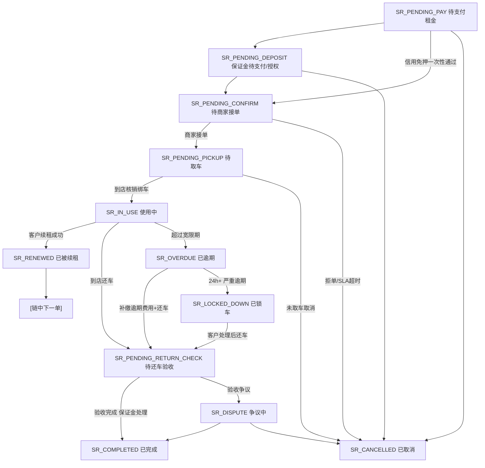

# 状态字典与订单状态机

> 全局 PRD 草案。
> 目标:统一三类长租订单、账单、支付、合同、公证、发货、设备档案、保证金、租后、客诉等状态,避免不同页面各自定义状态导致数据不互通。体验租/短租状态仅作为 V2 预留,不进入 V1 开发冻结范围。

> **⚠️ V0.2 合规口径修订(2026-05-25)**:
> - 订单状态 `BOUGHT_OUT` 改 `RETAINED`、`BUYOUT_PENDING` 改 `PURCHASE_PENDING`(措辞规范:买断→留购)
> - 设备状态补全 9 个(P1-1 决策表),新增 `DEVICE_PENDING_RESERVATION`(预约保留)

> **⚠️ V0.2 短租补全(2026-05-26)**:
> - 业务线编码统一 `assurance_rent` / `experience_rent`(全局)
> - 新增短租订单主状态机(§3.2 + §5.2)
> - 新增 §6.8 保证金状态、§6.9 控车日志状态、§6.10 续租链状态、§6.11 骑行人认证状态
> - 历史版本曾将设备状态定义为长短租共用;V0.2.1 已修订为长租设备档案与短租车辆库存分离

> **⚠️ V0.2 平台订单门店分配(2026-05-26)**:
> - §3.1 新增 `PENDING_STORE_ASSIGN` 状态(仅平台订单使用)
> - §4 三类订单差异表新增"门店分配"维度
> - §5.1 长租流转图新增分支(平台订单审核通过后进入门店分配)
> - 详见 `modules/运营端/订单管理/07_平台订单门店分配.md`

> **⚠️ V0.2 Stage 6 同步修订(2026-05-27)v1.2**:
> - 三种长租合作模式展示名统一为**商家订单 / 联营订单 / 平台订单**,底层 `cooperation_mode` 枚举保持 `self_operate / joint_venture / receivables_assignment`
> - C 端状态统一为**履约中 / 已完成**,后台 `RENTING / RETAINED` 等枚举保留
> - 新增订单关键字段快照、资方放款状态、退款工单状态、结算流水 `entry_type` 9 类枚举
> - `PENDING_FUNDER_ASSIGN` 作为待分配资方标准状态;历史 `PENDING_FUNDER` 仅作兼容别名记录,新文档优先使用标准状态

> **⚠️ V0.2.1 开发冻结修订(2026-05-27)v2.0**:
> - V1 只冻结长租主营链路;体验租/短租状态保留为 V2 预留,不进入 V1 接口、表结构和验收矩阵
> - 长租设备仅做发货/交付后的设备档案绑定,不走短租库存状态机
> - C 端正式展示不暴露资方、合作模式、资金来源、风控字眼
> - "押金"展示口径统一为"保证金";"待还款"展示口径统一为"待支付"

---

## 1. 页面说明

| 项 | 内容 |
|---|---|
| 页面名称 | 状态字典与订单状态机 |
| 所属端 | 全局基础能力 |
| 入口路径 | 开发建模 / 配置管理后续可视化 |
| 使用角色 | 产品、研发、测试、运营配置、数据分析 |
| 核心目标 | 规定状态枚举、状态流转、触发动作、权限和日志 |

---

## 2. 核心口径

1. 订单主状态只表示订单整体阶段,不能替代支付、合同、发货、账单等子状态。
2. 长租三类订单共用大状态,但审核主体、资金流、按钮权限不同。
3. **短租订单与长租订单状态机独立,不能混用枚举。**通过 `business_line` 字段区分(assurance_rent / experience_rent);V1 只实现 `assurance_rent`。
4. 所有状态变更必须有触发来源:客户、商家、运营、系统回调、定时任务。
5. 回调状态不能直接覆盖人工最终状态,冲突进入异常队列。
6. 历史订单保存状态快照和配置版本,后续配置变更不改历史。
7. 状态枚举要前后端共用,避免页面文案和后端字段不一致。
8. **数据库字段名 / API 路径 / 枚举值不因 UI 话术调整而改名**;本文只统一文档展示用语和页面文案。
9. 长租合作模式展示名统一为:商家订单(`self_operate`)、联营订单(`joint_venture`)、平台订单(`receivables_assignment`)。
10. C 端不展示合作模式、资金来源、资方名称、风控结论;合同模板和按钮话术由后台 `funding_source / terminology_template_id` 决定。
11. 长租设备状态与短租车辆库存状态分离:长租只生成设备档案,短租才使用车辆库存状态机。

---

## 3. 订单主状态

### 3.1 长租订单主状态(business_line = assurance_rent)

| 状态编码 | 状态名称 | 说明 |
|---|---|---|
| DRAFT | 草稿 | 商家/门店生成但客户未提交 |
| PENDING_SUBMIT | 待提交 | 客户填写中 |
| PENDING_PAYMENT | 待付款 | 等待首期或前置支付 |
| PENDING_REVIEW | 待审核 | 等待商家或平台审核 |
| PENDING_SUPPLEMENT | 待补资料 | 需要客户或商家补资料 |
| **PENDING_FUNDER_ASSIGN** ⭐ | **待分配资方** | 联营/平台订单未分配资方(运营端内部状态,**不暴露 C 端**);Stage 6 标准状态 |
| PENDING_FUNDER | 待分配资方 | 历史兼容别名,仅用于旧文档/旧数据迁移识别;新流程统一写 `PENDING_FUNDER_ASSIGN` |
| **PENDING_STORE_ASSIGN** ⭐ | **待分配门店** | **仅平台订单使用**;扫平台通用商品码下单时无门店信息,审核通过后由客服在合同发起前手工分配履约门店;详见 `modules/运营端/订单管理/07_平台订单门店分配.md` |
| PENDING_SIGN | 待签约 | 合同、授权、公证待完成 |
| PENDING_SHIP | 待发货 | 前置条件完成,等待发货 |
| PENDING_RECEIVE | 待收货 | 已发货或交付,等待客户确认 |
| RENTING | 履约中 | 租赁/赊销订单进入履约阶段;C 端统一显示"履约中" |
| DUE_REMINDER | 到期提醒 | 按配置进入到期提醒;不作为租后管理列表 |
| OVERDUE | 已逾期 | 账单或归还逾期 |
| RETURNING | 归还中 | 客户已申请归还或归还在途 |
| RETURN_INSPECTION | 归还待验 | 已收到设备,等待验收 |
| **PURCHASE_PENDING** | **留购待支付** | 客户申请留购待支付(原 `BUYOUT_PENDING` 已废弃) |
| COMPLETED | 已完成 | 正常归还或履约完成 |
| **RETAINED** | **已留购** | 客户留购/提前结清完成(原 `BOUGHT_OUT` 已废弃);C 端统一归入"已完成" |
| CLOSED | 已关闭 | 取消、审核拒绝、退款关闭 |
| DISPUTE | 争议中 | 客诉、验收、退款争议 |

**C 端口径**:`PENDING_FUNDER_ASSIGN`、历史别名 `PENDING_FUNDER` 和 `PENDING_STORE_ASSIGN` 都是后台内部状态,客户侧统一显示"审核中",**不暴露具体子状态**。

### 3.1.1 C 端 8 个状态 Tab

| C 端 Tab | 含义 |
|---|---|
| 全部订单 | 包含所有状态(含已取消) |
| 审核中 | 客户已提交,系统/客服在审核 |
| 待付款 | 客服已确认订单,客户需支付首期 |
| 待签约 | 首期已付,需签电子合同 / 代扣 |
| 已发货 | 订单已发出,等待物流送达 |
| 待收货 | 客户在 App 看到物流单号,收到设备后点确认收货 |
| **履约中** | 客户已确认收货,处于订单周期内 |
| 已完成 | 已完成 / 已取消(含子标签) |

### 3.1.2 后台状态到 C 端状态映射

| 后台状态 | C 端展示 |
|---|---|
| DRAFT / PENDING_SUBMIT | 不展示 |
| PENDING_REVIEW / PENDING_FUNDER_ASSIGN / PENDING_FUNDER / PENDING_STORE_ASSIGN | 审核中 |
| PENDING_PAYMENT(首期未付) | 待付款 |
| PENDING_PAYMENT(首期已付,合同未签) | 待签约 |
| PENDING_PAYMENT(合同已签,代扣未签) | 待签约 |
| PENDING_SIGN | 待签约 |
| PENDING_SHIP | 审核中 |
| PENDING_RECEIVE(已发货) | 已发货 |
| PENDING_RECEIVE(客户在 App 看到物流单号后) | 待收货 |
| RENTING | **履约中** |
| DUE_REMINDER / OVERDUE | 履约中(详情页显示逾期标签) |
| RETURNING / RETURN_INSPECTION | 履约中(归还中) |
| PURCHASE_PENDING | 履约中(申请留购/提前结清待支付) |
| COMPLETED | 已完成 |
| RETAINED | 已完成 |
| CLOSED | 已完成(已取消) |
| DISPUTE | 履约中(详情显示争议标签) |

### 3.2 短租订单主状态(business_line = experience_rent)⭐ V2 预留

> V0.2.1 冻结口径:以下短租状态仅作为体验租 V2 预留,不进入 V1 开发冻结范围。

| 状态编码 | 状态名称 | 说明 |
|---|---|---|
| SR_PENDING_PAY | 待支付租金 | 订单已创建,客户待支付租金 |
| SR_PENDING_DEPOSIT | 保证金待支付/待授权 | 租金已付,保证金待支付(实付场景)或待授权(免押/预授权场景) |
| SR_PENDING_CONFIRM | 待商家接单 | 保证金完成,商家 SLA 时钟启动 |
| SR_PENDING_PICKUP | 待取车 | 商家接单,客户应到店取车;核销码已生成 |
| SR_IN_USE | 使用中 | 客户已取车并绑定车辆;控车按钮开放 |
| SR_RENEWED | 已被续租 | 链中非活跃单(在续租链上已被新订单接续,详见短租 09) |
| SR_PENDING_RETURN_CHECK | 待还车验收 | 客户到店,门店验收中 |
| SR_COMPLETED | 已完成 | 验收完成、保证金已处理 |
| SR_CANCELLED | 已取消 | 客户取消 / 接单超时 / 拒单 |
| SR_OVERDUE | 已逾期 | 超过 rent_end_at + 宽限期未还车 |
| SR_LOCKED_DOWN | 已锁车 | 严重逾期被远程锁定,等待客户响应 |
| SR_DISPUTE | 争议中 | 保证金扣款 / 损坏 / 客诉争议 |

**与长租主状态的命名隔离原则**:短租所有状态加前缀 `SR_`,避免数据库 / 接口层混淆。

---

## 4. 三类长租订单差异

| 阶段 | 商家订单 | 联营订单 | 平台订单 |
|---|---|---|---|
| 扫码来源 | 门店专属码 | 门店专属码 | **平台通用商品码** |
| 审核 | 商家/门店自审 | 运营端审核 | 运营端审核 |
| **门店分配** | **扫码即门店,不需要** | **扫码即门店,不需要** | **⭐ 审核通过后由平台客服手工分配** |
| 资方 | 不需要 | 需要分配资方(后台) | 需要分配资方(后台) |
| 合同 | 商家可配置 | 运营端主控 | 运营端主控 |
| 支付 | 商家/平台配置 | 平台主控 | 平台主控 |
| 发货 | 默认门店 | 默认门店,可配置 | **分配后的履约门店** |
| 分账目标 | 门店结算账户(**仅后台**) | 门店/资方按规则(**仅后台**) | **分配的履约门店 + 平台(仅后台)** |
| 渠道 | 默认不统计 | 可统计 | 可统计 |
| 履约动作权限 | 门店全权 | 门店全权 | **门店仅发货/售后,无审核/改单权** |

**C 端口径**(2026-05-27 Stage 6 决策):客户感知统一为"审核中",合作模式(商家/联营/平台)不暴露 C 端;客户合同签署后**只看到"提货门店:XXX"一个字段**。

---

## 5. 订单状态流转

### 5.1 长租订单状态流转(含平台订单门店分配分支)

**流转关键说明**:
- 不是每个订单都经过所有状态。
- **商家订单**:跳过 `PENDING_FUNDER_ASSIGN` 和 `PENDING_STORE_ASSIGN`,直接 `PENDING_REVIEW → PENDING_SIGN`(若有合同)或 `→ PENDING_SHIP`。
- **联营订单**:`PENDING_REVIEW → PENDING_FUNDER_ASSIGN → PENDING_SIGN`(门店已知,不分配)。
- **平台订单**:`PENDING_REVIEW → PENDING_FUNDER_ASSIGN → PENDING_STORE_ASSIGN → PENDING_SIGN`,或不需资方时 `PENDING_REVIEW → PENDING_STORE_ASSIGN → PENDING_SIGN`。
- `PENDING_STORE_ASSIGN` 是平台订单的**硬约束前置**,未分配门店不可发起合同(合同需带商家主体)。

### 5.2 短租订单状态流转 ⭐ 新增

**路径分叉说明**:
- 信用免押场景:`SR_PENDING_PAY → SR_PENDING_CONFIRM`(跳过保证金待支付,因为租金+免押授权可一次完成)
- 实付保证金 / 预授权场景:`SR_PENDING_PAY → SR_PENDING_DEPOSIT → SR_PENDING_CONFIRM`
- 续租链场景:首租 `SR_IN_USE → SR_RENEWED`,新续租单从 `SR_PENDING_PAY` 起步
- 逾期升级:`SR_IN_USE → SR_OVERDUE → SR_LOCKED_DOWN`(详见短租 10)

---

## 6. 子状态字典

### 6.1 审核状态(长租)

| 编码 | 名称 |
|---|---|
| REVIEW_NONE | 无需审核 |
| REVIEW_WAITING | 待审核 |
| REVIEW_PROCESSING | 审核中 |
| REVIEW_SUPPLEMENT | 待补资料 |
| REVIEW_APPROVED | 审核通过 |
| REVIEW_REJECTED | 审核拒绝 |
| REVIEW_ESCALATED | 主管复核 |

### 6.2 支付状态(长租短租共用)

| 编码 | 名称 |
|---|---|
| PAY_NONE | 无需支付 |
| PAY_PENDING | 待支付 |
| PAY_PARTIAL | 部分支付 |
| PAY_SUCCESS | 已支付 |
| PAY_FAILED | 支付失败 |
| PAY_REFUNDING | 退款中 |
| PAY_REFUNDED | 已退款 |
| PAY_EXCEPTION | 支付异常 |

### 6.3 合同状态(长租)

| 编码 | 名称 |
|---|---|
| CONTRACT_NONE | 不使用合同 |
| CONTRACT_NOT_STARTED | 未发起 |
| CONTRACT_SENT | 已发起 |
| CONTRACT_SIGNING | 签署中 |
| CONTRACT_SIGNED | 已签署 |
| CONTRACT_REJECTED | 拒签 |
| CONTRACT_EXPIRED | 已过期 |
| CONTRACT_FAILED | 发起失败 |

短租仅勾选体验租服务协议(轻量),不走 e 签宝合同主流程;勾选记录在协议同意表(`customer_protocol_consent`)。

### 6.4 公证状态(长租)

| 编码 | 名称 |
|---|---|
| NOTARY_NONE | 不使用公证 |
| NOTARY_NOT_STARTED | 未发起 |
| NOTARY_PENDING_CUSTOMER | 待客户办理 |
| NOTARY_PROCESSING | 办理中 |
| NOTARY_COMPLETED | 已完成 |
| NOTARY_FAILED | 办理失败 |
| NOTARY_CANCELLED | 已取消 |

短租不使用公证。

### 6.5 发货状态(长租)

| 编码 | 名称 |
|---|---|
| SHIP_NONE | 无需发货 |
| SHIP_PENDING | 待发货 |
| SHIP_PREPARING | 备货中 |
| SHIP_SENT | 已发货 |
| SHIP_DELIVERED | 已送达 |
| SHIP_RECEIVED | 已签收 |
| SHIP_EXCEPTION | 发货异常 |

短租无发货流程,客户到店取车,使用核销码(详见短租 02 §9)。

### 6.6 短租车辆库存状态(9 个,V2 预留)

> V0.2.1 冻结口径:以下 9 状态仅服务体验租/短租车辆库存。长租不进入该状态机,只在发货/交付后生成长租设备档案。

| 编码 | 名称 | 说明 |
|---|---|---|
| DEVICE_PENDING_IN | 待入库 | 已采购/已配货,未完成入库登记 |
| DEVICE_AVAILABLE | 在库可租 | 入库完成,可对外出租 |
| **DEVICE_PENDING_RESERVATION** | **预约保留** | (新增 P1-1) 客户已扫码或办单中,设备暂时保留 |
| DEVICE_LOCKED | 已锁定 | 已支付,等待发货/客户取走 / 短租远程锁车 |
| DEVICE_RENTING | 出租中 | 已发货/已取走,在客户手中 |
| DEVICE_RETURN_PENDING | 归还待验 | 客户已归还,等待门店验收 |
| DEVICE_REPAIRING | 维修中 | 验收发现问题,送修 |
| DEVICE_DISPUTE | 争议中 | 门店与客户对设备状态有分歧 |
| DEVICE_RETIRED | 已下架 | 报废/出售二手/退还供应商/丢失/留购完成等终态;子原因写 `downgrade_reason` |

**长租设备档案规则**:
- 长租发货/门店交付时填写 IMEI / SN / VIN / 车架号等设备识别码。
- 客户确认收货后生成长租设备档案,用于订单绑定、发货证据、监管锁状态展示、归还、留购、售后记录。
- 长租不做可租库存、不做预约保留、不走短租车辆状态机。

**短租车辆库存规则(V2)**:
- 短租车辆通过短租车辆库存表管理,可复租、可预约、可取还车验收。
- 同一短租车辆同一时刻只能服务一个短租订单。

### 6.7 账单状态(长租)

| 编码 | 名称 |
|---|---|
| BILL_PENDING | 待出账 |
| BILL_UNPAID | 待支付 |
| BILL_PARTIAL | 部分支付 |
| BILL_PAID | 已结清 |
| BILL_OVERDUE | 已逾期 |
| BILL_REFUNDING | 退款中 |
| BILL_CLOSED | 已关闭 |

`bill_type` 枚举:`first / rent / service / notary / purchase / diff`(原 `buyout` 已废弃)

短租 V2 不出长租账单,使用一次性收款 + 保证金独立账户(详见短租 07)。

### 6.8 保证金状态(短租,V2 预留)

详见短租 07 §2。

| 编码 | 名称 | 说明 |
|---|---|---|
| DEPOSIT_PENDING | 待支付/待授权 | 订单已创建,保证金未完成 |
| DEPOSIT_PAID | 已支付 | 场景 A 实付完成 |
| DEPOSIT_AUTHORIZED | 已授权 | 场景 B 免押授权完成 / 场景 C 预授权冻结完成 |
| DEPOSIT_PARTIAL_DEDUCTED | 部分扣款 | 已发生扣款,剩余金额待结算 |
| DEPOSIT_PARTIAL_REFUNDED | 部分退款 | 扣款外的余额已退 |
| DEPOSIT_FULLY_REFUNDED | 全额退款 | 无扣款或免押解除授权 |
| DEPOSIT_CLOSED | 已关闭 | 终态,资金已全部结算 |

`deposit_type` 枚举:`paid_full / credit_free / preauth / mixed`(V2 预留)。

### 6.9 控车日志状态(短租)⭐ 新增

详见短租 08。

| 编码 | 名称 | 说明 |
|---|---|---|
| CONTROL_SUCCESS | 成功 | 中控台返回成功 |
| CONTROL_FAIL | 失败 | 中控台明确返回失败 |
| CONTROL_TIMEOUT | 超时 | 中控台无响应 |
| CONTROL_PENDING_CALLBACK | 待回调 | 异步命令,等待中控台回调 |
| CONTROL_UNKNOWN | 未知 | 中控台返回非标准响应 |

**控车日志独立保留,永久不删除**(审计要求)。

### 6.10 续租链状态(短租)⭐ 新增

详见短租 09。

| 编码 | 名称 | 说明 |
|---|---|---|
| CHAIN_ACTIVE | 活跃中 | 链上有当前活跃订单(SR_IN_USE 或 SR_OVERDUE) |
| CHAIN_CLOSED | 已闭链 | 链终结(客户完整还车,保证金结算完成) |
| CHAIN_DISPUTED | 争议中 | 链中订单存在保证金 / 损坏争议 |

`chain_sequence` 数字:链中订单顺序(首租=1,续租 1=2,以此类推)。

### 6.11 骑行人认证状态(短租)⭐ 新增

详见短租 06。

| 编码 | 名称 | 说明 |
|---|---|---|
| RIDER_PENDING_KYC | 待实名 | 骑行人刚创建,未完成实名 |
| RIDER_KYC_VERIFIED | 已实名 | 三要素核验通过 |
| RIDER_KYC_FAILED | 实名失败 | 三要素不一致,需要联系客服 |
| RIDER_FACE_VERIFIED | 已人脸 | 实名 + 人脸双重通过(可下单) |
| RIDER_SUSPENDED | 已冻结 | 命中黑名单 / 违规处置 |
| RIDER_DELETED | 已删除 | 客户主动删除(逻辑删除) |

### 6.12 平台订单门店分配状态(长租 / 平台订单)⭐ 新增

详见 `modules/运营端/订单管理/07_平台订单门店分配.md`。

| 字段 | 取值 / 说明 |
|---|---|
| `assigned_store_id` | 已分配的履约门店 ID(NULL = 未分配) |
| `assigned_merchant_id` | 履约门店的商家主体 ID(冗余) |
| `assigned_at` | 分配时间 |
| `assigned_by` | 客服 ID |
| `assigned_by_employee_no` | 客服工号(二次确认时输入,留痕) |
| `assigned_reassign_count` | 改派次数(初始 0)|

操作类型(`order_store_assign_log.action`):

| 编码 | 名称 |
|---|---|
| `assign` | 首次分配 |
| `reassign` | 改派 |
| `revoke` | 撤销分配(改派的前置) |

### 6.13 订单关键字段快照(长租 / Stage 6)

以下字段用于支撑三种合作模式、资方话术、合同模板、监管锁和资金放款链路。字段名为开发约束,不因 UI 话术变化而更名。

| 字段 | 取值 / 说明 |
|---|---|
| `cooperation_mode` | 合作模式:`self_operate`(商家订单) / `joint_venture`(联营订单) / `receivables_assignment`(平台订单) |
| `funding_source` | 资金来源:`platform_self` / `funder_blue_ocean` / 后续资方编码 |
| `funder_id` | 资方 ID;`funding_source = platform_self` 时可为空 |
| `contract_template_id` | 合同模板 ID;由合作模式、资方和后台人工选择共同决定 |
| `terminology_template_id` | C 端话术模板 ID;决定"申请留购 / 提前结清"等按钮与弹窗文案 |
| `lock_status` | 监管锁状态快照;具体枚举以监管锁管理文档为准 |
| `risk_status` | 风控状态快照;具体枚举以风控/资方分配文档为准 |
| `disbursement_status` | 资方放款状态快照:未触发 / 条件检查中 / 放款中 / 成功 / 失败 / 已撤销 |

### 6.14 `settlement_entry.entry_type` 枚举(9 类)

详见 `modules/运营端/财务管理/07_门店结算账户与资金穿透架构.md` §3.3。

| 编码 | 中文名 | 资金方向 |
|---|---|---|
| `order_settlement` | 订单结算款 | 入账 |
| `monthly_split` | 月度分账 | 入账 |
| `joint_venture_profit` | 联营收益 | 入账 |
| `platform_reward` | 平台奖励 | 入账 |
| `platform_rebate` | 平台返利 | 入账 |
| `platform_deduction` | 平台扣减 | 出账 |
| `refund_deduction` | 退款扣减 | 出账 |
| `withdrawal` | 提现 | 出账 |
| `financial_adjustment` | 财务调账 | 入账 / 出账 |

### 6.15 `funder_disbursement_log.status` 枚举

详见 `modules/运营端/资方管理/04_资方放款条件与触发机制.md`。

| 编码 | 名称 | 说明 |
|---|---|---|
| `pending` | 放款中 | 已触发资方放款或平台自营出款流程,等待结果 |
| `success` | 放款成功 | 资方放款或平台自营出款成功,可进入结算穿透 |
| `failed` | 放款失败 | 资方接口失败、人工拒绝或条件不满足 |
| `rolled_back` | 已撤销 | 撤单 / 退款链路触发放款撤销或台账还原 |

### 6.16 `refund_workflow.status` 枚举

详见 `modules/运营端/订单管理/10_订单撤单与补充合同.md` 和 `modules/运营端/财务管理/06_财务流水模型与对账规则.md`。

| 编码 | 名称 | 说明 |
|---|---|---|
| `pending` | 待处理 | 已生成退款工单,等待责任方处理 |
| `merchant_paid` | 门店已转账 | 门店线下转账 / 平台确认资金到位 |
| `refunded_customer` | 已退客户 | 客户侧退款完成 |
| `refunded_funder` | 已退资方 | 资方台账还原 / 退款完成 |
| `completed` | 已完成 | 退款工单闭环 |

---

## 7. 状态变更触发源

| 触发源 | 长租示例 | 短租示例 |
|---|---|---|
| 客户操作 | 提交订单、支付、签署、申请归还、申请留购 | 下单、支付、取车扫码、续租、还车、关机 |
| 商家操作 | 审核商家订单、发货、上传材料、归还验收 | 接单、核销、还车验收、保证金扣款 |
| 运营操作 | 审核、分配资方、**分配履约门店**(平台订单)、发起合同、退款、关闭 | 代接单、代核销、保证金大额审批、逾期费用减免 |
| 系统回调 | 支付成功、合同签署、公证完成、物流签收 | 支付成功、免押授权、中控台控车回调 |
| 定时任务 | 锁定超时释放、账单逾期、合同过期、**待分配门店超时预警** | 接单 SLA 超时、租期到期、逾期升级、24h 锁车、预授权到期 |
| 外部系统 | 风控报告、催收系统回调、监管锁回调 | 中控台 Webhook、芝麻信用回调、地理围栏触发 |

---

## 8. 状态日志

每次状态变更必须记录:

| 字段 | 说明 |
|---|---|
| 对象类型 | 订单、账单、合同、设备、保证金、控车、续租链、骑行人、**门店分配**、投诉等 |
| 对象 ID | 业务 ID |
| 业务线 | assurance_rent / experience_rent |
| 原状态 | 变更前 |
| 新状态 | 变更后 |
| 触发源 | 客户、商家、运营、系统、外部 |
| 操作人 | 人工操作时记录 |
| **操作人工号** | 关键操作(如门店分配)需额外记录工号 |
| 回调编号 | 系统回调时记录 |
| 变更原因 | 审核意见、失败原因、备注 |
| 配置版本 | 使用的规则版本 |
| 时间 | 发生时间 |

---

## 9. 业务线编码统一(V0.2 修订)

| 旧 | 新 | 用途 |
|---|---|---|
| long_rent | **assurance_rent** | 长租(安心用) |
| short_rent | **experience_rent** | 短租(体验租) |

新编码全局统一,数据库 / 接口 / 配置 / 埋点 / 状态变更日志 / 钱包流水均使用新编码。短租业务文档 05 v1.1 已同步;开发期请按新编码实施 migration。

---

## 10. 修订记录

| 日期 | 修订 | 说明 |
|---|---|---|
| 2026-05-24 | v1.0 | 初版,定义长租订单主状态机和 6 个子状态字典 |
| 2026-05-25 | §3 §5 | `BUYOUT_PENDING`→`PURCHASE_PENDING`;`BOUGHT_OUT`→`RETAINED`;后台状态文案当时调整为"已留购",C 端后续按 v1.2 统一归入"已完成" |
| 2026-05-25 | §6.6 | 设备状态补 `DEVICE_PENDING_RESERVATION`(预约保留),共 9 状态(P1-1) |
| 2026-05-25 | §6.7 §7 | bill_type 枚举 `buyout` 改 `purchase`;客户触发源补"申请留购" |
| 2026-05-26 | §3.2 §5.2 §6.8-6.11 §9 v1.1 | **短租补全**:1. §3.2 新增短租主状态机(SR_* 前缀);2. §5.2 新增短租状态流转图;3. §6.6 当时设备状态定义为长短租共用;4. §6.8 保证金状态;5. §6.9 控车日志状态;6. §6.10 续租链状态;7. §6.11 骑行人认证状态;8. §9 业务线编码统一为 assurance_rent / experience_rent |
| 2026-05-27 | v2.0 | **V0.2.1 开发冻结修订**:1. V1 只冻结长租主营链路,短租状态标为 V2 预留;2. 长租设备档案与短租车辆库存状态机分离;3. 保证金/待支付展示口径同步;4. 删除未定义的 `PENDING_RETURN` C 端映射 |
| 2026-05-26 | §3.1 §4 §5.1 §6.12 §7 §8 | **平台订单门店分配**:1. §3.1 新增 `PENDING_STORE_ASSIGN` 状态(仅平台订单);2. §4 三类订单差异表新增"门店分配"维度行;3. §5.1 长租流转图新增 `PENDING_STORE_ASSIGN` 分支;4. §6.12 新增门店分配状态字段表;5. §7 运营操作补"分配履约门店";6. §8 状态日志增"操作人工号"字段。详见 `modules/运营端/订单管理/07_平台订单门店分配.md` |
| 2026-05-27 | v1.2 | **Stage 6 同步修订**:1. 三种合作模式展示名统一为商家/联营/平台订单;2. `PENDING_FUNDER_ASSIGN` 作为待分配资方标准状态,保留 `PENDING_FUNDER` 兼容别名;3. C 端状态统一履约中 / 已完成,并补后台状态到 C 端状态映射;4. 新增订单关键字段快照;5. 新增 `entry_type` 9 类、`funder_disbursement_log.status`、`refund_workflow.status` 枚举 |

---

## 11. 待确认

1. 商家订单是否需要独立"商家审核中"主状态,还是用审核子状态表达。
2. 到期提醒默认提前几天进入 `DUE_REMINDER`,短租在 §3.2 / 短租 10 已定义(默认到期前 30 分钟通过 SLA 推送,不进入独立 DUE_REMINDER 状态)。
3. 争议中是否冻结全部财务动作,还是按争议类型冻结。
4. 短租 SR_LOCKED_DOWN 状态是否需要再细分(车辆已锁 vs 车辆未响应锁车命令)。
5. 平台订单 `PENDING_STORE_ASSIGN` 超时(默认 24h 未分配)的告警阈值是否需要按订单金额分级。
