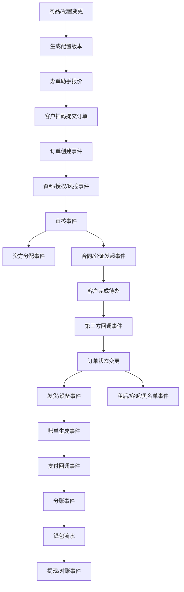

# 数据模型与事件流总表

> 所属：全局基础能力
> 目标：把页面级 PRD 收敛成业务对象、数据归属、事件触发和跨端联动，保证后续不是“页面能看”，而是订单、财务、设备、渠道、合同、租后真正互通。

---

## 1. 建模原则

1. 页面不直接决定数据结构，业务对象决定数据结构。
2. 订单是主线，但不能把合同、支付、设备、财务都塞进订单表。
3. 所有金额必须有来源单据和流水，不允许只更新余额字段。
4. 所有第三方结果必须先进入回调事件，再驱动业务状态变更。
5. 历史订单保存价格快照、配置版本和链路版本，后续配置变更不影响历史。
6. 多端共享同一业务对象，不允许运营端、商家端、门店端各建一套状态。

---

## 2. 核心业务对象

| 对象 | 说明 | 主归属 | 关联 |
|---|---|---|---|
| 商家/门店 | 入驻主体、老板账号、资料、授权 | 商家中心 / 运营店铺管理 | 员工、商品、订单、钱包、渠道 |
| 员工账号 | 商家分配给店员的办单账号 | 商家端 | 门店、角色、办单记录 |
| 商品 | 展示与售卖配置 | 运营端 / 商家端 | 规格、价格、增值服务、办单助手 |
| 规格 | 全新、二手、容量、颜色、设备指导价 | 商品管理 | 商品、价格、库存 |
| 设备 | 唯一实物，短租和交付必需 | 库存设备管理 | 商品规格、仓库、订单、监管锁 |
| 订单 | 三类订单主对象 | 订单中心 | 客户、商家、商品、账单、合同、发货、财务 |
| 客户 | 租客实名资料和历史行为 | 用户管理 | 订单、资料、风控、客诉、租后 |
| 账单 | 每期应收与实收 | 财务管理 | 订单、支付、分账、逾期 |
| 支付流水 | 通道支付结果 | 财务管理 | 账单、订单、回调 |
| 分账流水 | 门店、资方、渠道、平台收益拆分 | 财务管理 | 账单、钱包、资方、渠道 |
| 钱包账户 | 商家、资方、渠道账户 | 财务管理 | 分账、提现、冻结、对账 |
| 合同/公证 | 签署、公证、补充合同 | 合同公证 | 订单、客户待办、附件、回调 |
| 渠道 | 推广归属和佣金 | 渠道管理 | 商家、订单、佣金、提现 |
| 租后案件 | 逾期、催收、法务、回款 | 租后管理 | 订单、账单、客户、外部催收 |
| 客诉 | 支付宝投诉和平台客诉 | 客诉管理 | 订单、客户、处理记录 |
| 配置版本 | 链路、租赁、审核、财务等配置快照 | 配置管理 | 订单、账单、事件 |
| 操作日志 | 人工和系统动作 | 权限日志 | 所有业务对象 |
| 回调事件 | 第三方异步结果 | 通道接口配置 | 支付、合同、公证、风控、物流、监管锁 |

---

## 3. 主键与跨端共享

| 对象 | 建议主键 | 跨端展示 |
|---|---|---|
| 商家 | `merchant_id` | 运营端、商家端、渠道端 |
| 门店 | `store_id` | 运营端、商家端、门店手机端 |
| 员工 | `staff_id` | 商家端、门店手机端 |
| 商品 | `product_id` | 运营端、商家端、办单助手 |
| 规格 | `sku_id` | 商品页、办单助手、订单快照 |
| 设备 | `device_id` | 库存、发货、门店扫码、订单详情 |
| 订单 | `order_id` | 运营端、商家端、门店端、C 端、渠道端 |
| 账单 | `bill_id` | 订单详情、客户还款、财务 |
| 支付流水 | `payment_id` | 财务、订单详情、对账 |
| 分账流水 | `allocation_id` | 钱包、对账、资方账单 |
| 钱包账户 | `wallet_id` | 商家钱包、资方账户、渠道账户 |
| 回调事件 | `callback_event_id` | 回调日志、订单详情、异常队列 |

---

## 4. 事件流总览

---

## 5. 关键事件表

| 事件 | 触发源 | 影响对象 |
|---|---|---|
| 商品同步办单助手 | 运营/商家 | 商品池、办单助手 |
| 报价生成 | 门店端 | 价格快照、二维码 |
| 订单创建 | 客户扫码 | 订单、客户、渠道、商品快照 |
| 客户资料提交 | 客户 | 客户资料、订单审核状态 |
| 风控授权完成 | 客户/回调 | 风控报告、订单审核状态 |
| 审核通过 | 商家/运营 | 订单状态、合同、支付、发货条件 |
| 资方分配 | 运营 | 订单资方、额度占用、分账规则 |
| 合同发起 | 运营/系统 | 合同记录、客户待办 |
| 公证发起 | 运营/系统 | 公证记录、客户待办 |
| 支付成功 | 回调 | 支付流水、账单、订单、分账 |
| 设备出库 | 门店/运营 | 设备状态、发货记录、订单 |
| 客户签收 | 客户/物流 | 发货状态、订单起租、账单计划 |
| 账单逾期 | 定时任务 | 账单、订单、租后案件 |
| 分账完成 | 系统 | 钱包、资方账户、渠道佣金 |
| 提现成功 | 财务/通道 | 钱包余额、打款流水 |
| 退款冲正 | 财务 | 支付、账单、分账、钱包、对账 |

---

## 6. 跨模块数据读写边界

| 模块 | 允许写入 | 只能读取 |
|---|---|---|
| 商品管理 | 商品、规格、价格、同步配置 | 订单快照 |
| 办单助手 | 报价快照、二维码 | 商品、规格、增值服务 |
| 订单管理 | 订单状态、审核、备注、补资料 | 商品基础配置、客户资料、财务流水 |
| 财务管理 | 账单、支付、分账、钱包、提现、对账 | 订单、客户脱敏信息、商家信息 |
| 设备库存 | 设备状态、出入库、验收 | 订单、商品规格 |
| 合同公证 | 合同、公证、附件、回调状态 | 订单、客户资料 |
| 渠道管理 | 渠道、归属、佣金规则 | 订单、商家、财务流水 |
| 租后管理 | 租后案件、跟进、回款动作 | 订单、账单、客户资料 |
| 客诉管理 | 投诉、回复、处理状态 | 订单、支付、客户资料 |

---

## 7. 必须保留的快照

| 快照 | 保存时机 | 原因 |
|---|---|---|
| 商品快照 | 下单时 | 商品后续改价不影响历史订单 |
| 价格快照 | 办单助手生成二维码时 | 客服改价前后可追溯 |
| 配置版本 | 订单创建和关键动作时 | 链路配置变更可追责 |
| 分账规则快照 | 审核通过或资方分配时 | 后续还款按锁定规则分账 |
| 合同模板快照 | 发起合同时 | 合同版本可追溯 |
| 渠道归属快照 | 订单创建时 | 后续渠道变更不影响历史佣金 |

---

## 8. 验收标准

1. 任一订单能从订单详情跳到商品快照、客户资料、合同公证、账单、分账、设备、日志。
2. 任一钱包流水能追到订单、账单、支付流水和分账规则。
3. 任一设备能追到当前订单和历史出入库记录。
4. 任一回调事件能看到原始报文、验签结果、处理状态、重试记录和关联业务对象。
5. 任一配置版本能看到影响范围和使用中的订单。
