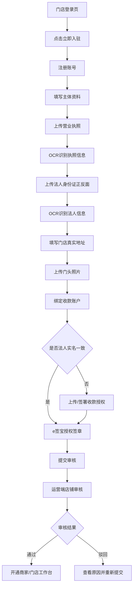

# 商家端门店入驻

> 页面级 PRD 草案。  
> 参考已观察 H5 页面：门店登录页点击 `立即入驻` 后进入门店入驻页。  
> 目标：让新商户从手机号注册、资料认证、收款账户、e 签宝授权，到提交运营端审核形成完整闭环。

---

## 1. 页面说明

| 项 | 内容 |
|---|---|
| 页面名称 | 门店入驻 |
| 所属端 | 门店手机端 / 商家 H5，后续可同步到商家 PC 端 |
| 入口路径 | 门店登录页 > 立即入驻 |
| 使用角色 | 新商户老板、个体户负责人、门店负责人 |
| 核心目标 | 完成商家主体注册、资质认证、收款账户绑定、签章授权，并提交运营端审核 |
| 审核结果 | 审核通过后，该账号成为商家主体账号，可登录商家 PC 端和门店手机端 |

---

## 2. 流程总览

---

## 3. 页面与步骤

### 3.1 注册账号

| 字段 | 类型 | 必填 | 说明 |
|---|---|---|---|
| 手机号 | 文本 | 是 | 商家主账号手机号 |
| 登录密码 | 密码 | 是 | 用于手机号密码登录 |
| 确认密码 | 密码 | 是 | 与登录密码一致 |
| 邀请码 | 文本 | 否 | 渠道推广码或运营邀请码 |
| 短信验证码 | 文本 | 是 | 校验手机号 |
| 协议勾选 | 复选框 | 是 | 服务协议、隐私政策、入驻合同 |

按钮：

| 按钮 | 结果 |
|---|---|
| 获取验证码 | 调用短信接口，进入倒计时 |
| 注册 | 校验账号信息，通过后进入资料填写 |
| 立即登录 | 返回门店登录页 |

规则：

1. 手机号不能重复注册同一主体。
2. 如手机号已存在未完成入驻申请，进入继续完善资料页面。
3. 如手机号已是审核通过商家账号，提示直接登录。
4. 邀请码如果来自渠道推广码，需要自动绑定渠道来源。

### 3.2 主体资料

| 字段 | 类型 | 必填 | 说明 |
|---|---|---|---|
| 主体类型 | 单选 | 是 | 企业 / 个体户 / 个人商户预留 |
| 店铺名称 | 文本 | 是 | 对外展示和后台管理名称 |
| 联系人 | 文本 | 是 | 店铺负责人 |
| 联系电话 | 文本 | 是 | 可默认注册手机号 |
| 经营类目 | 多选 | 是 | 手机、电动车、平板、电脑等 |
| 所在地区 | 省市区 | 是 | 门店所在行政区 |
| 详细地址 | 文本 | 是 | 门店真实经营地址 |
| 地图定位 | 地图选点 | 建议必填 | 选择门店实际位置 |

规则：

1. 店铺名称后续可修改，但关键资料变更需要运营审核。
2. 经营类目影响后续商品、设备、监管锁、短租能力。
3. 地址要同时保存文本地址和经纬度。

### 3.3 营业执照上传与 OCR

| 字段 | 类型 | 必填 | 说明 |
|---|---|---|---|
| 营业执照照片 | 图片上传 | 是 | 支持拍照和相册 |
| 统一社会信用代码 | OCR/文本 | 是 | 可识别后人工修正 |
| 主体名称 | OCR/文本 | 是 | 从营业执照识别 |
| 法定代表人 | OCR/文本 | 是 | 从营业执照识别 |
| 注册地址 | OCR/文本 | 是 | 从营业执照识别 |
| 营业期限 | OCR/日期 | 可选 | 有效期信息 |

规则：

1. OCR 识别后必须展示给用户确认。
2. 用户修改 OCR 字段时，要记录修改前后。
3. 图片必须保存原件和压缩预览。
4. OCR 失败允许手动填写，但运营端需标记 `OCR失败/人工填写`。

### 3.4 法人身份证上传与 OCR

| 字段 | 类型 | 必填 | 说明 |
|---|---|---|---|
| 身份证人像面 | 图片上传 | 是 | 法人身份证正面 |
| 身份证国徽面 | 图片上传 | 是 | 法人身份证反面 |
| 法人姓名 | OCR/文本 | 是 | 从身份证识别 |
| 身份证号 | OCR/文本 | 是 | 从身份证识别，前端展示需脱敏 |
| 有效期 | OCR/日期 | 是 | 身份证有效期 |
| 证件地址 | OCR/文本 | 可选 | 从身份证识别 |

规则：

1. 身份证号前端和列表默认脱敏展示。
2. 身份证有效期过期不允许提交，或进入人工审核高风险提示。
3. 法人姓名应与营业执照法定代表人一致；不一致必须提示并由运营端复核。

### 3.5 门店实景资料

| 字段 | 类型 | 必填 | 说明 |
|---|---|---|---|
| 门头照片 | 图片上传 | 是 | 证明真实经营场所 |
| 店内照片 | 图片上传 | 可选 | 后续可按类目要求必填 |
| 门店地址定位 | 地图 | 是 | 保存经纬度 |
| 经营说明 | 文本 | 可选 | 特殊经营情况说明 |

规则：

1. 门头照片应在运营端审核页可放大查看。
2. 地图定位和文本地址偏差较大时，运营端提示复核。
3. 后续可接入定位水印或拍摄时间，但 V1 先保留字段。

### 3.6 收款账户

| 字段 | 类型 | 必填 | 说明 |
|---|---|---|---|
| 收款方式 | 单选 | 是 | 支付宝账号 / 银行卡 |
| 账户名 | 文本 | 是 | 收款账户实名 |
| 支付宝账号 | 文本 | 条件必填 | 选择支付宝时填写 |
| 银行卡号 | 文本 | 条件必填 | 选择银行卡时填写，展示脱敏 |
| 开户行 | 文本 | 条件必填 | 选择银行卡时填写 |
| 预留手机号 | 文本 | 可选 | 银行卡校验需要时填写 |
| 是否法人本人账户 | 单选 | 是 | 是 / 否 |
| 授权材料 | 图片/文件/签署 | 条件必填 | 非法人账户时必须提交授权 |

规则：

1. 收款账户默认要求与法人实名一致。
2. 如果不是法人本人账户，必须上传授权材料或完成线上授权签署。
3. 收款账户变更需要重新审核。
4. 所有账号在列表和日志中必须脱敏展示。

### 3.7 e 签宝授权签章

| 字段/状态 | 类型 | 说明 |
|---|---|---|
| 授权状态 | 状态 | 未发起、授权中、已完成、失败、已过期 |
| 授权主体 | 只读 | 营业执照主体或法人 |
| 授权用途 | 说明 | 授权平台后续用于合同签署 |
| 授权链接 | 按钮 | 调起 e 签宝授权 |
| 回调时间 | 只读 | e 签宝返回时间 |
| 授权文件 | 文件 | 授权完成后的凭证 |

规则：

1. 入驻流程必须有 e 签宝授权节点。
2. 授权未完成可以保存草稿，但不建议允许正式提交审核；如允许提交，运营端必须标记 `签章授权未完成`。
3. 授权失败可以重新发起。
4. 授权完成状态需要同步到运营端店铺审核。

---

## 4. 状态流转

| 状态 | 说明 | 用户可操作 |
|---|---|---|
| 未注册 | 仅打开入驻页 | 注册 |
| 资料草稿 | 已注册但资料未提交 | 继续编辑、保存草稿 |
| 待提交 | 必填资料已完成 | 提交审核 |
| 审核中 | 运营端正在审核 | 查看进度，不可改关键资料 |
| 驳回待修改 | 运营端驳回 | 查看原因，修改后重新提交 |
| 审核通过 | 入驻成功 | 登录门店/商家工作台 |
| 已暂停 | 后台暂停商家 | 只读查看，联系平台 |
| 已注销 | 主体不再合作 | 不允许登录业务后台 |

---

## 5. 提交校验

提交审核前必须校验：

1. 手机号已验证。
2. 协议已勾选。
3. 营业执照已上传并完成 OCR 确认。
4. 法人身份证正反面已上传并完成 OCR 确认。
5. 门店真实地址和地图定位已填写。
6. 门头照片已上传。
7. 收款账户已填写。
8. 非法人收款账户已补授权。
9. e 签宝授权已完成或明确标记为待补。
10. 邀请码/渠道码如存在，已绑定渠道来源。

---

## 6. 异常与提示

| 场景 | 页面处理 |
|---|---|
| 手机号已注册 | 提示直接登录或继续未完成入驻 |
| 短信验证码错误 | 提示验证码错误或过期 |
| OCR 识别失败 | 允许手动填写，标记人工填写 |
| 身份证过期 | 阻止提交或进入高风险人工审核 |
| 法人与执照不一致 | 提示不一致，运营端高亮 |
| 收款账户非本人 | 要求提交授权材料 |
| e 签宝授权失败 | 展示失败原因，允许重新发起 |
| 图片上传失败 | 允许重试，保留已填字段 |
| 审核驳回 | 展示驳回原因和需修改字段 |

---

## 7. 数据字段

| 数据对象 | 关键字段 |
|---|---|
| merchant_application | application_id、status、source_channel_id、invite_code、submitted_at、reviewed_at |
| merchant_account | mobile、password_hash、login_status、last_login_at |
| merchant_profile | merchant_name、entity_type、business_category、contact_name、contact_mobile |
| business_license | license_image、credit_code、entity_name、legal_person、registered_address、license_period |
| legal_person_idcard | front_image、back_image、name、id_no_encrypted、id_no_masked、valid_period |
| store_profile | store_name、province、city、district、address、longitude、latitude、door_photo |
| settlement_account | account_type、account_name、account_no_encrypted、account_no_masked、bank_name、is_legal_person_account |
| authorization | auth_type、auth_status、auth_file、callback_payload_summary |
| esign_authorization | provider、auth_status、auth_url、auth_file、callback_at |

---

## 8. 权限与安全

1. 入驻申请人只能查看和编辑自己的申请。
2. 审核中状态不允许修改关键资料，除非运营端退回。
3. 身份证号、银行卡号、支付宝账号必须加密存储、脱敏展示。
4. 图片资料需做访问权限控制，不能公开访问。
5. 短信验证码、登录失败、资料提交、授权回调都要记录日志。
6. 入驻通过后，同一手机门店 H5 默认 30 天免登录，高风险操作需要二次验证。

---

## 9. 与其他模块关系

| 模块 | 关系 |
|---|---|
| 运营端店铺审核 | 接收入驻申请并审核 |
| 商家 PC 端 | 审核通过后可登录 |
| 门店手机端 | 审核通过后可使用办单助手和待办 |
| 渠道管理 | 邀请码/推广码绑定渠道来源 |
| e 签宝合同 | 入驻时完成签章授权，后续合同签署复用 |
| 财务钱包 | 收款账户审核通过后生成商家钱包/提现账户 |
| 员工管理 | 入驻通过后老板可创建员工账号 |
| 操作日志 | 记录资料提交、修改、授权、审核结果 |

