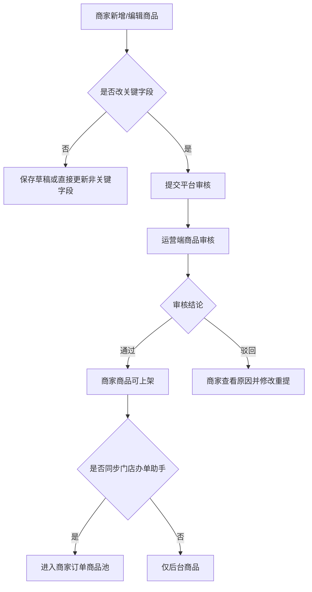

# 商家商品与增值服务

> **Stage 6 术语同步(2026-05-27)**: 本文档已按 Stage 6 统一为商家、联营、平台订单、订单结算款、我的钱包、履约中、逾期费用、留购、保证金等展示术语；数据库字段、API 路径、英文枚举保持不变。

> 页面级 PRD 草案。
> 目标：让商家在 PC 端维护自己的商家订单商品、规格、租期、增值服务和办单助手同步，同时接入运营端商品审核与复制商品能力。

> **⚠️ V0.2 Peer Review 修订(2026-05-27)v1.1**:
> - 商品规格按“规格组 + 规格值 + SKU 价格矩阵”维护。
> - 指导价仅校验设备价;商家订单超指导价上限可二次确认继续提交。
> - 商品列表主 Tab 统一为:上架中 / 已下架 / 待审核 / 草稿。

---

## 1. 页面说明

| 项 | 内容 |
|---|---|
| 页面名称 | 商家商品与增值服务 |
| 所属端 | 商家 PC 端 |
| 入口路径 | 商品管理 > 商品列表 / 增值服务 |
| 使用角色 | 商家老板、商家管理员、商品运营、店员只读或无权限 |
| 核心目标 | 商家维护商家订单商品和服务配置，并查看平台复制商品、审核状态、办单助手同步状态 |

商家端商品管理不是运营端商品管理的简化表格。它要解决门店日常开单的真实问题：哪些商品能开商家订单、哪些商品能同步办单助手、哪些增值服务默认收取、哪些商品还在等平台审核。

---

## 2. 核心口径

1. 商家只能管理自己的商品和平台复制给自己的商品副本。
2. 商家自建商品必须提交运营端审核，通过后才能上架和同步商家订单办单助手。
3. 平台复制给商家的商品进入商家商品库，商家可按权限确认、编辑、上架或停用。
4. 商家订单商品和增值服务由商家主控，联营订单、平台订单商品池仍由运营端主控。
5. 商家商品可选择是否同步到商家订单办单助手；不完整的规格不能同步。
6. 全新、二手、99新、95新等必须作为同一商品下的规格/成色，不要求重复创建商品。
7. 短租商品必须关联设备库存和唯一设备码，否则只能作为展示商品，不能进入短租办单助手。
8. 商家商品、价格、规格、服务变更必须保留版本和操作日志。

---

## 3. 商品列表

商家端商品列表顶部使用 4 个状态 Tab:

| Tab | 说明 | 商家可操作 |
|---|---|---|
| 上架中 | 审核通过且已上架,可用于 C 端/办单助手 | 查看、编辑非关键字段、下架、生成商品二维码 |
| 已下架 | 商家主动下架或平台强制下架 | 查看、重新上架申请、查看下架原因 |
| 待审核 | 已提交平台审核 | 查看进度、撤回草稿(未进入审核时)、查看驳回原因 |
| 草稿 | 未提交审核 | 编辑、删除草稿、提交审核 |

状态流转:

```text
草稿 → 提交审核 → 待审核 → 平台审核通过 → 上架中
                         └→ 平台驳回 → 草稿(展示驳回原因)
上架中 → 商家下架 → 已下架
上架中 → 平台违规下架 → 已下架(展示违规原因)
已下架 → 重新上架 → 待审核
```

### 3.1 筛选条件

| 字段 | 类型 | 说明 |
|---|---|---|
| 商品名称 | 文本 | 支持模糊搜索 |
| 商品来源 | 下拉 | 自建商品、平台复制商品 |
| 类目 | 级联 | 手机、电动车、平板、短租车辆等 |
| 品牌 | 下拉/搜索 | 可按类目过滤 |
| 审核状态 | 下拉 | 草稿、待审核、已通过、已驳回、复审中 |
| 上下架状态 | 下拉 | 上架、下架、冻结 |
| 租赁模式 | 下拉 | 长租、短租、长短租 |
| 同步办单助手 | 下拉 | 未同步、已同步、部分规格同步、同步失败 |
| 规格类型 | 多选 | 全新、二手、成色、容量、颜色、是否含电池 |

### 3.2 列表字段

| 字段 | 说明 |
|---|---|
| 商品图/商品名称 | 点击进入商品详情 |
| 商品来源 | 自建商品、平台复制商品 |
| 类目/品牌 | 基础信息 |
| 规格摘要 | 全新、二手、容量、颜色、成色、是否含电池 |
| 租赁模式 | 长租、短租、长短租 |
| 可用租期 | 月租期、天租、周租、小时租等摘要 |
| 增值服务 | 已绑定服务数量和必选服务 |
| 商家订单办单助手 | 已同步、未同步、部分同步、同步失败 |
| 审核状态 | 待审核、已通过、已驳回 |
| 上下架状态 | 上架、下架、冻结 |
| 操作 | 查看、编辑、提交审核、上架、下架、同步、复制、日志 |
| 商品二维码 | 上架中商品可生成;二维码锁定商品、SKU、价格方案版本 |

---

## 4. 新增/编辑商品

### 4.1 基础信息

| 字段 | 类型 | 规则 |
|---|---|---|
| 商品名称 | 文本 | 必填 |
| 商品来源 | 只读 | 自建或平台复制 |
| 类目 | 级联 | 必填，决定规格字段 |
| 品牌 | 下拉/搜索 | 必填 |
| 商品主图 | 上传 | 必填 |
| 轮播图 | 上传 | 可多张 |
| 商品详情 | 富文本/图片 | 可选 |
| 商品卖点 | 文本 | 可选 |
| 适用租赁模式 | 多选 | 长租、短租 |
| 是否允许商家订单 | 开关 | 默认是 |
| 是否同步门店办单助手 | 开关 | 商品总开关 |
| 上架状态 | 开关 | 审核通过后才可上架 |

### 4.2 规格配置

| 字段 | 类型 | 说明 |
|---|---|---|
| 规格组名称 | 文本 | 商家自定义，例如设备成色、颜色、容量、电池 |
| 规格值 | 多值文本 | 商家手动维护，例如全新、二手、白色、黑色、黄色 |
| SKU 组合 | 自动生成/可编辑 | 根据规格组和值组合生成，如全新+黑色+有电池 |
| 设备价 | 金额 | 办单助手计算基础,读取设备指导价区间 |
| 指导价区间 | 只读 | 低于下限记录日志;高于上限商家订单警告后可提交 |
| 成本价 | 金额 | 仅商家老板和授权管理员可见 |
| 库存数量 | 数字 | 当前长租不使用；短租库存后续由设备库存模块接入 |
| 可用租赁模式 | 多选 | 当前只展示长租；短租后续单独需求包接入 |
| 可用计费单位 | 多选 | 当前长租按配置支持天/月等；小时/周短租后续接入 |
| 可用租期 | 配置 | 可配置，不写死 |
| 保证金规则 | 配置 | 固定、比例、免押、补充保证金 |
| 留购规则 | 配置 | 到期留购、提前留购、不可留购 |
| 设备库存要求 | 开关/提示 | 仅短租使用；当前长租不要求库存 |
| 是否同步办单助手 | 开关 | 规格维度控制 |

规则：

1. 商品下可以同时存在全新规格和二手规格。
2. 规格价格、租期、保证金、留购规则不完整时，不允许同步办单助手。
3. 平台复制商品的关键字段可由运营端限制是否允许商家修改。
4. 规格变更后，历史订单和已生成二维码按原价格方案快照执行。
5. 每个 SKU 可选择简单价格模式或逐期自定义模式;逐期金额之和必须与订单总额校验一致。

---

## 5. 增值服务

### 5.1 服务列表

| 字段 | 说明 |
|---|---|
| 服务名称 | 商家自定义展示名 |
| 服务类型 | 服务费、设备管理费、公证费、配送费、保障服务、保证金类等 |
| 默认金额 | 固定金额、比例、按期、按天 |
| 是否必选 | 办单助手默认勾选且不可取消 |
| 是否允许改价 | 商家老板/管理员是否可在开单或审核中调整 |
| 适用商品/规格 | 可绑定全部商品、指定商品、指定规格 |
| 收取节点 | 下单、审核通过、发货前、按期账单 |
| 是否可退 | 影响退款和冲正 |
| 财务归属 | 商家收入、保证金、平台代收、成本项 |
| 状态 | 启用、停用 |

### 5.2 服务绑定规则

1. 商家端创建的增值服务默认只用于商家订单。
2. 平台可在运营端配置商家可用的服务类型和字段范围。
3. 商品编辑页可以绑定增值服务，服务可按规格和租赁模式区分。
4. 必选服务必须在客户扫码下单页、办单助手价格预览、订单详情中拆开展示。
5. 客服或商家审核商家订单时，可以按权限添加、移除或改价非必选服务。
6. 订单保存服务快照，后续服务停用不影响历史订单。

---

## 6. 平台复制商品处理

平台复制商品进入商家端后，商家看到待确认任务。

| 场景 | 商家操作 |
|---|---|
| 运营复制单个商品 | 查看商品、确认接收、补库存/租期、上架 |
| 运营批量复制商品 | 批量确认、批量停用不经营商品 |
| 商品需要商家确认 | 未确认前不进入办单助手 |
| 运营强制同步 | 展示被同步字段、影响规格和版本日志 |
| 商家不经营该商品 | 可停用，不影响平台商品 |

复制后商品是商家的商品副本，不直接共享平台主商品记录。

---

## 7. 审核流程



关键字段包括：商品名称、类目、规格、指导价、租期、保证金、留购规则、增值服务、同步办单助手开关。

---

## 8. 办单助手同步

| 同步对象 | 规则 |
|---|---|
| 商品 | 商品审核通过、上架、总开关开启 |
| 规格 | 规格启用、价格完整、租期完整 |
| 增值服务 | 服务启用、适用该商品/规格 |
| 短租设备 | 设备库存可用时才可进入短租开单 |
| 二维码 | 生成时锁定商品、规格、服务、价格方案版本 |

同步失败必须提示失败原因，例如：规格价格缺失、短租无可用设备、增值服务冲突、商品未审核通过。

---

## 9. 权限与员工限制

| 角色 | 商品权限 | 增值服务权限 | 办单助手权限 |
|---|---|---|---|
| 商家老板 | 全部 | 全部 | 全部 |
| 商家管理员 | 可按授权范围管理 | 可按授权范围管理 | 可同步/生成二维码 |
| 店员账号 | 默认不可编辑商品 | 默认不可编辑服务 | 只使用办单助手办单 |
| 财务角色 | 只读价格和费用 | 可看财务归属 | 不参与开单 |

店员账号不允许看到成本价、钱包、分账、提现、商家财务明细。

---

## 10. 日志与版本

必须记录：

1. 商品新增、编辑、删除草稿。
2. 商品提交审核、审核通过、审核驳回。
3. 平台复制商品、商家确认、商家停用。
4. 规格价格、租期、保证金、留购规则变更。
5. 增值服务创建、绑定、改价、停用。
6. 同步办单助手成功/失败。
7. 二维码生成时使用的商品和价格方案版本。

---

## 11. 待确认

1. 商家自建增值服务是否需要运营审核后才能用于商家订单。
2. 平台复制商品是否默认要求商家确认后上架，还是允许运营直接上架。
3. 商家端是否开放批量导入商品，还是 V1 只支持手工新增和平台复制。
