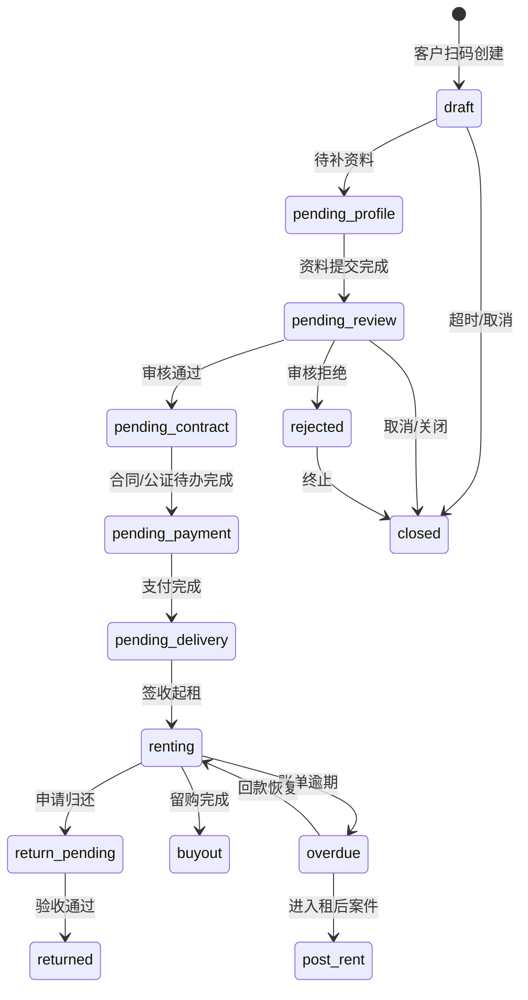

# 状态机与事件流细化

> [历史参考 / V0.2.2 口径覆盖] 本文为早期状态机细化。V0.2.2 唯一状态机以 `modules/全局/02_状态字典与订单状态机.md` 为准;若本文出现旧订单类型、旧资金来源或旧分配内部资金来源口径,仅作历史参考。

> 所属：开发设计
> 目标：把订单、审核、合同、公证、支付、发货、设备、财务、租后、客诉的状态流转写成开发可执行规则，避免后端只做字段改值。

---

## 1. 状态机原则

1. 每个状态变更必须由业务事件触发。
2. 状态只能按允许路径推进，不允许任意覆盖。
3. 第三方回调只产生回调事件，由 worker 触发业务状态推进。
4. 失败状态必须有重试、人工补偿或终止路径。
5. 主状态和子状态要保持一致，但不能互相替代。

---

## 2. 订单主状态



关键规则：

- 商家订单审核通过后可直接进入合同/支付/发货链路，由商家主控。
- 联营订单、平台订单必须由运营审核通过后才能分配内部资金来源和发起后续链路。
- 任何关闭动作必须处理账单、支付、钱包、设备占用和合同待办。

---

## 3. 审核状态

| 当前状态 | 触发事件 | 下一状态 | 约束 |
|---|---|---|---|
| `waiting` | `OrderCreated` | `pending_review` | 资料完整后进入 |
| `pending_review` | `ReviewLocked` | `reviewing` | 锁单后才能操作 |
| `reviewing` | `MoreMaterialsRequested` | `waiting_materials` | 客户侧生成待办 |
| `waiting_materials` | `CustomerProfileSubmitted` | `pending_review` | 回到审核 |
| `reviewing` | `OrderApproved` | `approved` | 写审核记录 |
| `reviewing` | `OrderRejected` | `rejected` | 必须写原因 |
| `approved` | `FunderAssigned` | `funder_assigned` | 仅分红/平台订单 |

异常：

- 审核锁超时：释放锁并写日志。
- 改价超过阈值：进入 `approval_required`，主管通过后继续。
- 疑似黑名单：不改变客户侧状态，只在审核端提示严格审核。

---

## 4. 合同和公证状态

| 对象 | 状态流 |
|---|---|
| 合同 | `not_created -> created -> signing -> completed / failed / expired` |
| 补充合同 | `not_created -> created -> signing -> completed / failed / expired` |
| 公证 | `not_created -> processing -> completed / failed / expired` |
| 客户待办 | `pending -> completed / expired / cancelled` |

事件流：

```text
OrderApproved
  -> ContractRequested
  -> CustomerTodoCreated
  -> Mock/第三方回调 received
  -> CallbackEventStored
  -> CallbackConsumeWorker
  -> ContractCompleted 或 ContractFailed
```

补偿：

- 合同发起失败：允许重发。
- 合同已签但订单已关闭：进入人工异常。
- 公证超时：进入异常队列，可重试或人工关闭。

---

## 5. 支付、账单、分账状态

### 5.1 账单状态

```text
unpaid -> paying -> paid
unpaid -> overdue
paid -> refunded_partial / refunded_full
paid -> reversed
```

### 5.2 支付状态

```text
created -> pending -> success / failed / closed
success -> refunding -> refunded_partial / refunded_full
```

### 5.3 分账状态

```text
pending -> calculated -> posted / failed
posted -> reversed
```

事件流：

```text
PaymentCallbackSuccess
  -> PaymentSucceeded
  -> BillPaid
  -> AllocationCreated
  -> WalletEntryPosted
  -> ReconciliationPending
```

金额规则：

- 商家订单：支付金额扣平台抽佣后进入门店钱包。
- 联营订单：按门店/资方比例拆分后，双方分别扣平台抽佣。
- 平台订单：全额归资方或平台资金主体，再扣平台抽佣。

异常：

- 支付金额不平：进入财务异常，不推进账单。
- 重复回调：只记录重复，不重复入账。
- 退款和冲正：保留原流水，生成反向流水。

---

## 6. 发货、设备、归还状态

### 6.1 发货状态

```text
not_ready -> pending_materials -> ready_to_ship -> shipped -> signed -> exception
```

### 6.2 设备状态

```text
in_stock -> locked_for_order -> delivered -> renting -> return_pending -> in_stock
renting -> locked_by_control
return_pending -> dispute / in_repair / retired
```

事件流：

```text
PaymentSucceeded
  -> ShipmentCreated
  -> DeviceBoundToOrder
  -> DeliveryEvidenceUploaded
  -> CustomerSigned
  -> RentStarted
```

约束：

- 短租订单必须绑定唯一设备。
- 客户签收前必须校验交付照片和配件清单。
- 签收起租要同时推进订单、设备、账单。

---

## 7. 渠道状态

| 对象 | 状态流 |
|---|---|
| 渠道 | `draft -> active -> paused -> disabled` |
| 推广码 | `active -> expired / disabled` |
| 佣金 | `pending -> confirmed -> wallet_posted -> reversed` |

佣金事件：

```text
MerchantApplicationCreated
  -> ChannelAttributionBound
OrderPaid
  -> if order_type in dividend/platform
  -> CommissionCreated
  -> WalletEntryPosted
```

商家订单不触发渠道佣金。

---

## 8. 租后状态

```text
none -> overdue_warning -> overdue -> case_open -> syncing_external -> in_collection -> recovered / closed / legal
```

触发：

- 账单到期未付：进入逾期。
- 逾期天数达到配置：生成租后案件。
- 外部催收启用：同步案件并记录同步日志。

约束：

- 租后案件必须能回到订单、账单、客户、设备和合同资料。
- 回款后要同步账单和案件状态。

---

## 9. 客诉状态

```text
received -> matched_order -> pending_reply -> replied -> closed
received -> pending_manual_match -> matched_order
```

事件流：

```text
ComplaintCallbackReceived
  -> ComplaintCreated
  -> MatchOrderContext
  -> ComplaintPendingReply
  -> ComplaintReplied
  -> ComplaintClosed
```

约束：

- 未匹配订单的投诉进入待匹配队列。
- 回复和关闭都必须写操作日志。
- 客诉详情要展示订单上下文，但敏感字段脱敏。

---

## 10. 回调统一处理状态

```text
received -> verified -> queued -> consumed -> applied
received -> verify_failed
queued -> consume_failed -> retrying -> consumed
queued -> manual_required
```

幂等规则：

- `provider + business_type + external_event_id` 唯一。
- 重复回调返回成功接收，但不重复执行业务。
- 乱序回调不得让业务状态倒退。

---

## 11. 人工补偿入口

| 异常 | 补偿动作 |
|---|---|
| 回调验签失败 | 只记录，不允许人工直接改为成功 |
| 合同发起失败 | 重发合同或换通道 |
| 公证超时 | 重试、换通道、人工关闭 |
| 支付金额不平 | 财务异常处理，禁止前端改金额绕过 |
| 分账失败 | 重算分账或进入人工冲正 |
| 发货材料缺失 | 门店补传 |
| 设备状态冲突 | 设备异常处理 |
| 投诉未匹配订单 | 人工匹配订单 |

所有人工补偿都必须记录操作人、原因、前状态、后状态和关联单据。
