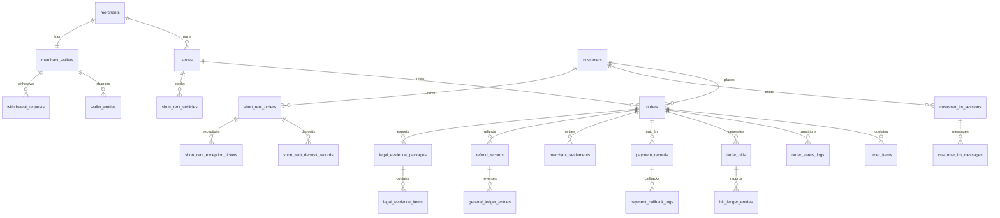

# V0.2.2 ERD 字段索引与幂等键补丁

> 本文是 `00_V0.2.1_核心数据模型总表.md` 的开发评审补丁。目标是把“建议模型”推进到研发可评审的 ERD 级别，但仍不创建 migration、不修改业务代码。

## 1. 建模原则

1. 订单业务账、支付流水账、钱包/商家账户账、财务总账/分录账必须分表,不能混写。
2. 所有资金动作必须有 `biz_ref_type + biz_ref_id + idempotency_key` 或等价唯一约束。
3. 所有状态表必须有状态日志表,不能只更新主表状态。
4. C 端显示字段和内部字段必须分层,不允许在 C 端 DTO 直接透出内部资金来源、合作模式、风控结论。
5. 长租发货只绑定设备识别码档案;短租才绑定车辆库存状态机。
6. 任何附件、视频、IM、合同、公证、监管锁记录都必须能归入法诉证据包。

## 2. 核心 ERD 文字版

## 3. P0 表字段和唯一约束

### 3.1 订单主表 `orders`

| 字段 | 说明 |
|---|---|
| `order_id` | 主键 |
| `order_no` | 业务单号,全局唯一 |
| `business_line` | `long_rent` / `experience_rent` |
| `order_type` | 内部枚举:`merchant` / `joint` / `platform` |
| `order_type_label` | 展示名:商家订单 / 联营订单 / 平台订单 |
| `merchant_id` / `store_id` / `customer_id` | 主体关联 |
| `status` | 唯一订单状态机 |
| `price_snapshot_id` | 报价快照 |
| `funding_source_id` | 内部资金来源,禁止 C 端展示 |
| `created_channel` | alipay/wechat/h5/app/assistant |

唯一约束:

- `uk_orders_order_no(order_no)`
- `idx_orders_customer_status(customer_id, status)`
- `idx_orders_merchant_status(merchant_id, status)`

### 3.2 账单表 `order_bills`

| 字段 | 说明 |
|---|---|
| `bill_id` | 主键 |
| `order_id` | 订单 |
| `period_no` | 期数,首期可为 0 或 1,需技术统一 |
| `bill_type` | rent/service/deposit/overdue_fee/retain_purchase/short_rent_fee/short_rent_extra_fee |
| `amount_due` / `amount_paid` / `amount_refunded` | 应付/已付/已退 |
| `status` | unpaid/partial_paid/paid/overdue/reduced/reversed/refunded/closed/legal |
| `issued_at` / `due_at` | 出账/到期 |

约束:

- `uk_order_bill_period_type(order_id, period_no, bill_type)`
- 账单生成后任何人不得直接修改金额;变更必须走冲正/补收/减免/退款/核销。

### 3.3 支付流水 `payment_records`

| 字段 | 说明 |
|---|---|
| `payment_id` | 主键 |
| `order_id` / `bill_id` | 业务关联 |
| `channel` | allinpay/xinlian/alipay/wechat/offline |
| `channel_trade_no` | 通道交易号 |
| `payment_scene` | first_pay/bill_pay/deposit/short_rent/renewal/refund_repay/recovery |
| `amount` | 金额 |
| `status` | pending/success/failed/refunded/closed |
| `idempotency_key` | 发起幂等键 |

唯一约束:

- `uk_payment_channel_trade(channel, channel_trade_no)`
- `uk_payment_idempotency(idempotency_key)`

### 3.4 钱包流水 `wallet_entries`

| 字段 | 说明 |
|---|---|
| `wallet_entry_id` | 主键 |
| `wallet_id` | 商家/渠道/内部账户钱包 |
| `direction` | in/out/freeze/unfreeze/reverse |
| `biz_type` | settlement/service_fee/rebate/withdraw/refund/reversal/short_rent_income |
| `amount` | 金额 |
| `ref_type` / `ref_id` | 关联业务 |
| `balance_before` / `balance_after` | 余额快照 |
| `idempotency_key` | 入账幂等键 |

唯一约束:

- `uk_wallet_entry_idempotency(wallet_id, idempotency_key)`
- 钱包流水只服务商家/门店视角,不能替代财务总账。

### 3.5 总账分录 `general_ledger_entries`

| 字段 | 说明 |
|---|---|
| `entry_id` | 主键 |
| `journal_id` | 同一业务分录批次 |
| `account_code` | 会计科目 |
| `debit_amount` / `credit_amount` | 借贷金额,必须一借一贷平衡 |
| `biz_ref_type` / `biz_ref_id` | 业务关联 |
| `reversal_of` | 冲正原分录 |
| `posted_at` | 入账时间 |

约束:

- 同一 `journal_id` 借贷合计必须相等。
- 总账只给财务对账和经营报表使用,客服和商家端不直接读取。

### 3.6 办单助手配置版本 `assistant_config_versions`

| 字段 | 说明 |
|---|---|
| `config_version_id` | 配置版本 ID,报价快照必须引用 |
| `scope_type` | merchant/joint/platform/category/product/store/city |
| `scope_id` | 适用范围 ID,为空表示平台默认 |
| `category` | phone/electric_vehicle/other |
| `rate_base` | unpaid_x_rate/price_x_rate/remaining_multiplier |
| `periods` | 可选期数数组,如 [6,9,12] |
| `down_payment_ratios` | 可选首付成数数组 |
| `rate_matrix_snapshot` | 费率二维表快照,行=期数,列=首付成数 |
| `remaining_multiplier` | 当 `rate_base=remaining_multiplier` 时使用 |
| `first_rent_amount_cent` | 首期租金,分 |
| `nominal_retain_fee_cent` | 名义留购费,分 |
| `status` | draft/published/disabled |
| `published_at` | 发布时间 |
| `created_by` / `updated_by` | 操作人 |

约束:

- `config_version_id` 一经报价引用不得物理删除。
- 费率、期数、首付成数、名义留购费修改必须生成新版本,不得覆盖已发布版本。

### 3.7 办单助手增值服务项 `assistant_value_added_services`

| 字段 | 说明 |
|---|---|
| `service_id` | 服务项 ID |
| `config_version_id` | 所属办单助手配置版本 |
| `name` | 客户可见服务名称 |
| `amount_type` | fixed/percentage/options |
| `amount_cent` / `rate` | 固定金额或比例 |
| `options_snapshot` | 可选金额档位,如 50/150/250 元 |
| `default_checked` | 默认勾选 |
| `force_checked` | 强制勾选 |
| `charge_in` | first_pay/bill/standalone |
| `in_buyout_total` | 是否计入留购总价 |
| `display_to_customer` | C 端是否展示 |

约束:

- `service_id + config_version_id` 唯一。
- `force_checked=true` 时 C 端不得允许客户取消。
- `charge_in` 决定首期支付单、账单计划或独立支付单的生成位置。

### 3.8 办单助手报价快照 `quote_snapshots`

| 字段 | 说明 |
|---|---|
| `quote_snapshot_id` | 报价快照 ID |
| `quote_no` | 报价编号,展示和二维码使用 |
| `config_version_id` | 使用的办单助手配置版本 |
| `order_type` / `order_type_label` | merchant/joint/platform 及展示名 |
| `merchant_id` / `store_id` | 出码主体 |
| `product_snapshot` / `sku_snapshot` | 商品和规格快照 |
| `device_price_cent` / `guide_price_cent` | 设备价/指导价,分 |
| `periods` / `down_payment_ratio` | 期数与首付成数 |
| `rate_base` | unpaid_x_rate/price_x_rate/remaining_multiplier |
| `rate_value` / `remaining_multiplier` | 费率值或系数 |
| `selected_services_snapshot` | 增值服务项快照,含 service_id/charge_in/in_buyout_total/force_checked/default_checked |
| `deposit_amount_cent` | 保证金/押金,分 |
| `first_rent_amount_cent` | 首期租金,分 |
| `first_pay_amount_cent` | 首期实付,分 |
| `monthly_amount_cent` | 后期每期应付,分 |
| `nominal_retain_fee_cent` | 名义留购费,分 |
| `retain_total_amount_cent` | 留购总价,分 |
| `bill_plan_snapshot` | 逐期账单与逐期留购价快照 |
| `qrcode_payload_hash` | 二维码 payload hash |
| `expires_at` / `status` | 过期时间和状态 |
| `created_by` | 出码操作员 |

约束:

- `uk_quote_no(quote_no)`。
- `quote_snapshot_id` 被订单引用后不可改,改价/改单必须生成新快照。
- 客户扫码下单只读取快照,不得重新读取当前配置。

## 4. 短租核心表补丁

| 表 | 必须唯一键 | 关键状态 |
|---|---|---|
| `short_rent_products` | `uk_short_product_standard_name(standard_name, category_id)` | draft/active/disabled |
| `short_rent_vehicles` | `uk_vehicle_identifier(identifier_type, identifier_value)` | available/reserved/pending_pickup/in_use/pending_return/inspection/repair/offline/lost |
| `short_rent_orders` | `uk_short_order_no(order_no)` | pending_payment/pending_acceptance/pending_pickup/in_use/pending_return/inspection/completed/refunded/cancelled/exception |
| `short_rent_deposit_records` | `uk_deposit_order(short_order_id)` | pending/paid/authorized/frozen/partial_deducted/refunded/disputed/closed |
| `short_rent_exception_tickets` | `idx_exception_order_type(short_order_id, exception_type)` | pending/processing/customer_disputed/resolved/closed |

## 5. IM 和证据包表补丁

| 表 | 唯一键/索引 | 说明 |
|---|---|---|
| `customer_im_sessions` | `idx_im_customer_status(customer_id, status)` | 按客户汇总会话 |
| `customer_im_messages` | `uk_im_client_message(session_id, client_message_id)` | 防重复发消息 |
| `customer_im_context_cards` | `idx_im_context_order(order_id, short_order_id)` | 会话进入时自动带业务上下文 |
| `customer_tickets` | `uk_ticket_no(ticket_no)` | IM、电话、异常统一工单 |
| `legal_evidence_packages` | `idx_legal_order_version(order_id, package_version)` | 法诉证据包 |
| `legal_evidence_items` | `idx_legal_package_type(package_id, item_type)` | 每项证据归档 |

## 6. 技术评审必须确认

| 问题 | 推荐口径 |
|---|---|
| 金额字段类型 | 数据库用 decimal 或 bigint 分制二选一,接口已按“分”描述 |
| 期数从 0 还是 1 开始 | 建议首期与第一期统一用 `period_no=1`,特殊首付款用 `bill_type=first_pay` |
| 多租户隔离字段 | 所有主表加 `tenant_id`,唯一键按租户维度扩展 |
| 审计日志保留期 | 资金/合同/证据链永久或长期归档,普通操作至少 3 年 |
| 附件 hash | 法诉证据项必须保存文件 hash 和来源表,防止后续举证缺口 |
