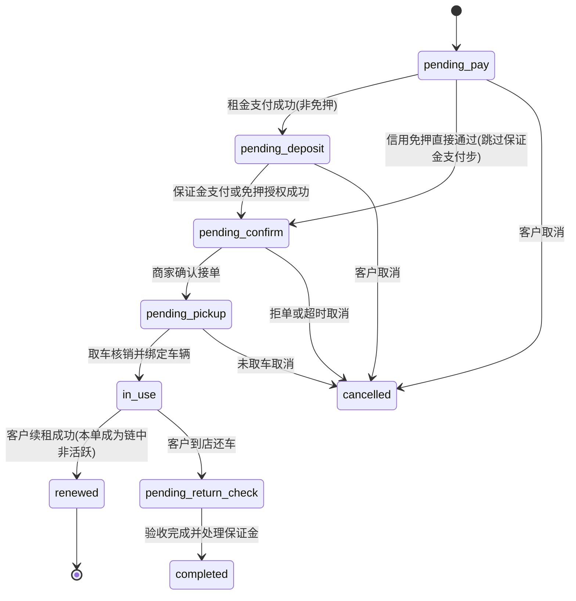

# 体验租数据模型与状态机

> **Stage 6 术语同步(2026-05-27)**: 本文档已按 Stage 6 统一为商家、联营、平台订单、订单结算款、我的钱包、履约中、逾期费用、留购、保证金等展示术语；数据库字段、API 路径、英文枚举保持不变。

> 本文定义体验租短租的核心数据和状态。命名为产品级草案,开发时需按工程规范转换为 migration 和接口字段。
>
> **本版 v1.1 修订(2026-05-25)** 配合 P0 阻断级问题修复:
> - Q1 状态命名:车辆状态统一使用 `DEVICE_*` 大写枚举,与 `modules/全局/02_状态字典与订单状态机.md` 一致
> - Q2 设备表归属:采用「`devices` 全局主表 + `short_rent_vehicle_ext` 短租扩展表」双表结构
> - Q6 平台自营字段:`short_rent_order` 补 `asset_owner_*` / `settlement_owner_*` / `fulfillment_store_id` / `fulfillment_fee_*`
> - 订单状态机补 `renewed`(配合 09 续租链)
> - 保证金表用 07 文档修正版(4 种保证金场景字段不再重叠)
> - 资金事件补 `fulfillment_fee_paid` / `platform_asset_income`

---

## 1. 核心枚举

### 1.1 业务线

| 枚举 | 说明 |
|---|---|
| `assurance_rent` | 安心用长租 |
| `experience_rent` | 体验租短租 |

### 1.2 体验租经营模式

| 枚举 | 说明 |
|---|---|
| `store_self_operated` | 门店自营(资产 = 门店;履约 = 门店) |
| `platform_self_operated` | 平台自营(资产 = 平台;履约 = 平台直营门店 / 平台指定仓店) |
| `platform_asset_store_fulfillment` | 平台货源,门店履约(资产 = 平台;履约 = 商家门店) |

### 1.3 租赁周期

| 枚举 | 说明 |
|---|---|
| `one_hour` | 1 小时 |
| `two_hour` | 2 小时 |
| `four_hour` | 4 小时 |
| `same_day` | 当日还 |
| `day` | 日租 |
| `week` | 周租 |
| `month` | 月租 |
| `season` | 季租,后续可关 |

---

## 2. 短租订单状态(v1.1 新增 `renewed`)

| 状态 | 说明 | 主要动作 |
|---|---|---|
| `pending_pay` | 待支付租金 | 支付、取消 |
| `pending_deposit` | 保证金待支付或免押待授权 | 支付保证金、免押授权、取消 |
| `pending_confirm` | 待商家确认接单 | 确认接单、拒绝接单、取消 |
| `pending_pickup` | 待取车 | 核销、扫码绑车、取消 |
| `in_use` | 已取车 / 使用中 | 控车、续租、还车 |
| `renewed` ⭐ | 已被续租(链中非活跃单) | 仅查询,详见 `09_续租链与父子订单.md` |
| `pending_return_check` | 待还车验收 | 确认车况、保证金扣款 |
| `completed` | 已完成 | 退款查询、再次租用 |
| `cancelled` | 已取消 | 退款查询 |

状态流:



**路径分叉**:
- 信用免押场景:`pending_pay → pending_confirm`(跳过 `pending_deposit`,因为租金 + 免押授权可一次完成)
- 实付/预授权场景:`pending_pay → pending_deposit → pending_confirm`

---

## 3. 车辆/设备状态(Q1 修订)

**v1.1 修订**:统一使用 `DEVICE_*` 大写枚举,与 `modules/全局/02_状态字典与订单状态机.md §6.6` 一致。

| 状态 | 说明 |
|---|---|
| `DEVICE_PENDING_IN` | 待入库 |
| `DEVICE_AVAILABLE` | 在库可租 |
| `DEVICE_PENDING_RESERVATION` | 预约保留 |
| `DEVICE_LOCKED` | 已锁定(已支付待取车 / 远程锁车) |
| `DEVICE_RENTING` | 出租中 |
| `DEVICE_RETURN_PENDING` | 归还待验 |
| `DEVICE_REPAIRING` | 维修中 |
| `DEVICE_DISPUTE` | 争议中 |
| `DEVICE_RETIRED` | 已下架 |

长租不使用此短租车辆状态机。长租只在交付节点记录设备识别码(`devices` 主表)。

**与本文档历史版本对照**(开发期请注意命名迁移):

| 旧名(v1.0) | 新名(v1.1) |
|---|---|
| pending_inbound | DEVICE_PENDING_IN |
| available | DEVICE_AVAILABLE |
| reserved_hold | DEVICE_PENDING_RESERVATION |
| locked | DEVICE_LOCKED |
| in_use | DEVICE_RENTING |
| pending_check | DEVICE_RETURN_PENDING |
| maintenance | DEVICE_REPAIRING |
| dispute | DEVICE_DISPUTE |
| offline | DEVICE_RETIRED |

---

## 4. 核心表

### 4.1 `short_rent_product`

短租商品/车型扩展表。

| 字段 | 说明 |
|---|---|
| product_id | 商品 ID |
| standard_name | 体验租标准商品名,启用后用于配置、库存、订单和统计 |
| display_name | C 端展示标题,可与标准名不同 |
| category_id | 品类 |
| vehicle_no | 车型编号 |
| support_short_rent | 是否支持体验租 |
| name_locked | 是否锁定标准商品名 |
| default_price_plan_id | 平台默认价格方案 |
| status | 启用/停用 |

锁定规则:

1. `support_short_rent = true` 且已绑定价格方案、车辆库存或体验租订单后,`standard_name`、`vehicle_no`、核心类目不允许直接修改。
2. `display_name` 可用于 C 端运营展示,允许按权限调整,但订单快照仍记录当时展示标题和标准商品名。
3. 如需调整标准名,必须创建新商品/新车型档案,并通过迁移工具把价格方案和库存重新绑定。
4. 直接修改标准名属于高风险动作,第一版不开放普通编辑入口。

### 4.2 `short_rent_price_plan`

| 字段 | 说明 |
|---|---|
| plan_id | 方案 ID |
| owner_type | platform / merchant / store |
| owner_id | 归属主体 |
| store_id | 门店,平台默认可为空 |
| product_id | 商品/车型 |
| cycle_type | 租赁周期 |
| rent_price | 租金 |
| deposit_amount | 保证金标准额(对应 `short_rent_deposit.amount_required`) |
| preauth_amount | 预授权金额(场景 C 用,与 deposit_amount 通常一致或更高) |
| credit_free_amount | 免押额度(场景 B 用,= deposit_amount) |
| enabled | 是否启用 |
| effective_at / expired_at | 生效和失效时间 |

**生效优先级**(同 product_id 同 cycle_type 多条方案冲突时):

```
门店专属(owner_type=store) > 商家全局(owner_type=merchant) > 平台默认(owner_type=platform)
同优先级冲突 → 以 effective_at 最新者为准
```

### 4.3 设备/车辆模型(Q2 修订)

**v1.1 修订**:采用「全局设备主表 + 短租扩展表」双表结构,解决 P0 Q2(`devices` vs `short_rent_vehicle` 二选一冲突)。

#### 4.3.1 `devices` 全局设备主表(共享长租+短租)

| 字段 | 说明 |
|---|---|
| device_id | 设备 ID(主键) |
| tenant_id | 租户 ID(多租户隔离) |
| identifier_type | 唯一码类型:vin / sn / imei |
| identifier_value | 唯一码值(加密存储) |
| identifier_hash | 唯一码 SHA256(查重/黑名单) |
| product_id | 关联商品 |
| device_status | DEVICE_* 9 状态(本文 §3) |
| current_order_id | 当前关联订单(若有) |
| created_at / updated_at | - |

**用途**:
- 短租车辆:`identifier_type = vin / sn / imei`,后续在 `short_rent_vehicle_ext` 维护短租专有信息
- 长租设备(发货时录入):`identifier_type = imei / sn`,**不在 `short_rent_vehicle_ext` 维护**

**唯一约束**:`(tenant_id, identifier_hash)` 全局唯一。

#### 4.3.2 `short_rent_vehicle_ext` 短租扩展表

仅短租车辆使用,与 `devices` 一对一关联。

| 字段 | 说明 |
|---|---|
| ext_id | 扩展记录 ID |
| device_id | 关联 devices(一对一) |
| merchant_id | 所属商家(门店自营场景 = 实际拥有者) |
| store_id | 所属门店(同上) |
| operation_mode | 经营模式(§1.2) |
| **asset_owner_type** | 资产归属类型:platform / merchant |
| **asset_owner_id** | 资产归属 ID(平台主体 ID 或商家 ID) |
| device_no | 中控设备号(冗余,便于排障) |
| plate_no | 车牌号(若有) |
| current_location_lat / current_location_lng | 实时定位(中控同步) |
| last_order_id | 最近订单 |
| created_at / updated_at | - |

**判定规则**:
- 该 device 是否为短租车辆 = `short_rent_vehicle_ext.device_id IS NOT NULL`
- 库存查询(C 端附近门店可租车型)= `JOIN devices ON short_rent_vehicle_ext.device_id WHERE devices.device_status = 'DEVICE_AVAILABLE'`

#### 4.3.3 唯一约束与业务约束

- `devices.identifier_hash` 全局唯一
- `short_rent_vehicle_ext.device_id` 唯一(防止一对多)
- `devices.device_no` (短租车辆) 不能重复
- 已绑定未完成订单的车辆(`current_order_id IS NOT NULL`)不能再次出租
- 状态为 `DEVICE_RETIRED` 的车辆,历史订单仍可处理,但不能新增订单

### 4.4 `short_rent_order`(Q6 修订)

**v1.1 修订**:补充资产归属、结算归属、履约门店、履约费等字段,支持 3 种经营模式的清晰记账。

| 字段 | 说明 |
|---|---|
| order_id / order_no | 订单 ID / 订单号 |
| customer_id | 客户 |
| rider_id | 骑行人(详见 `06_骑行人模型.md`) |
| product_id | 商品/车型 |
| vehicle_id | 取车后绑定的设备 ID(= devices.device_id) |
| merchant_id | 商家 ID(经营主体)|
| store_id | 名义归属门店(下单时选择的门店)|
| operation_mode | 经营模式(§1.2)|
| **asset_owner_type** ⭐ | 资产归属类型:platform / merchant |
| **asset_owner_id** ⭐ | 资产归属 ID |
| **settlement_owner_type** ⭐ | 结算归属类型:platform / merchant |
| **settlement_owner_id** ⭐ | 结算归属 ID |
| **fulfillment_store_id** ⭐ | 实际履约门店(平台自营场景可能 ≠ store_id)|
| **fulfillment_fee_rate** ⭐ | 履约服务费率(平台货源-门店履约场景下,平台给履约门店的比例)|
| **fulfillment_fee_fixed** ⭐ | 履约固定费(可选)|
| order_type | first_rent / renewal(详见 `09_续租链与父子订单.md`) |
| **rental_chain_id** ⭐ | 续租链 ID(详见 09)|
| parent_order_id | 续租父订单(首租为 NULL)|
| **chain_sequence** ⭐ | 在链中的顺序(首租=1)|
| **is_chain_active** ⭐ | 是否为链中当前活跃订单 |
| cycle_type / cycle_num | 租赁周期 |
| planned_pickup_at | 预约取车时间 |
| rent_start_at / rent_end_at | 实际起止时间 |
| return_at | 还车时间 |
| status | 短租订单状态(§2)|
| rent_amount | 租金 |
| deposit_amount | 保证金额(冗余,实际保证金状态见 short_rent_deposit) |
| paid_amount | 已付金额 |
| refund_amount | 已退金额 |
| deduction_amount | 保证金扣款 |
| price_snapshot | 价格快照(下单时锁定的方案)|
| store_snapshot | 门店快照(下单时锁定的门店信息)|
| business_line | `experience_rent`(固定) |

**3 种经营模式下字段取值**:

| 字段 | store_self_operated | platform_self_operated | platform_asset_store_fulfillment |
|---|---|---|---|
| merchant_id | 商家 ID | 平台主体 ID | 商家 ID |
| store_id | 门店 ID | 平台直营门店 / 仓店 ID | 商家门店 ID |
| asset_owner_type | merchant | platform | platform |
| asset_owner_id | 商家 ID | 平台主体 ID | 平台主体 ID |
| settlement_owner_type | merchant | platform | merchant(履约) + platform(资产) |
| settlement_owner_id | 商家 ID | 平台主体 ID | 主商家 ID(履约) |
| fulfillment_store_id | = store_id | = store_id | = store_id(商家门店) |
| fulfillment_fee_rate | NULL | NULL | 例 0.30(平台给履约门店 30% 履约费) |

### 4.5 `short_rent_deposit`(Q4 修订 — 详见 07 文档)

**v1.1 修订**:用 `07_保证金免押与扣款规则.md §2.1` 的修正版结构,4 种保证金场景字段不重叠。

| 字段 | 说明 |
|---|---|
| deposit_id | 保证金记录 |
| deposit_chain_id | 保证金链 ID(同条续租链复用,详见 `09_续租链与父子订单.md`)|
| order_id | 关联订单(首租订单)|
| deposit_type | paid_full / credit_free / preauth / mixed(V2) |
| amount_required | 应缴保证金额 |
| amount_paid | 实付金额 |
| amount_authorized | 授权金额(免押额度 / 预授权额度)|
| amount_deducted | 累计已扣金额 |
| amount_refunded | 累计已退金额 |
| credit_source | zhima / wechat_score / platform_internal |
| credit_authorization_no | 免押授权号 |
| preauth_channel_no | 预授权通道单号 |
| preauth_expired_at | 预授权到期时间 |
| status | pending / paid / authorized / partial_deducted / partial_refunded / fully_refunded / closed |

详细字段定义、状态流、4 种场景取值对照见 `07_保证金免押与扣款规则.md §2`。

### 4.6 `short_rent_fund_entries`

记录租金、保证金、扣款、退款、平台抽成、门店/商家收入、履约费等资金动作。

| 字段 | 说明 |
|---|---|
| entry_id | 流水 ID |
| order_id | 关联订单 |
| rental_chain_id | 续租链 ID(若适用)|
| wallet_id | 关联钱包 |
| event_type | 见 §5 资金事件 |
| direction | in / out |
| amount | 金额 |
| channel | 资金通道(alipay / wechat / bank / internal) |
| account_owner_type | platform / merchant / store / customer |
| account_owner_id | 账户归属 ID |
| business_line | `experience_rent`(固定) |
| description | 备注 |
| created_at | - |

### 4.7 `short_rent_control_log` 控车日志(详见 08 文档)

详细字段定义见 `08_控车日志与异常处置.md §2.1`。

### 4.8 `short_rent_overdue_event` 逾期事件(详见 10 文档)

详细字段定义见 `10_体验租逾期与SLA规则.md §8.1`。

### 4.9 `short_rent_rental_chain` 续租链(详见 09 文档)

详细字段定义见 `09_续租链与父子订单.md §2.2`。

### 4.10 `rider` 骑行人(详见 06 文档)

详细字段定义见 `06_骑行人模型.md §3.1`。

---

## 5. 资金事件(v1.1 新增 fulfillment / platform_asset)

| 事件 | 说明 |
|---|---|
| `rent_paid` | 租金支付成功 |
| `deposit_paid` | 保证金支付成功(场景 A) |
| `deposit_authorized` | 免押 / 预授权成功(场景 B / C) |
| `rent_refunded` | 租金退款 |
| `deposit_deducted` | 保证金扣款 |
| `deposit_refunded` | 保证金退还 |
| `overdue_penalty_charged` | 逾期费用计入(详见 10 文档) |
| `platform_commission` | 平台短租服务费(仅后台) |
| `merchant_income` | 商家/门店短租收益(仅后台) |
| **`fulfillment_fee_paid`** ⭐ | 平台支付给履约门店的履约费(仅后台) |
| **`platform_asset_income`** ⭐ | 平台作为资产方的租金收益(仅后台) |
| `channel_commission` | 渠道佣金(仅后台) |
| `offline_recovery` | 线下补收记录 |

**3 种经营模式的资金路径**:

```
store_self_operated:
  rent_paid → wallet[merchant] + platform_commission(从 merchant 抽)

platform_self_operated:
  rent_paid → wallet[platform_self] (全部)

platform_asset_store_fulfillment:
  rent_paid → wallet[platform_self]
                ├── platform_asset_income (资产方收益,留平台)
                └── fulfillment_fee_paid → wallet[merchant 履约门店]
```

**C 端合规红线**:`platform_commission` / `merchant_income` / `fulfillment_fee_paid` / `platform_asset_income` / `channel_commission` 等事件**仅后台记录,绝不暴露 C 端**。

---

## 6. 权限点(v1.1 新增控车日志/异常工单)

| 权限点 | 说明 |
|---|---|
| `short_rent.order.view` | 查看体验租订单 |
| `short_rent.order.confirm` | 确认接单 |
| `short_rent.order.reject` | 拒绝接单 |
| `short_rent.pickup.verify` | 取车核销 |
| `short_rent.vehicle.bind` | 绑定车辆 |
| `short_rent.vehicle.manage` | 车辆新增、编辑、上下架 |
| `short_rent.return.confirm` | 确认还车 |
| `short_rent.deposit.deduct` | 保证金扣款(分级见 07 文档) |
| `short_rent.deposit.refund` | 保证金退款 |
| `short_rent.price.manage` | 短租价格方案维护 |
| `short_rent.remote_control` | 控车基础能力(开关机/定位等) |
| **`short_rent.remote_control.lockdown`** ⭐ | 远程锁车(高风险) |
| **`short_rent.remote_control.kill_switch`** ⭐ | 切断电源(极高,平台主管) |
| **`short_rent.control_log.view`** ⭐ | 查看控车日志 |
| **`short_rent.exception_ticket.create`** ⭐ | 创建控车异常工单 |
| **`short_rent.rider.manage`** ⭐ | 骑行人管理(平台风控审查用) |
| **`short_rent.chain.view`** ⭐ | 查看续租链 |
| **`short_rent.overdue.exempt`** ⭐ | 逾期费用免除 |
| `short_rent.config.manage` | 体验租全局配置 |

**高风险动作**(详细矩阵见 07/08/10 各自文档):
- 保证金扣款、保证金退款
- 控车(尤其远程锁车、切断电源)
- 价格方案修改、门店归属变更
- 平台自营库存调拨
- 续租链调整
- 逾期费用免除

均需写操作日志并二次确认。

---

## 7. 关联文档

- `02_C端体验租下单流程.md` — C 端业务流程
- `03_商家端体验租订单与车辆.md` — 商家端动作
- `04_运营端体验租管理.md` — 运营端动作
- `06_骑行人模型.md` — rider 表与认证(本文 §4.10)
- `07_保证金免押与扣款规则.md` — 保证金 4 场景与扣款分级(本文 §4.5)
- `08_控车日志与异常处置.md` — 控车日志表(本文 §4.7)
- `09_续租链与父子订单.md` — 续租链与父子状态(本文 §4.9)
- `10_体验租逾期与SLA规则.md` — 逾期费用与接单 SLA(本文 §4.8)
- `modules/全局/02_状态字典与订单状态机.md §6.6` — 全局 DEVICE_* 状态字典

---

## 8. 修订记录

| 日期 | 版本 | 修订 |
|---|---|---|
| 2026-05-24 | v1.0 | 初版数据模型与状态机 |
| 2026-05-25 | v1.1 | 1. **Q1** 车辆状态枚举统一 `DEVICE_*` 大写,与全局状态字典对齐;2. **Q2** 设备表拆为 `devices` 全局主表 + `short_rent_vehicle_ext` 短租扩展表;3. **Q6** `short_rent_order` 补 asset_owner_*/settlement_owner_*/fulfillment_*;4. 订单状态机新增 `renewed`(配合续租链);5. `short_rent_deposit` 改用 07 文档修正版(4 场景字段不重叠);6. 资金事件新增 fulfillment_fee_paid / platform_asset_income;7. 权限点新增控车日志/异常工单/骑行人/续租链/逾期费用等子粒度;8. 业务线枚举从 long_rent/short_rent 改为 assurance_rent/experience_rent,与全局对齐 |
