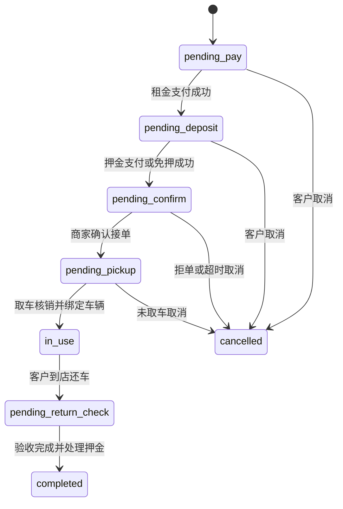

# 体验租数据模型与状态机

> 本文定义体验租短租的核心数据和状态。命名为产品级草案，开发时需按工程规范转换为 migration 和接口字段。

---

## 1. 核心枚举

### 1.1 业务线

| 枚举 | 说明 |
|---|---|
| `long_rent` | 安心用长租 |
| `short_rent` | 体验租短租 |

### 1.2 体验租经营模式

| 枚举 | 说明 |
|---|---|
| `store_self_operated` | 门店自营 |
| `platform_self_operated` | 平台自营 |
| `platform_asset_store_fulfillment` | 平台货源，门店履约 |

### 1.3 租赁周期

| 枚举 | 说明 |
|---|---|
| `one_hour` | 1 小时 |
| `two_hour` | 2 小时 |
| `four_hour` | 4 小时 |
| `same_day` | 当日还 |
| `day` | 日租 |
| `week` | 周租 |
| `month` | 月租 |
| `season` | 季租，后续可关 |

---

## 2. 短租订单状态

| 状态 | 说明 | 主要动作 |
|---|---|---|
| `pending_pay` | 待支付租金 | 支付、取消 |
| `pending_deposit` | 押金待支付或免押待授权 | 支付押金、免押授权、取消 |
| `pending_confirm` | 待商家确认接单 | 确认接单、拒绝接单、取消 |
| `pending_pickup` | 待取车 | 核销、扫码绑车、取消 |
| `in_use` | 已取车/使用中 | 控车、续租、还车 |
| `pending_return_check` | 待还车验收 | 确认车况、押金扣款 |
| `completed` | 已完成 | 退款查询、再次租用 |
| `cancelled` | 已取消 | 退款查询 |

状态流：

---

## 3. 车辆状态

| 状态 | 说明 |
|---|---|
| `pending_inbound` | 待入库 |
| `available` | 在库可租 |
| `reserved_hold` | 预约保留 |
| `locked` | 已锁定，已支付待取车或待发货 |
| `in_use` | 出租中 |
| `pending_check` | 归还待验 |
| `maintenance` | 维修中 |
| `dispute` | 争议中 |
| `offline` | 已下架 |

长租不使用此短租车辆状态机。长租只在交付节点记录设备识别码。

---

## 4. 核心表

### 4.1 `short_rent_product`

短租商品/车型扩展表。

| 字段 | 说明 |
|---|---|
| product_id | 商品 ID |
| standard_name | 体验租标准商品名，启用后用于配置、库存、订单和统计 |
| display_name | C 端展示标题，可与标准名不同 |
| category_id | 品类 |
| vehicle_no | 车型编号 |
| support_short_rent | 是否支持体验租 |
| name_locked | 是否锁定标准商品名 |
| default_price_plan_id | 平台默认价格方案 |
| status | 启用/停用 |

锁定规则：

1. `support_short_rent = true` 且已绑定价格方案、车辆库存或体验租订单后，`standard_name`、`vehicle_no`、核心类目不允许直接修改。
2. `display_name` 可用于 C 端运营展示，允许按权限调整，但订单快照仍记录当时展示标题和标准商品名。
3. 如需调整标准名，必须创建新商品/新车型档案，并通过迁移工具把价格方案和库存重新绑定。
4. 直接修改标准名属于高风险动作，第一版不开放普通编辑入口。

### 4.2 `short_rent_price_plan`

| 字段 | 说明 |
|---|---|
| plan_id | 方案 ID |
| owner_type | platform / merchant / store |
| owner_id | 归属主体 |
| store_id | 门店，平台默认可为空 |
| product_id | 商品/车型 |
| cycle_type | 租赁周期 |
| rent_price | 租金 |
| deposit_amount | 押金 |
| preauth_amount | 预授权金额 |
| enabled | 是否启用 |
| effective_at / expired_at | 生效和失效时间 |

### 4.3 `short_rent_vehicle`

| 字段 | 说明 |
|---|---|
| vehicle_id | 车辆 ID |
| product_id | 商品/车型 |
| merchant_id | 所属商家 |
| store_id | 所属门店 |
| operation_mode | 经营模式 |
| asset_owner_type / asset_owner_id | 资产归属 |
| vin / sn / imei | 唯一设备码，按品类选择 |
| device_no | 中控设备号 |
| plate_no | 车牌号，若有 |
| device_status | 设备 9 状态，和 `00_核心决策表.md` P1-1 保持一致 |
| last_order_id | 最近订单 |

唯一约束：

- VIN/SN/IMEI 不能重复。
- device_no 不能重复。
- 已绑定未完成订单的车辆不能再次出租。

### 4.4 `short_rent_order`

| 字段 | 说明 |
|---|---|
| order_id / order_no | 订单 |
| customer_id | 客户 |
| rider_id | 骑行人 |
| product_id | 商品/车型 |
| vehicle_id | 取车后绑定 |
| merchant_id / store_id | 商家和履约门店 |
| operation_mode | 经营模式 |
| order_type | 首租/续租 |
| parent_order_id | 续租关联首租或上一单 |
| cycle_type / cycle_num | 租赁周期 |
| planned_pickup_at | 预约取车时间 |
| rent_start_at / rent_end_at | 实际起止时间 |
| return_at | 还车时间 |
| status | 短租订单状态 |
| rent_amount | 租金 |
| deposit_amount | 押金 |
| paid_amount | 已付金额 |
| refund_amount | 已退金额 |
| deduction_amount | 押金扣款 |
| price_snapshot | 价格快照 |
| store_snapshot | 门店快照 |

### 4.5 `short_rent_deposit`

| 字段 | 说明 |
|---|---|
| deposit_id | 押金记录 |
| order_id | 订单 |
| deposit_type | 实付押金 / 信用免押 / 预授权 |
| amount | 押金金额 |
| paid_amount | 实付金额 |
| authorized_amount | 授权金额 |
| deducted_amount | 已扣金额 |
| refunded_amount | 已退金额 |
| status | 待支付、已支付、已授权、部分退、已退、扣款中 |

### 4.6 `short_rent_fund_entries`

记录租金、押金、扣款、退款、平台抽成、门店/商家收入。

字段：

- entry_id
- order_id
- wallet_id
- event_type
- direction
- amount
- channel
- account_owner_type
- account_owner_id
- description
- created_at

---

## 5. 资金事件

| 事件 | 说明 |
|---|---|
| `rent_paid` | 租金支付成功 |
| `deposit_paid` | 押金支付成功 |
| `deposit_authorized` | 免押/预授权成功 |
| `rent_refunded` | 租金退款 |
| `deposit_deducted` | 押金扣款 |
| `deposit_refunded` | 押金退还 |
| `platform_commission` | 平台短租服务费 |
| `merchant_income` | 商家/门店短租收益 |
| `offline_recovery` | 线下补收记录 |

---

## 6. 权限点

| 权限点 | 说明 |
|---|---|
| `short_rent.order.view` | 查看体验租订单 |
| `short_rent.order.confirm` | 确认接单 |
| `short_rent.order.reject` | 拒绝接单 |
| `short_rent.pickup.verify` | 取车核销 |
| `short_rent.vehicle.bind` | 绑定车辆 |
| `short_rent.vehicle.manage` | 车辆新增、编辑、上下架 |
| `short_rent.return.confirm` | 确认还车 |
| `short_rent.deposit.deduct` | 押金扣款 |
| `short_rent.deposit.refund` | 押金退款 |
| `short_rent.price.manage` | 短租价格方案维护 |
| `short_rent.remote_control` | 控车 |
| `short_rent.config.manage` | 体验租全局配置 |

押金、退款、控车、价格和门店归属变更属于高风险动作，必须写日志并二次确认。
