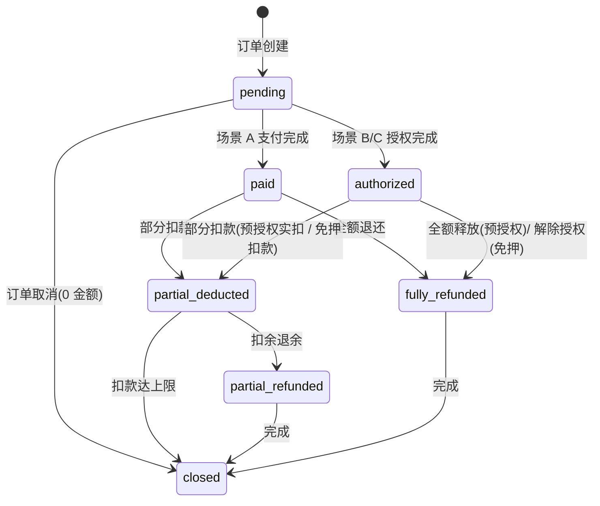

# 体验租 · 07 保证金免押与扣款规则

> **Stage 6 术语同步(2026-05-27)**: 本文档已按 Stage 6 统一为商家、联营、平台订单、订单结算款、我的钱包、履约中、逾期费用、留购、保证金等展示术语；数据库字段、API 路径、英文枚举保持不变。

> 解决 P0 问题 Q4(保证金 / 预授权 字段含义重叠)+ Q12(保证金扣款审批分级)。
> 保证金是体验租**最容易产生客诉**的环节,本文统一定义 4 种保证金场景的数据流、扣款分级审批、退款时效。

---

## 1. 保证金的 4 种业务场景

| 场景 | 触发条件 | 数据特征 | 资金动作 |
|---|---|---|---|
| **A 全额实付保证金** | 客户信用未达免押门槛 + 选择"实付保证金" | 实际扣款到平台保证金账户 | 扣款 → 还车后退款(原路退) |
| **B 信用免押(无授权)** | 芝麻信用 ≥ 阈值 / 微信支付分 ≥ 阈值 | 仅记录免押授权凭证 | 无资金动作;违约时调用免押扣款 |
| **C 预授权(冻结)** | 客户支持但未达免押门槛 / 商家要求预授权 | 卡内冻结额度,不实际扣款 | 冻结 → 还车后释放 / 违约时实扣 |
| **D 混合(V2)** | 部分实付 + 部分预授权 | 暂不实现 | - |

**关键设计**:**这 4 种场景共用一张 `short_rent_deposit` 表**,通过 `deposit_type` 字段区分。

---

## 2. 数据模型修正(Q4 解决方案)

原 `05_体验租数据模型与状态机.md §4.5` 中 `short_rent_deposit` 字段含义重叠,本文给出修正版:

### 2.1 `short_rent_deposit` 表(修正版)

| 字段 | 类型 | 必填 | 说明 |
|---|---|---|---|
| deposit_id | bigint | 是 | 主键 |
| deposit_chain_id | bigint | 是 | 保证金链 ID(支持续租复用,详见 `09_续租链与父子订单.md`) |
| order_id | bigint | 是 | 关联订单 |
| **deposit_type** | enum | 是 | `paid_full` / `credit_free` / `preauth` / `mixed`(V2 预留) |
| amount_required | decimal | 是 | 应缴保证金额(标准值,从价格方案带入) |
| amount_paid | decimal | 是 | 实付金额(场景 A 为保证金额,B/C 为 0) |
| amount_authorized | decimal | 是 | 授权金额(场景 B 免押额度 / 场景 C 预授权额度) |
| amount_deducted | decimal | 是 | 累计已扣金额 |
| amount_refunded | decimal | 是 | 累计已退金额 |
| credit_source | varchar(20) | 否 | 免押来源:zhima / wechat_score / platform_internal |
| credit_authorization_no | varchar(64) | 否 | 免押授权号(第三方信用产品返回) |
| preauth_channel_no | varchar(64) | 否 | 预授权通道单号(支付宝/微信预授权返回) |
| preauth_expired_at | datetime | 否 | 预授权到期时间(支付宝预授权默认 24 天) |
| status | enum | 是 | pending / paid / authorized / partial_deducted / partial_refunded / fully_refunded / closed |
| created_at / updated_at | datetime | 是 | - |

**关键改动**:
- `amount` 拆为 `amount_required`(应付)和 `amount_paid`(实付),不再混用
- 新增 `amount_authorized`(授权额),与 `amount_paid` 互斥
- 新增 `credit_authorization_no` / `preauth_channel_no` / `preauth_expired_at`,记录第三方授权凭证

### 2.2 4 种场景的字段取值

| 字段 | A 全额实付 | B 信用免押 | C 预授权 |
|---|---|---|---|
| deposit_type | `paid_full` | `credit_free` | `preauth` |
| amount_required | 应付保证金 | 应付保证金 | 应付保证金 |
| amount_paid | = required | 0 | 0 |
| amount_authorized | 0 | = required | = required |
| credit_authorization_no | NULL | 必填 | NULL |
| preauth_channel_no | NULL | NULL | 必填 |
| preauth_expired_at | NULL | NULL | 必填 |
| status 流转 | pending → paid → ... | pending → authorized → ... | pending → authorized → ... |

### 2.3 保证金状态流



---

## 3. 保证金生成时机

| 时机 | 动作 |
|---|---|
| 订单创建(C 端订单确认页) | 根据价格方案带入 `amount_required` + 客户信用评估决定 `deposit_type` |
| 客户支付租金后 | 触发保证金动作(支付 / 授权 / 验证免押) |
| 保证金动作完成 | order.status 从 `pending_deposit` → `pending_confirm` |
| 商家接单 | 不触发保证金动作(已完成) |

### 3.1 客户信用评估优先级

```text
有芝麻信用 ≥ 阈值
  └ 是 → 推荐场景 B(信用免押)
  └ 否 → 有微信支付分 ≥ 阈值
            └ 是 → 推荐场景 B(微信支付分免押)
            └ 否 → 商家是否要求实付保证金
                      └ 是 → 场景 A(实付)
                      └ 否 → 场景 C(预授权)
```

**客户选择权**:
- 即使满足免押条件,客户也可选择"实付保证金"(场景 A)— 出于隐私或习惯
- 但**反之不行**:不满足免押条件时不能强制走免押

---

## 4. 保证金扣款(违约场景)

### 4.1 扣款原因(可配置)

| 原因 | 业务含义 | 默认分级 |
|---|---|---|
| `overdue` | 逾期未还车 | 中 |
| `damage` | 车辆损坏 | 视金额而定 |
| `lost_parts` | 配件丢失(头盔/充电器等) | 小 |
| `cleaning` | 异常脏污需清洁 | 小 |
| `traffic_violation` | 客户违章罚款 | 中 |
| `theft` | 整车丢失/盗窃 | 大 |
| `other` | 其他(需填写说明) | 视金额而定 |

### 4.2 扣款金额分级 + 审批

**P0 决策(本文)**:扣款金额分 3 级,每级有不同审批要求。

| 等级 | 金额范围 | 审批 | 客户告知 | 操作角色 |
|---|---|---|---|---|
| **小额** | ≤ 5000 元 | 门店发起 + 二次确认,平台抽检 | 短信 + IM 推送(扣前/扣后告知) | 门店店长 / 商家管理员 |
| **中额** | 5000 - 20000 元 | 门店发起 → 平台审核 | 提前在 IM 通知客户(扣前告知)→ 平台审核 → 实扣 | 门店发起,平台审核员审批 |
| **大额** | > 20000 元 | 门店发起 → 平台主管审核 → 客户协商/法务介入 | IM 通知客户协商 → 客户确认 / 客户申诉 → 平台终裁 | 门店发起,平台主管/法务审批 |

### 4.3 扣款数据表

```sql
short_rent_deposit_deduction
- deduction_id           bigint PK
- deposit_id             bigint FK
- order_id               bigint FK
- amount                 decimal     -- 扣款金额
- reason                 enum        -- §4.1 原因
- reason_detail          text        -- 详细说明
- level                  enum        -- small / medium / large
- proof_urls             json        -- 证据图片(车损照片/违章单据)
- requested_by_type      enum        -- store_staff / merchant_admin / platform_operation
- requested_by_id        bigint
- requested_at           datetime
- approval_status        enum        -- self_approved / pending_review / approved / rejected / customer_disputed
- approved_by_id         bigint
- approved_at            datetime
- customer_notified_at   datetime    -- 客户告知时间
- customer_confirmed_at  datetime    -- 客户确认时间(大额场景)
- actual_deducted_at     datetime    -- 实际扣款执行时间
- channel_response       json        -- 扣款通道回执
- status                 enum        -- pending / approved / deducted / refunded / disputed / cancelled
- created_at / updated_at
```

### 4.4 扣款流程

#### 小额(≤5000元)

```text
门店发起扣款 → 上传车损照片 + 填写原因
  ↓
门店店长二次确认
  ↓
系统执行扣款(从保证金账户 / 预授权 / 免押)
  ↓
向客户推送扣款明细(IM + 短信)
  ↓
客户可在 30 天内申诉
```

#### 中额(5000-20000元)

```text
门店发起扣款 → 上传证据
  ↓
系统提前向客户推送"待扣款通知"(IM)
  ↓
平台审核员审核(审车损证据合理性、扣款金额合理性)
  ├─ 通过 → 实扣 → 推送扣款明细
  └─ 驳回 → 通知门店补证据 / 修改金额
```

#### 大额(>20000元)

```text
门店发起扣款 → 上传完整证据(多角度照片/维修报价/视频)
  ↓
系统向客户推送"协商通知"(IM + 电话外呼)
  ↓
客户响应
  ├─ 客户认可 → 平台主管审核 → 实扣
  ├─ 客户协商 → 进入工单流程,平台介入调解
  └─ 客户不响应(72 小时)→ 自动转人工介入
```

### 4.5 扣款上限

- 单笔扣款金额 ≤ `amount_required - amount_deducted`(保证金余额)
- 保证金不足以覆盖扣款时,记录 `unpaid_balance`,通过线下补收 / 二次代扣处理(V2 接线上补扣)

---

## 5. 保证金退款时效

| 场景 | 时效 | 说明 |
|---|---|---|
| 还车验收无扣款 | 即时退款(实付场景)/ 即时释放(预授权/免押) | 验收完成后 1 小时内 |
| 还车有扣款 | 扣款完成后 24 小时内退余 | - |
| 大额扣款客户申诉中 | 申诉结案后 7 个工作日内 | - |
| 通道异常 | 兜底 3 个工作日内,异常单进运营工单 | - |

**到账时效**(用户感知):
- 支付宝 / 微信原路退:1-3 个工作日
- 银行卡:3-7 个工作日
- 预授权释放:即时(银行 1-7 天解冻)
- 免押解除:即时

---

## 6. C 端展示规范

### 6.1 订单确认页

```text
保证金信息
  ┌────────────────────────────────┐
  │ 应付保证金        ¥299           │
  │ 信用免押        ✓ 已开通       │
  │ 实际需要支付    ¥0             │
  │                                │
  │ 说明:享受芝麻信用免押,         │
  │      还车无异常即解除授权        │
  └────────────────────────────────┘
```

### 6.2 已取车订单详情

```text
保证金状态
  ┌────────────────────────────────┐
  │ 保证金类型    信用免押            │
  │ 授权额度    ¥299                │
  │ 已扣金额    ¥0                 │
  │ 状态        授权中              │
  └────────────────────────────────┘
```

### 6.3 已完成订单

```text
保证金结算
  ┌────────────────────────────────┐
  │ 保证金额      ¥299                │
  │ 扣款明细                        │
  │   - 头盔丢失   -¥50    [查看证据]│
  │ 实际退还    ¥249                │
  │ 退款时间    2026-05-25 10:30    │
  │ 预计到账    1-3 个工作日         │
  └────────────────────────────────┘
```

### 6.4 客户侧合规红线

- **不展示**"平台保证金账户"概念,统一说"保证金"
- **不展示**门店与平台之间的保证金分账
- 扣款明细必须**有证据可查**(图片可点开放大)

---

## 7. 资金流向(后台视角)

| 场景 | 保证金账户归属 | 扣款分账 |
|---|---|---|
| 门店自营(store_self_operated) | 门店保证金户 → 平台监管 | 损坏赔付给门店,清洁费给门店 |
| 平台自营(platform_self_operated) | 平台保证金户 | 全部归平台 |
| 平台货源-门店履约(platform_asset_store_fulfillment) | 平台保证金户 | 损坏赔付给平台(资产方),清洁费给门店(履约方) |

**关键**:保证金账户不是商家可随意提现的钱包,是平台监管的保证金账户。

---

## 8. 风控点

| 风控点 | 触发 | 动作 |
|---|---|---|
| 同一证件号近 7 天扣款 ≥ 3 次 | 自动告警 | 标记骑行人风险 |
| 同一门店扣款率 > 30% | 自动告警 | 进入运营审查门店 |
| 客户申诉率 > 10% | 自动告警 | 进入运营审查门店 |
| 单笔扣款超过保证金额 80% | 强制审核 | 阻止门店自助扣款 |

---

## 9. 权限矩阵

| 动作 | 门店员工 | 门店店长 | 商家管理员 | 平台审核 | 平台主管 |
|---|---|---|---|---|---|
| 发起小额扣款 | 需授权 | ✅ | ✅ | ✅ | ✅ |
| 发起中额扣款 | ❌ | ✅ | ✅ | ✅ | ✅ |
| 发起大额扣款 | ❌ | ✅ | ✅ | ✅ | ✅ |
| 审批中额 | ❌ | ❌ | ❌ | ✅ | ✅ |
| 审批大额 | ❌ | ❌ | ❌ | ❌ | ✅ |
| 退款执行 | ❌ | ❌ | 需授权 | ✅ | ✅ |
| 查看扣款历史 | 本店 | 本店 | 本商家 | ✅ | ✅ |
| 处理客户申诉 | ❌ | ❌ | ❌ | ✅ | ✅ |

---

## 10. 关联文档

- `02_C端体验租下单流程.md` §7 支付和保证金
- `03_商家端体验租订单与车辆.md` §7 保证金扣款和退款
- `04_运营端体验租管理.md` §7 保证金和退款
- `05_体验租数据模型与状态机.md` §4.5(本文为修正版)
- `09_续租链与父子订单.md`(保证金跨订单复用)

---

## 11. 修订记录

| 日期 | 版本 | 修订 |
|---|---|---|
| 2026-05-25 | v1.0 | 初版,解决 P0 Q4(保证金字段重叠)+ Q12(扣款审批分级) |
