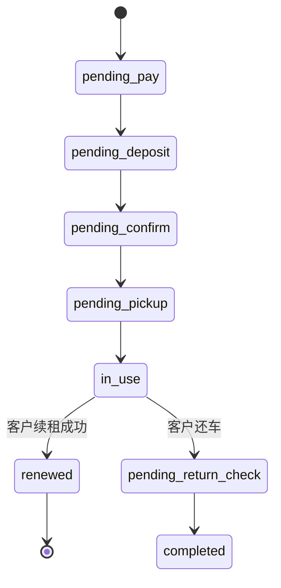

# 体验租 · 09 续租链与父子订单

> **Stage 6 术语同步(2026-05-27)**: 本文档已按 Stage 6 统一为商家、联营、平台订单、订单结算款、我的钱包、履约中、逾期费用、留购、保证金等展示术语；数据库字段、API 路径、英文枚举保持不变。

> 解决 P0 问题 Q5:续租生成新订单,但**父子订单状态联动 / 保证金跨订单复用 / 财务对账归属**全部没有数据建模。
> 本文统一定义续租链模型、父子订单状态联动、保证金链、财务归属规则。

---

## 1. 续租的业务定义

| 概念 | 含义 |
|---|---|
| **首租**(first_rent)| 客户第一次租赁某车辆的订单(`order_type = first_rent`)|
| **续租**(renewal)| 在原订单到期前/到期时,客户选择继续租用同一车辆的后续订单(`order_type = renewal`)|
| **续租链**(rental_chain)| 由 1 个首租 + N 个续租组成的连续租赁记录链 |
| **保证金链**(deposit_chain)| 跨续租复用同一笔保证金的链路 |

**核心约束**:
- 续租**必须是同一辆车**(同 vehicle_id)
- 续租**必须是同一骑行人**(同 rider_id)
- 续租**开始时间 = 上一单结束时间**(无缝衔接)
- 续租链可无限延伸(理论上),实际由"保证金有效期"和"客户信用"决定

---

## 2. 数据模型修正

### 2.1 `short_rent_order` 新增/修订字段

| 字段 | 类型 | 说明 |
|---|---|---|
| **rental_chain_id** | bigint | 续租链 ID,首租 = 自身 order_id,续租继承首租的链 ID |
| order_type | enum | first_rent / renewal |
| parent_order_id | bigint | 父订单 ID(续租时填上一单 order_id,首租为 NULL) |
| chain_sequence | int | 在续租链中的顺序(首租=1,第 1 次续租=2,以此类推) |
| **deposit_chain_id** | bigint | 保证金链 ID(关联 short_rent_deposit) |
| **is_chain_active** | boolean | 该订单是否为续租链当前活跃单(每条链同一时刻仅 1 个活跃) |

### 2.2 `short_rent_rental_chain` 续租链主表(新增)

```sql
short_rent_rental_chain
- chain_id                bigint PK
- customer_id             bigint     -- 客户
- rider_id                bigint     -- 骑行人
- vehicle_id              bigint     -- 车辆
- merchant_id             bigint     -- 商家
- store_id                bigint     -- 履约门店
- deposit_chain_id        bigint     -- 关联保证金链
- first_order_id          bigint     -- 首租订单
- current_order_id        bigint     -- 当前活跃订单
- chain_order_count       int        -- 链中订单总数
- total_paid_amount       decimal    -- 链累计已付金额(租金)
- total_deducted_amount   decimal    -- 链累计已扣保证金
- chain_started_at        datetime   -- 首租开始(实际取车)时间
- chain_planned_ended_at  datetime   -- 当前预计结束时间
- chain_actual_ended_at   datetime   -- 实际结束时间(还车)
- status                  enum       -- active / closed / disputed
- created_at / updated_at
```

### 2.3 `short_rent_deposit` 调整(配合)

`short_rent_deposit.order_id` 改为引用**首租订单**;新增 `deposit_chain_id` 作为保证金标识。续租时复用同一笔保证金,不创建新保证金记录。

---

## 3. 父子订单状态联动

### 3.1 续租触发时的状态变化

```text
[首租 in_use]  客户在到期前 30 分钟内点"续租"
     ↓
系统创建续租订单 order_renewal_1
  - parent_order_id = 首租 order_id
  - rental_chain_id = 首租 rental_chain_id
  - chain_sequence = 2
  - status = pending_pay(待支付续租租金)
     ↓
客户支付续租租金
     ↓
[首租] status = renewed(已续租)
       is_chain_active = false
[续租 1] status = in_use
       is_chain_active = true
       rent_start_at = 首租的 rent_end_at(无缝)
       rent_end_at = 根据新套餐计算
```

### 3.2 续租状态机扩展(对 05 §2 的补充)

新增 `renewed` 状态:

| 状态 | 触发 | 含义 |
|---|---|---|
| `renewed` | 续租订单创建并支付成功 | 该订单已被续租,不再是活跃单 |



### 3.3 续租取消的级联

| 场景 | 处理 |
|---|---|
| 续租订单创建但未支付 | 续租订单单独取消;首租保持 in_use |
| 续租订单已支付但未生效 | 续租订单退款;首租保持 in_use;**不能取消首租** |
| 续租订单已生效后取消 | 走"提前还车"逻辑;首租已 renewed 不可恢复 |

---

## 4. 保证金链(保证金复用)

### 4.1 核心规则

| 规则 | 说明 |
|---|---|
| **同链共用保证金** | 续租不重复收保证金,直接复用首租保证金记录 |
| **保证金随链结算** | 链终结(完整还车)时一次性结算保证金 |
| **保证金可在链中扣** | 续租期间发生损坏,可在保证金上扣款,但不影响链继续 |
| **保证金不足时** | 提示客户补缴 / 暂停续租能力 |

### 4.2 保证金链与续租链的关系

```text
short_rent_rental_chain (chain_id=1)
├── 首租 order_id=101 (chain_sequence=1, deposit_chain_id=1)
├── 续租 1 order_id=102 (chain_sequence=2, deposit_chain_id=1) ← 复用保证金
├── 续租 2 order_id=103 (chain_sequence=3, deposit_chain_id=1) ← 复用保证金
└── 续租 3 order_id=104 (chain_sequence=4, deposit_chain_id=1) ← 当前活跃

short_rent_deposit (deposit_chain_id=1)
- amount_required = 299
- amount_authorized = 299 (免押)
- amount_deducted = 50 (在续租 2 期间发生头盔丢失,扣 50)
- status = partial_deducted
```

### 4.3 保证金到期处理

| 类型 | 到期 | 处理 |
|---|---|---|
| 实付保证金 | 无期限(账户保留) | 链终结时统一退款 |
| 信用免押 | 通常 30-90 天 | 到期前 7 天系统提醒;到期当天**禁止再续租**;客户需还车或转实付保证金 |
| 预授权 | 通常 24 天(支付宝)| 同上;到期前可重新发起预授权 |

---

## 5. 续租前置条件校验

客户点"续租"按钮时,系统校验:

| 校验项 | 不通过的处理 |
|---|---|
| 当前订单状态 = in_use | "订单当前不可续租" |
| 距离到期时间 ≤ 配置阈值(默认 30 分钟前可续)| "请在到期前 30 分钟内续租" |
| 保证金状态 = paid / authorized | "保证金状态异常,请联系客服" |
| 保证金扣款累计 < 保证金额的 80% | "保证金余额不足,请先处理待扣款" |
| 保证金类型有效期未到 | "信用免押即将到期,请还车或更换支付方式" |
| 车辆下一时段未被其他订单预约 | "该车辆下一时段已被预约,请还车" |
| 客户/骑行人无未结违章 / 黑名单状态 | "存在待处理事项,请联系客服" |
| 续租周期门店支持 | "该门店未开通对应续租周期" |

---

## 6. 续租财务归属

### 6.1 续租链的财务记账

每个续租订单**独立记账**,但归属同一条链:

| 记账项 | 归属订单 | 关联链 |
|---|---|---|
| 首租租金 | 首租 | chain_id |
| 续租 1 租金 | 续租 1 | chain_id |
| 保证金扣款(发生在续租 2)| 该笔扣款记录 deduction_id 关联**实际发生时的订单** | chain_id |
| 保证金退款(链终结)| 关联**首租订单** + chain_id | chain_id |

### 6.2 商家/门店收益

| 场景 | 处理 |
|---|---|
| 同一商家门店连续续租 | 每单独立分账给该门店 |
| 续租切换门店(暂不支持)| V1 不支持;V2 探索 |
| 平台抽佣 | 每单独立抽佣(不打包) |

### 6.3 链终结(还车)时的总结算

```
还车完成 → 保证金最终结算
  ↓
保证金应退 = amount_paid + amount_authorized
          - amount_deducted_total
  ↓
触发保证金退款 / 解除授权
  ↓
chain.status = closed
chain.chain_actual_ended_at = now()
```

---

## 7. C 端展示

### 7.1 在租中订单(续租入口)

```
[订单详情 - 已取车 - 距还车 25 分钟]
┌─────────────────────────────────┐
│ 当前订单:续租 2 (第 3 期)        │
│ ⏱ 租期剩余 0 时 25 分            │
│                                  │
│ [开机][关机][闪灯][定位][更多]   │
│                                  │
│ ┌──────────┬──────────┐         │
│ │  去还车   │  去续租   │         │
│ └──────────┴──────────┘         │
└─────────────────────────────────┘
```

### 7.2 续租确认页

```
[续租]
┌─────────────────────────────────┐
│ 当前车辆:满点 Qz1 MIX            │
│ 上单结束:2026-05-25 18:54        │
│ 续租开始:2026-05-25 18:54 (无缝)│
│                                  │
│ 选择续租方案                      │
│ ┌────┬────┬────┐                │
│ │1小时│2小时│4小时│                │
│ └────┴────┴────┘                │
│                                  │
│ 保证金   ¥299 (复用,无需再付)      │
│ 应付   ¥9.9                      │
│                                  │
│ [确认续租]                        │
└─────────────────────────────────┘
```

### 7.3 续租链视图(订单详情底部)

```
本次租赁记录
  ✓ 首租     14:00-15:00  ¥9.9
  ✓ 续租 1   15:00-17:00  ¥16.9
  ◉ 续租 2   17:00-21:00  ¥29.9  ← 当前
              进行中
```

### 7.4 已完成订单(链汇总)

```
[订单详情 - 已完成]
┌─────────────────────────────────┐
│ 总租赁时长   7 小时               │
│ 订单次数     3 次(首租+2 次续租)│
│ 总租金       ¥56.7               │
│ 保证金扣款     ¥50 (头盔丢失)      │
│ 退还保证金     ¥249                │
└─────────────────────────────────┘
```

---

## 8. 异常场景

### 8.1 续租支付失败

| 场景 | 处理 |
|---|---|
| 支付超时 / 失败 | 续租订单 → cancelled;首租保持 in_use;客户进入逾期或选择还车 |
| 多次支付失败 | 系统不再展示"续租"按钮;引导还车 |

### 8.2 续租后车辆故障

| 场景 | 处理 |
|---|---|
| 续租 1 进行时发现首租期间车辆已损坏 | 责任归属在首租期间;续租 1 不受影响 |
| 续租 2 期间车辆损坏 | 责任归属续租 2;扣款记录关联续租 2 |

### 8.3 跨链续租(同车同人但不同链)

如果客户某天还车后,N 天后再次租同辆车:
- 这是**新的续租链**(新 chain_id)
- 保证金重新发起(不复用历史保证金)

---

## 9. 续租链的查询接口

| 接口 | 用途 |
|---|---|
| `GET /api/v1/rental-chain/:id` | 查询完整链信息 |
| `GET /api/v1/order/:id/chain` | 通过订单查询所属链 |
| `GET /api/v1/customer/:id/active-chains` | 客户当前所有活跃链 |
| `POST /api/v1/order/:id/renew` | 发起续租 |

---

## 10. 权限

| 动作 | 客户 | 门店 | 平台 |
|---|---|---|---|
| 发起续租 | ✅(本订单)| 代客操作 ✅ | 代客操作 ✅ |
| 取消续租(未支付)| ✅ | ✅ | ✅ |
| 链终结(强制)| ❌ | ✅(店长)| ✅ |
| 查看链 | ✅(本人)| ✅(本店)| ✅ |
| 链调整(改归属/合并)| ❌ | ❌ | ✅(主管)|

---

## 11. 关联文档

- `02_C端体验租下单流程.md` §10 续租规则
- `05_体验租数据模型与状态机.md`(本文为续租链的补充)
- `07_保证金免押与扣款规则.md`(保证金链复用)
- `08_控车日志与异常处置.md`(续租期间控车)

---

## 12. 修订记录

| 日期 | 版本 | 修订 |
|---|---|---|
| 2026-05-25 | v1.0 | 初版,解决 P0 Q5(续租链/父子订单状态/保证金链/财务归属) |
