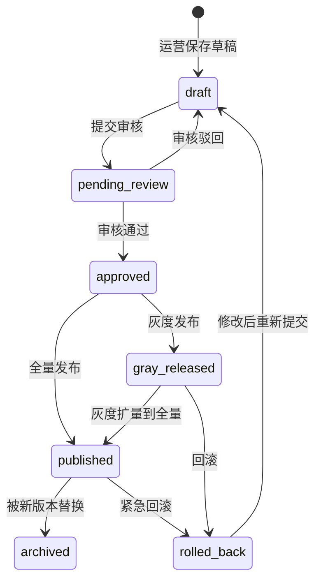

# 前台配置中心 · 08 装修版本与灰度发布

> 所有装修配置(Tab / 楼层 / Banner / 弹窗 / 品类 / 客群绑定)的变更必须走"草稿 → 审核 → 发布 → 灰度"流程。支持按城市 / 客群 / 租户灰度,支持回滚。

---

## 1. 页面说明

| 项 | 内容 |
|---|---|
| 页面名称 | 装修版本与灰度发布 |
| 入口路径 | 前台配置中心 > 装修版本与灰度发布 |
| 使用角色 | 平台管理员、内容运营、内容审核 |
| 核心目标 | 装修配置的版本管理、审核、灰度发布、回滚 |

---

## 2. 版本生命周期



| 状态 | 含义 |
|---|---|
| draft | 草稿,不影响线上 |
| pending_review | 待审核,内容审核角色处理 |
| approved | 审核通过,等待发布 |
| gray_released | 灰度发布中(部分流量) |
| published | 已全量发布(当前线上版本) |
| rolled_back | 已回滚 |
| archived | 已归档(被新版本替换) |

---

## 3. 版本字段

```sql
ui_config_version
- version_id            -- 版本 ID
- version_name          -- 版本名称(如 "2026 双 11 v1")
- tenant_id             -- 租户(NULL=平台默认)
- city_code             -- 城市(NULL=全部城市)
- business_line         -- assurance_rent / experience_rent / common
- module_type           -- tab / banner / floor / popup / category ...
- config_snapshot       -- JSON 完整快照
- status                -- draft / pending_review / approved / gray_released / published / rolled_back / archived
- gray_strategy         -- 灰度策略 JSON(详见 §5)
- gray_traffic_ratio    -- 灰度流量比例(0-100)
- effective_at          -- 实际生效时间
- published_at          -- 发布时间
- published_by          -- 发布人
- rollback_from_version -- 从哪个版本回滚来
- audit_log             -- 审批记录 JSON
- created_by / created_at
- updated_by / updated_at
```

---

## 4. 提交审核

### 4.1 审核字段

运营提交审核时填写:

| 字段 | 类型 | 必填 | 说明 |
|---|---|---|---|
| version_name | 文本 | 是 | 版本名称(便于识别) |
| change_summary | 富文本 | 是 | 本次变更摘要 |
| affected_modules | 多选(系统计算) | 是 | 涉及哪些模块(Tab / 楼层 / Banner ...) |
| risk_level | 下拉 | 是 | 低(文案/图片调整)/ 中(楼层结构调整)/ 高(Tab 启停 / 默认 Tab 切换 / 反诈文案修改) |
| desired_publish_time | 时间 | 否 | 期望发布时间 |

### 4.2 审核流程

```text
运营提交 → 内容审核接单 → 审核
  ↓
  ├── 通过 → 等发布(可设定时发布)
  ├── 驳回(需写驳回理由)→ 回到 draft
  └── 转主管复核(高风险变更自动转)→ 主管审核
                                      ↓
                                      ├── 通过 → 等发布
                                      └── 驳回 → 回到 draft
```

### 4.3 自动转主管复核的条件

满足以下任意一条:
- risk_level = 高
- 涉及 Tab 启停或默认 Tab 切换
- 涉及反诈文案修改
- 涉及强制更新弹窗
- 涉及商品标准名 / 品类一级变更
- 修改了"平台默认装修"(影响所有租户)

---

## 5. 灰度发布

### 5.1 灰度策略类型

| 策略 | 说明 | 适用场景 |
|---|---|---|
| 按城市灰度 | 先在指定城市发布,稳定后扩大 | 新功能首发 |
| 按客群灰度 | 先对指定客群发布(如内部员工 / 新客) | 风险高的变更 |
| 按租户灰度 | 先对指定租户发布 | 平台默认装修变更 |
| 按比例灰度(V2) | 随机抽取流量百分比 | A/B 测试 |

### 5.2 灰度配置字段

```json
{
  "strategy": "city_based",
  "cities": ["110100", "310100"],  // 北京、上海
  "traffic_ratio": 100              // 命中城市的 100% 流量
}

或

{
  "strategy": "audience_based",
  "segment_ids": ["new_user", "internal_staff"]
}

或

{
  "strategy": "tenant_based",
  "tenant_ids": ["dingzu", "huixun"]
}
```

### 5.3 灰度流程

```text
审核通过 → 选择"灰度发布" → 配置灰度策略 → 灰度上线
  ↓
观察数据(曝光 / 点击 / 转化 / 异常率)
  ↓
  ├── 数据正常 → 一键扩量到全量 → published
  ├── 数据异常 → 一键回滚 → rolled_back
  └── 需要修改 → 紧急回滚 → 回到 draft 修改
```

---

## 6. 全量发布

| 字段 | 说明 |
|---|---|
| publish_time | 立即 / 定时 |
| effective_strategy | 立即生效 / 等下次冷启动生效 |
| notify_tenants | 是否通知所有租户(平台默认装修变更时建议通知) |

发布后,旧版本自动转 `archived`,新版本成为 `published`(当前线上版本)。

---

## 7. 回滚

### 7.1 回滚类型

| 类型 | 操作 |
|---|---|
| 灰度回滚 | 撤回灰度,旧版本仍是 published |
| 全量回滚 | 把 published 版本退回上一个 archived 版本 |
| 紧急回滚 | 跳过审核,立即回滚(仅平台管理员可操作,事后补审核记录) |

### 7.2 回滚规则

- 回滚到某个历史版本时,该版本必须 status = `archived` 且 ≤ 90 天
- 回滚时记录 `rollback_from_version`(从哪个版本回来)+ `rollback_reason`
- 回滚后,被回滚的版本进入 `rolled_back` 状态(不可再发布,需 fork 新版本修改)

---

## 8. 版本列表页

```text
┌──────────────────────────────────────────────────────────┐
│ 装修版本与灰度发布                                          │
├──────────────────────────────────────────────────────────┤
│ 筛选:[业务线 ▼] [模块 ▼] [状态 ▼] [租户 ▼] [新建版本]      │
├──────────────────────────────────────────────────────────┤
│ 版本列表                                                    │
│ ┌─────────────────────────────────────────────────────┐ │
│ │ V20260525001 │ 双11 体验租首屏 │ 灰度中 │ 北京/上海 │操作│ │
│ │ V20260524003 │ 安心用品类调整 │ 已发布 │ 全量      │操作│ │
│ │ V20260523001 │ 反诈文案优化   │ 已归档 │           │查看│ │
│ │ ...                                                      │ │
│ └─────────────────────────────────────────────────────┘ │
└──────────────────────────────────────────────────────────┘
```

操作菜单:查看 / 编辑(草稿状态)/ 撤回(待审核)/ 发布 / 灰度扩量 / 回滚 / Diff(看与上版本差异)

---

## 9. 跨模块版本(打包发布)

某些情况下,一次活动可能涉及多个模块变更(改 Banner + 改楼层 + 改弹窗)。此时:

| 方案 | 说明 |
|---|---|
| 单独发布 | 每个模块各自版本,各自审核发布 |
| 打包发布(推荐) | 创建"发布包" `release_bundle`,关联多个模块版本,统一审核统一发布 |

```sql
release_bundle
- bundle_id
- bundle_name             -- "2026 双 11 大促"
- version_ids[]           -- 关联的 ui_config_version 列表
- status
- approved_at
- published_at
```

---

## 10. 数据看板(V2)

V1 不做,V2 加:

- 每个版本的核心指标:曝光数 / 点击数 / 转化数 / 异常率
- 灰度组 vs 对照组对比
- 版本回滚原因分析

---

## 11. 权限与日志

| 动作 | 权限 | 二次确认 | 日志 |
|---|---|---|---|
| 提交审核 | 内容运营 | - | 完整快照 |
| 审核通过 | 内容审核 | - | 审核意见 |
| 审核驳回 | 内容审核 | - | 驳回理由 |
| 主管复核 | 平台主管 | - | 复核意见 |
| 灰度发布 | 平台管理员 | ✅ | 灰度策略 |
| 全量发布 | 平台管理员 | ✅ | 发布时间 |
| 灰度回滚 | 平台管理员 | ✅ | 回滚原因 |
| 紧急回滚 | 平台管理员 | ✅✅ | 紧急原因 + 后补审核 |

---

## 12. 关联文档

- `00_前台配置中心总览.md`
- `01` ~ `07`(本模块所有子模块都通过本模块发布)
