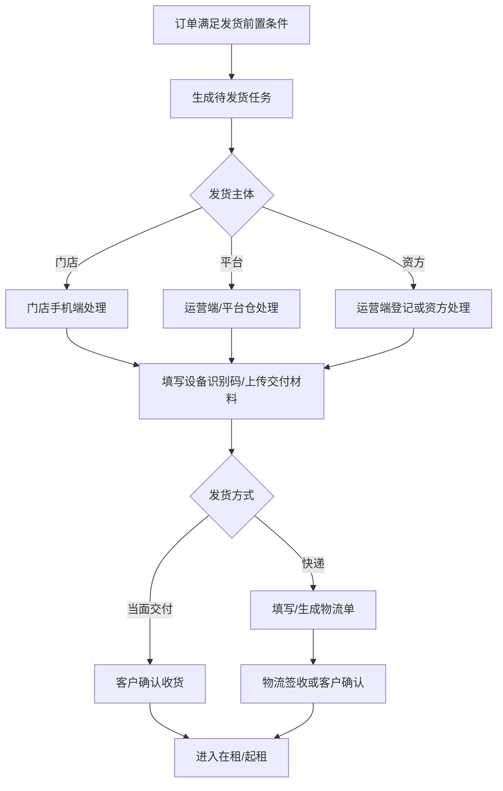

# 发货配置与物流接口

> 页面级 PRD 草案。
> 目标：配置门店发货、商家发货、平台发货、资方发货、快递接口、交付证据和签收规则，支撑默认门店发货的经营模式。

---

## 1. 页面说明

| 项 | 内容 |
|---|---|
| 页面名称 | 发货配置与物流接口 |
| 所属端 | 运营端，商家端可维护门店订单低风险配置 |
| 入口路径 | 配置管理 > 发货履约 / 订单管理 > 发货配置 |
| 使用角色 | 平台管理员、订单运营、仓库人员、商家管理员、门店员工 |
| 核心目标 | 明确不同订单类型和商品类目的发货主体、发货方式、物流接口、照片证据、签收和归还规则 |

---

## 2. 核心口径

1. 满点经营模式默认门店发货。
2. 平台订单、分红订单可按配置改为平台、资方或快递发货。
3. 门店订单由商家/门店主控发货，但平台保留监管和日志。
4. 顺丰等线上发货接口要保留配置能力，但不作为唯一发货方式。
5. 门店订单、分红订单、平台订单都必须有发货/交付选项，不能只给运营订单发货。
6. 长租发货不走库存，但发货/交付时必须填写设备识别码，例如 IMEI、SN、VIN。
7. 发货、签收、归还都要和交付照片证据、订单设备识别码、监管锁能力、账单起租联动。
8. 起租时间不能写死，可配置为支付后、发货后、签收后或门店交付后。

---

## 3. 配置范围

| 层级 | 说明 |
|---|---|
| 平台默认 | 全平台默认门店发货 |
| 订单类型 | 门店订单、分红订单、平台订单 |
| 商家/门店 | 指定商家覆盖 |
| 商品/类目 | 短租、车辆、手机等特殊规则 |
| 资方 | 某些平台订单由资方发货 |

继承优先级：商品/类目 > 商家/门店 > 订单类型 > 平台默认。

---

## 4. 发货方式

| 方式 | 说明 |
|---|---|
| 门店当面交付 | 默认，门店上传交付材料 |
| 门店配送 | 门店自行配送 |
| 商家快递 | 商家填写物流 |
| 平台仓发货 | 平台仓库处理 |
| 资方发货 | 资方提供设备并发货 |
| 顺丰线上发货 | 对接顺丰接口生成运单 |
| 其他物流 | 后台可配置物流名称、编码、是否需要单号 |
| 客户自提 | 客户到店取货 |

---

## 5. 配置字段

| 字段 | 类型 | 说明 |
|---|---|---|
| 默认发货主体 | 下拉 | 门店、商家、平台、资方 |
| 可选发货方式 | 多选 | 当面、配送、快递、线上快递、自提 |
| 物流方式字典 | 配置 | 顺丰、京东、德邦、自定义物流等 |
| 发货前置条件 | 多选 | 审核通过、合同已签、支付完成、代扣已签、设备识别码已填写 |
| 起租规则 | 下拉 | 支付后、发货后、签收后、门店交付后 |
| 是否要求设备识别码 | 开关 | 长租发货默认要求 IMEI/SN/VIN，短租后续按需求包定义 |
| 是否要求交付照片 | 开关 | 设备照、配件照 |
| 是否要求人机/人车合照 | 开关 | 按类目 |
| 是否要求客户签收 | 开关 | 影响起租和证据 |
| 客户确认收货方式 | 下拉 | 普通确认、电子签收单、AI 问答签收视频 |
| 默认确认方式 | 下拉 | 按订单类型、商家、类目可覆盖 |
| 是否允许修改收货地址 | 开关 | 按状态限制 |
| 物流接口 | 多选 | 顺丰、其他预留 |
| 异常处理 | 配置 | 发货失败、物流异常、拒收、丢件 |

---

## 6. 发货流程

发货提交后，订单进入 `待收货` 列表，客户订单详情展示 `确认收货` 按钮。

---

## 7. 物流接口

| 字段 | 说明 |
|---|---|
| 接口名称 | 顺丰线上发货、其他预留 |
| 启用范围 | 订单类型、商家、类目 |
| 发货地址来源 | 平台仓、商家、门店 |
| 收货地址来源 | 客户订单地址 |
| 运费承担方 | 客户、商家、平台、资方 |
| 面单获取 | 接口返回 |
| 轨迹同步 | 定时拉取或回调 |
| 异常处理 | 取消、重发、人工处理 |

接口密钥等敏感配置只放后端安全配置，不进入 PRD、前端和普通日志。

---

## 8. 签收规则

| 签收方式 | 说明 |
|---|---|
| 客户主动确认 | 客户订单详情点击确认 |
| 电子签收单 | 调起电子合同，客户签署确认收货单 |
| AI 问答签收视频 | 调起 AI 视频问答，按配置问题确认本人、设备、期数、月付金额等 |
| 门店协助确认 | 当面交付上传照片后确认 |
| 物流签收回调 | 快递接口返回签收 |
| 人工确认 | 客服处理异常订单 |

AI 问答签收视频要求：

1. 问题由后台配置，支持默认模板和按订单类型/商家/类目覆盖。
2. 问题示例：是否本人办理、办理设备是什么、期数多少、每期应付多少、是否清楚规则。
3. 客户回答异常、未回答、识别失败时，订单进入签收异常待人工复核。
4. 视频总时长建议控制在 20-30 秒内。
5. 视频、识别结果、问答文本和异常原因写入附件中心和操作日志。

签收后按配置触发：

1. 起租。
2. 账单计划生效。
3. 长租保存签收和设备识别码；短租后续需求包可触发设备状态变为出租中。
4. 监管锁接口状态校验。
5. 分账前置条件判断。

---

## 9. 归还物流

| 字段 | 说明 |
|---|---|
| 归还地址来源 | 门店、平台仓、商家退货地址 |
| 归还方式 | 到店、快递、上门 |
| 是否需要物流单号 | 快递归还必填 |
| 是否需要归还照片 | 默认需要 |
| 是否需要验收 | 默认需要 |
| 验收后状态 | 可租、维修、争议、下架 |

---

## 10. 异常

| 异常 | 处理 |
|---|---|
| 发货前置条件未满足 | 不生成发货任务 |
| 设备识别码缺失 | 长租发货不能提交；短租后续按需求包定义 |
| 照片未上传 | 不能完成交付 |
| 物流创建失败 | 进入异常队列，可重试 |
| 客户拒收 | 进入售后或关闭 |
| 地址异常 | 联系客户补充 |
| 签收超时 | 提醒门店/客服 |
| 监管锁异常 | 阻止发货或转人工 |

---

## 11. 权限与日志

| 动作 | 权限 | 日志 |
|---|---|---|
| 修改发货配置 | 运营配置/管理员 | 配置版本 |
| 发货 | 发货主体权限 | 订单、设备、照片 |
| 修改地址 | 授权客服/商家 | 修改前后地址脱敏摘要 |
| 生成物流单 | 发货权限 | 接口请求摘要 |
| 确认签收 | 客户/门店/客服 | 签收来源 |
| 归还验收 | 门店/仓库/售后 | 验收结果 |
| 重试物流接口 | 技术/运营 | 重试结果 |

---

## 12. 待确认

1. AI 问答签收视频的首批默认问题需业务确认。
2. 顺丰线上发货是否 V1 接入，还是先保留接口配置。
3. 平台订单由资方发货时，资方是否需要独立登录端，还是运营端代登记。
