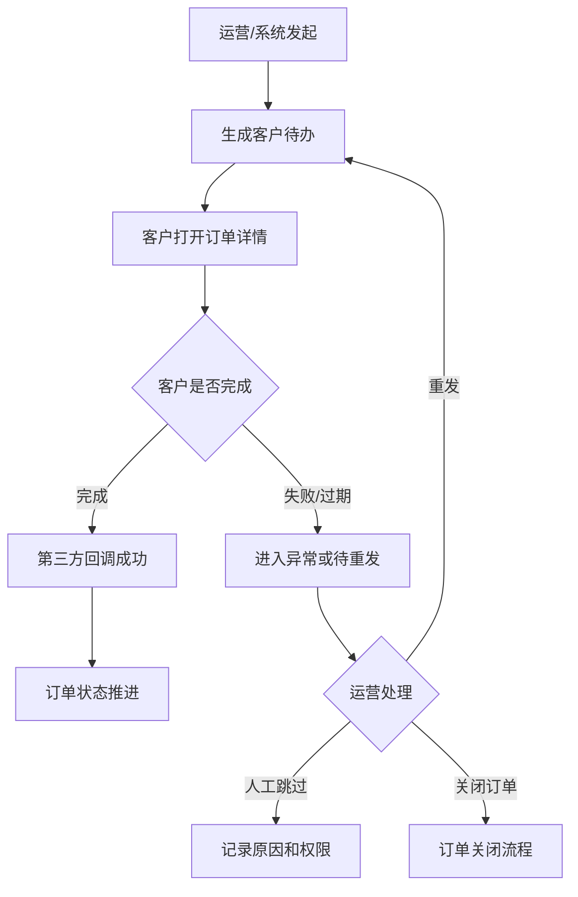

# 合同公证客户操作页

> **Stage 6 术语同步(2026-05-27)**: 本文档已按 Stage 6 统一为商家、联营、平台订单、订单结算款、我的钱包、履约中、逾期费用、留购、保证金等展示术语；数据库字段、API 路径、英文枚举保持不变。

> 页面级 PRD 草案。
> 目标：把合同签署、公证办理、补充合同、风控授权等客户侧待办做成明确路径，运营端可发起、重发、查看状态，客户在小程序/H5/APP 订单详情完成。

> **⚠️ V0.2 合规口径修订(2026-05-25)**:
> - 合同主体固定三方:**甲方门店、乙方客户、丙方平台**;资方在合同与客户侧**绝不出现**(避免融资租赁定性)。
> - "留购"全文改为"留购"。
> - 涉及"签署主体""适用主体""费用承担方"的字段,移除"资方"选项。

---

## 1. 页面说明

| 项 | 内容 |
|---|---|
| 页面名称 | 合同公证客户操作页 |
| 所属端 | C 端客户、运营端 |
| 客户入口 | 客户订单详情 > 待办 > 签署合同 / 办理公证 / 授权 |
| 运营入口 | 订单详情 > 合同公证授权 |
| 使用角色 | 客户、审核客服、法务配置、运营主管 |
| 核心目标 | 让合同、公证、补充合同和授权状态在客户侧可操作、运营侧可追踪 |

---

## 2. 核心口径

1. 合同、公证、授权都作为客户订单待办发起,不让客户离开订单上下文。
2. 商家订单可按商家配置使用合同和公证;联营订单、平台订单由运营端主控。
3. 客户未完成合同、公证、授权时,订单下一步按配置阻断发货或起租。
4. 运营端发起合同时可选择合同模板,系统有默认模板,但允许审核客服按订单情况切换到其他已启用模板。
5. 合同、公证和授权失败不直接覆盖人工审核结论,进入异常或待重发。
6. 补充合同必须关联触发原因,例如改价、改套餐、续租、**留购**、售后赔付。

---

## 3. 客户订单详情待办

| 待办 | 展示条件 | 客户操作 |
|---|---|---|
| 签署租赁合同 | 合同已发起未完成 | 查看并签署 |
| 签署补充合同 | 运营或商家发起 | 查看变更内容并签署 |
| 办理公证 | 公证规则触发 | 进入公证流程 |
| 风控/征信授权 | 审核需要授权 | 阅读授权并确认 |
| 代扣签约 | 支付链路要求 | 进入签约 |
| 重新签署 | 合同过期、变量变化 | 按新任务操作 |

每个待办展示：任务名称、截止时间、状态、失败原因、操作按钮。

---

## 4. 客户合同页

| 字段 | 说明 |
|---|---|
| 合同名称 | 主合同、补充合同、授权书 |
| 关联订单 | 订单摘要 |
| 签署主体 | **客户、门店、平台**(三方固定;资方不出现) |
| 商品与租期 | 商品、规格、租赁模式、租期 |
| 金额摘要 | 首期、账单、保证金、服务费、公证费、**留购价** |
| 变更摘要 | 补充合同展示改价、改套餐、续租、赔付等变化 |
| 签署状态 | 待签、签署中、已签、拒签、过期、失败 |
| 操作 | 查看合同、去签署、重新发起提示 |

客户签署完成后,状态回写订单详情、合同记录和操作日志。

---

## 5. 客户公证页

| 字段 | 说明 |
|---|---|
| 公证名称 | 当前公证任务 |
| 公证费用 | 如需客户承担则展示 |
| 关联合同 | 主合同或补充合同 |
| 办理状态 | 待办理、办理中、已完成、失败、取消 |
| 办理入口 | 跳转第三方或内嵌流程 |
| 失败原因 | 服务商返回摘要 |
| 操作 | 去办理、重新办理、联系客服 |

规则：

1. 公证费用如作为增值服务,应与账单和财务流水一致。
2. 公证完成后回写订单详情。
3. 公证失败可由运营端重发、跳过或转人工,具体按配置。

---

## 6. 运营端合同公证区

订单详情中增加合同公证授权区：

| 模块 | 内容 |
|---|---|
| 合同记录 | 主合同、补充合同、签署状态、模板版本 |
| 公证记录 | 公证任务、服务商、费用、办理状态 |
| 授权记录 | 风控、征信、流水报告、代扣签约 |
| 客户待办 | 待办状态、截止时间、催办次数 |
| 回调日志 | 发起、完成、失败、过期、重试 |

可用操作：

| 操作 | 说明 |
|---|---|
| 发起合同 | 使用当前订单快照 |
| 发起补充合同 | 必须选择触发原因 |
| 发起公证 | 按配置生成客户待办 |
| 发起授权 | 风控/征信/流水报告 |
| 重发待办 | 保留旧任务记录 |
| 查看文件 | 按权限查看 |
| 标记异常 | 回调冲突或客户无法办理 |

---

## 7. 状态流转

---

## 8. 失败态

| 场景 | 处理 |
|---|---|
| 合同变量缺失 | 阻止发起,提示运营补字段 |
| 客户拒签 | 进入审核异常 |
| 合同过期 | 允许重发 |
| 公证失败 | 重试、人工处理或按规则跳过 |
| 授权失败 | 重新发起或补资料 |
| 回调冲突 | 进入回调异常队列 |

---

## 9. 日志与附件

所有合同、公证、授权文件进入附件中心。日志记录发起人、发起时间、模板版本、任务状态、第三方回调摘要、客户操作时间和重发记录。

---

## 10. V0.2 合规修订记录

| 日期 | 修订 | 说明 |
|---|---|---|
| 2026-05-25 | §2 §4 §9 | 移除"留购"措辞,改为"留购"(全局措辞规范) |
| 2026-05-25 | §4 客户合同页 | 签署主体改为"客户、门店、平台"(资方不出现) |

## 11. 关联文档

- `01_合同签署流程.md` —— 合同签署主流程(三方制 / 模板分层 / 电子签)
- `02_公证服务管理.md` —— 公证服务管理
- `03_合同存档查阅.md` —— PDF 副本存档
