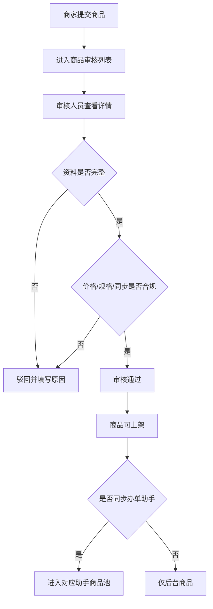

# 商品审核与复制给商家

> 页面级 PRD 草案。
> 目的：把商家自建商品审核、运营平台商品复制、强制同步、审核日志做成完整闭环。

---

## 1. 页面说明

| 项 | 内容 |
|---|---|
| 页面名称 | 商品审核与复制给商家 |
| 所属端 | 运营端 |
| 入口路径 | 商品管理 > 商品审核 / 商品列表 > 复制给商家 |
| 使用角色 | 平台管理员、商品审核、商品运营、商家运营 |
| 核心目标 | 审核商家提交商品，并让运营平台商品可快速复制给指定商家，减少商家重复录入 |

---

## 2. 商品审核范围

| 来源 | 是否需要审核 | 说明 |
|---|---|---|
| 平台商品 | 可配置 | 平台内部新增商品可走草稿/发布流程 |
| 商家自建商品 | 必须审核 | 审核通过后才能上架和同步门店订单办单助手 |
| 平台复制给商家商品 | 可配置 | 默认可直接进入商家商品库，也可要求商家确认后发布 |
| 商家修改关键字段 | 必须复审 | 商品名称、类目、规格、价格、合同/增值服务等关键字段变更 |

---

## 3. 商品审核列表

### 3.1 筛选字段

| 字段 | 类型 | 说明 |
|---|---|---|
| 商品名称 | 文本 | 模糊搜索 |
| 商家/门店 | 下拉/搜索 | 筛选提交方 |
| 类目 | 级联 | 商品类目 |
| 品牌 | 下拉/搜索 | 商品品牌 |
| 审核状态 | 下拉 | 待审核、已通过、已驳回、复审中 |
| 提交类型 | 下拉 | 新增商品、修改商品、复制商品确认 |
| 是否同步办单助手 | 下拉 | 是、否、部分规格 |
| 提交时间 | 日期区间 | 按提交审核时间筛选 |
| 审核人员 | 下拉/搜索 | 按审核人筛选 |

### 3.2 列表字段

| 字段 | 说明 |
|---|---|
| 商品图 | 主图缩略图 |
| 商品名称 | 点击进入审核详情 |
| 商家/门店 | 提交商品的主体 |
| 类目/品牌 | 基础信息 |
| 规格摘要 | 全新、二手、容量、颜色、成色、是否含电池 |
| 租赁模式 | 长租、短租、长短租 |
| 同步入口 | 门店订单、分红订单、平台订单 |
| 提交类型 | 新增、修改、复制确认 |
| 审核状态 | 待审核、已通过、已驳回 |
| 提交时间 | 时间 |
| 操作 | 查看、审核、驳回、日志 |

---

## 4. 审核详情

审核详情要展示商品完整信息，不能只展示商品名称和图片。

| 区域 | 展示内容 |
|---|---|
| 基础信息 | 商品名称、品牌、类目、来源、所属商家、卖点、图片 |
| 规格信息 | 全新/二手、成色、容量、颜色、是否含电池、指导价、库存、租赁模式 |
| 租期价格 | 长租期数、短租单位、价格配置、押金、留购、服务费 |
| 增值服务 | 绑定服务、是否必选、金额、适用订单类型 |
| 办单助手同步 | 同步开关、同步入口、不同入口的数据来源 |
| 变更对比 | 修改前/修改后，复审时必显 |
| 风险提示 | 价格缺失、规格冲突、短租无设备、图片缺失、类目不匹配 |
| 历史记录 | 提交人、提交时间、审核人、审核结论、驳回原因 |

---

## 5. 审核操作

| 操作 | 规则 |
|---|---|
| 审核通过 | 商品状态变为已通过，可按配置上架 |
| 审核驳回 | 必须填写驳回原因，商家可修改后重提 |
| 要求补充 | 可选状态，用于资料不完整但不完全驳回 |
| 冻结商品 | 已通过商品发现风险后可冻结，冻结后不可下新单 |
| 查看日志 | 查看提交、修改、审核、同步历史 |

---

## 6. 复制给商家

运营平台可把平台商品复制给一个或多个商家，解决商家重复录入商品的问题。

### 6.1 入口

| 入口 | 说明 |
|---|---|
| 商品列表单行操作 | 对单个商品复制 |
| 商品列表批量操作 | 批量选择多个平台商品复制 |
| 商家详情页 | 给指定商家添加平台商品 |

### 6.2 复制弹窗字段

| 字段 | 类型 | 说明 |
|---|---|---|
| 选择商家 | 多选搜索 | 可选择一个或多个商家 |
| 复制基础信息 | 勾选 | 商品名称、品牌、类目、图片、详情 |
| 复制规格 | 勾选 | 全新/二手、容量、颜色、成色等 |
| 复制价格 | 勾选 | 指导价、租期价格、押金、留购 |
| 复制增值服务 | 勾选 | 绑定的增值服务 |
| 复制办单助手同步状态 | 勾选 | 是否同步到门店/分红/平台助手 |
| 商家是否可编辑 | 开关 | 控制复制后商家是否能改价、改图、改规格 |
| 是否立即上架 | 开关 | 默认否，避免误上架 |
| 是否需要商家确认 | 开关 | 商家确认后才发布 |

### 6.3 复制规则

1. 复制后生成商家自己的商品副本，不直接共享同一商品记录。
2. 商家副本可以独立配置库存、价格、是否同步门店订单办单助手。
3. 平台商品后续修改，不自动覆盖商家副本。
4. 如运营执行强制同步，必须弹窗展示影响商家和字段，并写入日志。
5. 强制同步不能覆盖商家已生成订单的历史价格方案。

---

## 7. 强制同步

强制同步用于平台统一调整商品资料、规格、增值服务或办单助手同步状态。

| 字段 | 说明 |
|---|---|
| 同步范围 | 指定商家、全部已复制商家、按渠道/区域筛选 |
| 同步字段 | 基础信息、图片、规格、价格、增值服务、上下架、同步助手 |
| 影响预览 | 展示将被覆盖的商家商品数量和字段 |
| 生效时间 | 立即生效、定时生效 |
| 变更说明 | 必填 |

规则：

1. 强制同步必须有高权限。
2. 强制同步必须生成配置版本和操作日志。
3. 强制同步后，旧订单和旧二维码继续按原锁价方案执行。
4. 同步失败进入异常队列，不能静默失败。

---

## 8. 审核失败和异常

| 场景 | 处理 |
|---|---|
| 商品图片缺失 | 不允许通过 |
| 商品类目不匹配 | 驳回或要求修改 |
| 全新/二手规格重复冲突 | 提示合并或调整规格 |
| 短租规格无设备库存 | 可通过但不可同步短租助手，或按配置拦截 |
| 价格配置缺失 | 不允许同步办单助手 |
| 增值服务冲突 | 提示适用订单类型冲突 |
| 商家资质未通过 | 商品不可上架 |

---

## 9. 权限和日志

| 动作 | 是否必须记录日志 |
|---|---|
| 商品提交审核 | 是 |
| 审核通过/驳回 | 是 |
| 复制给商家 | 是 |
| 商家确认复制商品 | 是 |
| 强制同步 | 是 |
| 上架/下架/冻结 | 是 |
| 修改价格/规格/增值服务 | 是 |

日志字段至少包括：操作人、角色、操作前、操作后、影响商家、影响规格、影响办单助手入口、变更说明、时间。
