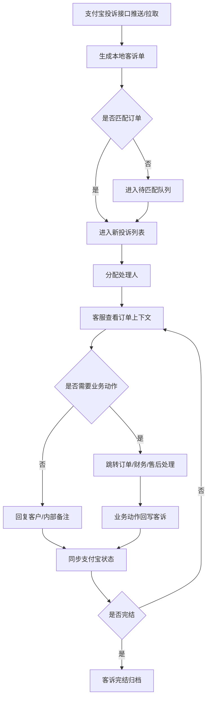

# 支付宝投诉处理

> 页面级 PRD 草案。
> 目标：保留客诉管理模块，对接支付宝投诉接口，同步客户投诉、订单上下文、处理记录和回调状态，形成可追溯闭环。

---

## 1. 页面说明

| 项 | 内容 |
|---|---|
| 页面名称 | 支付宝投诉处理 |
| 所属端 | 运营端 |
| 入口路径 | 客诉管理 > 支付宝投诉 |
| 使用角色 | 客服、客服主管、运营管理员、财务、风控 |
| 核心目标 | 拉取并处理支付宝侧投诉，把投诉和订单、客户、商家、账单、扣款、退款、日志打通 |

营销管理里的大礼包、优惠券等暂不纳入核心，但客诉管理必须保留。投诉不是孤立消息，必须能反查订单和处理动作。

---

## 2. 核心口径

1. 客诉管理 V1 重点对接支付宝投诉接口。
2. 投诉必须自动匹配订单、客户、商家、订单类型和支付/代扣记录。
3. 投诉详情页要展示订单关键信息，不要求客服再打开多个页面找资料。
4. 投诉处理、回复、协商、退款、关闭等动作必须写入订单日志和客诉日志。
5. 对涉及退款、停止代扣、关闭订单、改账单的动作，只能跳转到对应业务页面处理，不在客诉页直接绕过审批。
6. 客诉处理状态要和支付宝接口回调同步，不能只靠本地手动改状态。
7. 投诉数据涉及客户隐私，姓名、手机号、身份证、银行卡等字段按权限脱敏展示。

---

## 3. 投诉列表

### 3.1 筛选条件

| 字段 | 类型 | 说明 |
|---|---|---|
| 投诉编号 | 文本 | 支付宝投诉单号或本地客诉编号 |
| 订单号 | 文本 | 支持精确/模糊 |
| 客户姓名 | 文本 | 脱敏搜索，按权限控制 |
| 客户手机号 | 文本 | 支持后四位或完整手机号权限搜索 |
| 商家/门店 | 下拉/搜索 | 按订单所属商家筛选 |
| 订单类型 | 多选 | 门店订单、分红订单、平台订单 |
| 投诉类型 | 下拉 | 扣款、退款、合同、发货、归还、商品、服务态度等 |
| 投诉状态 | 下拉 | 新投诉、处理中、待客户补充、待平台回复、已完结、已关闭、超时 |
| 风险等级 | 下拉 | 普通、紧急、高风险 |
| 处理人 | 下拉/搜索 | 当前负责人 |
| 投诉时间 | 日期区间 | 支持今天、近 7 天、自定义 |
| 回复截止时间 | 日期区间 | 用于处理超时 |

### 3.2 列表字段

| 字段 | 说明 |
|---|---|
| 投诉编号 | 支付宝投诉编号、本地编号 |
| 投诉时间/截止时间 | 展示剩余处理时间 |
| 客户信息 | 脱敏姓名、手机号 |
| 关联订单 | 订单号、订单类型、订单状态 |
| 商家/门店 | 所属商家和负责人摘要 |
| 投诉类型 | 扣款、退款、发货、合同等 |
| 投诉摘要 | 客户投诉内容摘要 |
| 金额摘要 | 已付、待还、退款申请、争议金额 |
| 当前状态 | 新投诉、处理中、待回复、已完结 |
| 处理人 | 当前负责人 |
| 最近处理记录 | 最近一次回复或内部备注 |
| 操作 | 查看、分配、回复、备注、同步、跳转订单 |

---

## 4. 投诉详情

详情页建议采用左侧订单信息、右侧投诉处理的双栏布局。

### 4.1 投诉信息

| 字段 | 说明 |
|---|---|
| 支付宝投诉编号 | 第三方投诉编号 |
| 本地客诉编号 | 平台内部编号 |
| 投诉来源 | 支付宝小程序、支付宝账单、客服转入等 |
| 投诉类型 | 接口返回类型和本地归类 |
| 投诉内容 | 客户投诉正文和附件 |
| 客户诉求 | 退款、停止扣款、改账单、发货、解释合同等 |
| 投诉时间 | 创建时间 |
| 回复截止时间 | 接口要求的处理时限 |
| 投诉状态 | 本地状态和支付宝状态 |
| 客户补充材料 | 图片、文字、录音等，按接口支持 |

### 4.2 订单上下文

| 区域 | 展示内容 |
|---|---|
| 订单基础 | 订单号、订单类型、订单状态、下单渠道、商家/门店 |
| 商品套餐 | 商品、规格、租期、首期、后期账单、增值服务 |
| 支付账单 | 已付、待付、下一期、代扣签约、部分支付记录 |
| 合同授权 | 合同状态、公证状态、代扣授权、风控授权 |
| 发货签收 | 发货方式、物流/交付照片、人车合照、签收状态 |
| 归还售后 | 归还申请、留购、退款、售后记录 |
| 风控提示 | 黑名单命中、历史订单、逾期、异常定位 |
| 操作日志 | 订单关键日志和系统回调 |

订单上下文只展示必要字段。退款、关闭、改价、停止代扣等动作跳转到订单详情或财务页面执行。

---

## 5. 处理动作

| 动作 | 规则 |
|---|---|
| 分配处理人 | 客服主管可分配，写日志 |
| 内部备注 | 只平台内部可见，可关联订单备注 |
| 回复客户 | 调用支付宝投诉接口回复，保留内容和附件 |
| 要求客户补充 | 按接口能力发起补充材料请求 |
| 同步投诉状态 | 主动拉取支付宝最新状态 |
| 标记高风险 | 进入主管关注队列 |
| 跳转退款 | 跳到退款/冲正页面，不在客诉页直接退款 |
| 跳转订单关闭 | 跳到订单售后页面，走关闭审批 |
| 跳转账单调整 | 跳到订单详情改套餐/账单页面 |
| 完结客诉 | 必须满足接口状态和本地处理结果 |

回复客户前必须提示：回复内容会同步到第三方平台，不是内部备注。

---

## 6. 状态流转

---

## 7. 接口与回调

| 能力 | 说明 |
|---|---|
| 投诉拉取 | 按时间、状态、分页拉取支付宝投诉 |
| 投诉推送 | 接收第三方投诉事件 |
| 投诉详情 | 获取投诉正文、附件、状态 |
| 投诉回复 | 提交客服回复内容和附件 |
| 状态同步 | 获取最新处理状态 |
| 附件下载 | 下载投诉附件，进入附件中心 |
| 异常重试 | 接口失败进入回调/任务异常队列 |

接口日志要记录请求编号、第三方单号、接口名称、结果、错误码、重试次数和处理人。

---

## 8. 自动匹配规则

匹配优先级：

1. 投诉接口返回订单号时，按订单号匹配。
2. 返回支付流水号时，按支付/代扣流水匹配。
3. 返回客户账号或手机号时，按客户和近期待处理订单匹配。
4. 无法唯一匹配时进入待匹配队列，由客服选择订单。

待匹配队列必须提示可能订单，不允许系统强行绑定不确定订单。

---

## 9. 超时与提醒

| 场景 | 处理 |
|---|---|
| 新投诉未分配 | 提醒客服主管 |
| 临近回复截止 | 提醒处理人和主管 |
| 已超时 | 标记超时，进入高风险队列 |
| 第三方接口失败 | 进入异常队列并提醒技术/运营 |
| 客户补充材料 | 通知处理人继续处理 |

工作台应聚合显示：新投诉、待回复、临近超时、已超时、高风险投诉。

---

## 10. 权限与日志

| 动作 | 权限 | 日志 |
|---|---|---|
| 查看投诉 | 客服/主管 | 查看日志，敏感字段脱敏 |
| 查看完整客户信息 | 高权限 | 敏感查看日志 |
| 回复客户 | 客服/主管 | 回复内容、附件、接口结果 |
| 分配处理人 | 主管 | 分配前后处理人 |
| 标记高风险 | 客服/主管 | 原因 |
| 跳转退款/关闭 | 有对应业务权限 | 只记录跳转和关联动作 |
| 手动匹配订单 | 主管或授权客服 | 匹配前后订单和原因 |
| 导出 | 管理员 | 导出范围和字段 |

---

## 11. 待确认

1. 支付宝投诉是否需要支持自动回复模板，还是 V1 只做人工回复。
2. 投诉附件是否长期保存到平台附件中心，还是只保存引用和必要证据。
3. 投诉完结是否需要主管复核，或由处理人按权限直接完结。
