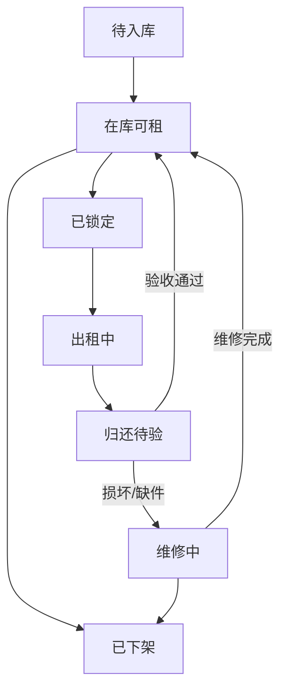

# 运营端库存设备管理

> 页面级 PRD 草案。  
> 目的：补齐短租必需的唯一设备、库存、仓库、交付、归还验收能力。

---

## 1. 页面说明

| 项 | 内容 |
|---|---|
| 页面名称 | 库存设备管理 |
| 所属端 | 运营端 / 商家 PC 端 / 门店手机端 |
| 入口路径 | 运营端：库存设备管理；商家端：库存设备；门店端：设备交付/归还 |
| 使用角色 | 平台运营、商家老板、门店员工、仓库人员、售后 |
| 核心目标 | 支撑短租和需要唯一实物履约的订单，确保每一台租出的设备可追踪、可归还、可再次入库 |

---

## 2. 核心口径

商品不是库存，商品只是展示和价格配置。设备库存主要服务短租商品；长租无需提前建立库存。

| 层级 | 说明 |
|---|---|
| 商品 | 展示给客户或门店办单助手看的租赁品类 |
| 规格 | 商品下的价格、成色、属性、长租/短租适配 |
| 设备库存 | 短租实际租出去的一台实物，必须有唯一设备码 |
| 仓库 | 设备当前所在位置，可以是平台仓、商家仓、门店仓 |

短租必须绑定设备库存。长租不走库存锁定和库存状态，只在发货或门店交付节点填写设备识别码，例如 IMEI、SN、VIN。

---

## 3. 设备字段

| 字段 | 类型 | 必填 | 说明 |
|---|---|---|---|
| 设备码 | 文本/二维码 | 是 | 系统内唯一编码 |
| 商品 | 关联 | 是 | 归属商品 |
| 规格 | 关联 | 是 | 归属规格 |
| 所属主体 | 关联 | 是 | 平台/商家/门店 |
| 当前仓库 | 关联 | 是 | 设备当前所在仓库 |
| 设备状态 | 枚举 | 是 | 在库可租、已锁定、出租中、归还待验、维修中、已下架 |
| SN/IMEI/VIN | 文本 | 按类目 | 手机、车辆等唯一识别 |
| 最近订单 | 关联 | 可选 | 最近一次绑定订单 |
| 入库时间 | 时间 | 是 | 首次入库时间 |
| 最近归还时间 | 时间 | 可选 | 最近一次归还 |

---

## 4. 设备状态流转



规则：

1. 只有 `在库可租` 可以被短租订单选择或锁定。
2. 客户下单或门店生成短租二维码后，可短时间锁定设备。
3. 支付/审核未完成且锁定超时，设备自动释放。
4. 归还后必须验收，验收通过才回到可租库存。
5. 维修中、已下架设备不能出租。
6. 所有状态变化必须写操作日志。
7. 长租订单不进入本状态流转；长租发货记录只保存设备识别码和交付证据。
8. 监管锁不是设备库存固定编号字段，锁机、解锁、支付模式等能力在订单锁控台和监管锁接口配置中处理。

---

## 5. 页面结构

```
┌──────────────────────────────────────────────────────────────┐
│ 库存设备管理                                                   │
├──────────────────────────────────────────────────────────────┤
│ 筛选：设备码 商品 规格 主体 仓库 状态 是否绑定监管锁 [查询]     │
├──────────────────────────────────────────────────────────────┤
│ [新增设备] [批量导入] [批量入库] [导出]                         │
├──────────────────────────────────────────────────────────────┤
│ 设备列表                                                       │
│ 设备码 | 商品/规格 | 当前仓库 | 状态 | 最近订单 | 操作           │
│ DEV001 | 九号电动车/天租 | 城北门店 | 在库可租 | - | 编辑/出库   │
│ DEV002 | 九号电动车/小时租 | 城北门店 | 出租中 | 订单摘要 | 查看   │
└──────────────────────────────────────────────────────────────┘
```

---

## 6. 操作按钮

| 操作 | 使用场景 | 结果 |
|---|---|---|
| 新增设备 | 单台入库 | 创建设备档案 |
| 批量导入 | 大量设备入库 | 按模板导入设备码和归属 |
| 入库 | 设备到仓 | 状态变为在库可租 |
| 锁定 | 短租下单/预约 | 状态变为已锁定 |
| 出库/交付 | 客户取货或门店交付 | 状态变为出租中 |
| 归还 | 客户归还 | 状态变为归还待验 |
| 验收通过 | 归还无异常 | 状态变为在库可租 |
| 报修 | 损坏或异常 | 状态变为维修中 |
| 下架 | 不再出租 | 状态变为已下架 |

---

## 7. 与订单的关系

| 场景 | 规则 |
|---|---|
| 长租订单 | 不走库存；发货或交付时填写 IMEI/SN/VIN 等设备识别码 |
| 短租订单 | 必须绑定具体设备 |
| 门店订单 | 绑定门店或商家自己的设备 |
| 分红订单 | 按平台/商家配置决定设备归属和出资逻辑 |
| 平台订单 | 由平台或指定执行方提供设备 |
| 归还订单 | 归还验收结果影响设备状态和押金/赔付 |

---

## 8. 数据互通

| 模块 | 互通内容 |
|---|---|
| 商品管理 | 商品、规格、是否适配短租、是否需要设备绑定 |
| 办单助手 | 当前长租不读取库存；短租后续需求包接入可用设备库存 |
| 订单管理 | 长租保存发货设备识别码；短租保存绑定设备、交付、归还、异常 |
| 仓库管理 | 设备所在仓库、出入库记录 |
| 监管锁 | 订单维度锁机/解锁、支付模式、状态回调 |
| 财务 | 押金、损坏赔付、超时费用、短租账单 |
| 租后管理 | 逾期未还、归还异常、维修处置 |
| 操作日志 | 设备创建、入库、锁定、出库、归还、维修、下架 |
