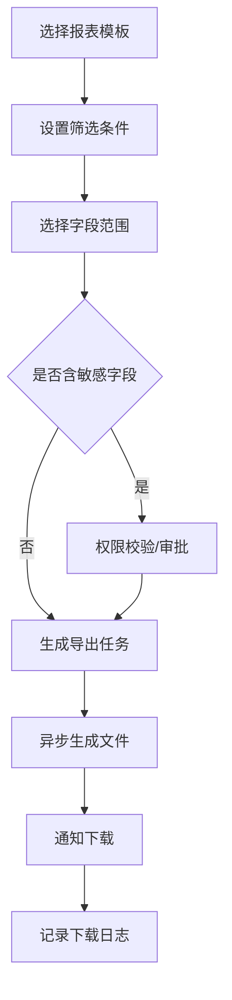

# 报表导出与字段权限

> **Stage 6 术语同步(2026-05-27)**: 本文档已按 Stage 6 统一为商家、联营、平台订单、订单结算款、我的钱包、履约中、逾期费用、留购、保证金等展示术语；数据库字段、API 路径、英文枚举保持不变。

> 页面级 PRD 草案。
> 目标：统一运营、财务、渠道、商家可导出的报表范围和字段权限，避免敏感信息泄露，也避免各模块各自导出导致口径不一致。

---

## 1. 页面说明

| 项 | 内容 |
|---|---|
| 页面名称 | 报表导出与字段权限 |
| 所属端 | 运营端，商家端和渠道端按权限复用 |
| 入口路径 | 数据管理 > 报表导出 / 字段权限 |
| 使用角色 | 平台管理员、财务、运营主管、商家老板、渠道账号 |
| 核心目标 | 统一报表模板、导出申请、字段脱敏、下载审计和大数据量异步导出 |

---

## 2. 核心口径

1. 订单、财务、渠道、租后、客诉等导出必须使用统一字段字典。
2. 敏感字段默认脱敏，完整导出需要高权限和审批。
3. 商家只能导出自己店铺范围，渠道只能导出自己推广范围。
4. 大数据量导出走异步任务，完成后通知下载。
5. 每次导出记录操作日志、字段范围、筛选条件和下载人。

---

## 3. 报表类型

| 报表 | 主要字段 |
|---|---|
| 订单报表 | 订单类型、状态、商品、商家、资方、客户脱敏、金额、租期 |
| 账单报表 | 期数、应还、已还、逾期、部分支付 |
| 分账报表 | 门店份额、资方份额、平台抽佣、渠道佣金 |
| 提现报表 | 主体、金额、状态、打款结果 |
| 渠道报表 | 推广商家、联营订单、平台订单、佣金 |
| 租后报表 | 逾期、跟进、回款、法务状态 |
| 客诉报表 | 投诉来源、处理状态、订单关联 |
| 接口计费报表 | 调用次数、费用项、扣费状态 |

---

## 4. 导出流程

---

## 5. 字段权限

| 字段类型 | 默认策略 |
|---|---|
| 客户姓名 | 脱敏 |
| 手机号 | 脱敏 |
| 身份证号 | 不导出或脱敏 |
| 银行卡/收款账户 | 不导出或脱敏 |
| 详细地址 | 按角色脱敏 |
| 风控报告 | 不导出，仅导出结论摘要 |
| 合同文件 | 不随表导出，走附件权限 |
| 财务金额 | 按角色范围 |

字段权限按角色、端、报表类型、数据范围共同决定。

---

## 6. 导出任务列表

| 字段 | 说明 |
|---|---|
| 任务编号 | 系统生成 |
| 报表类型 | 订单、财务、渠道等 |
| 创建人 | 操作账号 |
| 数据范围 | 平台、商家、渠道 |
| 字段范围 | 普通、脱敏、敏感审批 |
| 状态 | 生成中、成功、失败、已过期 |
| 文件有效期 | 下载链接有效时间 |
| 操作 | 下载、重新生成、查看日志 |

---

## 7. 商家端与渠道端

| 端 | 范围 |
|---|---|
| 商家端 | 自己商家/商家订单、钱包流水、设备库存、提现记录 |
| 渠道端 | 自己推广商家、联营订单、平台订单、佣金和提现 |
| 运营端 | 按角色数据权限 |

员工账号默认不能导出财务和客户敏感数据。

---

## 8. 审计

必须记录：

| 日志 | 内容 |
|---|---|
| 导出申请 | 筛选条件、字段范围、数据范围 |
| 审批记录 | 审批人、结论、原因 |
| 文件生成 | 生成时间、文件大小、结果 |
| 下载记录 | 下载人、时间、IP、设备 |
| 失败记录 | 失败原因 |

导出文件过期后不可下载，需要重新申请。
