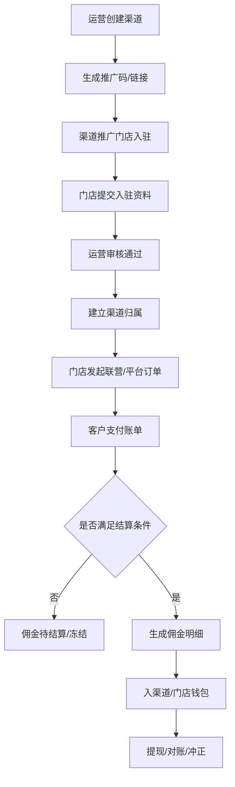

# 渠道分销与佣金

> **Stage 6 术语同步(2026-05-27)**: 本文档已按 Stage 6 统一为商家、联营、平台订单、订单结算款、我的钱包、履约中、逾期费用、留购、保证金等展示术语；数据库字段、API 路径、英文枚举保持不变。

> 页面级 PRD 草案。
> 说明：无界租渠道分销文档链接返回“未找到该文档”，本页按已确认业务口径和满点现有渠道需求整理。

---

## 1. 页面说明

| 项 | 内容 |
|---|---|
| 页面名称 | 渠道分销与佣金 |
| 所属端 | 运营端、渠道端、商家端 |
| 运营入口 | 渠道管理 > 渠道分销 |
| 渠道入口 | 渠道 H5 > 数据统计 / 佣金明细 / 提现 |
| 核心目标 | 渠道推广门店入驻，并对推广门店产生的联营订单、平台订单进行可配置分佣 |

---

## 2. 核心口径

1. 渠道推广码扫码后进入门店入驻页面。
2. 入驻通过后，该门店和渠道建立推广归属关系。
3. 渠道只统计推广门店产生的联营订单、平台订单。
4. 门店自营的商家订单不参与渠道佣金，因为平台和资方没有主控收益。
5. 支持一二级商户/门店分销，但佣金规则必须由平台配置，不允许无限层级。
6. 佣金进入对应渠道/门店钱包，可提现、可对账、可冲正。

---

## 3. 推广关系模型

| 字段 | 说明 |
|---|---|
| 渠道 ID | 推广主体 |
| 渠道名称 | 个人、团队或机构 |
| 推广码 | 渠道唯一推广码 |
| 推广链接 | 跳转门店入驻页面 |
| 一级推广人 | 直接推广门店的人 |
| 二级推广人 | 上级推广关系，可选 |
| 被推广商家/门店 | 入驻通过后的商家主体 |
| 渠道来源 | 写入店铺审核和订单详情 |
| 归属生效时间 | 用于订单归因 |
| 归属状态 | 生效、冻结、解除 |

---

## 4. 佣金规则

| 规则项 | 类型 | 说明 |
|---|---|---|
| 适用订单类型 | 多选 | 联营订单、平台订单 |
| 佣金计算方式 | 下拉 | 固定金额/单、订单流水比例、账单实收比例 |
| 一级佣金 | 金额/比例 | 直接推广人佣金 |
| 二级佣金 | 金额/比例 | 上级推广人佣金，可为 0 |
| 结算触发 | 下拉 | 首期支付成功、当期账单结清、订单完成、人工确认 |
| 退款冲正规则 | 配置 | 订单退款、关闭、冲正时扣回佣金 |
| 逾期冻结 | 开关 | 逾期订单对应佣金是否冻结 |
| 提现规则 | 配置 | 最低提现金额、审核方式、到账方式 |

建议默认：

| 订单类型 | 佣金触发 |
|---|---|
| 联营订单 | 当期账单结清后，按门店/资方分账结果计算 |
| 平台订单 | 当期账单结清后，按平台/资方实收规则计算 |
| 商家订单 | 不计渠道佣金 |

---

## 5. 流程

---

## 6. 渠道 H5 数据统计

| 模块 | 展示内容 |
|---|---|
| 入驻统计 | 推广商家数、审核中、已通过、已拒绝 |
| 订单统计 | 联营订单数、平台订单数、在租、逾期、完成、关闭 |
| 金额统计 | 订单流水、账单实收、待结算佣金、可提现佣金 |
| 佣金明细 | 订单号、商家、订单类型、期数、规则、金额、状态 |
| 提现 | 可提现余额、提现记录、审核状态、到账状态 |

---

## 7. 操作日志

必须记录以下动作：

1. 渠道创建、停用、归属变更。
2. 推广码生成、作废、扫码入驻。
3. 佣金规则创建、发布、回滚。
4. 佣金生成、冻结、解冻、冲正。
5. 渠道提现申请、审核、打款、失败。
