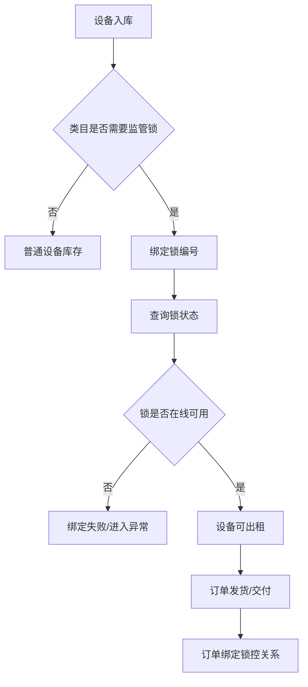

# 监管锁配置与订单控制

> 页面级 PRD 草案。
> 目标：预留公司自研监管锁接入能力，让设备、订单、租后和风控能够调用锁机、解锁、状态查询和日志回调。

---

## 1. 页面说明

| 项 | 内容 |
|---|---|
| 页面名称 | 监管锁配置与订单控制 |
| 所属端 | 运营端，商家 PC 端可按权限查看/申请操作 |
| 入口路径 | 监管锁管理 > 锁设备列表 / 锁操作日志 / 锁配置 |
| 使用角色 | 平台管理员、设备运营、审核客服、租后客服、商家管理员 |
| 核心目标 | 管理监管锁设备和接口配置，并在订单详情、设备库存、租后管理中控制锁机/解锁 |

监管锁不是单独的孤立设备表。它必须和设备库存、订单状态、发货签收、逾期租后、操作权限和回调日志打通。

---

## 2. 核心口径

1. 监管锁先按能力预留，不要求 V1 必须接入真实硬件。
2. 监管锁可以绑定设备，也可以绑定订单，但最终必须能追溯到唯一设备码。
3. 锁机、解锁、解绑、远程控制都属于高风险操作，需要权限、二次确认和日志。
4. 门店订单是否允许商家自己操作监管锁由平台配置。
5. 分红订单和平台订单的监管锁主控默认在运营端。
6. 逾期锁机不能只看订单状态，必须结合合同、客户通知、租后策略和主管权限。
7. 第三方或自研监管锁接口失败必须进入异常队列，不允许静默失败。

---

## 3. 菜单结构

```text
监管锁管理
├─ 锁设备列表
├─ 锁设备绑定
├─ 订单锁控台
├─ 锁操作日志
├─ 回调异常
└─ 锁接口配置
```

---

## 4. 锁设备列表

### 4.1 筛选条件

| 字段 | 类型 | 说明 |
|---|---|---|
| 锁编号 | 文本 | 监管锁唯一编号 |
| 设备码 | 文本 | 绑定的库存设备码 |
| 商品/规格 | 搜索 | 关联商品 |
| 所属主体 | 下拉/搜索 | 平台、商家、门店 |
| 当前订单 | 文本 | 绑定订单号 |
| 锁状态 | 下拉 | 未绑定、在线、离线、已锁机、已解锁、异常 |
| 电量/信号 | 区间/状态 | 按硬件能力展示 |
| 最近回调时间 | 日期区间 | 判断离线或异常 |
| 仓库/门店 | 下拉 | 设备所在位置 |

### 4.2 列表字段

| 字段 | 说明 |
|---|---|
| 锁编号 | 锁设备唯一编号 |
| 绑定设备 | 设备码、商品、规格 |
| 所属主体 | 平台、商家、门店 |
| 当前订单 | 订单号、订单类型、订单状态 |
| 锁状态 | 在线、离线、锁机、解锁、异常 |
| 电量/信号 | 如硬件支持则展示 |
| 最近指令 | 最近一次锁机/解锁/查询 |
| 最近回调 | 回调时间和结果 |
| 操作 | 查看、绑定、解绑、查询状态、锁机、解锁、日志 |

---

## 5. 锁设备字段

| 字段 | 类型 | 说明 |
|---|---|---|
| 锁编号 | 文本 | 系统唯一 |
| 厂商/型号 | 下拉/文本 | 自研或第三方 |
| 通讯协议 | 下拉 | API、MQTT、蓝牙、其他 |
| 绑定设备码 | 关联 | 关联库存设备 |
| 所属主体 | 关联 | 平台、商家、门店 |
| 当前状态 | 枚举 | 未绑定、在线、离线、锁机、解锁、异常 |
| 最近定位 | 坐标/地址 | 如硬件支持 |
| 电量 | 数字 | 如硬件支持 |
| 信号 | 数字/状态 | 如硬件支持 |
| 固件版本 | 文本 | 可选 |
| 最近心跳 | 时间 | 判断在线状态 |
| 最近订单 | 关联 | 当前或最近订单 |

---

## 6. 绑定流程



规则：

1. 需要监管锁的类目，未绑定锁或锁异常时不能进入短租开单。
2. 长租类目可按配置要求绑定监管锁。
3. 绑定关系变更必须记录设备、锁、订单三方日志。
4. 解绑必须校验当前无在租订单或有主管审批。

---

## 7. 订单锁控台

订单详情页和监管锁管理都应能看到同一套锁控信息。

| 模块 | 展示内容 |
|---|---|
| 订单摘要 | 订单号、订单类型、客户、商家、商品、租期 |
| 设备摘要 | 设备码、仓库、交付状态、归还状态 |
| 锁状态 | 在线/离线、锁机/解锁、电量、信号、最近心跳 |
| 当前策略 | 是否允许锁机、是否允许商家操作、是否逾期触发 |
| 指令记录 | 查询、锁机、解锁、失败、回调 |
| 风险提示 | 合同未签、客户未通知、争议中、客诉中 |

---

## 8. 锁控动作

| 动作 | 触发场景 | 权限 | 规则 |
|---|---|---|---|
| 查询状态 | 订单详情、设备列表 | 普通查看权限 | 调接口并写回调日志 |
| 锁机 | 逾期、风控、异常处置 | 高权限/主管 | 二次确认，填写原因 |
| 解锁 | 还款、误锁、维修、归还 | 高权限/主管 | 二次确认，填写原因 |
| 临时解锁 | 客户临时处理 | 高权限 | 必须设置有效期 |
| 解绑 | 设备维修、换锁 | 管理员 | 校验无在租或审批 |
| 重发指令 | 接口超时/失败 | 技术/管理员 | 限制重试次数 |

锁机/解锁必须保存：操作人、操作来源、订单号、设备码、锁编号、原因、指令编号、接口返回、回调结果。

---

## 9. 自动策略

| 策略 | 说明 |
|---|---|
| 逾期自动提醒 | 逾期后先提醒，不直接锁机 |
| 逾期自动锁机 | 可配置，默认建议关闭，需要主管确认 |
| 还款后自动解锁 | 账单结清后可自动发起解锁，失败进入异常 |
| 租期结束锁定 | 短租超时未归还可进入锁控待办 |
| 客诉冻结 | 投诉处理中可暂停自动锁机 |
| 归还验收解锁 | 归还验收完成后恢复可用状态 |

V1 建议：自动策略只生成待办和建议，关键锁机动作先人工确认。

---

## 10. 接口配置

| 字段 | 类型 | 说明 |
|---|---|---|
| 接口名称 | 文本 | 自研监管锁、第三方锁 |
| 接口状态 | 开关 | 启用/停用 |
| 指令类型 | 多选 | 查询、锁机、解锁、解绑、定位 |
| 超时时间 | 数字 | API 超时 |
| 重试次数 | 数字 | 指令失败重试 |
| 回调地址 | 只读/配置 | 系统接收锁状态回调 |
| 签名方式 | 下拉 | 按技术实现配置 |
| 生效范围 | 多选 | 类目、商家、订单类型 |
| 异常处理 | 下拉 | 重试、转人工、通知技术 |

接口密钥等敏感配置只放后端安全配置，不写入 PRD、前端或普通日志。

---

## 11. 回调与异常

| 异常 | 处理 |
|---|---|
| 指令超时 | 进入异常队列，可重试 |
| 锁离线 | 提醒设备运营或门店检查 |
| 状态不一致 | 系统状态和硬件回调不一致，需人工复核 |
| 解锁失败 | 高优先级异常，影响客户使用 |
| 锁机失败 | 租后高风险异常，提醒租后负责人 |
| 回调签名失败 | 拒收回调并记录安全日志 |

---

## 12. 权限与日志

| 动作 | 权限 | 日志 |
|---|---|---|
| 查看锁状态 | 订单/设备查看权限 | 查看日志 |
| 绑定锁 | 设备运营/管理员 | 绑定前后关系 |
| 解绑锁 | 管理员 | 审批和原因 |
| 锁机 | 高权限/主管 | 二次确认、原因、接口结果 |
| 解锁 | 高权限/主管 | 二次确认、原因、接口结果 |
| 临时解锁 | 高权限 | 有效期和原因 |
| 配置接口 | 管理员/技术 | 配置版本日志 |
| 导出 | 管理员 | 导出范围 |

---

## 13. 待确认

1. 哪些类目 V1 必须绑定监管锁，哪些只是预留字段。
2. 门店订单是否允许商家在商家端自行解锁/锁机，还是必须平台审批。
3. 逾期自动锁机是否启用，还是只生成租后待办。
