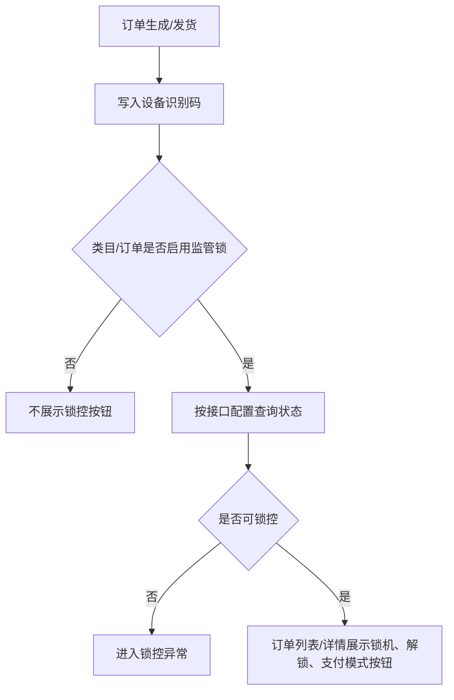

# 监管锁配置与订单控制

> **Stage 6 术语同步(2026-05-27)**: 本文档已按 Stage 6 统一为商家、联营、平台订单、订单结算款、我的钱包、履约中、逾期费用、留购、保证金等展示术语；数据库字段、API 路径、英文枚举保持不变。

> 页面级 PRD 草案。
> 目标：预留公司自研监管锁接入能力，让设备、订单、租后和风控能够调用锁机、解锁、状态查询和日志回调。

---

## 1. 页面说明

| 项 | 内容 |
|---|---|
| 页面名称 | 监管锁配置与订单控制 |
| 所属端 | 运营端，商家 PC 端可按权限查看/申请操作 |
| 入口路径 | 监管锁管理 > 订单锁控台 / 锁操作日志 / 接口配置 |
| 使用角色 | 平台管理员、设备运营、审核客服、租后客服、商家管理员 |
| 核心目标 | 配置监管锁接口，并在订单列表/订单详情中执行锁机、解锁、支付模式等订单锁控操作 |

监管锁不是一个简单的编号字段，也不作为长租库存字段。它是订单维度的外部控制能力，必须和订单状态、发货签收、逾期租后、操作权限、接口配置和回调日志打通。

---

## 2. 核心口径

1. 监管锁先按能力预留，不要求 V1 必须接入真实硬件。
2. 监管锁操作以订单为主入口，订单中可携带设备识别码 IMEI/SN/VIN 作为调用参数或业务关联。
3. 锁机、解锁、解绑、远程控制都属于高风险操作，需要权限、二次确认和日志。
4. 商家订单是否允许商家自己操作监管锁由平台配置。
5. 联营订单和平台订单的监管锁主控默认在运营端。
6. 逾期锁机不能只看订单状态，必须结合合同、客户通知、租后策略和主管权限。
7. 第三方或自研监管锁接口失败必须进入异常队列，不允许静默失败。

---

## 3. 菜单结构

```text
监管锁管理
├─ 订单锁控台
├─ 锁操作日志
├─ 回调异常
├─ 支付模式配置
└─ 接口配置
```

---

## 4. 订单锁控台

### 4.1 筛选条件

| 字段 | 类型 | 说明 |
|---|---|---|
| 订单号 | 文本 | 支持精确搜索 |
| 设备识别码 | 文本 | IMEI/SN/VIN |
| 商品/规格 | 搜索 | 关联商品 |
| 所属主体 | 下拉/搜索 | 平台、商家、门店 |
| 订单状态 | 下拉 | 待发货、待收货、在租、逾期、已完成等 |
| 锁控状态 | 下拉 | 未启用、可锁控、锁机中、已锁机、解锁中、已解锁、异常 |
| 支付模式 | 下拉 | 按接口能力配置 |
| 最近回调时间 | 日期区间 | 判断离线或异常 |
| 门店 | 下拉 | 订单归属门店 |

### 4.2 列表字段

| 字段 | 说明 |
|---|---|
| 订单摘要 | 订单号、订单类型、客户、商家、门店 |
| 设备识别码 | IMEI/SN/VIN |
| 所属主体 | 平台、商家、门店 |
| 锁控状态 | 可锁控、已锁机、已解锁、异常 |
| 支付模式 | 当前支付/控制模式 |
| 最近指令 | 最近一次锁机/解锁/查询 |
| 最近回调 | 回调时间和结果 |
| 操作 | 查询状态、锁机、解锁、切换支付模式、日志 |

---

## 5. 订单锁控字段

| 字段 | 类型 | 说明 |
|---|---|---|
| 订单 ID | 关联 | 必填 |
| 设备识别码 | 文本 | IMEI/SN/VIN |
| 接口供应商 | 下拉 | 自研监管锁、第三方锁 |
| 锁控状态 | 枚举 | 未启用、可锁控、锁机中、已锁机、解锁中、已解锁、异常 |
| 支付模式 | 枚举 | 按接口配置维护 |
| 最近指令 | 文本 | 查询、锁机、解锁、支付模式切换 |
| 最近回调 | 时间/结果 | 接口回调结果 |
| 异常原因 | 文本 | 指令失败、设备离线、回调失败等 |

---

## 6. 订单锁控流程



规则：

1. 监管锁是否启用按订单类型、商家、类目、资方和链路配置决定。
2. 长租不要求提前绑定库存或锁编号，发货后以订单和设备识别码作为接口调用上下文。
3. 锁机、解锁、支付模式切换必须有权限、二次确认和日志。
4. 接口失败进入异常队列，不允许静默失败。

---

## 7. 订单锁控台

订单详情页和监管锁管理都应能看到同一套锁控信息。

| 模块 | 展示内容 |
|---|---|
| 订单摘要 | 订单号、订单类型、客户、商家、商品、租期 |
| 设备摘要 | 长租设备识别码、交付状态、归还状态；短租后续可展示仓库和设备码 |
| 锁状态 | 在线/离线、锁机/解锁、电量、信号、最近心跳 |
| 当前策略 | 是否允许锁机、是否允许商家操作、是否逾期触发 |
| 指令记录 | 查询、锁机、解锁、失败、回调 |
| 风险提示 | 合同未签、客户未通知、争议中、客诉中 |

---

## 8. 锁控动作

| 动作 | 触发场景 | 权限 | 规则 |
|---|---|---|---|
| 查询状态 | 订单列表、订单详情 | 普通查看权限 | 调接口并写回调日志 |
| 锁机 | 逾期、风控、异常处置 | 高权限/主管 | 二次确认，填写原因 |
| 解锁 | 还款、误锁、维修、归还 | 高权限/主管 | 二次确认，填写原因 |
| 切换支付模式 | 审核、履约、租后处置 | 高权限/主管 | 按接口能力配置 |
| 临时解锁 | 客户临时处理 | 高权限 | 必须设置有效期 |
| 重发指令 | 接口超时/失败 | 技术/管理员 | 限制重试次数 |

锁机/解锁/支付模式切换必须保存：操作人、操作来源、订单号、设备识别码、原因、指令编号、接口返回、回调结果。

---

## 9. 自动策略

| 策略 | 说明 |
|---|---|
| 逾期自动提醒 | 逾期后先提醒，不直接锁机 |
| 逾期自动锁机 | 可配置，默认建议关闭，需要主管确认 |
| 还款后自动解锁 | 账单结清后可自动发起解锁，失败进入异常 |
| 租期结束锁定 | 后续短租需求包如需要，可接入锁控待办 |
| 客诉冻结 | 投诉处理中可暂停自动锁机 |
| 归还验收解锁 | 归还验收完成后恢复可用状态 |

V1 建议：自动策略只生成待办和建议，关键锁机动作先人工确认。

---

## 10. 接口配置

| 字段 | 类型 | 说明 |
|---|---|---|
| 接口名称 | 文本 | 自研监管锁、第三方锁 |
| 接口状态 | 开关 | 启用/停用 |
| 指令类型 | 多选 | 查询、锁机、解锁、支付模式切换、定位 |
| 超时时间 | 数字 | API 超时 |
| 重试次数 | 数字 | 指令失败重试 |
| 回调地址 | 只读/配置 | 系统接收锁状态回调 |
| 签名方式 | 下拉 | 按技术实现配置 |
| 生效范围 | 多选 | 类目、商家、订单类型 |
| 异常处理 | 下拉 | 重试、转人工、通知技术 |

接口密钥等敏感配置只放后端安全配置，不写入 PRD、前端或普通日志。

---

## 11. 回调与异常

| 异常 | 处理 |
|---|---|
| 指令超时 | 进入异常队列，可重试 |
| 锁离线 | 提醒设备运营或门店检查 |
| 状态不一致 | 系统状态和硬件回调不一致，需人工复核 |
| 解锁失败 | 高优先级异常，影响客户使用 |
| 锁机失败 | 租后高风险异常，提醒租后负责人 |
| 回调签名失败 | 拒收回调并记录安全日志 |

---

## 12. 权限与日志

| 动作 | 权限 | 日志 |
|---|---|---|
| 查看锁状态 | 订单查看权限 | 查看日志 |
| 锁机 | 高权限/主管 | 二次确认、原因、接口结果 |
| 解锁 | 高权限/主管 | 二次确认、原因、接口结果 |
| 切换支付模式 | 高权限/主管 | 二次确认、原因、接口结果 |
| 临时解锁 | 高权限 | 有效期和原因 |
| 配置接口 | 管理员/技术 | 配置版本日志 |
| 导出 | 管理员 | 导出范围 |

---

## 13. 待确认

1. 哪些类目 V1 必须启用监管锁接口，哪些只是预留能力。
2. 商家订单是否允许商家在商家端自行解锁/锁机，还是必须平台审批。
3. 逾期自动锁机是否启用，还是只生成租后待办。
