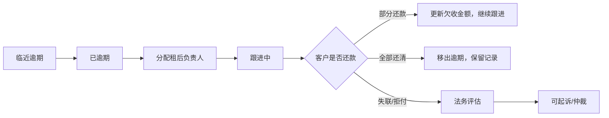

# 租后催收管理

> 页面级 PRD 草案。
> 来源参考：无界租《租后管理功能》。
> 口径：租后模块先做系统内置基础能力，后续可对接外部催收系统；不强制所有部署都接外部催收。

---

## 1. 页面说明

| 项 | 内容 |
|---|---|
| 页面名称 | 租后催收管理 |
| 所属端 | 运营端 |
| 入口路径 | 租后管理 > 逾期列表 / 临近逾期 / 租后回款 |
| 使用角色 | 租后客服、订单客服、财务、平台管理员 |
| 核心目标 | 对逾期和临近逾期订单进行分配、跟进、还款、回款和法务状态管理 |

---

## 2. 页面拆分

| 页面 | 说明 |
|---|---|
| 逾期列表 | 已超过账单应还时间的订单 |
| 临近逾期 | 距离账单到期 N 天内的订单，默认 5 天可配置 |
| 租后回款 | 已进入租后管理的订单和回款进度 |
| 租后详情 | 单订单催收记录、账单、沟通、短信、法务动作 |

---

## 3. 逾期列表

| 字段 | 说明 |
|---|---|
| 订单号 | 支持跳转订单详情 |
| 订单类型 | 门店订单、分红订单、平台订单 |
| 商家/门店 | 订单归属 |
| 资方 | 分红/平台订单显示 |
| 客户 | 脱敏姓名、手机号 |
| 逾期期数 | 多期逾期聚合展示 |
| 逾期金额 | 当前逾期总金额 |
| 最近应还日 | 最近一笔逾期账单应还日 |
| 租后负责人 | 可分配 |
| 跟进状态 | 未接、已租后管理、空号/停机/无法联系、可起诉/仲裁 |
| 最近跟进 | 最近沟通时间和结果 |

规则：

1. 多期逾期按订单聚合为一条主记录。
2. 客户还清当前逾期账单后，自动移出逾期列表。
3. 逾期列表可跳转订单详情发起部分支付收款码、线下支付审核、代扣重试。

---

## 4. 临近逾期

| 字段 | 说明 |
|---|---|
| 到期时间 | 默认展示未来 5 天，可配置 |
| 应还金额 | 即将到期账单金额 |
| 提醒状态 | 未提醒、已提醒、承诺支付、失联 |
| 通知方式 | 短信、电话、IM、人工备注 |

规则：

1. 临近逾期用于提前提醒，不等于正式逾期。
2. 客户提前支付后自动移出临近逾期。
3. 沟通记录进入租后详情，订单详情也可看到摘要。

---

## 5. 租后详情

| 模块 | 内容 |
|---|---|
| 订单摘要 | 订单类型、商家、资方、客户、商品、租期、金额 |
| 账单信息 | 已付、未付、逾期、部分支付、代扣失败 |
| 跟进记录 | 时间、负责人、状态、沟通内容、下次跟进时间 |
| 短信记录 | 模板、发送对象、发送状态、费用 |
| 法务动作 | 律师函、起诉/仲裁建议、资料状态 |
| 还款入口 | 部分支付收款码、线下支付审核、代扣重试 |
| 操作日志 | 系统、人工、回调、财务变动 |

---

## 6. 状态流转

---

## 7. 外部催收系统对接

后期如果接外部催收系统，内置租后模块仍保留为数据入口和状态总账：

1. 支持导入外部逾期订单。
2. 支持把逾期订单推送到外部催收系统。
3. 支持接收外部系统回款、跟进、案件状态回调。
4. 外部回调不能直接覆盖财务结果，必须和账单实收对账。
