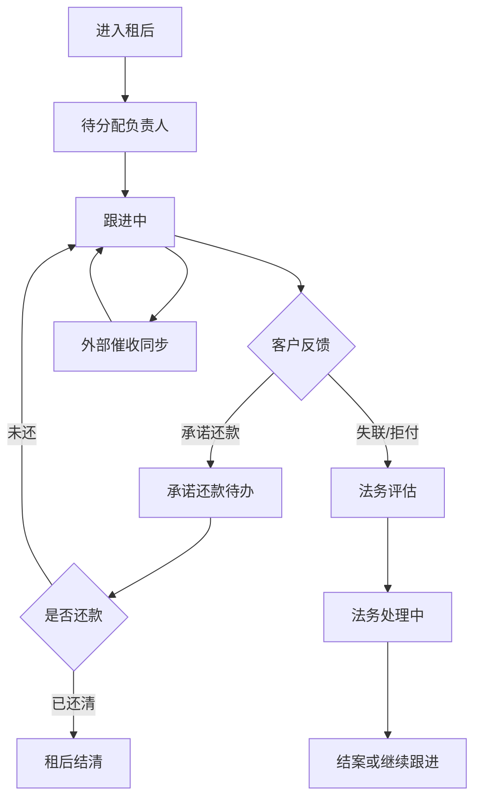

# 租后详情与外部催收同步

> **Stage 6 术语同步(2026-05-27)**: 本文档已按 Stage 6 统一为商家、联营、平台订单、订单结算款、我的钱包、履约中、逾期费用、留购、保证金等展示术语；数据库字段、API 路径、英文枚举保持不变。

> 页面级 PRD 草案。
> 目标：把单个逾期/租后订单的账单、沟通、短信、法务、回款和外部催收系统同步状态集中到租后详情，后续既能自用，也能给外部部署使用。

---

## 1. 页面说明

| 项 | 内容 |
|---|---|
| 页面名称 | 租后详情与外部催收同步 |
| 所属端 | 运营端 |
| 入口路径 | 租后管理 > 逾期列表 / 租后回款 > 租后详情 |
| 使用角色 | 租后客服、客服主管、财务、法务、平台管理员 |
| 核心目标 | 记录租后跟进全过程，处理还款、延期、法务、外部催收回调和对账 |
| 关联页面 | 订单详情、账单还款、部分支付收款码、客户详情、黑名单库、操作日志 |

---

## 2. 核心口径

1. 租后模块先做内置基础能力，不强制接外部催收系统。
2. 外部催收系统是可选链路，系统内仍是订单、账单、回款、状态的最终总账。
3. 外部回调不能直接改财务实收，必须经过账单或对账确认。
4. 租后动作必须回写订单详情，订单详情也要能看到租后摘要。
5. 商家订单、联营订单、平台订单都可以进入租后，但处理权限和通知对象不同。
6. 联营订单、平台订单涉及资方收益时，租后状态要影响分账、冻结和资方回款预期。

---

## 3. 页面结构

```text
┌────────────────────────────────────────────────────────────────────┐
│ 租后详情：订单号 / 客户 / 逾期金额 / 租后负责人 / 当前状态            │
├────────────────────────────────────────────────────────────────────┤
│ 订单摘要 | 账单回款 | 跟进记录 | 通知短信 | 法务动作 | 外部同步 | 日志 │
└────────────────────────────────────────────────────────────────────┘
```

---

## 4. 顶部摘要

| 字段 | 说明 |
|---|---|
| 订单号 | 跳转订单详情 |
| 订单类型 | 商家订单、联营订单、平台订单 |
| 商家/门店 | 订单归属 |
| 资方 | 联营订单、平台订单展示 |
| 客户信息 | 脱敏姓名、脱敏手机号、年龄、认证状态 |
| 商品信息 | 商品、规格、设备码、租期 |
| 逾期概览 | 逾期期数、逾期本金、费用、总欠款 |
| 最近应还 | 最近逾期账单应还日 |
| 当前状态 | 未分配、跟进中、承诺还款、失联、法务评估、已结清 |
| 负责人 | 当前租后负责人 |

顶部只展示必要摘要，敏感资料按权限展开。

---

## 5. 账单与回款

| 模块 | 内容 |
|---|---|
| 逾期账单 | 期数、应还日、应还金额、已还金额、逾期天数 |
| 未到期账单 | 后续账单计划 |
| 部分支付 | 已生成收款码、已支付、待核销 |
| 代扣记录 | 发起时间、结果、失败原因 |
| 线下收款 | 提交人、收款凭证、财务审核状态 |
| 分账影响 | 待分账、冻结、冲正、已恢复 |

可用操作：

| 操作 | 说明 |
|---|---|
| 发起部分支付收款码 | 调用已配置的收款通道，客户在小程序订单页支付 |
| 发起代扣重试 | 按支付链路权限控制 |
| 登记线下收款 | 需财务审核后才影响账单实收 |
| 查看分账影响 | 跳转财务分账明细 |

---

## 6. 跟进记录

| 字段 | 说明 |
|---|---|
| 跟进时间 | 自动记录 |
| 跟进人 | 当前操作人 |
| 联系方式 | 电话、短信、IM、微信、线下 |
| 联系结果 | 接通、未接、停机、拒接、承诺还款、失联 |
| 承诺还款时间 | 可选 |
| 承诺金额 | 可选 |
| 下次跟进时间 | 生成待办 |
| 备注 | 内部可见 |

规则：

1. 跟进记录不可删除，只允许补充更正记录。
2. 承诺还款到期未支付时自动生成提醒待办。
3. 跟进状态同步到逾期列表的最近跟进摘要。
4. 涉及辱骂、威胁等不合规内容不能作为模板话术，系统只记录事实结果。

---

## 7. 通知短信

| 模块 | 内容 |
|---|---|
| 模板选择 | 到期提醒、逾期提醒、还款链接、归还提醒、法务提醒 |
| 发送对象 | 客户本人、紧急联系人、商家负责人，按权限控制 |
| 发送方式 | 短信、站内信、IM、小程序通知 |
| 发送状态 | 待发送、成功、失败、回执异常 |
| 费用记录 | 如短信计费，写入接口计费或平台成本 |

短信模板必须由运营端配置，租后人员不能自由编辑高风险话术。

---

## 8. 法务动作

| 动作 | 状态 |
|---|---|
| 法务评估 | 未发起、评估中、建议继续催收、建议法务 |
| 律师函 | 未发起、已发起、已送达、失败 |
| 仲裁/起诉 | 准备资料、已提交、进行中、已结案 |
| 证据归档 | 合同、签收、交付照片、账单、沟通记录 |
| 黑名单 | 可加入、已加入、已撤销 |

法务动作需要权限控制，并和附件中心、操作日志、客户详情联动。

---

## 9. 外部催收同步

### 9.1 推送外部系统

| 字段 | 说明 |
|---|---|
| 推送状态 | 未推送、待推送、已推送、推送失败、已撤回 |
| 外部案件号 | 外部系统返回 |
| 推送时间 | 最近一次推送 |
| 推送范围 | 订单摘要、账单、客户脱敏资料、证据附件索引 |
| 失败原因 | 接口错误、字段缺失、配置停用 |

推送规则：

1. 推送前必须校验客户授权、资料权限和外部系统配置。
2. 只推送催收必要字段，不推送无关敏感信息。
3. 附件建议使用有时效的访问凭证或内部文件索引。
4. 推送失败进入异常队列，可重试。

### 9.2 接收外部回调

| 回调类型 | 处理方式 |
|---|---|
| 跟进记录 | 写入外部跟进页签，并同步摘要 |
| 承诺还款 | 生成租后待办 |
| 失联/拒付 | 更新租后状态 |
| 回款通知 | 进入财务待确认，不能直接改账单实收 |
| 案件关闭 | 标记外部案件关闭，保留原因 |

外部回调必须写入回调日志，包含请求时间、结果、幂等号、失败原因。

---

## 10. 状态流转



---

## 11. 数据联动

| 模块 | 联动内容 |
|---|---|
| 订单详情 | 展示租后摘要、跟进记录、法务状态 |
| 财务管理 | 部分支付、线下收款、分账冻结、冲正 |
| 黑名单库 | 逾期严重或恶意拒付可进入黑名单流程 |
| 消息待办 | 下次跟进、承诺还款、外部回调异常 |
| 附件中心 | 合同、签收、交付照片、沟通证据 |
| 数据看板 | 逾期率、回款率、跟进效率、法务转化 |
