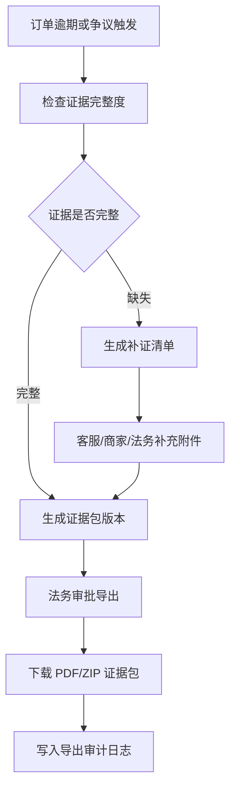

# 法诉证据包与导出规则

> **V0.2.2 新增(2026-05-28)**: 本文档补齐法诉证据链主流程。V1 不自建完整催收系统,但必须沉淀订单、合同、签收、支付、IM、监管锁、催收同步和操作审计证据,支持按订单一键生成法诉证据包。

---

## 1. 页面定位

| 项 | 内容 |
|---|---|
| 所属模块 | 运营端 / 租后管理 / 法诉证据 |
| 使用角色 | 法务、运营主管、财务主管、客服主管、老板 |
| 核心目标 | 将分散在订单、合同、支付、发货、签收、IM、监管锁、外部催收中的材料按订单归档,可审计导出 |
| 高危等级 | 【资金/法务高风险】 |

---

## 2. 证据包内容

| 证据项 | 来源模块 | 必备内容 |
|---|---|---|
| 订单基础信息 | 订单中心 | 订单号、订单类型展示名、商家、门店、客户、商品、价格快照、状态流转 |
| 客户实名资料 | 客户/风控 | 姓名、证件脱敏展示、实名结果、人脸核验记录、信用/信息授权记录 |
| 合同/电子签记录 | 合同公证 | 合同模板、签署时间、签署主体、PDF 副本、电子签回调 |
| 公证记录 | 合同公证 | 公证发起、客户操作、回调、失败/成功记录 |
| 签收确认 | 发货履约 | 电子确认单、AI 问答确认记录、异常复核结论 |
| AI 视频确认 | 发货履约 | 视频 URL、问题配置版本、转写文本、结果、人工复核 |
| 交付照片 | 订单/门店端 | 设备照、配件照、人机/人车合照、物流/自提凭证 |
| 设备信息 | 商品/发货 | 商品型号、SKU、设备码 IMEI/SN/VIN、设备价值证明、指导价 |
| 监管锁记录 | 监管锁管理 | 上锁、激活、定位、开关机、解锁、异常放行记录 |
| 账单明细 | 账单中心 | 账单计划、每期应付、到期日、逾期费用、减免/冲正记录 |
| 支付记录 | 支付/财务 | 支付渠道、交易号、金额、回调、退款、冲正、手续费 |
| 钱包/结算记录 | 财务 | 商家钱包入账、冻结、提现、退款扣减、总账分录 |
| 逾期记录 | 租后管理 | 逾期阶段、提醒记录、外部催收同步状态 |
| 催收记录 | 外部催收 API | 外部案件号、同步日志、承诺支付、部分回款、回传状态 |
| IM 聊天记录 | IM 客服 | 会话、附件、订单卡片、客服回复、客户承诺、转工单记录 |
| 退款/冲正记录 | 财务/客服 | 协商单、责任方、审批、金额、凭证、执行结果 |
| 操作日志 | 权限日志 | 关键业务动作、前后快照、操作人、二次确认 |
| 审计日志 | 权限日志 | 高危动作审批、导出、隐藏附件、强制状态变更 |

---

## 3. 证据包流程

---

## 4. 导出权限和留痕

1. 法诉材料导出属于高危操作,必须具备独立权限点。
2. 导出前必须二次确认;高敏感或批量导出建议二人复核。
3. 导出日志必须记录:订单号、导出人、审批人、导出原因、导出范围、文件 hash、下载时间、IP、设备信息。
4. 后续补证据不得覆盖旧证据包,必须新增版本。
5. 附件原则上不物理删除;如需隐藏,必须写隐藏原因、审批人和审计日志。

---

## 5. 外部催收接口边界

V1 不自建完整催收工作台。系统只负责:

- 逾期订单推送外部催收系统。
- 接收外部催收状态、承诺支付、部分回款、失联、拒付、法诉建议等回写。
- 为外部催收和法诉导出提供证据包授权链接或文件。
- 外部接口失败时进入补偿任务,不得丢失案件同步记录。

---

## 6. 坏账核销和回收完成

坏账核销后,证据包仍必须可导出。后期追回款项时:

1. 在原订单执行“回收完成”。
2. 选择完成方式:客户补缴、法诉回款、线下回款、保证金抵扣、其他。
3. 填写完成金额、凭证、备注。
4. 系统生成回收支付流水、钱包冲正/入账、总账分录。
5. 证据包新增“回收完成”证据项,不删除原坏账核销记录。

---

## 7. 已确认口径

| 事项 | 已确认方案 | 是否阻塞 |
|---|---|---|
| 法诉证据包导出权限 | 法务主导导出;运营主管可申请/审批受限导出;老板可授权批量导出;客服只能申请或查看脱敏材料 | 不阻塞开发,上线前需完成权限配置 |
| 证据保存年限 | 订单结束后至少 5 年;法诉订单按案件周期及执行周期延长 | 不阻塞开发 |
| 外部催收供应商 | 先做 API 抽象,不绑定供应商;后续按供应商接入文档配置 | 不阻塞开发 |
