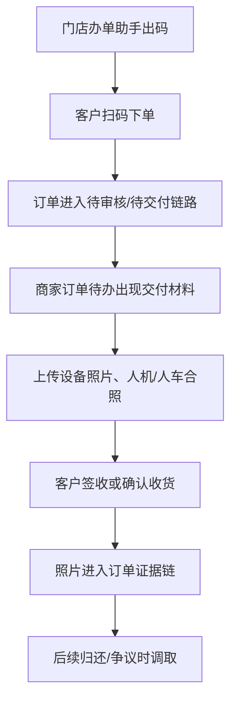

# 交付签收照片证据

> **⚠️ V0.2 Stage 6 同步修订(2026-05-27)v1.1**:
> - 同步展示用语:商家订单 / 联营订单 / 平台订单 / 履约中 / 逾期费用。
> - 底层字段、接口、枚举不变;状态定义以 `02_状态字典与订单状态机.md` 索引和全局状态字典为准。

> 页面级 PRD 草案。
> 来源参考：无界租《订单发货签收照片操作说明文档》。
> 口径：结合满点门店手机端办单助手，把发货、签收、归还验收形成订单证据链。

---

## 1. 页面说明

| 项 | 内容 |
|---|---|
| 页面名称 | 交付签收照片证据 |
| 所属端 | 运营端、商家端、门店手机端、C 端 |
| 运营入口 | 订单详情 > 交付证据 |
| 门店入口 | 办单助手 > 订单待办 > 交付材料 |
| 核心目标 | 对设备交付、客户签收、归还验收形成可追溯图片证据 |

---

## 2. 证据阶段

| 阶段 | 上传方 | 适用状态 | 图片类型 |
|---|---|---|---|
| 发货/交付前 | 门店、商家、平台 | 待发货、待交付 | 设备实拍、配件、外观、序列号、监管锁接口状态 |
| 当面交付 | 门店、商家 | 待发货、待收货 | 人机合照、人车合照、门店现场照片、AI 辅助核验结果 |
| 客户签收 | 客户、门店协助 | 待收货 | 签收照片、客户确认截图 |
| 归还验收 | 门店、商家、平台 | 待归还、归还中 | 归还外观、配件、损坏点、仓库入库照 |
| 异常补充 | 平台、门店 | 任意争议状态 | 补充凭证、客服沟通截图 |

### 2.1 当面交付人设备合照 AI 辅助核验

1. 上传人机合照 / 人车合照后,系统调用第三方持牌人脸比对 API,将合照中的人脸与下单实名环节留存的认证人脸做一次性比对。
2. AI 只输出辅助建议,不得自动放行或自动拒绝;最终交付核验必须由有权限的人工点击通过 / 驳回 / 要求重传。
3. 三档建议:
   - `high_match`:高度匹配,可在人工复核界面提示"建议通过",但仍需人工最终确认。
   - `suspect_mismatch`:疑似不符,交付核验标红,不可走快速通过。
   - `undetermined`:无法判定,包括分值处于中间档、合照无法提取人脸、第三方超时或失败,进入人工核验。
4. 阈值配置:
   - 高度匹配阈值:TODO【需运营/算法确认】。
   - 疑似不符阈值:TODO【需运营/算法确认】。
   - 人脸提取失败默认转人工,不得阻断交付流程。
5. 隐私红线:
   - 系统只存比对结果、评分、供应商标识、调用流水号和人工核验结论。
   - 不建立可检索的人脸库,不支持按人脸检索历史客户或订单。
   - C 端不出现"人脸比对"、"风控"等字眼,客户侧仍按资料审核 / 交付材料审核口径展示。

---

## 3. 办单助手路径

---

## 4. 字段设计

| 字段 | 类型 | 说明 |
|---|---|---|
| 订单号 | 只读 | 当前订单 |
| 设备识别码 | 文本/只读 | 长租发货或交付时填写 IMEI/SN/VIN；短租后续读取唯一设备码 |
| 阶段 | 下拉 | 发货、当面交付、签收、归还、异常补充 |
| 图片类型 | 下拉 | 设备、配件、外观、人机合照、人车合照、签收、验收 |
| 图片 | 上传 | 支持多张 |
| 上传人 | 只读 | 平台、商家、门店员工、客户 |
| 首次上传时间 | 只读 | 首次提交后不变 |
| 最后更新时间 | 只读 | 修改后更新 |
| 客户确认状态 | 状态 | 未确认、已确认、有异议 |
| 备注 | 文本 | 说明照片背景 |

### 4.1 AI 辅助核验字段

| 字段 | 类型 | 说明 |
|---|---|---|
| `face_match_score` | decimal | 第三方返回的相似度分值,按供应商原始区间归一化展示 |
| `face_match_result` | enum | `high_match` / `suspect_mismatch` / `undetermined` |
| `face_match_provider` | varchar | 第三方供应商标识 |
| `face_match_trace_no` | varchar | 第三方调用流水号,用于审计和复查 |
| `face_match_checked_at` | datetime | 比对时间 |
| `manual_verify_result` | enum | `pending` / `passed` / `rejected` / `need_reupload` |
| `manual_verify_by` | bigint | 人工核验人 |
| `manual_verify_at` | datetime | 人工核验时间 |
| `manual_verify_note` | text | 人工核验说明,疑似不符或要求重传时必填 |

---

## 5. 业务规则

1. 长租车辆类订单必须填写设备识别码后才能完成交付；短租后续车辆类订单必须选择唯一设备码。
2. 人机合照、人车合照是否必填按类目和订单类型配置。
3. 门店员工只能上传自己商家订单或被授权订单的照片。
4. 客户签收后，交付前照片不允许删除，只允许追加异常说明。
5. 归还验收照片与库存入库状态联动。
6. 所有上传、删除、追加、客户确认都进入操作日志。
7. 人机合照 / 人车合照启用 AI 辅助核验时,必须先取得信用 / 信息授权中关于证件影像和实名认证影像用于订单交付核验的授权。
8. AI 辅助核验失败、超时、无法判定时,自动转人工核验,不得把失败直接视为通过或拒绝。
9. `suspect_mismatch` 时,核验通过必须二次确认并填写原因;驳回或要求重传必须记录客户 / 门店通知记录。
10. AI 分值、供应商流水号、人工结论进入订单证据链和操作日志;不保存可检索人脸特征库。

### 5.1 AI 辅助核验配置

| 配置项 | 默认值 | 说明 |
|---|---|---|
| 是否启用合照 AI 辅助核验 | 按类目 / 订单类型配置 | 可按商品类目、订单类型、交付方式启用 |
| 高度匹配阈值 | TODO【需运营/算法确认】 | 达到该阈值进入 `high_match` |
| 疑似不符阈值 | TODO【需运营/算法确认】 | 低于该阈值进入 `suspect_mismatch` |
| 中间档处理 | 转人工 | 分值位于两个阈值之间进入 `undetermined` |
| 第三方失败处理 | 转人工 | 超时、错误、未识别人脸均转人工 |
| 存储策略 | 仅存结果 + 评分 + 流水号 | 不建立可检索人脸库 |

---

## 修订记录

| 日期 | 版本 | 说明 |
|---|---|---|
| 2026-05-27 | v1.1 | Stage 6 术语同步:商家/联营/平台订单 + 履约中/逾期费用;底层字段、接口、枚举不变。 |
| 2026-05-29 | v1.2 | V0.2.2 补充需求:新增人设备合照 AI 辅助核验三档流程、字段、配置和隐私红线。 |
