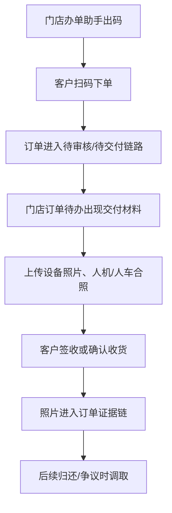

# 交付签收照片证据

> 页面级 PRD 草案。
> 来源参考：无界租《订单发货签收照片操作说明文档》。
> 口径：结合满点门店手机端办单助手，把发货、签收、归还验收形成订单证据链。

---

## 1. 页面说明

| 项 | 内容 |
|---|---|
| 页面名称 | 交付签收照片证据 |
| 所属端 | 运营端、商家端、门店手机端、C 端 |
| 运营入口 | 订单详情 > 交付证据 |
| 门店入口 | 办单助手 > 订单待办 > 交付材料 |
| 核心目标 | 对设备交付、客户签收、归还验收形成可追溯图片证据 |

---

## 2. 证据阶段

| 阶段 | 上传方 | 适用状态 | 图片类型 |
|---|---|---|---|
| 发货/交付前 | 门店、商家、平台 | 待发货、待交付 | 设备实拍、配件、外观、序列号、监管锁状态 |
| 当面交付 | 门店、商家 | 待发货、待收货 | 人机合照、人车合照、门店现场照片 |
| 客户签收 | 客户、门店协助 | 待收货 | 签收照片、客户确认截图 |
| 归还验收 | 门店、商家、平台 | 待归还、归还中 | 归还外观、配件、损坏点、仓库入库照 |
| 异常补充 | 平台、门店 | 任意争议状态 | 补充凭证、客服沟通截图 |

---

## 3. 办单助手路径

---

## 4. 字段设计

| 字段 | 类型 | 说明 |
|---|---|---|
| 订单号 | 只读 | 当前订单 |
| 设备码 | 只读/选择 | 短租必填，长租按类目配置 |
| 阶段 | 下拉 | 发货、当面交付、签收、归还、异常补充 |
| 图片类型 | 下拉 | 设备、配件、外观、人机合照、人车合照、签收、验收 |
| 图片 | 上传 | 支持多张 |
| 上传人 | 只读 | 平台、商家、门店员工、客户 |
| 首次上传时间 | 只读 | 首次提交后不变 |
| 最后更新时间 | 只读 | 修改后更新 |
| 客户确认状态 | 状态 | 未确认、已确认、有异议 |
| 备注 | 文本 | 说明照片背景 |

---

## 5. 业务规则

1. 短租车辆类订单必须绑定唯一设备码后才能完成交付。
2. 人机合照、人车合照是否必填按类目和订单类型配置。
3. 门店员工只能上传自己门店订单或被授权订单的照片。
4. 客户签收后，交付前照片不允许删除，只允许追加异常说明。
5. 归还验收照片与库存入库状态联动。
6. 所有上传、删除、追加、客户确认都进入操作日志。
