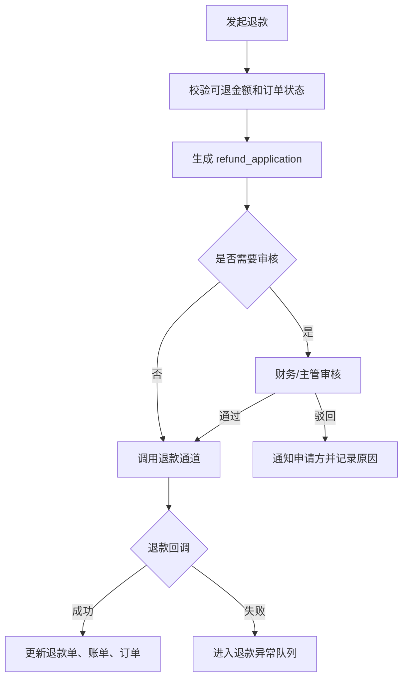
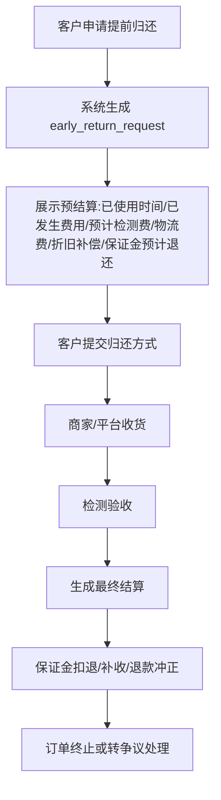

# 订单关闭、退款与售后

> P0 业务文档(2026-05-27)。
> 目标:把关闭订单、退款、售后、归还、留购、提前结清、异常处理做成高风险可追溯流程,避免客服直接改状态造成财务和日志断链。

> **⚠️ V0.2 修订(2026-05-27)v1.2**:
> - 三种合作模式命名统一为 **商家订单 / 联营订单 / 平台订单**(对齐 04 / 08 / 10 文档)
> - **§5 退款流程整体重写**:对接 `10_订单撤单与补充合同.md` v2.0 §3 退款工单
> - **§6 冲正与扣回**:对齐 `财务管理/07` v2.3 §6 撤单退款资金链路 + 内部资金来源台账还原
> - "留购"已统一改"留购"(保留)
> - 履约中订单留购按内部业务话术模板差异化(申请留购 vs 提前结清,详见 09 文档)
> - C 端字眼按统一中性话术(订单总额 / 每期应付 / 保证金 / 履约中 / 已完成)

> **⚠️ V0.2 修订(2026-05-25)v1.1**:"留购"全文改"留购";内部资金来源在客户侧不暴露;数据库 `buyout_*` 改 `purchase_*`(保留)

---

## 1. 页面说明

| 项 | 内容 |
|---|---|
| 页面名称 | 订单关闭、退款与售后 |
| 所属端 | 运营端,商家端按订单类型开放部分能力 |
| 入口路径 | 订单详情 > 关闭/退款/售后;订单管理 > 售后处理 |
| 使用角色 | 运营客服、财务、售后客服、运营主管、商家老板 |
| 核心目标 | 规范订单取消、审核拒绝、退款、冲正、归还售后、留购、提前结清和异常关闭流程 |

---

## 2. 核心口径(v1.2 命名统一)

1. 关闭订单、退款、冲正、售后都属于高风险动作,必须有权限、二次确认、原因和日志。
2. 不能只改订单状态;涉及钱的动作必须生成财务流水、退款单、冲正单或冻结记录。
3. **商家订单**(原"商家订单")由商家/门店自主管理售后,平台保留监管、平台综合服务费、财务总账和异常介入。
4. **联营订单 / 平台订单** 由运营端主控退款、关闭和售后,内部资金来源、渠道、门店分账都要联动(内部资金来源仅为后台分账概念,**不在客户侧暴露**)。
5. 已签合同、已支付、已发货、**已分账**后的关闭和退款**必须走严格退款工单流程**(详见 §5)。
6. 所有关闭/退款/售后结果要同步客户侧、商家端、财务、渠道佣金、内部资金来源台账。

---

## 3. 菜单与入口

```
订单管理
├─ 订单详情
│  ├─ 关闭订单
│  ├─ 申请退款 (生成退款工单)
│  ├─ 售后处理
│  ├─ 归还验收
│  └─ 留购 / 提前结清(按内部业务话术模板)
└─ 售后处理
   ├─ 退款工单(撤单走线下)
   ├─ 关闭审核
   ├─ 归还售后
   ├─ 留购 / 提前结清申请
   └─ 异常订单
```

---

## 4. 关闭订单

### 4.1 可关闭场景(v1.2 命名同步)

| 场景 | 说明 | 财务影响 |
|---|---|---|
| 客户未付款取消 | 客户放弃或超时未支付 | 无支付流水,直接关闭 |
| 审核拒绝 | 风控或资料不通过 | 如已付款需进入退款流程 |
| 客户重复下单 | 保留正确订单,关闭重复订单 | 视付款状态退款 |
| 商家撤回 | 商家订单或平台订单撤回 | 如有渠道佣金需撤销 |
| 资料超时未补 | 超过补资料期限 | 按配置关闭 |
| 合同/授权失败 | 多次失败或客户拒绝 | 需判断是否退款 |
| 发货前取消 | 未发货且客户申请取消 | 退款、释放库存和**内部资金来源额度** |

### 4.2 不允许普通关闭的场景

| 场景 | 处理 |
|---|---|
| 已发货未签收 | 进入售后取消,需要物流和财务复核 |
| 已签收**履约中** | 不能普通关闭,走归还、留购 / 提前结清、租后或退款售后 |
| **已分账** ⭐ | **必须走退款工单流程**(详见 §5.4) |
| 已进入租后催收 | 需要租后负责人确认 |
| 存在投诉 | 需要客诉处理完成或主管审批 |

### 4.3 关闭弹窗字段(v1.2 更新)

| 字段 | 类型 | 说明 |
|---|---|---|
| 关闭原因 | 下拉 | 客户取消、审核拒绝、重复下单、资料超时、商家撤回、其他 |
| 详细说明 | 文本 | 必填 |
| 是否通知客户 | 开关 | 默认通知 |
| 是否通知商家 | 开关 | 联营/平台订单默认通知 |
| 是否释放库存 | 开关 | 短租设备订单必选;长租只保留设备识别码记录 |
| **是否释放内部资金来源额度** ⭐ v1.2 | 开关 | 联营/平台订单必选(后台动作,不在客户侧展示) |
| **是否触发退款** | 开关 | 已付款时必须进入退款流程 |
| **是否走退款工单** ⭐ v1.2 | 系统自动判断 | 已分账 = 强制走工单;未分账 = 平台对公直接退 |
| 二次确认 | 输入确认 | 高风险动作 |

---

## 5. 退款流程(v1.2 重写,对接退款工单)

### 5.1 退款来源

| 来源 | 说明 |
|---|---|
| 客户申请退款 | 客户侧订单发起 |
| 商家申请退款 | 商家端提交 |
| 平台主动退款 | 审核拒绝、重复支付、售后处理 |
| 支付异常退款 | 支付成功但订单异常 |
| 部分支付退款 | 针对某笔部分支付流水退款 |

### 5.2 退款单字段(v1.2 简化版)

```sql
refund_application
- refund_id              bigint PK
- order_id               bigint FK
- source                 enum            -- customer / merchant / platform / system
- original_payment_ref   varchar(64)     -- 原支付流水
- refund_amount          decimal(18,2)   -- 退款金额(不得超过可退金额)
- refund_breakdown       json            -- 可退明细(首期/保证金/服务费/公证费/增值)
- refund_reason          text            -- 退款原因
- audit_status           enum            -- pending / approved / rejected
- is_settlement_happened boolean         -- ⭐ v1.2:是否已分账(决定路径)
- refund_workflow_id     bigint          -- ⭐ v1.2:若已分账,关联退款工单
- channel                varchar         -- 退款通道
- refund_status          enum            -- pending / processing / refunded / failed
- created_by / created_at / updated_at
```

### 5.3 退款路径判断 ⭐ v1.2 核心

```
退款触发
   ↓
计算可退金额(扣除撤单费用)
   ↓
判断是否"已对外分账":
   ├─ 否(未分账)→ 走 §5.4 简单退款(平台对公直接退)
   └─ 是(已分账)→ 走 §5.5 退款工单(线下退款流程)
```

### 5.4 简单退款(未分账场景)



**资金路径**:平台对公账户(过路状态)→ 客户(原路退回)

### 5.5 退款工单流程(已分账场景)⭐ v1.2

详细工单设计见 `10_订单撤单与补充合同.md` v2.0 §3 + `财务管理/07_门店结算账户与资金穿透架构.md` v2.3 §6。本节摘要:

```
已分账 → 生成 refund_workflow 工单
   ↓
计算各方应退/应补:
  - 客户应退:¥A(扣撤单费用)
  - 门店应退还平台:¥B(订单结算款 + 已分账月度)
  - 平台应内部清算:¥C(若 funding_source != platform_self)
   ↓
T0  通知门店线下转账 ¥B
T1  门店执行银行对公转账 → 平台对公账户
T2  财务确认到账 → 标记 merchant_paid
T3  ⭐ Q1=B:平台对公账户出钱退给客户 ¥A
T4  ⭐ Q2=A:平台对公账户付款给资方 ¥C(若有)
T5  内部资金来源台账还原 + 内部资金来源额度还原
T6  工单 completed,账面闭环
```

**关键差异**:
- 不再"原路退回"客户:钱已经穿透出去了,需要从门店追回
- 客户感知:可能比正常退款慢(等门店转账到位)
- 内部资金来源台账:transferred_amount → refunded_amount,outstanding_balance 减少

---

## 6. 冲正与扣回(v1.2 对齐内部资金来源台账)

| 场景 | 处理 |
|---|---|
| 退款前已分账(走退款工单) | 详见 §5.5;最终通过 settlement_entry refund_deduction + funder_receivable_ledger.refunded_amount += C 完成账面调整 |
| 门店结算账户余额不足 | 冻结后续入账或标记待扣回;主管协调门店补转 |
| 渠道佣金已结算 | 生成渠道扣回流水 |
| **内部资金来源应收余额已被部分回收** ⭐ | 退款时分别处理:已回收部分进入分润,剩余本金还给资方 |
| **内部资金来源额度还原** ⭐ | 自动同步:funder.credit_limit_used -= refunded_amount |
| 保证金退还 | 按保证金账户和冻结记录退还 |

冲正不能删除原流水,只能生成反向流水(refund_deduction)。

---

## 7. 售后处理

| 类型 | 说明 |
|---|---|
| 发货前售后 | 取消、退款、改地址、重新发货 |
| 发货中售后 | 物流异常、拒收、丢件、改派 |
| 签收后售后 | 设备问题、换货、维修、退租 |
| 归还售后 | 损坏、缺件、争议、赔付 |
| **留购 / 提前结清** ⭐ | 客户申请,按内部业务话术模板差异化(详见 §8.2) |
| 客诉联动 | 支付宝投诉、平台投诉、协商结果 |

售后处理要和订单详情、租后管理、客诉管理、设备库存、财务退款联动。

---

## 8. 归还与留购 / 提前结清

### 8.1 归还

| 字段 | 说明 |
|---|---|
| 归还方式 | 到店、快递、上门 |
| 归还时间 | 客户提交或平台确认 |
| 验收结果 | 正常、损坏、缺件、争议 |
| 费用处理 | 赔付、扣保证金、免赔、人工复核 |
| 库存处理 | 入库、维修、报废、继续出租 |

### 8.1.1 提前归还与预结算

客户可在 C 端主动发起“申请提前归还”,运营端进入售后处理队列。提前归还不是普通关闭订单,也不得默认要求客户结清全部未到期费用;实际应收以已使用时间、已发生费用、归还检测结果和协议约定的实际损失为准。



预结算展示字段:

| 字段 | 说明 |
|---|---|
| 已使用时间 | 从起租/客户签收确认到提前归还申请时间 |
| 已发生费用 | 已出账、已到期、已产生但未支付的费用 |
| 预计检测费 | 按配置或人工评估展示,最终以检测结果为准 |
| 预计物流费 | 快递、上门取回或到店归还产生的预估费用 |
| 预计折旧补偿 | 因提前归还、损坏、缺件等可能产生的预估补偿 |
| 保证金预计退还 | 保证金 - 已确认扣款 - 预计扣款 |

处理要求:

1. 提前归还申请提交后,不得删除原账单、支付流水和签收证据。
2. 收货和检测完成前,预结算金额仅作提示,不得直接作为最终扣款。
3. 最终结算必须关联检测照片、设备识别码、费用明细、客户确认记录或争议记录。
4. 订单终止前必须完成保证金扣退、退款冲正、返点回滚和商家结算冲正判断。

### 8.1.2 `early_return_request` 表结构

```sql
early_return_request
- request_id             bigint PK
- order_id               bigint FK
- customer_id            bigint FK
- request_status         enum    -- submitted / received / inspection_pending / settlement_pending / refund_pending / completed / cancelled / disputed
- return_method          enum    -- store_return / express / pickup
- requested_at           datetime
- received_at            datetime
- inspected_at           datetime
- used_duration_snapshot json     -- 已使用时间快照
- incurred_fee_snapshot  json     -- 已发生费用快照
- estimated_fee_snapshot json     -- 检测费/物流费/折旧补偿/保证金预计退还
- final_settlement       json     -- 最终结算明细
- deposit_refund_amount  decimal(18,2)
- extra_charge_amount    decimal(18,2)
- evidence_ids           json     -- 归还照片、检测照片、物流凭证等(凭证类型见 §8.1.3)
- customer_confirmed     boolean
- confirmed_at           datetime
- created_by / created_at / updated_at
```

### 8.1.3 归还检测报告与凭证结构(费用以实际发生 + 凭证为准)

> **目的**:归还/无法返还场景下的检测费、维修费、物流费、拖车费、仓储费、整备费、电动车定位取回费等,均"以实际发生金额及相应凭证为准",不得凭空填写。本节明确检测报告数据结构与凭证类型,作为开发依据,与归还验收、争议处理、违约赔偿(见 §8.4 / 订单管理08)共用。

#### 检测报告主体 `return_inspection_report`

```sql
return_inspection_report
- report_id              bigint PK
- order_id               bigint FK
- early_return_request_id bigint FK NULL   -- 关联提前归还申请(如有)
- device_imei_sn_vin     varchar(64)       -- 归还设备识别码,与交付记录做一致性校验
- device_category        enum              -- phone / pad / laptop / ev / other(电动车走 ev 专项费用)
- inspection_result      enum              -- normal / damaged / missing_parts / disputed
- appearance_note        text              -- 外观情况
- function_note          text              -- 功能情况
- accessory_note         text              -- 配件情况
- battery_note           text              -- 电池情况(数码/电动车)
- locator_note           text              -- 定位设备情况(电动车)
- tamper_note            text              -- 私拆/改装痕迹
- accident_note          text              -- 事故痕迹(电动车)
- inspected_by           bigint            -- 检测人(门店/平台)
- inspected_at           datetime
- customer_confirm_status enum             -- pending / confirmed / disputed(客户对检测结果的确认,3 工作日内可提异议)
- customer_confirm_at    datetime
- created_at / updated_at
```

#### 费用明细 `return_fee_item`(逐项,每项必须可挂凭证)

```sql
return_fee_item
- fee_item_id            bigint PK
- report_id              bigint FK
- fee_type               enum    -- inspection(检测费)/ repair(维修费)/ part_replace(配件更换费)/ refurbish(整备费)/ logistics(物流费)/ tow(拖车费)/ storage(仓储费)/ parking(停车费)/ data_wipe(数据清除费)/ system_restore(系统恢复费)/ ev_recovery_coordination(电动车定位取回协作费)/ other
- amount_cent            bigint  -- 实际发生金额(以分整数)
- is_actual_incurred     boolean -- 是否已实际发生(true 才计入最终结算;预估项为 false)
- evidence_refs          json    -- 凭证引用列表,见下方凭证类型
- remark                 text
- created_at
```

#### 凭证类型枚举 `evidence_type`(`evidence_refs[].type` 取值)

| 凭证类型 | 适用费用 | 说明 |
|---|---|---|
| `inspection_report_photo` | 检测费 | 检测报告照片/截图 |
| `repair_quote` | 维修费 | 维修报价单 |
| `repair_invoice` | 维修费 | 维修发票 |
| `repair_receipt` | 维修费 | 维修收据 |
| `merchant_repair_order` | 维修费 | 门店维修单 |
| `logistics_voucher` | 物流费 | 物流单/运费凭证 |
| `tow_voucher` | 拖车费 | 拖车单据(电动车) |
| `storage_voucher` | 仓储费 | 仓储费用凭证 |
| `parking_voucher` | 停车费 | 停车费用凭证 |
| `device_photo` | 通用 | 设备外观/损坏照片 |
| `device_video` | 通用 | 设备视频 |
| `ev_recovery_record` | 电动车定位取回协作费 | 取回记录 |
| `ev_location_track` | 电动车定位取回协作费 | 定位轨迹截图 |
| `other` | 通用 | 其他合理凭证 |

规则:
1. 每个 `return_fee_item` 计入最终结算前,`is_actual_incurred=true` 且至少挂 1 条对应类型凭证(`other` 除外,需文字说明)。
2. 电动车定位取回协作费为固定项(默认 200 元/次,可配),但仍需挂 `ev_recovery_record` 或 `ev_location_track` 凭证证明取回真实发生及次数。
3. 检测报告与费用明细一旦客户确认或超 3 工作日未异议,视为认可;客户提异议进入争议处理,不直接扣款。
4. 本结构与"设备无法返还赔偿计算"共用(见 §8.4 备注与 开发设计/22):赔偿中的"取回/检测/维修等实际费用"部分,即取自此处 `is_actual_incurred=true` 的 `return_fee_item` 累加。

### 8.2 留购 / 提前结清(v1.2 按内部业务话术模板差异化)⭐

C 端按订单的话术模板渲染按钮:

| 内部业务话术模板 | C 端按钮 | 弹窗标题 | 法律性质 |
|---|---|---|---|
| 标准租赁话术(平台自营) | **[申请留购]** | 留购确认 | 留购(应收账款已收清,设备所有权转移) |
| 蓝海银行赊销话术 | **[提前结清]** | 提前结清确认 | 提前结清(银行赊销方案剩余款项结清,设备本就归客户) |

详细话术对照见 `话术规范/01_平台统一中性话术规范.md`。

**留购 / 提前结清数据模型**(英文字段命名,保留 `purchase_*`):

```sql
purchase_requests
- id
- order_id
- purchase_type        -- on_maturity(到期留购)/ early(提前留购或提前结清)
- purchase_price       -- 应付金额
- deposit_offset       -- 保证金抵扣
- amount_due           -- 客户实付
- payment_status
- completed_status
- legal_nature         -- ⭐ v1.2:rental_purchase(留购)/ early_repayment(提前结清),按 funding_source 决定
```

> **购买价口径(A 口径,与办单助手02 §1.3 / C端12 §4.2 一致)**:`purchase_price` = 申请时点取报价快照中"当前期对应的当期留购价" = 剩余应付租金 + 保证金;`deposit_offset` = 保证金抵扣;`amount_due` = purchase_price − deposit_offset。二期折旧余值口径为合规优化项(挂起),详见 开发设计/22 与 C端12 §4.2 注。

留购 / 提前结清前的检查:
- 当期已付清
- 之前期已付清(严格顺序)
- 无未结清逾期费用

详见 `09_C端订单状态与账单支付.md` v1.2 §3.4。

---

## 9. 权限与日志(v1.2 更新)

| 动作 | 权限 | 二次确认 | 要求 |
|---|---|---|---|
| 关闭未付款订单 | 客服权限 | - | 原因必填 |
| 关闭已付款订单 | 主管权限 | **2FA** | 必须进入退款判断 |
| 发起退款(未分账) | 客服/财务 | **2FA** | 可退金额校验 |
| **发起退款(已分账,生成退款工单)** ⭐ v1.2 | 客服主管 / 运营主管 | **2FA** | 自动生成 refund_workflow |
| 审核退款 | 财务/主管 | **2FA** | 二次确认 |
| **确认门店线下转账(退款工单)** ⭐ v1.2 | 财务主管 | - | 标记 merchant_paid |
| **触发客户退款(退款工单)** ⭐ v1.2 | 财务主管 | **2FA** | 平台对公账户出款 |
| **触发内部清算(退款工单)** ⭐ v1.2 | 财务主管 | **2FA** | 同步还原内部资金来源台账 + 授信 |
| **完成退款工单** ⭐ v1.2 | 财务主管 | - | 账面核对闭环 |
| 冲正 | 财务主管 | **2FA** | 反向流水,不删原流水 |
| 售后结论 | 售后客服/主管 | - | 关联照片和说明 |
| 修改留购价 | 改价权限 | **2FA** | 记录新旧价格 |
| 强制关闭商家订单 | 平台主管 | **2FA** | 异常介入原因必填 |
| 确认归还检测费用明细(挂凭证) | 售后客服/主管 | - | 每项费用须挂对应凭证,见 §8.1.3 |

---

## 10. 修订记录

| 日期 | 版本 | 修订 |
|---|---|---|
| 2026-05-25 | v1.1 | "留购"全文改"留购";内部资金来源在客户侧不暴露;数据库 `buyout_*` 改 `purchase_*`;资金类操作补 2FA |
| 2026-05-27 | **v1.2** | 1. 三种合作模式命名统一为商家/联营/平台订单;2. **§5 退款流程整体重写**:加入"已分账判断"分支,对接退款工单(refund_workflow);3. §5.5 新增退款工单流程摘要(引用 10 文档 v2.0 §3);4. §6 冲正与扣回对齐内部资金来源台账还原 + 授信额度还原;5. §8.2 留购按内部业务话术模板差异化(申请留购 vs 提前结清);6. §8.2 purchase_requests 新增 legal_nature 字段;7. §9 权限矩阵新增"发起退款(已分账)/ 确认门店线下转账 / 触发客户退款 / 触发内部清算 / 完成退款工单";8. C 端字眼按统一中性话术 |
| 2026-05-30 | **v1.3** | A口径定版配套:1. 新增 §8.1.3 归还检测报告与凭证结构(`return_inspection_report` + `return_fee_item` + `evidence_type` 凭证类型枚举),把合同列举的检测/维修/物流/拖车/仓储/电动车定位取回等凭证类型落为字段,费用"以实际发生+凭证为准";2. §8.2 明确 `purchase_price` 为 A 口径(剩余应付租金+保证金),与办单助手02/C端12 一致,折旧余值口径标注挂二期;3. §9 权限矩阵新增"确认归还检测费用明细(挂凭证)" |

---

## 11. 数据模型(英文字段命名)

```sql
-- 留购 / 提前结清申请记录
purchase_requests
- id
- order_id
- purchase_type        -- on_maturity / early
- purchase_price       -- 应付金额(A 口径:剩余应付租金 + 保证金)
- deposit_offset       -- 保证金抵扣
- amount_due           -- 客户实付
- payment_status
- completed_status
- legal_nature         -- rental_purchase(留购)/ early_repayment(提前结清)

-- 退款申请记录(v1.2 新增 is_settlement_happened + refund_workflow_id)
refund_application
- refund_id
- order_id
- source                 -- customer / merchant / platform / system
- original_payment_ref
- refund_amount
- refund_breakdown       -- json
- refund_reason
- audit_status           -- pending / approved / rejected
- is_settlement_happened -- ⭐ 是否已分账
- refund_workflow_id     -- ⭐ 若已分账,关联工单
- channel
- refund_status          -- pending / processing / refunded / failed
- created_by / created_at / updated_at

-- 退款工单(详见 财务管理/07 §6 + 订单管理/10 §3)
refund_workflow
- (字段定义见上述引用文档)

-- 归还检测报告与费用凭证(详见 §8.1.3)
return_inspection_report / return_fee_item
- (字段定义见 §8.1.3)

-- 订单状态变更
order.status = 'RETAINED' -- 已留购完成 / 已提前结清完成
```

---

## 12. 待确认

1. 商家订单平台是否允许强制关闭、强制退款;建议只在客诉、违规、风控异常时由主管介入。
2. 已分账后的退款工单 SLA(门店线下转账)是 3 天还是 7 天?目前默认 3 天 + 7 天升主管。
3. 留购价是否允许商家端自行修改,还是只允许平台或商家老板级账号修改。

---

## 13. 关联文档(v1.2 新增)

| 文档 | 关系 |
|---|---|
| `08_长租订单全生命周期与客服操作.md` v1.5 | 主操作手册 |
| `09_C端订单状态与账单支付.md` v1.2 ⭐ | C 端留购/提前结清按内部业务话术模板差异化 |
| `10_订单撤单与补充合同.md` v2.0 ⭐ | **撤单退款资金链路 + 退款工单完整流程** |
| `11_撤单费用账单与规则配置.md` v1.1 | 逾期费用账单 |
| `03_订单详情.md` v1.1 | 订单详情布局 |
| `财务管理/07_门店结算账户与资金穿透架构.md` v2.3 ⭐ | §6 撤单退款资金链路 + 内部资金来源台账还原 |
| `财务管理/12_订单合作模式与收益分配规则.md` v1.1 | 三模式分账规则 |
| `资方管理/01_资方主体与授信管理.md` | 内部资金来源额度自动增减 |
| `资方管理/04_内部资金来源放款条件与触发机制.md` | 内部资金来源撤单后的额度释放 |
| `话术规范/01_平台统一中性话术规范.md` ⭐ | C 端字眼对照表 + 内部业务话术模板差异化 |
| `开发设计/22_系统定版待完善清单(A口径).md` | 购买价 A 口径 / 折旧余值二期 / 设备无法返还赔偿计算 |
