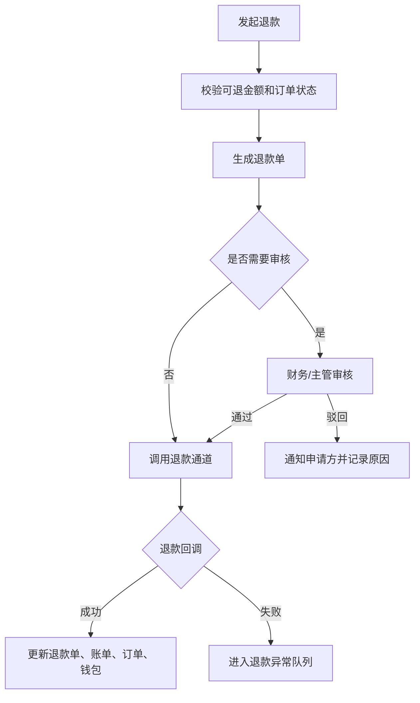

# 订单关闭、退款与售后

> 页面级 PRD 草案。
> 目标：把关闭订单、退款、售后、归还、**留购**、异常处理做成高风险可追溯流程,避免客服直接改状态造成财务和日志断链。

> **⚠️ V0.2 合规口径修订(2026-05-25)**:
> - "买断"全文改为"留购"(全局措辞规范)
> - 资方在客户侧不暴露;资方分账/额度释放/冲正属于运营端后台动作,允许保留

---

## 1. 页面说明

| 项 | 内容 |
|---|---|
| 页面名称 | 订单关闭、退款与售后 |
| 所属端 | 运营端,商家端按订单类型开放部分能力 |
| 入口路径 | 订单详情 > 关闭/退款/售后;订单管理 > 售后处理 |
| 使用角色 | 运营客服、财务、售后客服、运营主管、商家老板 |
| 核心目标 | 规范订单取消、审核拒绝、退款、冲正、归还售后、**留购**和异常关闭流程 |

---

## 2. 核心口径

1. 关闭订单、退款、冲正、售后都属于高风险动作,必须有权限、二次确认、原因和日志。
2. 不能只改订单状态;涉及钱的动作必须生成财务流水、退款单、冲正单或冻结记录。
3. 门店订单由商家/门店自主管理售后,平台保留监管、抽佣、财务总账和异常介入。
4. 分红订单和平台订单由运营端主控退款、关闭和售后,资方、渠道、门店分账都要联动(资方仅为后台分账概念,**不在客户侧暴露**)。
5. 已签合同、已支付、已发货、已分账后的关闭和退款必须走更严格流程。
6. 所有关闭/退款/售后结果要同步客户侧、商家端、财务、渠道佣金和资方账单。

---

## 3. 菜单与入口

```
订单管理
├─ 订单详情
│  ├─ 关闭订单
│  ├─ 申请退款
│  ├─ 售后处理
│  ├─ 归还验收
│  └─ 留购
└─ 售后处理
   ├─ 退款申请
   ├─ 关闭审核
   ├─ 归还售后
   ├─ 留购申请
   └─ 异常订单
```

---

## 4. 关闭订单

### 4.1 可关闭场景

| 场景 | 说明 | 财务影响 |
|---|---|---|
| 客户未付款取消 | 客户放弃或超时未支付 | 无支付流水,直接关闭 |
| 审核拒绝 | 风控或资料不通过 | 如已付款需进入退款流程 |
| 客户重复下单 | 保留正确订单,关闭重复订单 | 视付款状态退款 |
| 商家撤回 | 门店订单或平台订单撤回 | 如有渠道佣金需撤销 |
| 资料超时未补 | 超过补资料期限 | 按配置关闭 |
| 合同/授权失败 | 多次失败或客户拒绝 | 需判断是否退款 |
| 发货前取消 | 未发货且客户申请取消 | 退款、释放库存和资方额度 |

### 4.2 不允许普通关闭的场景

| 场景 | 处理 |
|---|---|
| 已发货未签收 | 进入售后取消,需要物流和财务复核 |
| 已签收在租 | 不能普通关闭,走归还、**留购**、租后或退款售后 |
| 已分账 | 需要冲正或冻结相关钱包 |
| 已进入租后催收 | 需要租后负责人确认 |
| 存在投诉 | 需要客诉处理完成或主管审批 |

### 4.3 关闭弹窗字段

| 字段 | 类型 | 说明 |
|---|---|---|
| 关闭原因 | 下拉 | 客户取消、审核拒绝、重复下单、资料超时、商家撤回、其他 |
| 详细说明 | 文本 | 必填 |
| 是否通知客户 | 开关 | 默认通知 |
| 是否通知商家 | 开关 | 分红/平台订单默认通知 |
| 是否释放库存 | 开关 | 短租设备订单必选;长租只保留设备识别码记录 |
| 是否释放资方额度 | 开关 | 分红/平台订单必选(后台动作,不在客户侧展示) |
| 是否触发退款 | 开关 | 已付款时必须进入退款流程 |
| 二次确认 | 输入确认 | 高风险动作 |

---

## 5. 退款流程

### 5.1 退款来源

| 来源 | 说明 |
|---|---|
| 客户申请退款 | 客户侧订单发起 |
| 商家申请退款 | 商家端提交 |
| 平台主动退款 | 审核拒绝、重复支付、售后处理 |
| 支付异常退款 | 支付成功但订单异常 |
| 部分支付退款 | 针对某笔部分支付流水退款 |

### 5.2 退款单字段

| 字段 | 说明 |
|---|---|
| 退款单号 | 系统生成 |
| 订单号 | 关联订单 |
| 退款来源 | 客户、商家、平台、系统 |
| 原支付流水 | 支付通道流水 |
| 退款金额 | 不得超过可退金额 |
| 可退明细 | 首期、押金、服务费、公证费、增值服务、部分支付 |
| 退款原因 | 必填 |
| 审核状态 | 待审核、通过、驳回、退款中、成功、失败 |
| 财务影响 | 分账冲正、佣金扣回、钱包冻结 |

### 5.3 退款流程



退款成功后,如果已生成分账、渠道佣金或资方收益,必须按规则冲正或冻结对应钱包。

---

## 6. 冲正与扣回

| 场景 | 处理 |
|---|---|
| 退款前已分账 | 生成冲正单,扣回门店、资方、渠道或平台收入(后台动作) |
| 钱包余额不足 | 冻结后续入账或标记待扣回 |
| 渠道佣金已结算 | 生成渠道扣回流水 |
| 资方收益已提现 | 进入财务异常,主管处理 |
| 押金退还 | 按押金账户和冻结记录退还 |

冲正不能删除原流水,只能生成反向流水。

---

## 7. 售后处理

| 类型 | 说明 |
|---|---|
| 发货前售后 | 取消、退款、改地址、重新发货 |
| 发货中售后 | 物流异常、拒收、丢件、改派 |
| 签收后售后 | 设备问题、换货、维修、退租 |
| 归还售后 | 损坏、缺件、争议、赔付 |
| **留购** | 客户申请购买;到期留购或提前留购(原"买断"措辞已废弃) |
| 客诉联动 | 支付宝投诉、平台投诉、协商结果 |

售后处理要和订单详情、租后管理、客诉管理、设备库存、财务退款联动。

---

## 8. 归还与留购

### 8.1 归还

| 字段 | 说明 |
|---|---|
| 归还方式 | 到店、快递、上门 |
| 归还时间 | 客户提交或平台确认 |
| 验收结果 | 正常、损坏、缺件、争议 |
| 费用处理 | 赔付、扣押金、免赔、人工复核 |
| 库存处理 | 入库、维修、报废、继续出租 |

### 8.2 留购

> **重要:全文统一"买断 → 留购"**。本节字段用 `purchase_*` 系列命名(详见数据模型 §11)。

| 字段 | 说明 |
|---|---|
| **留购方式** | **到期留购、提前留购**(对应数据库 `purchase_type = on_maturity / early`) |
| 留购价 | 订单快照或客服改价(对应字段 `purchase_price`) |
| 已付租金 | 参与计算或展示 |
| 待付金额 | 客户需支付 |
| 押金抵扣 | 押金可冲抵留购价 |
| 支付状态 | 待支付、已支付、失败 |
| 完成状态 | 已留购、关闭、异常(对应订单状态 `RETAINED`) |

---

## 9. 权限与日志

| 动作 | 权限 | 二次确认 | 要求 |
|---|---|---|---|
| 关闭未付款订单 | 客服权限 | - | 原因必填 |
| 关闭已付款订单 | 主管权限 | **2FA** | 必须进入退款判断 |
| 发起退款 | 客服/财务 | **2FA** | 可退金额校验 |
| 审核退款 | 财务/主管 | **2FA** | 二次确认 |
| 冲正 | 财务主管 | **2FA** | 反向流水,不删原流水 |
| 售后结论 | 售后客服/主管 | - | 关联照片和说明 |
| 修改留购价 | 改价权限 | **2FA** | 记录新旧价格 |
| 强制关闭门店订单 | 平台主管 | **2FA** | 异常介入原因必填 |

---

## 10. V0.2 合规修订记录

| 日期 | 修订 | 说明 |
|---|---|---|
| 2026-05-25 | 全文 | "买断"措辞全部改"留购"(§1 §2 §3 §4 §7 §8) |
| 2026-05-25 | §8.2 | 数据库字段从 `buyout_*` 改为 `purchase_*`;订单状态 `BOUGHT_OUT` 改 `RETAINED` |
| 2026-05-25 | §9 | 资金类高风险操作补 2FA 标识 |

---

## 11. 数据模型(英文字段命名)

```sql
-- 留购申请记录(原 buyout_request 已废弃)
purchase_requests
- id
- order_id
- purchase_type        -- on_maturity / early
- purchase_price       -- 留购价(原 buyout_price 已废弃)
- deposit_offset       -- 押金抵扣
- amount_due           -- 客户实付
- payment_status
- completed_status

-- 订单状态变更
order.status = 'RETAINED' -- 已留购完成(原 BOUGHT_OUT 已废弃)
```

---

## 12. 待确认

1. 门店订单平台是否允许强制关闭、强制退款;建议只在客诉、违规、风控异常时由主管介入。
2. 已分账后的退款是优先冻结后续入账,还是立即要求钱包扣回。
3. 留购价是否允许商家端自行修改,还是只允许平台或商家老板级账号修改。
